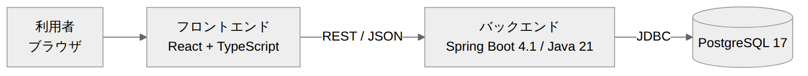
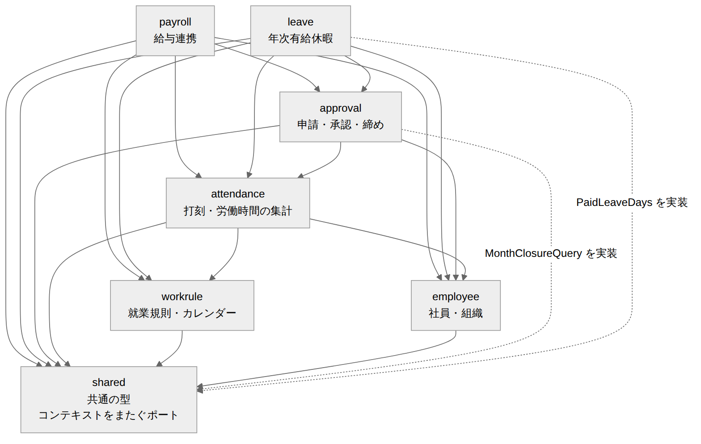
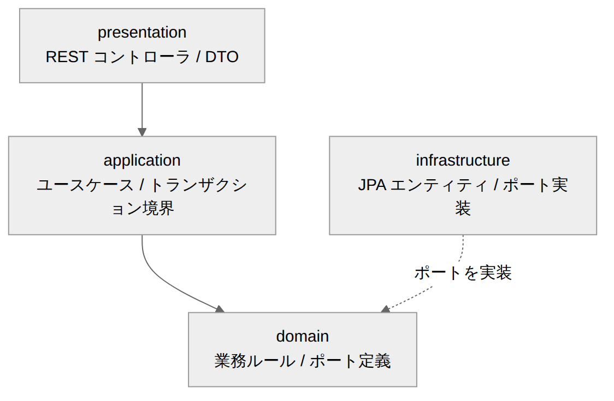

# アーキテクチャ設計書

| 項目 | 内容 |
| --- | --- |
| 文書番号 | KNT-DES-001 |
| 版 | 0.3 |
| 作成日 | 2026-09-01 |
| ステータス | ドラフト |
| 改訂 | 0.2（2026-09-01）BR-11 の責務分割を明確化。0.3（同日）第 2 回レビューを反映し、コンテキスト間の循環依存を 2 件解消 |
| 関連文書 | [要件定義書](../../01_要件定義/要件定義書.md) |

---

## 1. 本書の位置づけ

要件定義書で確定した業務ルールを、どのような構造のコードに落とすかを定める。
個々のクラス設計はドメインモデル設計書、テーブル設計は DB 設計書で扱う。

本書が答えるのは次の 3 点である。

1. コードをどう分割するか（パッケージ構成）
2. 依存をどの向きに流すか（レイヤ構成）
3. その構造をどうやって維持するか（機械的な強制）

---

> **図について** 本書の図は `diagrams/*.mmd`（Mermaid）を正とし、
> PNG を生成して埋め込んでいる。図を直すときは `.mmd` を編集し、
> `cd doc/_tools && npm run render` で再生成すること。PNG を直接編集しない。

## 2. 全体構成



<sub>図のソース: [`diagrams/全体構成.mmd`](diagrams/全体構成.mmd)　修正後は `cd doc/_tools && npm run render` で再生成する</sub>

| 要素 | 責務 |
| --- | --- |
| フロントエンド | 画面の描画と入力。業務判断は行わず、集計結果の表示に徹する |
| バックエンド | 業務ルールの適用、永続化、認証・認可 |
| PostgreSQL | データの保持と、業務上ありえない状態の拒否（制約） |

**業務ルールをフロントエンドに置かない。** 割増の計算や承認可否の判断をブラウザ側に
持たせると、API を直接叩かれた場合に検証が効かなくなるため。

---

## 3. パッケージ構成

### 3.1 業務コンテキストによる分割

最上位を **業務の区切り** で分ける。レイヤではない。

| コンテキスト | 扱う業務 | 主な概念 |
| --- | --- | --- |
| `employee` | 社員と組織 | 社員、部署、所属（有効期間つき） |
| `workrule` | 就業規則と会社カレンダー | 就業規則、割増率、深夜帯、暦日区分 |
| `attendance` | 打刻と労働時間の集計 | 打刻イベント、労働区間、日次勤怠、月次清算 |
| `approval` | 申請・承認・締め | 月次勤怠の状態、承認イベント |
| `shared` | 全コンテキストが使う汎用の型 | 時刻区間、タイムゾーン |

パッケージを開いたときに **業務の構造がそのまま見える** ことを狙う。
「勤怠の計算を直したい」と思ったら `attendance` だけを見ればよい状態にする。

### 3.2 コンテキスト間の依存

依存は一方向に流し、循環させない。



<sub>図のソース: [`diagrams/コンテキスト間の依存.mmd`](diagrams/コンテキスト間の依存.mmd)　修正後は `cd doc/_tools && npm run render` で再生成する</sub>

| 規約 | 内容 |
| --- | --- |
| 参照してよい | 他コンテキストの `domain` パッケージ |
| 参照してよい | 他コンテキストの `application` パッケージ（上図の向きに限る） |
| **参照禁止** | 他コンテキストの `infrastructure` と `presentation` |

他コンテキストの `infrastructure` を触れるようにすると、テーブルの都合が業務の境界を
越えて伝播し、分割した意味が失われるため。

#### 図にない依存を作らない

上図に無い辺は作らない。ArchUnit の AR-06 / AR-07 がこれを検査する。

#### 逆向きの問い合わせが必要になったら `shared` にポートを置く

依存の向きと逆に問い合わせたくなる場面がある。

| 問い合わせ | 向き | 図の辺 |
| --- | --- | --- |
| `attendance` が「この月は締め済みか」を知りたい | `attendance → approval` | **無い**（図は `approval → attendance`） |
| `workrule` が「この月は締め済みか」を知りたい | `workrule → approval` | **無い** |

素直に辺を足すと `approval → attendance → approval` の循環が生じる。

**ポートを `shared/domain` に置き、`approval` が実装する。**

```java
// shared/domain --- 締め状態を問い合わせる窓口
public interface MonthClosureQuery {
    boolean isClosed(EmployeeId employeeId, YearMonth month);
    boolean acceptsChanges(EmployeeId employeeId, YearMonth month);
}

// approval/infrastructure --- 実装
class MonthClosureQueryAdapter implements MonthClosureQuery { ... }
```

`attendance → shared` も `workrule → shared` も `approval → shared` も既に存在するため、
**新しい辺は 1 本も増えない。** 締め状態の所有者は `approval` のままで、
問い合わせる側はインターフェースだけを知る。

#### `PremiumType` を `shared` に置く

割増区分（法定内残業・法定外残業・深夜・法定休日労働）は、
`attendance` が労働区間に付与し、`workrule` が割増率を引くために使う。
どちらか一方のコンテキストに置くと、もう一方から参照する辺が必要になる。

```java
// workrule/domain --- 割増区分ごとの率を引く
public BigDecimal multiplierFor(Set<PremiumType> premiums) { ... }
```

`attendance` に置くと `workrule → attendance` の辺が要り、
`attendance → workrule` と合わせて **循環する。**
割増区分は両者が共有する語彙であり、どちらの所有物でもないため `shared` に置く。

> **`shared` に置いてよいものの基準**
> 複数のコンテキストが必要とし、かつ特定のコンテキストの内部事情に依存しないもの。
> `TimeRange` や `DateRange` のような汎用の型に加え、
> **コンテキストをまたぐ問い合わせのポート** をここに置く。
> 実装は所有者のコンテキストに置き、`shared` には契約だけを残す。

実例として、ログイン中の社員の情報を返す `GET /api/me` に
「その社員に適用される労働時間制度」を含めたくなるが、これは `employee → workrule` という
図に無い依存を生む。**API の都合でコンテキストの境界を崩さない。**
労働時間制度はフロントエンドが `workrule` のエンドポイントから別途取得する
（[社員・組織 API設計書](../01_社員・組織/API設計書.md) 3.1 の注記）。

### 3.3 レイヤ構成

各コンテキストの内部を 4 層に分ける。**依存は常に内側（domain）へ向かう。**



<sub>図のソース: [`diagrams/レイヤ構成.mmd`](diagrams/レイヤ構成.mmd)　修正後は `cd doc/_tools && npm run render` で再生成する</sub>

`domain` は Spring も JPA も知らない。依存の向きを逆転させるため、
永続化の窓口は `domain` 側にインターフェース（ポート）として置き、
`infrastructure` がそれを実装する。

### 3.4 完成形のツリー

```
src/backend/src/main/java/jp/co/sample/kintai/
├── KintaiApplication.java
├── config/                          Spring の設定（全体に関わるもののみ）
│   ├── ClockConfig.java
│   └── SecurityConfig.java
├── shared/
│   ├── domain/                      TimeRange, DateRange, TimeOfDayRange, BusinessZone,
│   │                                PremiumType（割増区分の語彙）,
│   │                                MonthClosureQuery（締め状態を問い合わせるポート）
│   └── presentation/                ApiExceptionHandler, ProblemDetail 変換
├── employee/
│   ├── domain/                      Employee, EmployeeId, Department, Assignment,
│   │                                Managership, OrganizationChart（組織構造の事実）,
│   │                                各種 Repository（ポート）
│   ├── application/                 EmployeeQueryService
│   ├── infrastructure/              EmployeeEntity, EmployeeJpaRepository,
│   │                                EmployeeRepositoryAdapter
│   └── presentation/                EmployeeController, EmployeeResponse
├── workrule/
│   ├── domain/                      WorkRule, WorkingTimeSystem, PremiumRates,
│   │                                NightWindow, DayType, CompanyCalendar
│   ├── application/
│   ├── infrastructure/
│   └── presentation/
├── attendance/
│   ├── domain/                      TimeClockEvent, WorkSlice, DailyAttendance,
│   │                                MonthlySettlement, 計算エンジンと規則
│   │                                （PremiumType は shared にある。理由は 3.2）
│   ├── application/                 AttendanceCommandService, AttendanceQueryService
│   ├── infrastructure/
│   └── presentation/
└── approval/
    ├── domain/                      MonthlyAttendanceStatus, ApprovalEvent,
    │                                ApproverPolicy（BR-11 の業務ルール）
    ├── application/
    ├── infrastructure/
    └── presentation/
```

---

## 4. 各層の責務と規約

### 4.1 domain

**業務ルールそのもの。この層だけを読めば仕様が分かる状態を目指す。**

| 規約 | 理由 |
| --- | --- |
| Spring、JPA、Jackson、Swagger に依存しない | フレームワークを起動せずに単体テストするため |
| 値は `record` で表現し、不変にする | 計算途中で状態が変わる事故を防ぐため |
| 種類が固定された概念は `sealed interface` で表現する | `switch` の網羅性をコンパイラに保証させるため |
| 不変条件は compact constructor で検証する | 不正なインスタンスを存在させないため |
| 永続化はインターフェース（ポート）として宣言するのみ | 依存の向きを内側へ保つため |

### 4.2 application

**ユースケースの調整役。業務ルールをここに書かない。**

| 規約 | 理由 |
| --- | --- |
| `@Transactional` をこの層に置く | トランザクション境界をユースケース単位に揃えるため |
| 判断は domain に委譲し、この層は手順を組むだけ | ロジックが application に漏れると単体テストが重くなるため |
| 戻り値は domain のオブジェクト。DTO へは変換しない | 表示形式は presentation の関心事のため |

### 4.3 infrastructure

**外の世界との接続。JPA エンティティはこの層から出さない。**

| 規約 | 理由 |
| --- | --- |
| JPA エンティティはパッケージプライベートにする | 他の層から `@Entity` が見えないようにするため |
| ポートの実装クラスは `〜RepositoryAdapter` と命名する | Spring Data の `〜JpaRepository` と区別するため |
| ドメインとエンティティの相互変換をここで行う | 変換コードを 1 か所に閉じ込めるため |

### 4.4 presentation

**HTTP との境界。**

| 規約 | 理由 |
| --- | --- |
| リクエスト / レスポンスは専用の `record` を定義する | ドメインの構造変更が API の互換性を壊さないようにするため |
| 時間は分単位の整数で返す | ISO-8601 の `PT8H30M` は加工が面倒で、小数の「時間」は丸め誤差を生むため |
| 例外は `@RestControllerAdvice` で一括変換する | 各コントローラで try-catch を書かないため |

---

## 5. ドメインモデルと永続化の分離

ドメインモデルと JPA エンティティを別のクラスとして定義する。

```java
// attendance/domain — フレームワークを知らない
public record WorkSlice(TimeRange range, Set<PremiumType> premiums) { }

// attendance/domain — 永続化の窓口だけを宣言する
public interface DailyAttendanceRepository {
    void save(EmployeeId employeeId, DailyAttendance attendance, long version);
    List<DailyAttendance> findByPeriod(EmployeeId employeeId, DateRange period);
}

// attendance/infrastructure — DB のことだけ知っている
@Entity
@Table(name = "daily_attendances")
class DailyAttendanceEntity {          // パッケージプライベート
    @Id private UUID id;
    DailyAttendance toDomain() { ... }
}

@Repository
class DailyAttendanceRepositoryAdapter implements DailyAttendanceRepository { ... }
```

### 得られるもの

- 計算ロジックの単体テストがデータベースを必要としない
- `record` と `sealed interface` を使える（JPA は引数なしコンストラクタを要求するため、
  エンティティ兼用では不変にできない）
- テーブル構造の変更がドメインに波及しない

### 支払うもの

- テーブルごとに 30〜50 行の変換コードが増える
- 同じ概念を 2 か所で定義するため、片方だけ直す事故が起こりうる

後者は、統合テストでドメイン → 永続化 → ドメインの往復が一致することを検証して防ぐ。

---

## 6. 横断的関心事

### 6.1 トランザクション境界

`application` 層の公開メソッドを 1 トランザクションとする。
参照のみのユースケースは `@Transactional(readOnly = true)` を付ける。

`spring.jpa.open-in-view` は **無効にする**。有効のままだと、ビューの描画中に
遅延ロードが走り、トランザクションの境界が曖昧になるため。

### 6.2 例外

| 種類 | 例 | HTTP |
| --- | --- | --- |
| ドメインの不変条件違反 | 打刻の順序が不正 | 409 Conflict |
| 業務データの不在 | 社員が存在しない | 404 Not Found |
| 入力値の不正 | 必須項目の欠落 | 400 Bad Request |
| 権限の不足 | 他人の勤怠を承認しようとした | 403 Forbidden |

応答は RFC 9457（Problem Details）形式に統一する。

```json
{
  "type": "urn:kintai:error:invalid-time-clock-sequence",
  "title": "打刻の順序が不正です",
  "status": 409,
  "detail": "退勤 の打刻(2026-04-09T18:00)は 休憩中 の状態では行えません"
}
```

`type` を機械可読な URN にすることで、フロントエンドがエラーの種類ごとに
振る舞いを変えられるようにする。

### 6.3 時刻の扱い

| 層 | 型 | 意味 |
| --- | --- | --- |
| domain | `LocalDateTime` / `LocalTime` | 壁掛け時計の時刻。始業 9:00 や深夜帯 22:00 は時刻の表示そのもの |
| infrastructure | `OffsetDateTime` ↔ `timestamptz` | 絶対時刻 |

変換は `shared/domain/BusinessZone`（`Asia/Tokyo`）の 1 か所に閉じ込め、
他の場所でタイムゾーン変換を書かない。

現在時刻は `java.time.Clock` を DI する。`LocalDateTime.now()` を直接呼ぶと、
時刻に依存するロジックをテストで固定できなくなるため。

> **注意** `hibernate.jdbc.time_zone` は設定しない。JDBC 層に追加の変換をさせると
> `time` 型のカラム（始業時刻や深夜帯）まで変換され、値がずれる。

### 6.4 認証・認可

- 認証：Spring Security のフォームログイン（セッション）。パスワードは BCrypt
- 認可は 2 段構え

| 段 | 対象 | 実装 |
| --- | --- | --- |
| 粗い制御 | 「人事だけが締められる」 | `@PreAuthorize("hasRole('HR')")` |
| 業務判断 | 「この社員の承認者は誰か」 | `approval/domain` の `ApproverPolicy` |

**ロールだけでは表現できない判断を Spring Security に持ち込まない。**
承認者の判定（BR-11）は所属の有効期間と部署階層に依存する業務ルールであり、
ドメインに置くべきものだから。

#### BR-11 の責務分割

BR-11 は「組織構造の事実」と「承認の業務ルール」の 2 つからなる。
**両方を 1 か所に置くと、組織の問い合わせを使うたびに承認のルールが付いてくる。**
コンテキストごとに次のように分ける。

| コンテキスト | クラス | 担うもの |
| --- | --- | --- |
| `employee` | `OrganizationChart` | **事実の導出**。指定日の所属部署、部署の祖先、部署の長。「誰が承認者か」は判断しない |
| `approval` | `ApproverPolicy` | **承認の業務ルール**。自己承認の禁止、退職者・廃止部署のスキップ、人事へのエスカレーション |

`ApproverPolicy` が `OrganizationChart` を使って祖先を辿り、
BR-11 の 4 と 5（遡りの条件と人事へのエスカレーション）を適用する。
依存の向きは `approval → employee` であり、コンテキスト間依存図と一致する。

### 6.5 ログと監査

| 種類 | 目的 | 保持 |
| --- | --- | --- |
| アプリケーションログ | 障害調査 | 一時的 |
| 監査証跡 | 誰がいつ何をしたかの記録 | 永続（DB のテーブル） |

打刻・承認・締めは監査証跡をテーブルに残す。ログファイルは消えるが、
労務の記録は 5 年間参照できる必要があるため（非機能要件）。

---

## 7. 技術選定

| 領域 | 採用 | 選定理由 |
| --- | --- | --- |
| 言語 | Java 21 | `record` / `sealed interface` / パターンマッチングで業務ルールを型として表現できる。LTS |
| フレームワーク | Spring Boot 4.1.1 | 3.5 系は OSS サポート終了。安定版の最新 |
| ビルド | Gradle 9.7 (Kotlin DSL) | 記述量が少なく IDE の補完が効く |
| DB | **PostgreSQL 16** | `EXCLUDE` 制約・範囲型・パーティション・配列型・生成列を使う。これらが本システムの設計の土台 |
| マイグレーション | Flyway | SQL をそのまま書けるため、PostgreSQL 固有の制約を表現できる |
| O/R マッパー | Spring Data JPA | 単純な CRUD を宣言的に書ける。複雑な集計クエリが必要になれば JPQL / ネイティブクエリを併用 |
| 認証 | Spring Security | セッション管理と CSRF 対策を自前で書かない |
| テスト | JUnit 5 / AssertJ | 標準 |
| 統合テスト | Testcontainers | 本物の PostgreSQL を起動する。H2 では `EXCLUDE` 制約もパーティションも再現できない |
| アーキテクチャ検査 | ArchUnit | 依存の方向をビルドで強制する |
| フロントエンド | React 19 / TypeScript / Vite | 型で API の応答を縛れる |

---

## 8. アーキテクチャの強制

**「ドメイン層は Spring に依存しない」はレビューの気合いでは守れない。**
ArchUnit のテストとして記述し、違反したらビルドが落ちるようにする。

| ID | ルール | 意図 |
| --- | --- | --- |
| AR-01 | `..domain..` は Spring / JPA / Jackson / Swagger に依存しない | ドメインをフレームワークから独立させる |
| AR-02 | `..domain..` は `application` / `infrastructure` / `presentation` に依存しない | 依存を内側へ向ける |
| AR-03 | `..application..` は `infrastructure` / `presentation` に依存しない | 永続化の実装を差し替え可能に保つ |
| AR-04 | `..presentation..` は `infrastructure` に依存しない | コントローラが JPA エンティティを触らないようにする |
| AR-05 | `〜Entity` は `..infrastructure..` の外から参照されない | エンティティを実装詳細に閉じ込める |
| AR-06 | コンテキストは他コンテキストの `infrastructure` / `presentation` を参照しない | 業務の境界を守る |
| AR-07 | コンテキスト間の依存に循環がない | 分割の意味を保つ |
| AR-08 | フィールドインジェクション（`@Autowired` のフィールド付与）を使わない | 依存をコンストラクタで受け取り、テストから差し替え可能にする |
| AR-09 | `..domain..` のクラスに `java.time.LocalDateTime.now()` の呼び出しがない | 時刻を `Clock` 経由にしてテスト可能にする |

これらは `src/backend/src/test/java/jp/co/sample/kintai/architecture/` に配置し、
通常の単体テストと同じく `./gradlew test` で実行する。

---

## 9. 検討したが採らなかった案

| 案 | 却下理由 |
| --- | --- |
| **レイヤ優先のパッケージ構成** | `domain` / `application` / … を最上位にする形。日本の業務システムでは一般的だが、1 つの機能を足すのに 4 か所を触ることになり、関連するコードが離れる。業務の区切りが見える構成を優先した |
| **JPA エンティティをドメインとして兼用** | 変換コードは不要になるが、JPA が引数なしコンストラクタを要求するため `record` にできず、不変オブジェクトが使えない。「業務ルールを型で表現する」という本プロジェクトの主題と両立しない |
| **Gradle マルチモジュールで層を物理分離** | 層をモジュールに分けると依存違反がコンパイルエラーになり強力だが、ビルド設定が複雑になる。ArchUnit で同等の検査ができ、失敗もビルド時に分かるため、複雑さに見合わないと判断 |
| **Spring Modulith の導入** | コンテキスト分割の検証を宣言的に書けるが、モジュール定義の学習コストが加わる。まず ArchUnit で運用し、コンテキストが増えて手に負えなくなった時点で再検討する |
| **CQRS（コマンドとクエリでモデルを分ける）** | 月次照会の負荷は 100 名規模では問題にならない。複雑さに見合わない |

---

## 10. 未決事項

| # | 内容 | 決定時期 |
| --- | --- | --- |
| 1 | 複雑な集計クエリを JPQL で書くか、ネイティブクエリにするか | DB 設計書 |
| 2 | フロントエンドの API 型定義を手書きするか、OpenAPI から生成するか | M1-a の実装時 |
| 3 | 監査証跡をアプリケーションで記録するか、DB トリガで記録するか | DB 設計書 |
