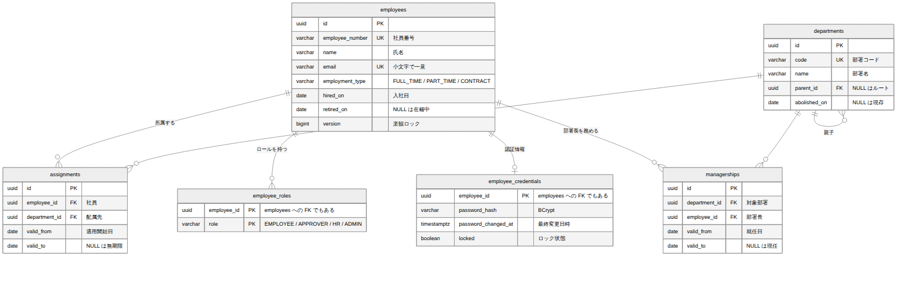

# 社員・組織 DB設計書

| 項目 | 内容 |
| --- | --- |
| 文書番号 | KNT-DES-102 |
| 版 | 0.1 |
| 対象スキーマ | `employees` / `employee_credentials` / `employee_roles` / `departments` / `assignments` / `managerships` |
| 関連要件 | [BR-11 承認者の決定](../../01_要件定義/要件定義書.md#br-11-承認者の決定) |
| 関連文書 | [ドメインモデル設計書](ドメインモデル設計書.md) |

---

## 1. ER 図



<sub>図のソース: [`diagrams/ER図.mmd`](diagrams/ER図.mmd)</sub>

---

## 2. 設計の要点

| # | 設計 | 理由 |
| --- | --- | --- |
| 1 | 所属（`assignments`）と部署長（`managerships`）の**両方**を有効期間つきで保持する | BR-11 が「対象月初日時点の所属部署の長」を要求する。片方だけでは過去月の承認者を誤る |
| 2 | 期間の重複を `EXCLUDE` 制約で禁止する | 兼務なしという業務ルールを DB で保証する。アプリのバグや同時実行でも破られない |
| 3 | 認証情報を `employee_credentials` に分離する | パスワードハッシュを社員マスタの参照系クエリに混ぜないため。誤ってログや API に載る事故を構造で防ぐ |
| 4 | 部署階層は隣接リスト（`parent_id`）+ 再帰 CTE | 部署は数十件・3 階層。クロージャーテーブルは更新時の整合維持コストに見合わない |
| 5 | 部署の循環をトリガで拒否する | `CHECK` 制約では多段の循環を検出できない |
| 6 | 退職は行の削除ではなく `retired_on` で表現する | 過去の勤怠と承認履歴が社員を参照するため |

---

## 3. テーブル定義

### 3.1 employees（社員）

| カラム | 型 | NULL | 説明 |
| --- | --- | --- | --- |
| `id` | `uuid` | × | 主キー |
| `employee_number` | `varchar(20)` | × | 社員番号。一意 |
| `name` | `varchar(100)` | × | 氏名 |
| `email` | `varchar(255)` | × | メールアドレス。小文字で一意 |
| `employment_type` | `varchar(20)` | × | `FULL_TIME` / `PART_TIME` / `CONTRACT` |
| `hired_on` | `date` | × | 入社日 |
| `retired_on` | `date` | ○ | 退職日。NULL は在籍中 |
| `version` | `bigint` | × | 楽観ロック |
| `created_at` / `updated_at` | `timestamptz` | × | 作成・更新日時 |

```sql
CREATE TABLE employees (
    id               uuid         PRIMARY KEY,
    employee_number  varchar(20)  NOT NULL,
    name             varchar(100) NOT NULL,
    email            varchar(255) NOT NULL,
    employment_type  varchar(20)  NOT NULL,
    hired_on         date         NOT NULL,
    retired_on       date,
    version          bigint       NOT NULL DEFAULT 0,
    created_at       timestamptz  NOT NULL DEFAULT now(),
    updated_at       timestamptz  NOT NULL DEFAULT now(),

    CONSTRAINT employees_employment_type_check
        CHECK (employment_type IN ('FULL_TIME', 'PART_TIME', 'CONTRACT')),
    -- 退職日が入社日より前になることはありえない
    CONSTRAINT employees_employment_period_check
        CHECK (retired_on IS NULL OR retired_on >= hired_on)
);

CREATE UNIQUE INDEX employees_employee_number_uk ON employees (employee_number);
-- 大文字小文字の違いで同一人物が二重登録されるのを防ぐ
CREATE UNIQUE INDEX employees_email_uk ON employees (lower(email));
```

### 3.2 employee_credentials（認証情報）

```sql
CREATE TABLE employee_credentials (
    employee_id         uuid        PRIMARY KEY REFERENCES employees (id) ON DELETE CASCADE,
    password_hash       varchar(72) NOT NULL,
    password_changed_at timestamptz NOT NULL DEFAULT now(),
    locked              boolean     NOT NULL DEFAULT false,
    failed_attempts     int         NOT NULL DEFAULT 0,

    -- 平文が誤って保存されることを型レベルで防ぐ。BCrypt は $2a$ / $2b$ / $2y$ で始まる
    CONSTRAINT employee_credentials_hash_format_check
        CHECK (password_hash ~ '^\$2[aby]\$'),
    CONSTRAINT employee_credentials_failed_attempts_check
        CHECK (failed_attempts >= 0)
);
```

`password_hash ~ '^\$2[aby]\$'` は、**平文パスワードの誤保存を DB で拒否する** ための制約である。
アプリのバグでハッシュ化を通さずに保存しようとしても、書き込み自体が失敗する。

### 3.3 employee_roles（ロール）

```sql
CREATE TABLE employee_roles (
    employee_id uuid        NOT NULL REFERENCES employees (id) ON DELETE CASCADE,
    role        varchar(20) NOT NULL,
    granted_at  timestamptz NOT NULL DEFAULT now(),

    PRIMARY KEY (employee_id, role),
    CONSTRAINT employee_roles_role_check
        CHECK (role IN ('EMPLOYEE', 'APPROVER', 'HR', 'ADMIN'))
);
```

ロールは加算式のため、1 社員が複数行を持つ（要件定義書 4 章）。

### 3.4 departments（部署）

```sql
CREATE TABLE departments (
    id           uuid         PRIMARY KEY,
    code         varchar(20)  NOT NULL,
    name         varchar(100) NOT NULL,
    parent_id    uuid         REFERENCES departments (id),
    abolished_on date,
    version      bigint       NOT NULL DEFAULT 0,
    created_at   timestamptz  NOT NULL DEFAULT now(),
    updated_at   timestamptz  NOT NULL DEFAULT now(),

    -- 自分自身を親にすることはできない（1 段の循環はここで防ぐ）
    CONSTRAINT departments_no_self_parent_check CHECK (parent_id IS NULL OR parent_id <> id)
);

CREATE UNIQUE INDEX departments_code_uk ON departments (code);
CREATE INDEX departments_parent_idx ON departments (parent_id);
```

#### 循環の検出

`CHECK` 制約は自分の行しか参照できないため、`A → B → C → A` のような多段の循環を検出できない。
トリガで祖先を遡って検査する。

```sql
CREATE OR REPLACE FUNCTION departments_reject_cycle() RETURNS trigger AS $$
DECLARE
    ancestor uuid := NEW.parent_id;
    depth    int  := 0;
BEGIN
    WHILE ancestor IS NOT NULL LOOP
        IF ancestor = NEW.id THEN
            RAISE EXCEPTION '部署の親子関係が循環しています (department_id=%)', NEW.id;
        END IF;
        depth := depth + 1;
        IF depth > 50 THEN
            RAISE EXCEPTION '部署階層が深すぎます (department_id=%)', NEW.id;
        END IF;
        SELECT parent_id INTO ancestor FROM departments WHERE id = ancestor;
    END LOOP;
    RETURN NEW;
END;
$$ LANGUAGE plpgsql;

CREATE TRIGGER departments_reject_cycle_trigger
    BEFORE INSERT OR UPDATE OF parent_id ON departments
    FOR EACH ROW EXECUTE FUNCTION departments_reject_cycle();
```

深さの上限を設けているのは、**万一データが既に循環していた場合に無限ループへ落ちないため**である。

### 3.5 assignments（所属）

```sql
CREATE TABLE assignments (
    id            uuid        PRIMARY KEY,
    employee_id   uuid        NOT NULL REFERENCES employees (id),
    department_id uuid        NOT NULL REFERENCES departments (id),
    valid_from    date        NOT NULL,
    valid_to      date,
    created_at    timestamptz NOT NULL DEFAULT now(),

    CONSTRAINT assignments_period_check
        CHECK (valid_to IS NULL OR valid_to > valid_from),

    -- ★ 1 人の社員が、ある日付で複数の部署に所属することを物理的に禁止する
    CONSTRAINT assignments_no_overlap
        EXCLUDE USING gist (
            employee_id WITH =,
            daterange(valid_from, valid_to, '[)') WITH &&
        )
);

CREATE INDEX assignments_lookup_idx ON assignments (employee_id, valid_from DESC);
CREATE INDEX assignments_department_idx ON assignments (department_id, valid_from DESC);
```

**この排他制約が、ドメイン側の `findEffective` が `Optional` を返せる根拠である。**
「複数見つかったらどうするか」をアプリケーションで考えなくてよくなる。

`daterange(valid_from, valid_to, '[)')` の `[)` は「開始日を含み終了日を含まない」半開区間を意味する。
異動日を境に前後の所属が隙間なく連続し、かつ重複しない表現になる。

### 3.6 managerships（部署長）

```sql
CREATE TABLE managerships (
    id            uuid        PRIMARY KEY,
    department_id uuid        NOT NULL REFERENCES departments (id),
    employee_id   uuid        NOT NULL REFERENCES employees (id),
    valid_from    date        NOT NULL,
    valid_to      date,
    created_at    timestamptz NOT NULL DEFAULT now(),

    CONSTRAINT managerships_period_check
        CHECK (valid_to IS NULL OR valid_to > valid_from),

    -- ★ 1 つの部署に、ある日付で複数の長がいることを禁止する
    CONSTRAINT managerships_no_overlap
        EXCLUDE USING gist (
            department_id WITH =,
            daterange(valid_from, valid_to, '[)') WITH &&
        )
);

CREATE INDEX managerships_lookup_idx ON managerships (department_id, valid_from DESC);
```

---

## 4. 主要なクエリ

### 4.1 指定日の所属部署

```sql
SELECT d.*
FROM assignments a
JOIN departments d ON d.id = a.department_id
WHERE a.employee_id = :employeeId
  AND a.valid_from <= :date
  AND (a.valid_to IS NULL OR a.valid_to > :date);
```

`assignments_lookup_idx` が効く。排他制約により結果は高々 1 行。

### 4.2 部署の祖先を辿る（承認者の導出）

```sql
WITH RECURSIVE ancestors AS (
    SELECT id, parent_id, code, name, 0 AS depth
    FROM departments
    WHERE id = :departmentId

    UNION ALL

    SELECT d.id, d.parent_id, d.code, d.name, a.depth + 1
    FROM departments d
    JOIN ancestors a ON d.id = a.parent_id
)
SELECT a.id, a.name, m.employee_id AS manager_id
FROM ancestors a
LEFT JOIN managerships m
       ON m.department_id = a.id
      AND m.valid_from <= :date
      AND (m.valid_to IS NULL OR m.valid_to > :date)
ORDER BY a.depth;
```

自分自身から根まで、近い順に部署と部署長を返す。
アプリケーション側は **最初に `manager_id` が非 NULL かつ本人以外である行** を採用する。

> 「本人以外」の判定を SQL に含めない理由は、自己承認の除外が業務ルール（BR-11 の解釈）であり、
> ドメイン層で表現すべき判断だからである。SQL は事実の取得に徹する。

### 4.3 部署配下の全社員（承認者が閲覧できる範囲）

```sql
WITH RECURSIVE descendants AS (
    SELECT id FROM departments WHERE id = :departmentId
    UNION ALL
    SELECT d.id FROM departments d JOIN descendants x ON d.parent_id = x.id
)
SELECT e.*
FROM employees e
JOIN assignments a ON a.employee_id = e.id
WHERE a.department_id IN (SELECT id FROM descendants)
  AND a.valid_from <= :date
  AND (a.valid_to IS NULL OR a.valid_to > :date);
```

---

## 5. 制約の一覧

| 制約名 | 種類 | 守るもの |
| --- | --- | --- |
| `employees_employment_type_check` | CHECK | 雇用形態が定義された 3 種のいずれか |
| `employees_employment_period_check` | CHECK | 退職日が入社日以降 |
| `employees_employee_number_uk` | UNIQUE | 社員番号の一意性 |
| `employees_email_uk` | UNIQUE | メールアドレスの一意性（大文字小文字を無視） |
| `employee_credentials_hash_format_check` | CHECK | **平文パスワードの保存を拒否** |
| `employee_roles_role_check` | CHECK | ロールが定義された 4 種のいずれか |
| `departments_no_self_parent_check` | CHECK | 自分自身を親にしない |
| `departments_reject_cycle_trigger` | TRIGGER | **多段の循環を拒否** |
| `assignments_no_overlap` | EXCLUDE | **1 社員の所属期間が重複しない（兼務なし）** |
| `managerships_no_overlap` | EXCLUDE | **1 部署の部署長期間が重複しない** |

---

## 6. インデックス設計

| インデックス | 対象 | 用途 |
| --- | --- | --- |
| `assignments_lookup_idx` | `(employee_id, valid_from DESC)` | 指定日の所属を引く（4.1） |
| `assignments_department_idx` | `(department_id, valid_from DESC)` | 部署の在籍者を引く（4.3） |
| `managerships_lookup_idx` | `(department_id, valid_from DESC)` | 部署長を引く（4.2） |
| `departments_parent_idx` | `(parent_id)` | 再帰 CTE で子を辿る |

`EXCLUDE` 制約は内部で GiST インデックスを作るため、期間の重なり判定はそちらが担う。
上記の B-tree インデックスは、期間の重なりではなく **等値 + 範囲の絞り込み** を担当する。

---

## 7. 制約の検証

本書の DDL は **PostgreSQL に実際に適用し、制約が不正データを拒否することを確認済み** である。
以下は結合テスト（Testcontainers）のテストケースとして実装する。

| ID | 検証内容 | 期待 | 確認 |
| --- | --- | --- | --- |
| IT-EMP-01 | 同一社員に期間の重なる所属を登録する | `assignments_no_overlap` で拒否 | 済 |
| IT-EMP-02 | 同一部署に期間の重なる部署長を登録する | `managerships_no_overlap` で拒否 | 済 |
| IT-EMP-03 | 平文のパスワードを保存する | `employee_credentials_hash_format_check` で拒否 | 済 |
| IT-EMP-04 | 部署の親子に多段の循環を作る | トリガで拒否 | 済 |
| IT-EMP-05 | 部署の親に自分自身を設定する | トリガで拒否 | 済 |
| IT-EMP-06 | 退職日を入社日より前に設定する | `employees_employment_period_check` で拒否 | 済 |
| IT-EMP-07 | 大文字違いの同一メールアドレスを登録する | `employees_email_uk` で拒否 | 済 |
| IT-EMP-08 | 期間を区切って異動を登録する | 成功する | 済 |
| IT-EMP-09 | 期間を区切って部署長を交代する | 成功する | 済 |
| IT-EMP-10 | 承認者導出クエリが対象日ごとに異なる部署長を返す | 4.2 の結果が日付で変わる | 済 |

### IT-EMP-10 の確認結果

第一営業課（部署長なし）に所属する社員の承認者を、2 つの時点で導出した結果。

**2025-06-01 時点** — 第一営業課に長がいないため親を辿る

| depth | 部署 | 部署長 |
| --- | --- | --- |
| 0 | 第一営業課 | （なし） |
| 1 | 第一営業部 | 佐藤花子 |
| 2 | 営業本部 | 田中一郎 |

**2026-06-01 時点** — 第一営業部の長が交代した後

| depth | 部署 | 部署長 |
| --- | --- | --- |
| 0 | 第一営業部 | 田中一郎 |
| 1 | 営業本部 | 田中一郎 |

同じクエリが対象日によって異なる部署長を返しており、
**所属と部署長の双方を履歴化した設計（設計の要点 1）が意図どおり機能している。**

---

## 8. 未決事項

| # | 内容 | 判断の時期 |
| --- | --- | --- |
| 1 | 社員番号を自動採番するか手入力とするか | API設計書 |
| 2 | 部署の廃止時に所属を強制的に終了させるか、アプリで制御するか | M1-a の実装時 |
