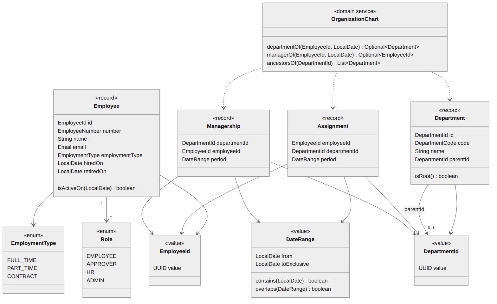
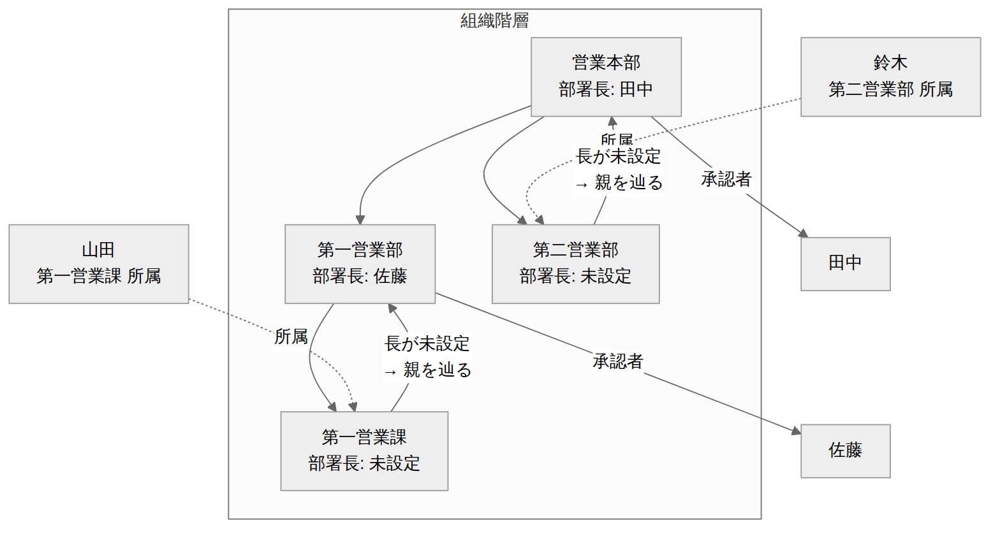

# 社員・組織 ドメインモデル設計書

| 項目 | 内容 |
| --- | --- |
| 文書番号 | KNT-DES-101 |
| 版 | 0.3 |
| 対象パッケージ | `jp.co.sample.kintai.employee` |
| 関連要件 | [BR-11 承認者の決定](../../01_要件定義/要件定義書.md#br-11-承認者の決定) |
| 関連文書 | [アーキテクチャ設計書](../00_共通/アーキテクチャ設計書.md) / [DB設計書](DB設計書.md) / [API設計書](API設計書.md) |
| 改訂 | 0.2（2026-09-01）設計レビューの指摘を反映<br>0.3（2026-09-01）レビュー第 2 回。`OrganizationChart` に `assignmentStartWithin` と `isActiveOn` を追加し、BR-11 の適用が `employee` の他のポートを引かないようにした |

---

## 1. このコンテキストの責務

社員と組織を管理し、**「ある日付において、誰がどの部署に所属し、その部署の長は誰か」**
という **事実** に答える。

**「誰が承認者か」は判断しない。** 自己承認の禁止、退職者のスキップ、
人事へのエスカレーション（BR-11 の 4 と 5）は承認の業務ルールであり、
`approval` コンテキストの `ApproverPolicy` が担う
（[アーキテクチャ設計書 6.4](../00_共通/アーキテクチャ設計書.md)）。

この分割により、組織の問い合わせを使うたびに承認のルールが付いてくることを避ける。

---

## 2. モデル



<sub>図のソース: [`diagrams/ドメインモデル.mmd`](diagrams/ドメインモデル.mmd)</sub>

### 2.1 値オブジェクト

| 型 | 表現するもの | 不変条件 |
| --- | --- | --- |
| `EmployeeId` | 社員の識別子 | UUID が非 null |
| `DepartmentId` | 部署の識別子 | UUID が非 null |
| `EmployeeNumber` | 社員番号。認証 ID を兼ねる | 英数字 1〜20 文字 |
| `DepartmentCode` | 部署コード | 英数字 1〜20 文字 |
| `Email` | メールアドレス | `@` を含む。比較は小文字で行う |
| `DateRange` | 日付の期間（`shared`） | `from < toExclusive`。**端点に null は許さない。** 無期限は番兵 `DateRange.UNBOUNDED_END` で表し、`infrastructure` が SQL の `NULL` へ写す |

**識別子を `UUID` の生値で持ち回らない。**
`findById(UUID)` は社員 ID でも部署 ID でも通ってしまうが、
`findById(EmployeeId)` なら取り違えがコンパイルエラーになるため。

### 2.2 期間の表現を 1 つに統一する

**すべての期間を `DateRange`（半開区間 `[from, toExclusive)`）で扱う。**

一方で、人間が入力する退職日は「最終出社日」であり閉区間の感覚である。
この差を放置すると **退職日当日に在籍しているのに所属が無い** という状態が生まれ、
最終日の勤怠の承認者が導出できなくなる。

変換をモデル側に閉じ込める。

```java
public record Employee(..., LocalDate hiredOn, Optional<LocalDate> retiredOn, ...) {

    /** 在籍期間。退職日は最終在籍日なので、半開区間へは翌日を渡す。 */
    public DateRange activePeriod() {
        // closed(from, Optional<LocalDate>) が「最終日 → 半開区間の上限」の変換と
        // 無期限（番兵）の両方を引き受ける。null を通さない
        return DateRange.closed(hiredOn, retiredOn);
    }

    public boolean isActiveOn(LocalDate date) {
        return activePeriod().contains(date);
    }
}
```

**無期限は番兵で表し、`null` は使わない。**
`DateRange` の端点に `null` を許すと、比較のたびに `null` 検査が要り、
書き忘れた 1 か所で在籍判定が落ちる。

ただし **番兵はそのままでは永続化できない。**
`DateRange.UNBOUNDED_END`（`LocalDate.MAX`）は PostgreSQL の `date` が表せる
上限（5874897 年）を超える。DDL 側は `retired_on date`（NULL 可）で無期限を表すので、
**`infrastructure` 層が `isUnbounded()` を見て `NULL` へ写す責務を負う**
（CLAUDE.md 落とし穴 35）。

端が番兵の期間に対して `days()` や所定労働日数を求めることはできないので、例外にする。
素通りさせると 365241759927 日という値が黙って返る。

**退職を登録するときは `assignments.valid_to` と `managerships.valid_to` に
`retiredOn.plusDays(1)` を設定する。** この規約を [API設計書](API設計書.md) 3.5 に明記する。

### 2.3 エンティティ

#### Employee

```java
public record Employee(
        EmployeeId id,
        EmployeeNumber number,
        String name,
        Email email,
        LocalDate hiredOn,
        LocalDate retiredOn,      // null は在籍中
        Set<Role> roles) {

    public Employee {
        if (retiredOn != null && retiredOn.isBefore(hiredOn)) { ... }
        if (!roles.contains(Role.EMPLOYEE)) {
            throw new IllegalArgumentException("全社員が EMPLOYEE ロールを持つ必要があります");
        }
        roles = Set.copyOf(roles);
    }
}
```

| 決定 | 理由 |
| --- | --- |
| **雇用形態を持たない** | 要件定義書 3.1 が「全社員の所定労働時間は 1 日 8 時間」と定めており、短時間勤務は対象外。列を設けると BR-04 / BR-05 の前提と実態が食い違う |
| `EMPLOYEE` ロールの保持を不変条件にする | 要件定義書 4 章。自分の打刻ができない社員を生成できなくする |
| 退職しても行を消さない | 過去の勤怠・承認履歴が社員を参照するため |

#### Department

```java
public record Department(
        DepartmentId id,
        DepartmentCode code,
        String name,
        DepartmentId parentId,     // null はルート
        LocalDate abolishedOn) {

    public boolean isRoot() { return parentId == null; }
    public boolean isActiveOn(LocalDate date) {
        return abolishedOn == null || date.isBefore(abolishedOn);
    }
}
```

部署そのものは有効期間を持たない。組織改編の履歴管理は要件に含まれないため
（要件定義書 2.3）、廃止日のみを持つ。

#### Assignment（所属）／ Managership（部署長）

```java
public record Assignment(EmployeeId employeeId, DepartmentId departmentId, DateRange period) {}
public record Managership(DepartmentId departmentId, EmployeeId employeeId, DateRange period) {}
```

**所属と部署長の双方が有効期間を持つ。**
片方だけを履歴化すると、「4 月分を 6 月に承認するとき、5 月に交代した新しい部署長が
承認者になる」という誤りが起きる。

| 制約 | 保証する場所 |
| --- | --- |
| 兼務なし（1 社員の所属期間は重複しない） | DB の `assignments_no_overlap` |
| 1 部署に同時に 2 人の長はいない | DB の `managerships_no_overlap` |
| 部署長の兼任は認める | 制約を置かない（BR-11 補足） |

### 2.4 ドメインサービス OrganizationChart

**事実の導出だけを担う。** 承認の可否は判断しない。

```java
public interface OrganizationChart {
    /** 指定日に社員が所属していた部署。 */
    Optional<Department> departmentOf(EmployeeId employeeId, LocalDate date);

    /** 部署とその祖先を、自分自身から根へ向かう順で返す。 */
    List<Department> selfAndAncestorsOf(DepartmentId departmentId);

    /** 指定日にその部署の長を務めていた社員。 */
    Optional<Managership> managerOf(DepartmentId departmentId, LocalDate date);

    /** その月の途中で所属が始まっていれば、その開始日。BR-11 の 1 の基準日に使う。 */
    Optional<LocalDate> assignmentStartWithin(EmployeeId employeeId, YearMonth month);

    /** 指定日にその社員が在籍していたか。 */
    boolean isActiveOn(EmployeeId employeeId, LocalDate date);
}
```

`approval` の `ApproverPolicy` は、**この 5 つだけ**を組み合わせて BR-11 を適用する。

```java
// approval/domain --- BR-11 の 4 と 5 はここで適用される
public Approver resolve(EmployeeId target, YearMonth month, LocalDate today) {
    LocalDate basis = organizationChart.assignmentStartWithin(target, month)
            .orElse(month.atDay(1));                            // BR-11 の 1
    Optional<Department> own = organizationChart.departmentOf(target, basis);   // BR-11 の 2
    for (Department department : organizationChart.selfAndAncestorsOf(own.get().id())) {
        if (!department.isActiveOn(basis)) continue;            // 廃止部署はスキップ
        var manager = organizationChart.managerOf(department.id(), basis);
        if (manager.isEmpty()) continue;                        // 長が未設定
        if (manager.get().employeeId().equals(target)) continue; // 自己承認の禁止
        if (!organizationChart.isActiveOn(manager.get().employeeId(), today)) continue;
        return Approver.of(manager.get(), path);                // 承認時点で退職済みはスキップ
    }
    return Approver.humanResources(path);                       // BR-11 の 5
}
```

> **`ApproverPolicy` は `employee` の他のポートを直接引かない。**
> 基準日の決定（BR-11 の 1）も在籍判定も**組織構造の事実**であり、
> `OrganizationChart` が答えるべき問いである。
> `AssignmentRepository` や `EmployeeRepository` を直接使うと、
> BR-11 の実装が 2 か所に散る（[アーキテクチャ設計書 6.4](../00_共通/アーキテクチャ設計書.md)）。

---

## 3. 承認者の導出（BR-11）



<sub>図のソース: [`diagrams/組織階層と承認者の導出.mmd`](diagrams/組織階層と承認者の導出.mmd)</sub>

### 3.1 基準日の決定（BR-11 の 1）

| 状況 | 基準日 |
| --- | --- |
| 通常 | 対象月の初日 |
| 当月の途中で所属を開始した（入社・異動） | **所属開始日** |

**この例外が無いと、月中入社の社員は初月の承認者が導出できず、
勤怠を永久に締められない。**

### 3.2 境界条件

| # | 状況 | 振る舞い | 根拠 |
| --- | --- | --- | --- |
| 1 | 所属部署に長が未設定 | 親部署へ遡る | BR-11 の 4 |
| 2 | 部署長が本人 | 親部署へ遡る（自己承認の禁止） | BR-11 の 4 |
| 3 | 部署長が**承認実行時点で**退職済み | 親部署へ遡る | BR-11 の 4 |
| 4 | 部署が廃止済み | その部署を飛ばして親へ遡る | BR-11 の 4 |
| 5 | 根まで遡っても承認者なし | **人事担当（`HR`）を承認者とする** | BR-11 の 5 |
| 6 | 対象月初日に所属が無いが月中に所属開始 | 所属開始日を基準日として再導出 | BR-11 の 1 |
| 7 | 対象月にまったく所属が無い（入社前・退職後） | 空を返す。**その月の勤怠は存在しないため** | — |
| 8 | 退職日当日 | 在籍として扱う。所属も有効 | 2.2 の期間の統一 |

**#3 の在籍判定だけ基準日ではなく承認実行時点で行う。**
基準日時点では在籍していた部署長が承認時点で退職していると、その承認を誰も実行できない。
実装では `Clock` から現在日を得る（AR-09）。

**#5 は本部長クラスの勤怠で必ず発生する。**
部署長の兼任を認めているため、本部長は所属部署の長も親部署の長も自分自身になり、
自己承認の禁止と組み合わさると根まで承認者が得られない。

---

## 4. ポート

```java
public interface EmployeeRepository {
    Optional<Employee> findById(EmployeeId id);
    Optional<Employee> findByNumber(EmployeeNumber number);
    List<Employee> findAll(LocalDate asOf, boolean includeRetired);
    void save(Employee employee);
}

public interface DepartmentRepository {
    Optional<Department> findById(DepartmentId id);
    List<Department> findAll();
    /** 自分自身から根まで（再帰 CTE で 1 クエリ）。 */
    List<Department> findSelfAndAncestors(DepartmentId departmentId);
    /** 自分自身と配下すべて。 */
    List<Department> findSelfAndDescendants(DepartmentId departmentId);
    void save(Department department);
}

public interface AssignmentRepository {
    /** 有効期間の重複は DB が禁止しているため、結果は高々 1 件。 */
    Optional<Assignment> findEffective(EmployeeId employeeId, LocalDate date);
    List<Assignment> findHistory(EmployeeId employeeId);
    void save(Assignment assignment);
    /** 現在開いている期間を指定日で閉じる。異動・退職で使う。 */
    void close(EmployeeId employeeId, LocalDate toExclusive);
}

public interface ManagershipRepository {
    /** 集約ごと返す。就任日を呼び出し側が使えるようにするため。 */
    Optional<Managership> findEffective(DepartmentId departmentId, LocalDate date);
    List<Managership> findByManager(EmployeeId employeeId, LocalDate date);
    void save(Managership managership);
    void close(DepartmentId departmentId, LocalDate toExclusive);
}
```

`findEffective` が `Optional` を返せるのは、**有効期間の重複を DB の排他制約が禁止している**
からである。「複数見つかったらどうするか」をアプリケーションで考えなくてよい。

`ManagershipRepository.findEffective` は `EmployeeId` ではなく `Managership` を返す。
呼び出し側が「いつから就任している長か」を必要とするため（API の承認者の経路に載せる）。

---

## 5. アプリケーションサービス

更新系のユースケースを受け、**トランザクション境界を定める。**
アーキテクチャ設計書 6.1 に従い、`@Transactional` はこの層に置く。

```java
@Service
public class EmployeeCommandService {
    @Transactional
    public EmployeeId register(RegisterEmployeeCommand command);
    @Transactional
    public void updateProfile(EmployeeId id, UpdateProfileCommand command, long version);
    /** 退職。所属と部署長を retiredOn の翌日で閉じる（2.2 の規約）。 */
    @Transactional
    public void retire(EmployeeId id, LocalDate retiredOn);
    @Transactional
    public void replaceRoles(EmployeeId id, Set<Role> additionalRoles);
}

@Service
public class OrganizationCommandService {
    @Transactional
    public DepartmentId createDepartment(CreateDepartmentCommand command);
    /** 親の変更。循環検出トリガが並行更新で破られないよう明示ロックを取る。 */
    @Transactional
    public void changeParent(DepartmentId id, DepartmentId newParentId, long version);
    @Transactional
    public void abolish(DepartmentId id, LocalDate abolishedOn);
    /** 異動。現在の所属を閉じて新しい所属を開く。 */
    @Transactional
    public void transfer(EmployeeId employeeId, DepartmentId to, LocalDate validFrom);
    /** 部署長の交代。現任を閉じて新しい就任を開く。 */
    @Transactional
    public void appointManager(DepartmentId departmentId, EmployeeId employeeId, LocalDate validFrom);
}

@Service
@Transactional(readOnly = true)
public class EmployeeQueryService {
    /** 閲覧範囲の絞り込みはここで行う。プレゼンテーション層に業務判断を置かない。 */
    public List<EmployeeView> list(EmployeeId viewer, EmployeeSearchCriteria criteria);
}
```

**`retire` と `transfer` が複数テーブルを更新する。**
これらが 1 トランザクションであることが、
「所属だけ閉じて部署長が開いたまま」という中途半端な状態を防ぐ。

---

## 6. 単体テストの観点

| ID | 観点 | 期待 | 対応要件 |
| --- | --- | --- | --- |
| UT-EMP-01 | 在籍判定の境界 | 入社日当日は在籍、前日は非在籍、退職日当日は在籍、翌日は非在籍 | — |
| UT-EMP-02 | 退職日 < 入社日 | 生成時に例外 | — |
| UT-EMP-03 | `EMPLOYEE` ロールを欠く | 生成時に例外 | 要件 4 章 |
| UT-EMP-04 | `activePeriod()` の変換 | 退職日 3/31 → `[hiredOn, 4/1)` | — |
| UT-BR11-01 | 所属部署に長がいる | その長を返す | BR-11 の 3 |
| UT-BR11-02 | 所属部署に長がいない | 親部署の長を返す | BR-11 の 4 |
| UT-BR11-03 | 部署長が本人 | 親部署の長を返す | BR-11 の 4 |
| UT-BR11-04 | 部署長が承認時点で退職済み | 親部署の長を返す | BR-11 の 4 |
| UT-BR11-05 | 部署が廃止済み | その部署を飛ばして親へ遡る | BR-11 の 4 |
| UT-BR11-06 | 根まで長がいない | **人事担当を返す** | BR-11 の 5 |
| UT-BR11-07 | 本部長本人の承認者 | 人事担当を返す（#3 と #5 の複合） | BR-11 の 4 / 5 |
| UT-BR11-08 | 月中入社 | 所属開始日を基準日として導出する | BR-11 の 1 |
| UT-BR11-09 | 異動を挟む | 対象月によって異なる部署長を返す | BR-11 の 1 |
| UT-BR11-10 | 部署長が交代している | 基準日時点の部署長を返す | BR-11 の 3 |
| UT-BR11-11 | 退職日当日の勤怠 | 所属が有効で承認者が導出できる | 2.2 |
| UT-BR11-12 | 対象月にまったく所属が無い | 空を返す（例外にしない） | — |

**UT-BR11-07 が最も重要。** 部署長の兼任と自己承認の禁止が組み合わさったとき、
人事へのエスカレーションが働かないと月次の締めが完了しない。

---

## 7. 未決事項

| # | 内容 | 判断の時期 |
| --- | --- | --- |
| 1 | 人事担当が複数いる場合、誰が承認者になるか（全員か、代表 1 名か） | [05_申請承認と締め](../05_申請承認と締め/) |
| 2 | 異動・退職の遡及訂正をどこまで許すか | M1-a の実装時 |
| 3 | 部署廃止時に配下の所属をどう閉じるか | M1-a の実装時 |
