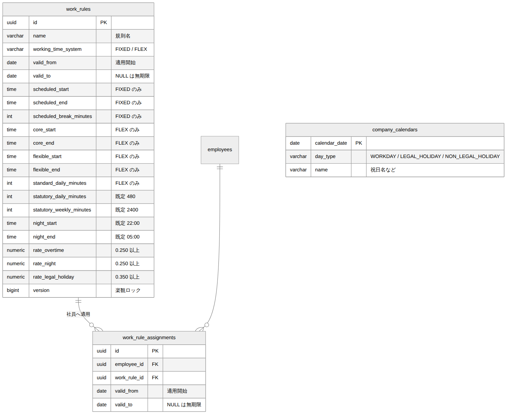

# 就業規則・カレンダー DB設計書

| 項目 | 内容 |
| --- | --- |
| 文書番号 | KNT-DES-202 |
| 版 | 0.1 |
| 対象スキーマ | `work_rules` / `work_rule_assignments` / `company_calendars` |
| 関連要件 | [3章 前提条件：就業規則](../../01_要件定義/要件定義書.md#3-前提条件就業規則) |
| 関連文書 | [ドメインモデル設計書](ドメインモデル設計書.md) |

---

## 1. ER 図



<sub>図のソース: [`diagrams/ER図.mmd`](diagrams/ER図.mmd)</sub>

---

## 2. 設計の要点

| # | 設計 | 理由 |
| --- | --- | --- |
| 1 | 労働時間制度を **1 テーブル + 判別列 + CHECK 制約** で表現する | 制度は 2 種で列数も少ない。ドメインの `sealed interface` と対になる形を DB でも作る |
| 2 | 制度ごとに「必要な列が揃い、不要な列が NULL である」ことを CHECK で保証する | 中途半端な行（FLEX なのに始業時刻が入っている等）を作れなくする |
| 3 | 割増率の法定下限を CHECK 制約で守る | ドメインの compact constructor と二重に守る。手作業の SQL でも破られない |
| 4 | 就業規則の適用（`work_rule_assignments`）を有効期間つきで保持する | 規則の改定と、社員ごとの適用切替を区別して扱うため |
| 5 | 会社カレンダーは暦日を主キーとする | 1 日 1 区分。存在しない日は所定労働日として扱う |

---

## 3. テーブル定義

### 3.1 work_rules（就業規則）

```sql
CREATE TABLE work_rules (
    id                       uuid         PRIMARY KEY,
    name                     varchar(100) NOT NULL,
    working_time_system      varchar(20)  NOT NULL,
    valid_from               date         NOT NULL,
    valid_to                 date,

    -- 固定時間制のときだけ使う列
    scheduled_start          time,
    scheduled_end            time,
    scheduled_break_minutes  int,

    -- フレックスタイム制のときだけ使う列
    flexible_start           time,
    flexible_end             time,
    core_start               time,
    core_end                 time,
    standard_daily_minutes   int,

    -- 制度によらず共通の列
    statutory_daily_minutes  int          NOT NULL DEFAULT 480,
    statutory_weekly_minutes int          NOT NULL DEFAULT 2400,
    night_start              time         NOT NULL DEFAULT '22:00',
    night_end                time         NOT NULL DEFAULT '05:00',
    rate_overtime            numeric(4,3) NOT NULL DEFAULT 0.250,
    rate_night               numeric(4,3) NOT NULL DEFAULT 0.250,
    rate_legal_holiday       numeric(4,3) NOT NULL DEFAULT 0.350,

    version                  bigint       NOT NULL DEFAULT 0,
    created_at               timestamptz  NOT NULL DEFAULT now(),
    updated_at               timestamptz  NOT NULL DEFAULT now(),

    CONSTRAINT work_rules_system_check
        CHECK (working_time_system IN ('FIXED', 'FLEX')),
    CONSTRAINT work_rules_validity_check
        CHECK (valid_to IS NULL OR valid_to > valid_from),

    -- ★ 制度ごとに必要な列が揃い、不要な列が NULL であることを保証する。
    --   ドメインの sealed interface（FixedTimeSystem / FlextimeSystem）に対応する制約
    CONSTRAINT work_rules_variant_check CHECK (
        (working_time_system = 'FIXED'
             AND scheduled_start IS NOT NULL
             AND scheduled_end IS NOT NULL
             AND scheduled_break_minutes IS NOT NULL
             AND flexible_start IS NULL AND flexible_end IS NULL
             AND core_start IS NULL AND core_end IS NULL
             AND standard_daily_minutes IS NULL)
        OR
        (working_time_system = 'FLEX'
             AND flexible_start IS NOT NULL
             AND flexible_end IS NOT NULL
             AND core_start IS NOT NULL
             AND core_end IS NOT NULL
             AND standard_daily_minutes IS NOT NULL
             AND scheduled_start IS NULL AND scheduled_end IS NULL
             AND scheduled_break_minutes IS NULL)
    ),

    -- コアタイムはフレキシブルタイムの内側になければならない
    CONSTRAINT work_rules_core_within_flexible_check CHECK (
        working_time_system <> 'FLEX'
        OR (flexible_start <= core_start AND core_start < core_end AND core_end <= flexible_end)
    ),

    -- 労基法 37 条の法定下限。ドメイン層と同じ不変条件を DB にも置く
    CONSTRAINT work_rules_rate_overtime_check      CHECK (rate_overtime >= 0.250),
    CONSTRAINT work_rules_rate_night_check         CHECK (rate_night >= 0.250),
    CONSTRAINT work_rules_rate_legal_holiday_check CHECK (rate_legal_holiday >= 0.350),

    CONSTRAINT work_rules_break_check
        CHECK (scheduled_break_minutes IS NULL OR scheduled_break_minutes >= 0),
    CONSTRAINT work_rules_standard_daily_check
        CHECK (standard_daily_minutes IS NULL OR standard_daily_minutes > 0),
    CONSTRAINT work_rules_statutory_check
        CHECK (statutory_daily_minutes > 0 AND statutory_weekly_minutes > 0),

    -- 同名の規則が同時期に 2 つ有効になることを禁止する（改定は期間を区切って行う）
    CONSTRAINT work_rules_no_overlapping_validity
        EXCLUDE USING gist (
            name WITH =,
            daterange(valid_from, valid_to, '[)') WITH &&
        )
);
```

#### `work_rules_variant_check` について

これは **ドメインの `sealed interface` を DB 側で表現したもの** である。

```java
sealed interface WorkingTimeSystem permits FixedTimeSystem, FlextimeSystem
```

Java 側では、フレックスの規則から `scheduledStart` を読もうとしてもコンパイルが通らない。
同じ保証を DB でも得るために、制度ごとの列の充足を制約として書いている。

これが無いと「`working_time_system = 'FLEX'` なのに `scheduled_start` に値が入っている」
という行が作れてしまい、どちらを信じればよいか分からないデータが生まれる。

### 3.2 work_rule_assignments（社員への適用）

```sql
CREATE TABLE work_rule_assignments (
    id           uuid        PRIMARY KEY,
    employee_id  uuid        NOT NULL REFERENCES employees (id),
    work_rule_id uuid        NOT NULL REFERENCES work_rules (id),
    valid_from   date        NOT NULL,
    valid_to     date,
    created_at   timestamptz NOT NULL DEFAULT now(),

    CONSTRAINT work_rule_assignments_period_check
        CHECK (valid_to IS NULL OR valid_to > valid_from),

    -- ★ 1 人の社員に、ある日付で適用される就業規則は必ず 0 件か 1 件
    CONSTRAINT work_rule_assignments_no_overlap
        EXCLUDE USING gist (
            employee_id WITH =,
            daterange(valid_from, valid_to, '[)') WITH &&
        )
);

CREATE INDEX work_rule_assignments_lookup_idx
    ON work_rule_assignments (employee_id, valid_from DESC);
```

**「規則の有効期間」と「社員への適用期間」を分けて持つ。**
前者は就業規則そのものの改定、後者は個人の勤務形態変更（固定 → フレックスなど）を表す。
同一視すると、規則を改定するたびに全社員の適用行を作り直すことになる。

### 3.3 company_calendars（会社カレンダー）

```sql
CREATE TABLE company_calendars (
    calendar_date date         PRIMARY KEY,
    day_type      varchar(20)  NOT NULL,
    name          varchar(100),
    created_at    timestamptz  NOT NULL DEFAULT now(),
    updated_at    timestamptz  NOT NULL DEFAULT now(),

    CONSTRAINT company_calendars_day_type_check
        CHECK (day_type IN ('WORKDAY', 'LEGAL_HOLIDAY', 'NON_LEGAL_HOLIDAY'))
);

CREATE INDEX company_calendars_day_type_idx ON company_calendars (day_type, calendar_date);
```

`name` は「元日」「創立記念日」など、休日の名称を保持する。画面表示に使う。

---

## 4. 主要なクエリ

### 4.1 指定日に適用される就業規則

```sql
SELECT r.*
FROM work_rule_assignments a
JOIN work_rules r ON r.id = a.work_rule_id
WHERE a.employee_id = :employeeId
  AND a.valid_from <= :date AND (a.valid_to IS NULL OR a.valid_to > :date)
  AND r.valid_from <= :date AND (r.valid_to IS NULL OR r.valid_to > :date);
```

**適用期間と規則自体の有効期間の両方で絞る。**
「社員には適用されているが、その規則は既に廃止されている」という状態を弾く。

### 4.2 指定月の所定労働日数（フレックスの所定総労働時間の算出に使う）

```sql
SELECT count(*) AS workday_count
FROM generate_series(:monthStart::date, (:monthStart::date + INTERVAL '1 month - 1 day')::date,
                     INTERVAL '1 day') AS d(calendar_date)
LEFT JOIN company_calendars c ON c.calendar_date = d.calendar_date::date
WHERE coalesce(c.day_type, 'WORKDAY') = 'WORKDAY';
```

`generate_series` で暦日を作り、カレンダーに **登録が無い日は所定労働日** として数える
（`coalesce`）。ドメインの `CompanyCalendar.dayTypeOf` と同じ既定値の扱いである。

### 4.3 指定期間の暦日区分をまとめて取得

```sql
SELECT calendar_date, day_type
FROM company_calendars
WHERE calendar_date >= :from AND calendar_date < :toExclusive;
```

月次の集計で日ごとに問い合わせると N+1 になるため、まとめて取得してメモリ上で引く。

---

## 5. 制約の一覧

| 制約名 | 種類 | 守るもの |
| --- | --- | --- |
| `work_rules_system_check` | CHECK | 労働時間制度が定義された 2 種のいずれか |
| `work_rules_variant_check` | CHECK | **制度ごとに必要な列が揃い、不要な列が NULL** |
| `work_rules_core_within_flexible_check` | CHECK | コアタイムがフレキシブルタイムの内側にある |
| `work_rules_rate_*_check` | CHECK | **割増率が労基法の下限以上** |
| `work_rules_no_overlapping_validity` | EXCLUDE | 同名規則の有効期間が重複しない |
| `work_rule_assignments_no_overlap` | EXCLUDE | **1 社員に同時に 2 つの就業規則が適用されない** |
| `company_calendars_day_type_check` | CHECK | 暦日区分が定義された 3 種のいずれか |

---

## 6. 制約の検証

本書の DDL は PostgreSQL に適用し、制約が不正データを拒否することを確認済み。

| ID | 検証内容 | 期待 | 確認 |
| --- | --- | --- | --- |
| IT-WR-01 | `FLEX` なのに `scheduled_start` を設定する | `work_rules_variant_check` で拒否 | 済 |
| IT-WR-02 | `FIXED` なのに `core_start` を設定する | `work_rules_variant_check` で拒否 | 済 |
| IT-WR-03 | `FLEX` で `core_start` を欠く | `work_rules_variant_check` で拒否 | 済 |
| IT-WR-04 | コアタイムがフレキシブルタイムの外にある | `work_rules_core_within_flexible_check` で拒否 | 済 |
| IT-WR-05 | 法定外残業の割増率を 0.100 にする | `work_rules_rate_overtime_check` で拒否 | 済 |
| IT-WR-06 | 同一社員に期間の重なる就業規則を適用する | `work_rule_assignments_no_overlap` で拒否 | 済 |
| IT-WR-07 | 未定義の暦日区分を登録する | `company_calendars_day_type_check` で拒否 | 済 |
| IT-WR-08 | 正常な `FIXED` / `FLEX` の規則を登録する | 成功する | 済 |
| IT-WR-09 | 所定労働日数のクエリが未登録日を所定労働日として数える | 4.2 が正しい件数を返す | 済 |

---

## 7. 未決事項

| # | 内容 | 判断の時期 |
| --- | --- | --- |
| 1 | 祝日データの投入方法（内閣府 CSV の取込か手動登録か） | M1-a の実装時 |
| 2 | 就業規則の改定時に過去分を再計算するか | 05_申請承認と締め の設計時 |
