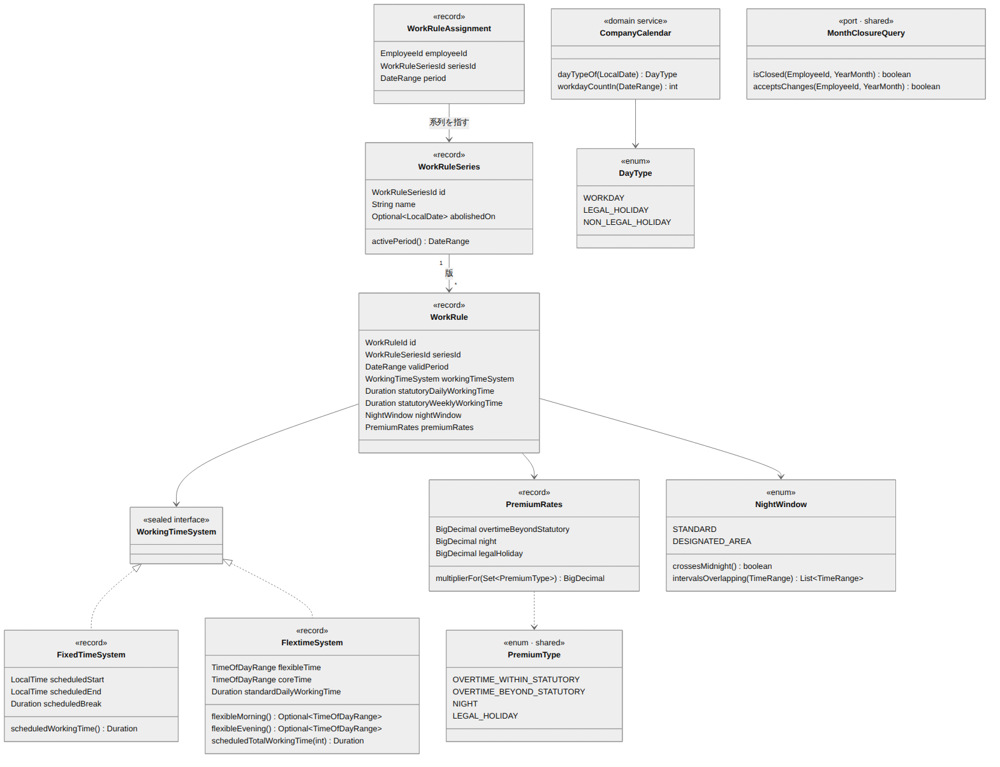
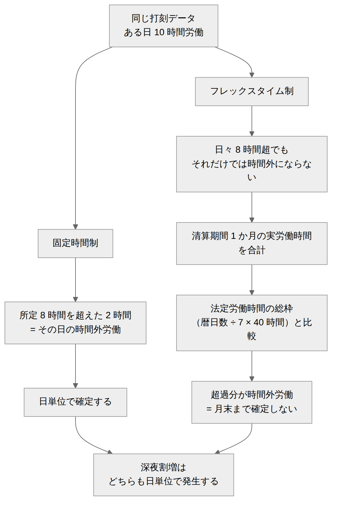

# 就業規則・カレンダー ドメインモデル設計書

| 項目 | 内容 |
| --- | --- |
| 文書番号 | KNT-DES-201 |
| 版 | 0.2 |
| 対象パッケージ | `jp.co.sample.kintai.workrule` |
| 関連要件 | [3章 前提条件：就業規則](../../01_要件定義/要件定義書.md#3-前提条件就業規則) / BR-04 / BR-05 / BR-06 / BR-07 |
| 関連文書 | [DB設計書](DB設計書.md) / [API設計書](API設計書.md) / [設計規約チェックリスト](../00_共通/設計規約チェックリスト.md) |
| 改訂 | 0.2（2026-09-01）設計レビュー第 2 回の指摘を反映 |

---

## 1. このコンテキストの責務

**勤怠計算に必要なパラメータを、時点を指定して提供する。** 計算そのものは行わない。

答えるべき問いは 3 つ。

1. 「ある社員の、ある日付に適用される就業規則は何か」
2. 「ある日付は所定労働日か、法定休日か、所定休日か」
3. 「ある清算期間の所定総労働時間は何分か」

### 1.1 他コンテキストへの依存

| 参照するもの | 置き場所 | 理由 |
| --- | --- | --- |
| `EmployeeId` | `shared.domain` | 識別子は共有語彙 |
| `PremiumType` | `shared.domain` | 割増区分は `workrule` と `attendance` の双方が使う。**どちらかに置くと依存が循環する** |
| `MonthClosureQuery` | `shared.domain`（実装は `approval`） | 締め済みの月の規則・カレンダーを変更させないため。ポートを `shared` に置くので **`workrule → approval` の辺は生まれない** |

依存の向きは
[アーキテクチャ設計書](../00_共通/アーキテクチャ設計書.md) のコンテキスト間依存図に従う。
**この 3 つ以外に他コンテキストの型を参照しない。**

---

## 2. モデル



<sub>図のソース: [`diagrams/ドメインモデル.mmd`](diagrams/ドメインモデル.mmd)</sub>

### 2.0 使用する型の一覧

| 型 | 定義場所 | 内容 |
| --- | --- | --- |
| `WorkRuleSeriesId` | 本コンテキスト | 就業規則の系列の識別子（UUID） |
| `WorkRuleId` | 本コンテキスト | 就業規則の**版**の識別子（UUID） |
| `DayType` | 本コンテキスト | `WORKDAY` / `LEGAL_HOLIDAY` / `NON_LEGAL_HOLIDAY` |
| `WorkingTimeSystemType` | 本コンテキスト | `FIXED` / `FLEX`。**永続化と表示のための判別値**（2.1） |
| `SettlementPeriod` | 本コンテキスト | 清算期間（暦月 ∩ 在籍期間）と、そこから決まる法定総枠（3.2） |
| `WorkRuleAssignment` | 本コンテキスト | 社員への適用。**系列**を指す |
| `EffectiveWorkRule` | 本コンテキスト | 時点解決のドメインサービス（3.4） |
| `TimeOfDayRange` | `shared.domain` | 壁掛け時計時刻の範囲。日をまたぐ場合は `start > end` |
| `DateRange` | `shared.domain` | 日付の**半開区間** `[from, toExclusive)` |
| `EmployeeId` | `shared.domain` | 社員の識別子 |
| `PremiumType` | `shared.domain` | `OVERTIME_WITHIN_STATUTORY` / `OVERTIME_BEYOND_STATUTORY` / `NIGHT` / `LEGAL_HOLIDAY` |

**期間はすべて半開区間で扱う。** 閉区間を混ぜない
（[設計規約チェックリスト 2](../00_共通/設計規約チェックリスト.md)）。

### 2.1 WorkingTimeSystem — 労働時間制度

**本コンテキストの中心。** 固定時間制とフレックスタイム制では、
同じ打刻データから導かれる結論がまったく異なる。



<sub>図のソース: [`diagrams/労働時間制度の違い.mmd`](diagrams/労働時間制度の違い.mmd)</sub>

この違いを `if (isFlextime)` の分岐で表現すると、判定漏れが実行時まで分からない。
**`sealed interface` で表現し、制度を追加したときに考慮漏れがコンパイルエラーになるようにする。**

```java
public sealed interface WorkingTimeSystem
        permits FixedTimeSystem, FlextimeSystem {
}

/** 固定時間制。始業・終業・休憩が就業規則で決まっている。 */
public record FixedTimeSystem(
        LocalTime scheduledStart,
        LocalTime scheduledEnd,
        Duration scheduledBreak) implements WorkingTimeSystem {

    public FixedTimeSystem {
        // 労基法 34 条。所定労働時間が 6 時間を超えるなら休憩 45 分以上
        if (rawWorkingTime(scheduledStart, scheduledEnd, scheduledBreak)
                .compareTo(Duration.ofHours(6)) > 0
                && scheduledBreak.compareTo(Duration.ofMinutes(45)) < 0) {
            throw new IllegalArgumentException("所定労働時間が 6 時間を超える場合、休憩は 45 分以上必要です");
        }
    }

    /** 所定労働時間。拘束時間から所定休憩を差し引く。 */
    public Duration scheduledWorkingTime() {
        Duration span = Duration.between(scheduledStart, scheduledEnd);
        if (!span.isPositive()) {
            span = span.plusDays(1);   // 終業が始業以下なら日をまたぐ勤務
        }
        return span.minus(scheduledBreak);
    }
}

/** フレックスタイム制。日々の所定は無く、清算期間の総労働時間で管理する。 */
public record FlextimeSystem(
        TimeOfDayRange flexibleTime,       // 07:00 – 22:00　出退勤を自由に決められる範囲
        TimeOfDayRange coreTime,           // 11:00 – 15:00　必ず労働する範囲
        Duration standardDailyWorkingTime  // 所定総労働時間の算出に使う 1 日あたりの時間
) implements WorkingTimeSystem {

    public FlextimeSystem {
        // コアタイムはフレキシブルタイムの内側になければならない
        if (!flexibleTime.contains(coreTime)) {
            throw new IllegalArgumentException("コアタイムはフレキシブルタイムの内側である必要があります");
        }
    }

    /** 清算期間の所定総労働時間。= 所定労働日数 × 1 日あたりの時間 */
    public Duration scheduledTotalWorkingTime(int workdayCount) {
        return standardDailyWorkingTime.multipliedBy(workdayCount);
    }

    /** コアタイム前のフレキシブル帯（07:00 – 11:00）。コアタイムから導出する。 */
    public TimeOfDayRange flexibleMorning() {
        return new TimeOfDayRange(flexibleTime.start(), coreTime.start());
    }

    /** コアタイム後のフレキシブル帯（15:00 – 22:00）。 */
    public TimeOfDayRange flexibleEvening() {
        return new TimeOfDayRange(coreTime.end(), flexibleTime.end());
    }
}
```

#### 永続化と表示のための判別値

`sealed interface` はそのまま列や JSON にできない。判別値を 1 つ定義する。

```java
/** 労働時間制度の判別値。永続化と表示にだけ使う。分岐には使わない。 */
public enum WorkingTimeSystemType {
    FIXED, FLEX;

    public static WorkingTimeSystemType of(WorkingTimeSystem system) {
        return switch (system) {
            case FixedTimeSystem ignored -> FIXED;
            case FlextimeSystem ignored  -> FLEX;
        };
    }
}
```

**この enum で `switch` して業務ロジックを分岐しない。**
分岐は下の `sealed interface` に対する網羅性検査つき `switch` で行う。
enum で分岐すると `default` 句が必要になり、制度を追加したときの漏れが実行時まで分からない。

`of` は `sealed interface` に対する `switch` なので、
制度を追加したらここが最初にコンパイルエラーになる。

利用側では、網羅性検査つきの `switch` で分岐する。

```java
Duration overtime = switch (workingTimeSystem) {
    case FixedTimeSystem fixed -> dailyOvertime(fixed, slices);
    case FlextimeSystem flex   -> Duration.ZERO;   // 月次で清算するため日次では確定しない
};
// default 句を書かない。制度を追加した瞬間にここがコンパイルエラーになる
```

朝夕のフレキシブル帯を独立した項目として持たず、
**フレキシブルタイムの外枠とコアタイムから導出する。**
3 つを独立に持つと「コアタイムがフレキシブル帯の外にある」という
矛盾したデータを作れてしまうため。

> **`FlextimeSystem` に日次の所定労働時間を持たせない。**
> 「フレックスなのに日々の所定がある」という誤解を型で防ぐ。
> `standardDailyWorkingTime` は所定総労働時間を算出するための係数であり、
> 日々の残業判定には使わない。名前でその意図を示している。

### 2.2 WorkRuleSeries と WorkRule — 系列と版

**就業規則は「系列」と「版」に分かれる。**
社員に適用されるのは系列であり、日付を指定して版が決まる。

```java
/** 就業規則の系列。改定をまたいで変わらない。社員はこれに紐づく。 */
public record WorkRuleSeries(
        WorkRuleSeriesId id,
        String name,                 // 「標準勤務」「フレックス勤務」
        Optional<LocalDate> abolishedOn) {

    /** 系列が有効な期間。半開区間。 */
    public DateRange activePeriod() {
        return new DateRange(LocalDate.MIN, abolishedOn.orElse(LocalDate.MAX));
    }
}

/** 就業規則の版。改定のたびに 1 つ増える。 */
public record WorkRule(
        WorkRuleId id,
        WorkRuleSeriesId seriesId,
        DateRange validPeriod,                 // 半開区間 [validFrom, validToExclusive)
        WorkingTimeSystem workingTimeSystem,
        Duration statutoryDailyWorkingTime,    // 原則 8 時間。これを超える値は作れない
        Duration statutoryWeeklyWorkingTime,   // 原則 40 時間。これを超える値は作れない
        NightWindow nightWindow,
        PremiumRates premiumRates) {

    public WorkRule {
        // 正であること、かつ法定の上限を超えないこと
        requireWithin(statutoryDailyWorkingTime, Duration.ofHours(8), "1 日の法定労働時間");
        requireWithin(statutoryWeeklyWorkingTime, Duration.ofHours(40), "1 週の法定労働時間");
        // 1 日が 1 週を超えることはありえない（DDL の statutory_consistency_check に対応）
        requireAtMost(statutoryDailyWorkingTime, statutoryWeeklyWorkingTime);
        requireScheduledWithinStatutory(workingTimeSystem, statutoryDailyWorkingTime);
    }
}
```

#### なぜ系列と版を分けるのか

第 1 版では社員が版を直接指していた。**この形だと改定した瞬間に全社員の規則が消える。**
詳細は [DB設計書 2.1](DB設計書.md) に書いた。ここでは型の観点だけを述べる。

```java
// 誤り。改定するとこの id が指す版は「過去の版」になる
record WorkRuleAssignment(EmployeeId employeeId, WorkRuleId workRuleId, DateRange period) {}

// 正しい。社員が結びつくのは「標準勤務」という規則であって、その 2024 年 4 月版ではない
record WorkRuleAssignment(EmployeeId employeeId, WorkRuleSeriesId seriesId, DateRange period) {}
```

**`WorkRuleId` と `WorkRuleSeriesId` を別の型にする。** どちらも UUID だが、
型が同じだと取り違えてもコンパイルが通ってしまう。
この設計欠陥は「UUID を UUID として扱っていた」ことに一因がある。

#### なぜ上限を検証するのか

割増**率**の下限（労基法 37 条）は第 1 版から守っていた。
しかし `statutoryDailyWorkingTime` に 12 時間を入れられたら、
**割増の対象になる時間そのものが消える。** 率がいくら高くても支払いは 0 になる。

「労働者に不利にできない」向きに、下限と上限の両方を置く。

### 2.3 PremiumRates — 割増率

```java
public record PremiumRates(
        BigDecimal overtimeBeyondStatutory,   // 0.25 以上
        BigDecimal night,                     // 0.25 以上
        BigDecimal legalHoliday) {            // 0.35 以上

    public PremiumRates {
        requireAtLeast(overtimeBeyondStatutory, new BigDecimal("0.25"), "法定外残業");
        requireAtLeast(night, new BigDecimal("0.25"), "深夜");
        requireAtLeast(legalHoliday, new BigDecimal("0.35"), "法定休日");
    }

    /** 割増属性の組み合わせに対する賃金倍率。深夜 + 法定外残業 なら 1.50 */
    public BigDecimal multiplierFor(Set<PremiumType> premiums) { ... }
}
```

| 決定 | 理由 |
| --- | --- |
| `double` ではなく `BigDecimal` を使う | 0.25 を `double` で扱うと積算時に誤差が出る。賃金計算では 1 円のズレが致命的 |
| 法定下限を compact constructor で検証する | 労基法 37 条の下限を下回る規則を **そもそも生成できなくする** |
| `PremiumType` を `shared.domain` に置く | `workrule` が割増率を持ち、`attendance` が区分を判定する。**どちらかの側に置くと依存が循環する** |

法定下限は DB の `CHECK` 制約でも同じ検証を行う（二重に守る）。

### 2.4 NightWindow — 深夜帯

```java
public record NightWindow(LocalTime start, LocalTime end) {   // 22:00 – 05:00

    /** 法定で決まった 2 種しか存在しない。 */
    public static final NightWindow STANDARD = ...;         // 22:00–05:00（原則）
    public static final NightWindow DESIGNATED_AREA = ...;  // 23:00–06:00（大臣が定める地域）

    public NightWindow {
        // 深夜帯を自由に狭められると、深夜割増を実質的に無効化できてしまう
        if (!isLegal(start, end)) {
            throw new IllegalArgumentException("深夜帯は 22:00–05:00 または 23:00–06:00 に限ります");
        }
    }

    public boolean crossesMidnight() { return start.isAfter(end); }

    /** 指定区間と重なる深夜帯をすべて返す。連続勤務では複数返る。 */
    public List<TimeRange> intervalsOverlapping(TimeRange range) { ... }
}
```

**日付をまたぐ時間帯の展開ロジックをこの型に閉じ込める。**
素朴に扱うと「22:00 は 05:00 より後だから区間が作れない」といった不具合の温床になる。

### 2.5 CompanyCalendar — 会社カレンダー

```java
public interface CompanyCalendar {
    /** 暦日の区分。未登録の日は所定労働日とみなす。 */
    DayType dayTypeOf(LocalDate date);

    /** 指定期間の所定労働日数。期間は半開区間。 */
    int workdayCountIn(DateRange period);
}
```

**未登録の日を所定労働日として扱う。**
登録漏れの日を休日と判定すると、通常勤務に休日割増が付いて過払いになる。
逆向きの誤り（休日なのに所定労働日と判定）は、勤怠の確認時に気づける。

> **`workdayCountIn` は `YearMonth` ではなく `DateRange` を受ける。**
> 月中入社の初月は清算期間が「入社日から翌月 1 日まで」になるため（3.2）、
> 暦月に固定できない。

---

## 3. 就業規則の選択（時点解決）

勤怠を計算するときは、必ず **勤務日を指定して** 就業規則を取得する。

```java
public interface WorkRuleRepository {
    /**
     * 指定日に社員へ適用される就業規則（版）。
     * 適用期間の重複と版の期間の重複を DB の排他制約が禁止しているため、結果は高々 1 件。
     */
    Optional<WorkRule> findEffective(EmployeeId employeeId, LocalDate date);
}
```

解決は 2 段階である。

```
employeeId + date ──> work_rule_assignments ──> WorkRuleSeriesId
                                                      │ + date
                                                      ▼
                                                  WorkRule（版）
```

| 状況 | 振る舞い |
| --- | --- |
| 対象日に適用される系列がない | 空を返す。呼び出し側が「就業規則未設定」として扱い、計算を行わない |
| 系列はあるが、その日に有効な版がない（版に隙間） | 空を返す。**これは運用の誤りなので、未適用者一覧で検知する**（DB設計書 5.1） |
| 規則が改定された月をまたぐ | 勤務日ごとに版を引くため、改定日の前後で自動的に切り替わる。**適用行は書き換えない** |
| 締め済みの月を再計算しようとした | 本コンテキストは関知しない。`approval` が締め状態を見て拒否する |

### 3.4 解決そのものはドメインサービスに置く

`WorkRuleRepository.findEffective` は「取得」の口であり、
**どの版を選ぶかという判断そのものはドメインの知識**である。
取得したものの中から選ぶ部分を切り出しておくと、DB を起動せずに単体テストできる。

```java
public final class EffectiveWorkRule {
    /**
     * 指定日に有効な版。適用が無い、または版に隙間がある場合は空。
     * 例外にしない。呼び出し側が「就業規則未設定」として扱う。
     */
    public static Optional<WorkRule> resolve(List<WorkRuleAssignment> assignments,
                                             List<WorkRule> versions, LocalDate date) { ... }
}
```

**系列の廃止（`abolishedOn`）はここでは見ない。**
廃止済みの系列に新しい適用を作れないことは DB の制約トリガが守っており
（[DB設計書 3.4](DB設計書.md)）、既にある適用は有効期間で閉じる運用とする。

### 3.1 なぜ日付ごとに引くのか

月の途中で規則が改定されると、同じ月の中に 2 つの版が混在する。
「月の代表的な規則」を 1 つ選ぶと、改定日をまたいだ日の計算が誤る。

日ごとに引くのは N+1 になるが、
月次の集計では期間分の版をまとめて取得してメモリ上で引く（`findEffectiveByPeriod`）。

### 3.2 清算期間の決め方

フレックスの清算期間は原則として暦月である。ただし **在籍期間と交差させる。**

```java
public record SettlementPeriod(YearMonth month, DateRange period) {

    /** 清算期間 = 暦月 ∩ 在籍期間。交差しない月（入社前・退職後）は空を返す。 */
    public static Optional<SettlementPeriod> of(YearMonth month, DateRange employmentPeriod) { ... }

    public long days() { ... }

    /** 法定労働時間の総枠。= 暦日数 ÷ 7 × 週法定労働時間。分未満は切り捨てる。 */
    public Duration statutoryTotalLimit(Duration statutoryWeekly) { ... }
}
```

**戻り値は `Optional` である。** 在籍期間と交差しない月には清算するものが無い。
交差を必ず得られる前提で書くと、入社前・退職後の月で落ちる。

| 状況 | 清算期間 |
| --- | --- |
| 通常 | 月初日 〜 翌月初日（半開） |
| 4/15 入社 | **4/15 〜 5/1** |
| 9/20 退職（最終在籍日 9/20） | **9/1 〜 9/21** |

所定労働日数も法定労働時間の総枠も、この期間で数える。
暦月に固定すると、**月中入社の社員の初月が計算できず、締められない。**

> 就業規則の適用開始日を「月初日のみ」に限定していたのが第 1 版の誤りだった。
> 入社日を例外として許すことで初月が扱えるようになる（[DB設計書 3.4](DB設計書.md)）。
> 制度の途中変更（固定 → フレックス）を月初日に限る理由は変わらない。
> **入社は「変更」ではなく「開始」なので、清算期間が割れる問題が起きない。**

### 3.3 所定総労働時間と法定労働時間の総枠

フレックスでは、所定総労働時間が **法定労働時間の総枠を超える月がある。**

総枠は `SettlementPeriod` のメソッドとして持つ（3.2）。
期間を引数で受け取る形にすると、暦月を渡す誤りが型で防げない。

2026 年 6 月（暦日 30 日・所定労働日 22 日・1 日 8 時間）では、

| 項目 | 値 |
| --- | --- |
| 所定総労働時間 | 22 × 480 = **10,560 分** |
| 法定労働時間の総枠 | 30 ÷ 7 × 2,400 = **10,285 分** |
| 差 | **275 分** |

**所定どおり働くだけで法定外残業が 275 分発生する。**
違法ではないが、36 協定と割増賃金が必要になる。

[04_勤怠_月次清算](../04_勤怠_月次清算/ドメインモデル設計書.md) の
`overtime = max(0, 対象労働時間 − 法定総枠)` がこれを残業として扱うので、
**賃金の取りこぼしは起きない。** しかし人事が意図せずこの状態を作ることは避けたいので、
規則の登録・改定時とカレンダーの一括設定時に検証して警告を返す。

```java
/** 清算期間の所定総労働時間が法定総枠を超えるか。超えるなら警告を返す。 */
public Optional<ScheduleExceedsStatutoryLimit> checkCapacity(
        FlextimeSystem flex, DateRange period, int workdayCount, Duration statutoryWeekly) {
    Duration scheduled = flex.scheduledTotalWorkingTime(workdayCount);
    Duration limit = statutoryTotalLimit(period, statutoryWeekly);
    return scheduled.compareTo(limit) > 0
            ? Optional.of(new ScheduleExceedsStatutoryLimit(period, scheduled, limit))
            : Optional.empty();
}
```

**例外にしない。** 適法な状態なので登録は許し、人事に知らせるだけにとどめる。

---

## 4. ポート

```java
public interface WorkRuleRepository {
    Optional<WorkRule> findEffective(EmployeeId employeeId, LocalDate date);
    Map<LocalDate, WorkRule> findEffectiveByPeriod(EmployeeId employeeId, DateRange period);
    Optional<WorkRule> findById(WorkRuleId id);
    List<WorkRule> findVersionsOf(WorkRuleSeriesId seriesId);
    void save(WorkRule workRule);
}

public interface WorkRuleSeriesRepository {
    Optional<WorkRuleSeries> findById(WorkRuleSeriesId id);
    List<WorkRuleSeries> findAll();
    void save(WorkRuleSeries series);
    void assign(EmployeeId employeeId, WorkRuleSeriesId seriesId, LocalDate validFrom);
    List<EmployeeId> findEmployeesWithoutRuleOn(LocalDate date);
}

public interface CompanyCalendarRepository {
    DayType dayTypeOf(LocalDate date);
    Map<LocalDate, DayType> findByPeriod(DateRange period);
    int workdayCountIn(DateRange period);
    void save(LocalDate date, DayType dayType, String name);
}
```

`findByPeriod` を用意しているのは、**月次の集計で日ごとに問い合わせると N+1 になる**ため。
期間の分をまとめて取得し、メモリ上で引く。

`findEmployeesWithoutRuleOn` は、DB では守れない
「在籍者全員に規則が適用されている」ことを画面で検知するために置く
（[DB設計書 5.1](DB設計書.md)）。

### 4.1 `shared` に置くポート

締め済みの月の規則・カレンダーを変更させない判定は、`approval` の知識である。
しかし `workrule → approval` の依存は作りたくない。**ポートを `shared` に置く。**

```java
// shared/domain
public interface MonthClosureQuery {
    boolean isClosed(EmployeeId employeeId, YearMonth month);
    boolean acceptsChanges(EmployeeId employeeId, YearMonth month);
}
// 実装は approval/infrastructure に置く。workrule は shared のインタフェースだけを見る
```

依存図に新しい辺は増えない
（[アーキテクチャ設計書](../00_共通/アーキテクチャ設計書.md)）。

---

## 5. 単体テストの観点

| ID | 観点 | 期待 | 要件 |
| --- | --- | --- | --- |
| UT-WR-01 | `FixedTimeSystem` の所定労働時間 | 9:00–18:00 / 休憩 60 分 → 8 時間 | 3 章 |
| UT-WR-02 | 日をまたぐ固定勤務 | 22:00–06:00 / 休憩 60 分 → 7 時間 | 3 章 |
| UT-WR-03 | `FlextimeSystem` の所定総労働時間 | 所定労働日数 20 日 × 8 時間 → 160 時間 | BR-05 |
| UT-WR-04 | 割増率が法定下限を下回る | 生成時に例外 | BR-06 / BR-07 |
| UT-WR-05 | 割増の重ね掛け | 深夜 + 法定外残業 → 1.50 | BR-06 |
| UT-WR-06 | 法定休日 + 深夜 | 1.60（法定休日と時間外は重複しない） | BR-06 / BR-07 |
| UT-WR-07 | `NightWindow` が日付をまたぐ | 20:00–翌 02:00 の区間 → 深夜は 22:00–翌 02:00 の 4 時間 | BR-06 |
| UT-WR-08 | `NightWindow` が複数日にまたがる | 連続勤務で深夜帯が 2 回現れる | BR-06 |
| UT-WR-09 | **深夜帯を 02:00–03:00 で生成** | 生成時に例外 | BR-06 |
| UT-WR-10 | **1 日の法定労働時間を 12 時間で生成** | 生成時に例外 | BR-04 |
| UT-WR-11 | **所定 9 時間の固定時間制を生成** | 生成時に例外（所定 > 法定） | BR-04 |
| UT-WR-12 | **所定 7 時間・休憩 30 分を生成** | 生成時に例外（労基法 34 条） | BR-08 |
| UT-WR-13 | **改定後の日付で `findEffective`** | 新しい版が返る。適用行は書き換えていない | 3 章 |
| UT-WR-14 | **改定前の日付で `findEffective`** | 古い版が返る | 3 章 |
| UT-WR-15 | **版に隙間がある日付で `findEffective`** | 空が返る（例外にしない） | 3 章 |
| UT-WR-16 | **4/15 入社の清算期間** | `[2026-04-15, 2026-05-01)` | BR-05 |
| UT-WR-17 | **9/20 退職の清算期間** | `[2026-09-01, 2026-09-21)` | BR-05 |
| UT-WR-18 | **2026-06・所定 22 日・8 時間の総枠検証** | 10,560 > 10,285 で警告が返る | BR-05 |
| UT-WR-19 | **総枠を超えない月の総枠検証** | 警告は返らない | BR-05 |
| UT-CAL-01 | 未登録日の区分 | `WORKDAY` を返す | BR-07 |
| UT-CAL-02 | 所定労働日数 | 土日祝を除いた日数を返す | BR-05 |
| UT-CAL-03 | **半開区間の端** | `[6/1, 7/1)` は 6/30 を含み 7/1 を含まない | BR-05 |

---

## 6. 未決事項

| # | 内容 | 判断の時期 |
| --- | --- | --- |
| 1 | 祝日データを内閣府の CSV から取り込むか、人事が手動登録するか | M1-a の実装時 |
| 2 | 就業規則の改定時、過去分の日次勤怠を自動で再計算するか、人事が明示的に指示するか | 05_申請承認と締め の設計時 |
| 3 | フレックスの清算期間を 1 か月以外（最大 3 か月）に広げるか | M2 以降 |
