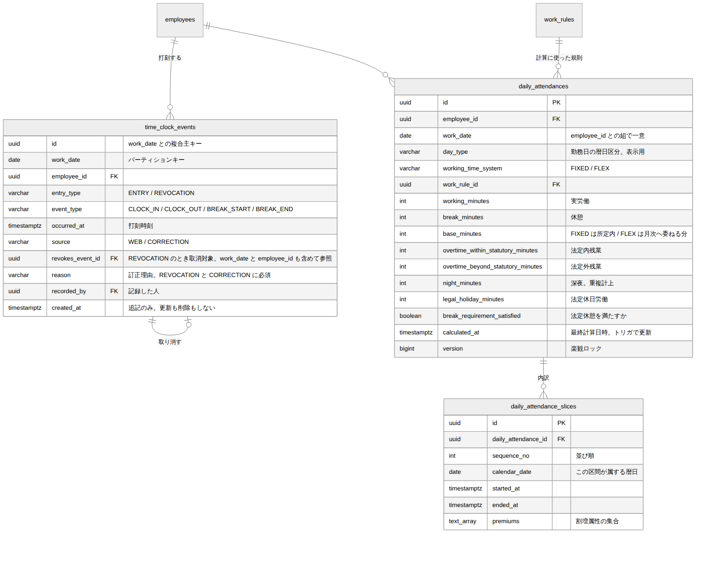

# 勤怠（打刻・日次集計） DB設計書

| 項目 | 内容 |
| --- | --- |
| 文書番号 | KNT-DES-302 |
| 版 | 0.2 |
| 対象スキーマ | `time_clock_events` / `daily_attendances` / `daily_attendance_slices` |
| 関連要件 | BR-01 / BR-02 / BR-03 / BR-05 / BR-07 / BR-08 / BR-09 |
| 関連文書 | [ドメインモデル設計書](ドメインモデル設計書.md) / [API設計書](API設計書.md) / [設計規約チェックリスト](../00_共通/設計規約チェックリスト.md) |
| 改訂 | 0.2（2026-09-01）設計レビュー第 2 回の指摘を反映 |

---

## 1. ER 図



<sub>図のソース: [`diagrams/ER図.mmd`](diagrams/ER図.mmd)</sub>

---

## 2. 設計の要点

| # | 設計 | 理由 |
| --- | --- | --- |
| 1 | 打刻を **追記専用** にする。更新も削除もしない | 打刻は労働時間の一次証拠。訂正で上書きすると「元は何時だったか」が失われる（BR-09） |
| 2 | 訂正を **取消行の追記** で表現する | 履歴の欠落を構造的に防ぐ |
| 3 | `time_clock_events` を `work_date` でレンジパーティションにする | 100 名 × 240 日 × 4 回で年間 10 万行、5 年で 50 万行。単調増加するため最初から分割する |
| 4 | 日次勤怠を **計算結果のスナップショット** として保存する | 締めた後に就業規則を改定しても、確定済みの値が動いてはいけない |
| 5 | 内訳（`daily_attendance_slices`）を正規化して保持する | 「なぜこの残業時間か」を提示できないと労務の問い合わせに答えられない |
| 6 | 集計値の整合を CHECK 制約で保証する | ドメインの不変条件と対にする。集計ロジックを壊す変更を DB が拒否する |
| 7 | 内訳が **暦日をまたがない** ようにする（`calendar_date` を持つ） | 法定休日労働は暦日で判断するため（[ドメインモデル設計書 2.4](ドメインモデル設計書.md)） |
| 8 | 日次勤怠に **労働時間制度**を持たせる | フレックスに日次の残業を計上させないため（BR-05） |

---

## 3. テーブル定義

### 3.1 time_clock_events（打刻イベント）

```sql
CREATE TABLE time_clock_events (
    id                uuid        NOT NULL,
    work_date         date        NOT NULL,
    employee_id       uuid        NOT NULL REFERENCES employees (id),
    entry_type        varchar(20) NOT NULL,
    event_type        varchar(20) NOT NULL,
    occurred_at       timestamptz NOT NULL,
    source            varchar(20) NOT NULL DEFAULT 'WEB',
    revokes_event_id  uuid,
    reason            varchar(200),
    recorded_by       uuid        NOT NULL REFERENCES employees (id),
    created_at        timestamptz NOT NULL DEFAULT now(),

    CONSTRAINT time_clock_events_entry_type_check
        CHECK (entry_type IN ('ENTRY', 'REVOCATION')),
    CONSTRAINT time_clock_events_event_type_check
        CHECK (event_type IN ('CLOCK_IN', 'CLOCK_OUT', 'BREAK_START', 'BREAK_END')),
    -- 要件に無い打刻手段を増やさない。訂正申請の承認による追記だけを別扱いする
    CONSTRAINT time_clock_events_source_check
        CHECK (source IN ('WEB', 'CORRECTION')),

    -- 取消行は必ず対象を持ち、通常の打刻は持たない。
    -- 訂正で追記された打刻（source = 'CORRECTION'）にも理由を必須とする
    CONSTRAINT time_clock_events_revocation_check CHECK (
        (entry_type = 'REVOCATION' AND revokes_event_id IS NOT NULL AND reason IS NOT NULL)
        OR
        (entry_type = 'ENTRY' AND revokes_event_id IS NULL
             AND (source <> 'CORRECTION' OR reason IS NOT NULL))
    ),

    -- パーティションキーを主キーに含めるのは PostgreSQL の制約
    PRIMARY KEY (work_date, id),

    -- 取消対象を (work_date, employee_id, id) で参照するための一意制約
    CONSTRAINT time_clock_events_owner_uk UNIQUE (work_date, employee_id, id),

    -- ★ 取消対象は「同じ勤務日の、同じ社員の」打刻でなければならない。
    --   employee_id を参照に含めないと、他人の打刻を取り消せてしまう
    CONSTRAINT time_clock_events_revokes_fk
        FOREIGN KEY (work_date, employee_id, revokes_event_id)
        REFERENCES time_clock_events (work_date, employee_id, id)
) PARTITION BY RANGE (work_date);

-- 同じ打刻を二重に取り消せない
CREATE UNIQUE INDEX time_clock_events_revokes_uk
    ON time_clock_events (work_date, revokes_event_id)
    WHERE revokes_event_id IS NOT NULL;

CREATE INDEX time_clock_events_employee_date_idx
    ON time_clock_events (employee_id, work_date, occurred_at);

-- 要件 7 章のデータ保持期間（5 年）ぶんを事前に定義する
CREATE TABLE time_clock_events_2026 PARTITION OF time_clock_events
    FOR VALUES FROM ('2026-01-01') TO ('2027-01-01');
CREATE TABLE time_clock_events_2027 PARTITION OF time_clock_events
    FOR VALUES FROM ('2027-01-01') TO ('2028-01-01');
CREATE TABLE time_clock_events_2028 PARTITION OF time_clock_events
    FOR VALUES FROM ('2028-01-01') TO ('2029-01-01');
CREATE TABLE time_clock_events_2029 PARTITION OF time_clock_events
    FOR VALUES FROM ('2029-01-01') TO ('2030-01-01');
CREATE TABLE time_clock_events_2030 PARTITION OF time_clock_events
    FOR VALUES FROM ('2030-01-01') TO ('2031-01-01');
-- 想定外の日付の受け皿。ここに行が入ること自体が異常なので監視する
CREATE TABLE time_clock_events_default PARTITION OF time_clock_events DEFAULT;
```

#### `recorded_by` を持つ理由

打刻した本人と、記録を行った人は一致しないことがある（訂正申請の承認による追記など）。
**誰が記録したかを残さないと、不正打刻の調査ができない。**

#### 取消対象に `employee_id` を含める理由

第 1 版の外部キーは `(work_date, revokes_event_id)` だけを見ていた。
これだと **社員 B が、社員 A の出勤打刻を取り消す行を自分名義で INSERT できる。**
4.1 の有効打刻クエリは取消の存在だけを見るため、
社員 A の出勤打刻が消え、労働時間が失われる。

参照キーに `employee_id` を含めることで、DB が構造的に拒否する。

#### DEFAULT パーティションの扱い

**DEFAULT に行が入った状態では、その範囲のパーティションを後から追加できない。**

```
ERROR: updated partition constraint for default partition "time_clock_events_default"
       would be violated by some row
```

打刻は追記専用で DELETE しない方針なので、退避のための削除は方針と衝突する。
そこで **DEFAULT は「入ったら即座に検知するための受け皿」** と位置づける。

| 運用 | 内容 |
| --- | --- |
| 監視 | `SELECT count(*) FROM time_clock_events_default` を日次で確認し、0 でなければ警報 |
| 移送 | 追記専用の唯一の例外として、`DELETE` + `INSERT` による移送を認める。実行は運用手順に従い、監査ログを残す |
| 予防 | 保持期間の終わりが近づいたら、翌年ぶんのパーティションを追加するマイグレーションを流す |

#### 更新・削除を禁じる運用

テーブル定義だけでは UPDATE / DELETE を防げない。
アプリケーション側では、ポートに追記と参照のメソッドしか置かないことで防ぐ
（ドメインモデル設計書 3.2）。運用者による直接操作の抑止は、
権限設計（`REVOKE UPDATE, DELETE`）で行う。M1-c で扱う。

### 3.2 他テーブル・他列を参照する不変条件（制約トリガ）

`CHECK` は自分の行しか参照できず、`timestamptz` から日付を取り出す式は
タイムゾーンに依存するため IMMUTABLE でもない。次の 3 つは制約トリガで守る。

```sql
CREATE OR REPLACE FUNCTION time_clock_events_validate() RETURNS trigger AS $$
DECLARE
    target_entry_type varchar(20);
    target_event_type varchar(20);
    punched_on        date;
BEGIN
    -- ① 打刻時刻は勤務日の当日か翌日でなければならない（BR-03 の日跨ぎを許容する幅）
    punched_on := (NEW.occurred_at AT TIME ZONE 'Asia/Tokyo')::date;
    IF punched_on < NEW.work_date OR punched_on > NEW.work_date + 1 THEN
        RAISE EXCEPTION '打刻時刻が勤務日から離れすぎています (work_date=%, occurred_at=%)',
            NEW.work_date, NEW.occurred_at;
    END IF;

    IF NEW.entry_type = 'REVOCATION' THEN
        SELECT entry_type, event_type INTO target_entry_type, target_event_type
          FROM time_clock_events
         WHERE work_date = NEW.work_date AND id = NEW.revokes_event_id;

        -- ② 取消の対象は ENTRY に限る。取消の取消は認めない
        IF target_entry_type <> 'ENTRY' THEN
            RAISE EXCEPTION '取消できるのは通常の打刻だけです (revokes_event_id=%)',
                NEW.revokes_event_id;
        END IF;

        -- ③ 取消行の打刻種別は対象と一致していなければならない
        IF target_event_type <> NEW.event_type THEN
            RAISE EXCEPTION '取消行の打刻種別が対象と一致しません (% <> %)',
                NEW.event_type, target_event_type;
        END IF;
    END IF;

    RETURN NEW;
END;
$$ LANGUAGE plpgsql;

CREATE CONSTRAINT TRIGGER time_clock_events_validate_trigger
    AFTER INSERT ON time_clock_events
    DEFERRABLE INITIALLY IMMEDIATE
    FOR EACH ROW EXECUTE FUNCTION time_clock_events_validate();
```

**「取消の取消」を認めない。** 認めると有効打刻の判定が再帰的になり、
4.1 のクエリでは表現できなくなる。やり直したいなら新しい ENTRY を積む
（[ドメインモデル設計書 3](ドメインモデル設計書.md)）。

### 3.3 daily_attendances（日次勤怠）

```sql
CREATE TABLE daily_attendances (
    id                                uuid        PRIMARY KEY,
    employee_id                       uuid        NOT NULL REFERENCES employees (id),
    work_date                         date        NOT NULL,
    day_type                          varchar(20) NOT NULL,
    working_time_system               varchar(20) NOT NULL,
    work_rule_id                      uuid        NOT NULL REFERENCES work_rules (id),
    working_minutes                   int         NOT NULL,
    break_minutes                     int         NOT NULL,
    base_minutes                      int         NOT NULL,
    overtime_within_statutory_minutes int         NOT NULL,
    overtime_beyond_statutory_minutes int         NOT NULL,
    night_minutes                     int         NOT NULL,
    legal_holiday_minutes             int         NOT NULL,
    break_requirement_satisfied       boolean     NOT NULL,
    calculated_at                     timestamptz NOT NULL DEFAULT now(),
    version                           bigint      NOT NULL DEFAULT 0,
    created_at                        timestamptz NOT NULL DEFAULT now(),
    updated_at                        timestamptz NOT NULL DEFAULT now(),

    CONSTRAINT daily_attendances_day_type_check
        CHECK (day_type IN ('WORKDAY', 'LEGAL_HOLIDAY', 'NON_LEGAL_HOLIDAY')),
    CONSTRAINT daily_attendances_system_check
        CHECK (working_time_system IN ('FIXED', 'FLEX')),

    CONSTRAINT daily_attendances_non_negative_check
        CHECK (working_minutes >= 0 AND break_minutes >= 0
               AND base_minutes >= 0
               AND overtime_within_statutory_minutes >= 0
               AND overtime_beyond_statutory_minutes >= 0
               AND night_minutes >= 0
               AND legal_holiday_minutes >= 0),

    -- ★ 排他的な 4 区分の合計は実労働時間に一致する。深夜は重ね掛けなので含めない
    CONSTRAINT daily_attendances_breakdown_check
        CHECK (base_minutes
               + overtime_within_statutory_minutes
               + overtime_beyond_statutory_minutes
               + legal_holiday_minutes = working_minutes),

    -- ★ 深夜労働が実労働時間を超えることはありえない
    CONSTRAINT daily_attendances_night_within_working_check
        CHECK (night_minutes <= working_minutes),

    -- ★ フレックスは日次で残業を判定しない（BR-05）
    CONSTRAINT daily_attendances_flex_check
        CHECK (working_time_system <> 'FLEX'
               OR (overtime_within_statutory_minutes = 0
                   AND overtime_beyond_statutory_minutes = 0)),

    -- ★ 休憩の充足は実労働時間と休憩時間から一意に決まる（労基法 34 条 / BR-08）
    CONSTRAINT daily_attendances_break_requirement_check
        CHECK (break_requirement_satisfied = (
            CASE WHEN working_minutes > 480 THEN break_minutes >= 60
                 WHEN working_minutes > 360 THEN break_minutes >= 45
                 ELSE true END)),

    CONSTRAINT daily_attendances_employee_date_uk UNIQUE (employee_id, work_date)
);
```

#### 法定休日を `day_type` で縛らない理由

第 1 版には次の 2 つの制約があった。

```text
-- 第 1 版（削除した）
CHECK (day_type <> 'LEGAL_HOLIDAY' OR (残業区分がすべて 0))
CHECK (day_type = 'LEGAL_HOLIDAY' OR legal_holiday_minutes = 0)
```

`day_type` は **勤務日**の暦日区分である。しかし法定休日労働は
**暦日**で判断する（[ドメインモデル設計書 2.4](ドメインモデル設計書.md)）。

土曜（所定休日）22:00 出勤 → 日曜（法定休日）06:00 退勤は、
勤務日が土曜なので `day_type = 'NON_LEGAL_HOLIDAY'` になるが、
日曜 0:00–6:00 は法定休日労働である。
**第 1 版の 2 つ目の制約は、この正しい計算結果を INSERT できなくしていた。**

`day_type` は表示と参考のために残し、内訳の根拠にはしない。
代わりに `legal_holiday_minutes <= working_minutes`
（`daily_attendances_breakdown_check` が含意する）で守る。

#### `base_minutes` の意味

| `working_time_system` | 意味 |
| --- | --- |
| `FIXED` | 所定内労働時間 |
| `FLEX` | 月次清算に委ねる労働時間。日次では区分しない（BR-05） |

「所定内」という列名にしないのは、フレックスに日々の所定が無いためである。
`daily_attendances_flex_check` が「FLEX なら残業は 0」を守る。

#### CHECK 制約が実際にバグを検出した例

`daily_attendances_breakdown_check` は、開発中に集計ロジックの誤りを検出した実績がある。
「深夜だけが付いた所定内の区間」が所定内労働に数えられておらず、
内訳の合計が実労働時間より小さくなっていた（ドメインモデル設計書 2.5 参照）。

**制約が無ければ、給与計算に渡るまで気づけなかった種類の不具合である。**

### 3.4 daily_attendance_slices（内訳）

```sql
CREATE TABLE daily_attendance_slices (
    id                  uuid        PRIMARY KEY,
    daily_attendance_id uuid        NOT NULL
                                    REFERENCES daily_attendances (id) ON DELETE CASCADE,
    sequence_no         int         NOT NULL,
    calendar_date       date        NOT NULL,
    started_at          timestamptz NOT NULL,
    ended_at            timestamptz NOT NULL,
    -- 1 区間に複数の割増が重なるため配列で持つ（深夜 かつ 法定外残業 など）
    premiums            text[]      NOT NULL DEFAULT '{}',

    CONSTRAINT daily_attendance_slices_period_check
        CHECK (ended_at > started_at),
    CONSTRAINT daily_attendance_slices_premiums_check
        CHECK (premiums <@ ARRAY['OVERTIME_WITHIN_STATUTORY',
                                 'OVERTIME_BEYOND_STATUTORY',
                                 'NIGHT',
                                 'LEGAL_HOLIDAY']::text[]),
    -- 排他的な区分が 1 区間に 2 つ以上付くことはありえない。
    -- CHECK 制約に副問い合わせは書けないため、配列演算子で数える
    CONSTRAINT daily_attendance_slices_exclusive_premium_check
        CHECK ((CASE WHEN 'OVERTIME_WITHIN_STATUTORY' = ANY (premiums) THEN 1 ELSE 0 END
              + CASE WHEN 'OVERTIME_BEYOND_STATUTORY' = ANY (premiums) THEN 1 ELSE 0 END
              + CASE WHEN 'LEGAL_HOLIDAY'              = ANY (premiums) THEN 1 ELSE 0 END) <= 1),

    CONSTRAINT daily_attendance_slices_order_uk UNIQUE (daily_attendance_id, sequence_no)
);
```

`premiums` を配列にするのは、**割増が 1 区間に重なりうる** ためである。
別テーブルへ正規化すると、区間 1 つに対して 0〜2 行という扱いづらい構造になり、
「属性の無い基本時間の区間」を表現できなくなる。

`daily_attendance_slices_exclusive_premium_check` は、
`PremiumType.partitionsWorkingTime()` が真である区分（**深夜以外の 3 つ**）が
1 区間に 2 つ以上付かないことを保証する。ドメインの区分の性質を DB でも表現している。

`calendar_date` は **その区間が属する暦日**である。
区間は暦日境界で分割されるので、1 区間が 2 つの暦日にまたがることはない。
法定休日労働がどの暦日のものかを、データだけで説明できるようにする。

> **`daily_attendance_slices_parent_idx` は置かない。**
> `daily_attendance_slices_order_uk` が生成する
> `(daily_attendance_id, sequence_no)` の B-tree と列も順序も同一で、
> 書き込みコストが二重にかかるだけになるため。

### 3.5 updated_at と calculated_at の自動更新

`set_updated_at()` の定義は
[01_社員・組織 DB設計書 3.8](../01_社員・組織/DB設計書.md) にある。
日次勤怠は再計算で UPDATE されるので、`calculated_at` も同時に更新する。

```sql
CREATE OR REPLACE FUNCTION daily_attendances_touch() RETURNS trigger AS $$
BEGIN
    NEW.updated_at    = now();
    NEW.calculated_at = now();   -- DEFAULT now() は INSERT 時にしか効かない
    RETURN NEW;
END;
$$ LANGUAGE plpgsql;

CREATE TRIGGER daily_attendances_touch_trigger BEFORE UPDATE ON daily_attendances
    FOR EACH ROW EXECUTE FUNCTION daily_attendances_touch();
```

---

## 4. 主要なクエリ

### 4.1 有効な打刻の取得（取り消されていない ENTRY）

```sql
SELECT e.id, e.event_type, e.occurred_at
FROM time_clock_events e
WHERE e.employee_id = :employeeId
  AND e.work_date = :workDate
  AND e.entry_type = 'ENTRY'
  AND NOT EXISTS (
      SELECT 1 FROM time_clock_events r
      WHERE r.work_date = e.work_date
        AND r.employee_id = e.employee_id
        AND r.entry_type = 'REVOCATION'
        AND r.revokes_event_id = e.id
  )
ORDER BY e.occurred_at;
```

`employee_id + work_date` で絞るためパーティション枝刈りが効く。
**`id` だけで引くクエリを書かない。** 全パーティションを走査してしまうため。

副問い合わせにも `employee_id` の条件を入れる。
外部キーが同じ制約を守っているが、**クエリだけを読んだ人が
「他人の取消行でも消える」と誤解しない**ようにする。

### 4.2 未退勤の勤務日を探す（BR-03）

**締めていない全期間から探す。** 前日 1 日だけを見ると、
金曜に退勤を打ち忘れて月曜に出勤したケースを取りこぼす。

```sql
SELECT e.work_date
FROM time_clock_events e
WHERE e.employee_id = :employeeId
  AND e.work_date >= :searchFrom
  AND e.work_date <  :searchToExclusive
  AND e.entry_type = 'ENTRY'
  AND NOT EXISTS (SELECT 1 FROM time_clock_events r
                  WHERE r.work_date = e.work_date
                    AND r.employee_id = e.employee_id
                    AND r.entry_type = 'REVOCATION'
                    AND r.revokes_event_id = e.id)
GROUP BY e.work_date
HAVING sum(CASE WHEN e.event_type = 'CLOCK_OUT' THEN 1 ELSE 0 END) = 0
ORDER BY e.work_date;
```

`:searchFrom` は「締めていない最も古い月の初日」とする。
締め済みの月には未退勤の日が残っていないことが保証されているため
（[05_申請承認と締め](../05_申請承認と締め/ドメインモデル設計書.md) の提出前検査）。

期間を半開区間 `[searchFrom, searchToExclusive)` で受ける。

### 4.3 月次の日次勤怠（内訳つき）

```sql
SELECT a.*, s.sequence_no, s.calendar_date, s.started_at, s.ended_at, s.premiums
FROM daily_attendances a
LEFT JOIN daily_attendance_slices s ON s.daily_attendance_id = a.id
WHERE a.employee_id = :employeeId
  AND a.work_date >= :periodStart AND a.work_date < :periodEndExclusive
ORDER BY a.work_date, s.sequence_no;
```

`daily_attendances_employee_date_uk` が生成する `(employee_id, work_date)` の
複合インデックスが効く。**内訳を別クエリで取ると N+1 になるため 1 回で取得する。**

---

## 5. 制約の一覧

| 制約名 | 種類 | 守るもの |
| --- | --- | --- |
| `time_clock_events_revocation_check` | CHECK | 取消行は対象と理由を持つ。訂正で追記された打刻にも理由が要る |
| `time_clock_events_owner_uk` | UNIQUE | 取消対象を社員つきで参照するための一意性 |
| `time_clock_events_revokes_fk` | FK | **取消対象が同じ勤務日・同じ社員の打刻である** |
| `time_clock_events_revokes_uk` | UNIQUE | 同じ打刻を二重に取り消さない |
| `time_clock_events_validate_trigger` | 制約 TRIGGER | **打刻時刻が勤務日の当日か翌日**・取消の対象は ENTRY・打刻種別が一致 |
| `daily_attendances_breakdown_check` | CHECK | **内訳の合計 = 実労働時間** |
| `daily_attendances_night_within_working_check` | CHECK | 深夜労働が実労働時間を超えない |
| `daily_attendances_flex_check` | CHECK | **フレックスに日次の残業を計上しない** |
| `daily_attendances_break_requirement_check` | CHECK | **休憩の充足判定が実労働時間と休憩時間から決まる** |
| `daily_attendances_employee_date_uk` | UNIQUE | 社員・勤務日の一意性 |
| `daily_attendance_slices_premiums_check` | CHECK | 未知の割増区分を拒否 |
| `daily_attendance_slices_exclusive_premium_check` | CHECK | **排他的な区分が 1 区間に 2 つ以上付かない** |
| `daily_attendances_touch_trigger` | TRIGGER | `updated_at` と `calculated_at` の自動更新 |

### 5.1 DB では防げないもの

| 内容 | 守る場所 |
| --- | --- |
| 打刻順序の妥当性（出勤の前に退勤など） | アプリケーション（`TimeClockSequence.validateTransitions()`） |
| 内訳（`slices`）の合計と集計値の一致 | アプリケーション（`DailyAttendance` の compact constructor）。**行をまたぐ検証なので CHECK では書けない** |
| `slices` が隙間なく実労働区間を覆うこと | 同上 |
| `slices.calendar_date` と `started_at` の一致 | アプリケーション。`timestamptz` から日付を取る式はタイムゾーン依存で IMMUTABLE でない |
| 締め済みの月への追記 | アプリケーション（`shared` の `MonthClosureQuery` ポート） |
| 打刻テーブルへの UPDATE / DELETE | DB 権限（`REVOKE`）。M1-c で設定する |
| DEFAULT パーティションに行が入っていないこと | 運用監視（3.1） |
| `day_type` が `work_rule_id` の版と同じ日のカレンダーから引かれたこと | アプリケーション |

**黙って抜けているのが最も危険なので、DB で守れない範囲を明示する。**

---

## 6. 制約の検証

**検証環境**: PostgreSQL 16 / 2026-09-01 実施

| ID | 検証内容 | 期待 | 結果 |
| --- | --- | --- | --- |
| IT-ATT-01 | 打刻がパーティションへ正しく振り分けられる | `work_date` に対応する子テーブルへ入る | 済 |
| IT-ATT-02 | 内訳の合計が実労働時間と一致しない日次勤怠 | `daily_attendances_breakdown_check` で拒否 | 済 |
| IT-ATT-03 | 深夜労働が実労働時間を超える | `night_within_working_check` で拒否 | 済 |
| IT-ATT-04 | **フレックスに日次の法定外残業を計上する** | `daily_attendances_flex_check` で拒否 | 済 |
| IT-ATT-05 | **実労働 540 分・休憩 0 分で `break_requirement_satisfied = true`** | `break_requirement_check` で拒否 | 済 |
| IT-ATT-06 | 取消行に対象を設定しない | `revocation_check` で拒否 | 済 |
| IT-ATT-07 | 通常の打刻に取消対象を設定する | `revocation_check` で拒否 | 済 |
| IT-ATT-08 | **`source = 'CORRECTION'` の ENTRY に理由を設定しない** | `revocation_check` で拒否 | 済 |
| IT-ATT-09 | 同じ打刻を二重に取り消す | `revokes_uk` で拒否 | 済 |
| IT-ATT-10 | **他人の打刻を取り消す行を INSERT する** | `revokes_fk` で拒否 | 済 |
| IT-ATT-11 | **取消行を取り消す** | 制約トリガで拒否 | 済 |
| IT-ATT-12 | **取消行の打刻種別が対象と異なる** | 制約トリガで拒否 | 済 |
| IT-ATT-13 | **`work_date` から 1 年離れた `occurred_at`** | 制約トリガで拒否 | 済 |
| IT-ATT-14 | **`work_date` の翌日の `occurred_at`（日跨ぎ勤務）** | 成功する | 済 |
| IT-ATT-15 | 未知の割増区分を内訳に登録する | `premiums_check` で拒否 | 済 |
| IT-ATT-16 | 1 区間に法定内残業と法定外残業を同時に付ける | `exclusive_premium_check` で拒否 | 済 |
| IT-ATT-17 | 深夜と法定外残業を同時に付ける | 成功する（重複可のため） | 済 |
| IT-ATT-18 | **所定休日の勤務日に法定休日労働を計上する（日曜へまたいだ勤務）** | 成功する。第 1 版では拒否されていた | 済 |
| IT-ATT-19 | 正常な打刻と日次勤怠を一式登録する | 成功する | 済 |
| IT-ATT-20 | 有効な打刻の取得クエリが取消済みを除外する | 4.1 が正しい結果を返す | 済 |
| IT-ATT-21 | **金曜が未退勤で月曜に出勤した状態** | 4.2 が金曜を返す | 済 |
| IT-ATT-22 | **再計算で `calculated_at` が更新される** | トリガにより現在時刻になる | 済 |

---

## 7. 未決事項

| # | 内容 | 判断の時期 |
| --- | --- | --- |
| 1 | パーティションの自動生成（`pg_partman` の導入か、年次のマイグレーションか） | M3 |
| 2 | 打刻テーブルへの UPDATE / DELETE を DB 権限で禁止するか | M1-c |
| 3 | DEFAULT パーティションの監視をどこで行うか（アプリの死活監視か DB の定期ジョブか） | 運用設計時 |
