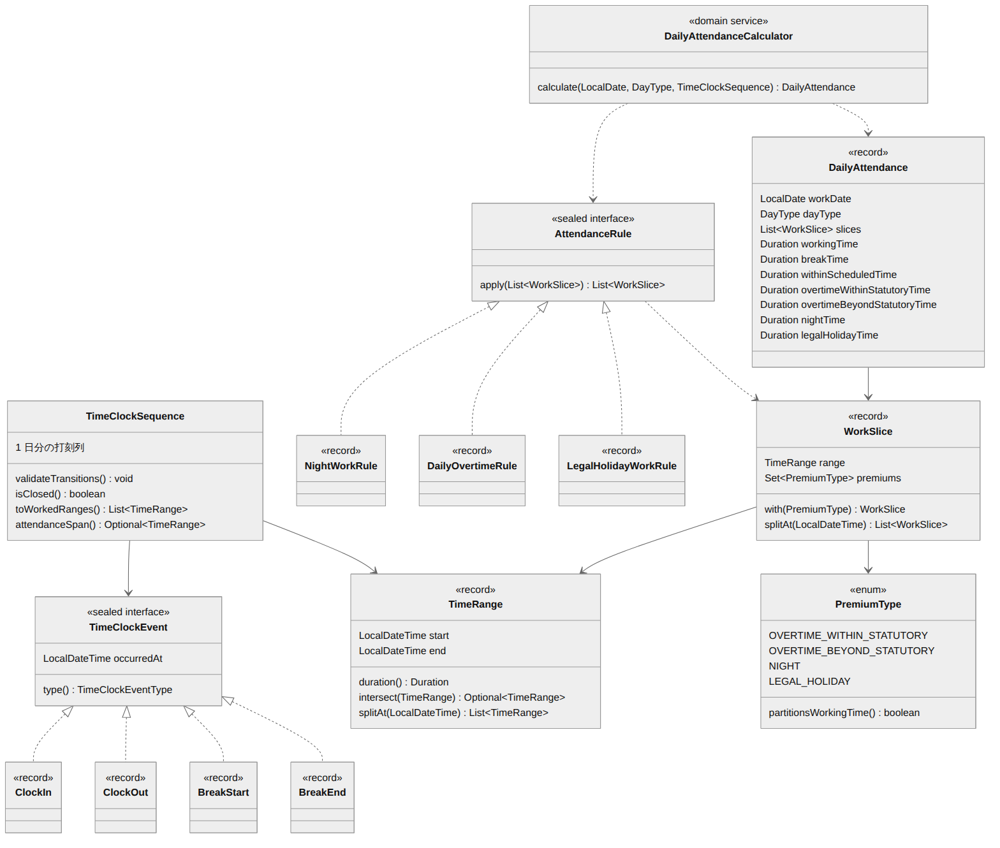
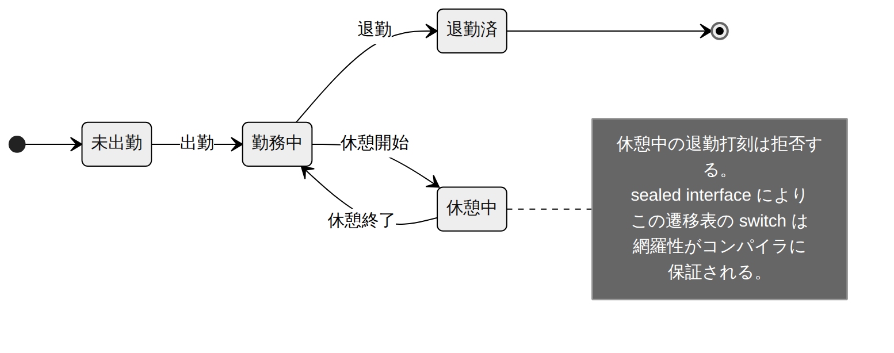
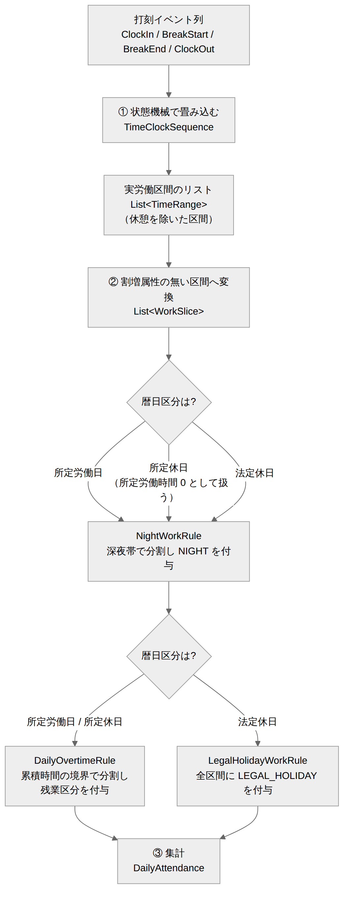
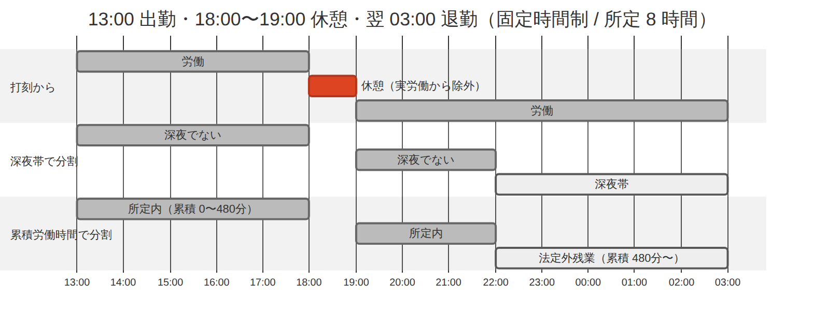

# 勤怠（打刻・日次集計） ドメインモデル設計書

| 項目 | 内容 |
| --- | --- |
| 文書番号 | KNT-DES-301 |
| 版 | 0.1 |
| 対象パッケージ | `jp.co.sample.kintai.attendance` |
| 関連要件 | BR-01 / BR-02 / BR-03 / BR-04 / BR-06 / BR-07 / BR-08 / BR-09 |
| 関連文書 | [DB設計書](DB設計書.md) / [API設計書](API設計書.md) / [月次清算](../04_勤怠_月次清算/ドメインモデル設計書.md) |

---

## 1. このコンテキストの責務

打刻を記録し、**1 日分の労働時間を割増区分ごとに集計する。**

フレックスタイム制の月次清算は別コンテキスト（[04_勤怠_月次清算](../04_勤怠_月次清算/)）が担う。
本書が扱うのは、制度を問わず日単位で確定する部分（深夜・法定休日）と、
固定時間制の日次の残業判定である。

---

## 2. モデル



<sub>図のソース: [`diagrams/ドメインモデル.mmd`](diagrams/ドメインモデル.mmd)</sub>

### 2.1 TimeClockEvent — 打刻イベント

```java
public sealed interface TimeClockEvent
        permits TimeClockEvent.ClockIn,
                TimeClockEvent.ClockOut,
                TimeClockEvent.BreakStart,
                TimeClockEvent.BreakEnd {

    LocalDateTime occurredAt();

    record ClockIn(LocalDateTime occurredAt) implements TimeClockEvent {}
    record ClockOut(LocalDateTime occurredAt) implements TimeClockEvent {}
    record BreakStart(LocalDateTime occurredAt) implements TimeClockEvent {}
    record BreakEnd(LocalDateTime occurredAt) implements TimeClockEvent {}
}
```

**種別を enum のフィールドではなく型で表現する。**
`enum EventType` を持つ 1 つのクラスにすると、状態遷移を書く `switch` に
`default` 句が必要になり、種別を増やしたときのハンドリング漏れが実行時まで分からない。
`sealed interface` なら網羅性がコンパイラに保証される。

### 2.2 TimeClockSequence — 打刻の状態機械（BR-02）



<sub>図のソース: [`diagrams/打刻の状態機械.mmd`](diagrams/打刻の状態機械.mmd)</sub>

```java
public List<TimeRange> toWorkedRanges() {
    List<TimeRange> ranges = new ArrayList<>();
    Status status = Status.NOT_STARTED;
    LocalDateTime segmentStart = null;

    for (TimeClockEvent event : events) {
        switch (event) {
            case ClockIn in -> {
                requireStatus(status, NOT_STARTED, "出勤", in.occurredAt());
                status = WORKING;
                segmentStart = in.occurredAt();
            }
            case BreakStart bs -> {
                requireStatus(status, WORKING, "休憩開始", bs.occurredAt());
                addRange(ranges, segmentStart, bs.occurredAt());
                status = ON_BREAK;
            }
            case BreakEnd be -> {
                requireStatus(status, ON_BREAK, "休憩終了", be.occurredAt());
                status = WORKING;
                segmentStart = be.occurredAt();
            }
            case ClockOut out -> {
                requireStatus(status, WORKING, "退勤", out.occurredAt());
                addRange(ranges, segmentStart, out.occurredAt());
                status = FINISHED;
            }
        }
        // default 句が無い。打刻種別を追加した瞬間にコンパイルエラーになる
    }
    return ranges;
}
```

| メソッド | 用途 |
| --- | --- |
| `validateTransitions()` | 遷移の妥当性だけを検査する。**退勤前の途中状態も許容する** |
| `isClosed()` | 退勤まで完了しているか。日次勤怠を計算できるかの判定 |
| `toWorkedRanges()` | 実労働区間へ変換する。未完了なら例外 |

**検査と変換を分けるのは、打刻を受け付ける時点ではまだ勤務が終わっていないため。**
「出勤打刻を 2 回した」は即座に拒否したいが、「まだ退勤していない」は正常な状態である。

#### 境界条件

| 状況 | 振る舞い | 理由 |
| --- | --- | --- |
| 長さ 0 の区間（出勤と同時に休憩開始） | 区間として記録しない | 労働実績として意味を持たないため |
| 退勤打刻が無いまま計算を要求 | 例外 | 労働時間が確定しないため |
| 打刻が 1 件も無い | 空の結果（欠勤） | 例外にしない。休日や欠勤で正常に起こりうる |

### 2.3 TimeRange と WorkSlice

```java
/** 半開区間 [start, end)。区間の切り貼りを型に閉じ込める。 */
public record TimeRange(LocalDateTime start, LocalDateTime end) {
    public TimeRange {
        if (!start.isBefore(end)) { throw new IllegalArgumentException(...); }
    }
    public Optional<TimeRange> intersect(TimeRange other) { ... }
    public List<TimeRange> splitAt(LocalDateTime instant) { ... }
}

/** 割増属性が確定した労働区間の最小単位。 */
public record WorkSlice(TimeRange range, Set<PremiumType> premiums) { }
```

`TimeRange` は `shared` に置く。月次清算でも使うため。

**勤怠計算は「1 本の労働区間を、割増の切り替わり点でひたすら細切れにしていく」処理として
表現できる。** `WorkSlice` がその細切れ 1 つを表す。

### 2.4 PremiumType — 割増区分（BR-04 / BR-06 / BR-07）

```java
public enum PremiumType {
    OVERTIME_WITHIN_STATUTORY,   // 法定内残業。所定超だが法定内。割増の支払義務なし
    OVERTIME_BEYOND_STATUTORY,   // 法定外残業。25% 以上
    NIGHT,                       // 深夜。25% 以上
    LEGAL_HOLIDAY;               // 法定休日労働。35% 以上

    /**
     * 実労働時間を排他的に分割する区分か。
     * NIGHT だけは他に重ねて付く属性であり、合計には数えない。
     */
    public boolean partitionsWorkingTime() { return this != NIGHT; }
}
```

> **ここが本システムで最も間違えやすい箇所。**
> 深夜は「所定内かつ深夜」「法定外残業かつ深夜」のように **他の区分に重なる属性** であり、
> 労働時間を分割する区分ではない。この区別を型に持たせないと、
> 「深夜だけが付いた所定内の区間」をどの区分にも数え損ねる。
> 実際にこの誤りは、集計値の合計が実労働時間と一致しないという形で現れる（2.7 参照）。

### 2.5 AttendanceRule — 割増を付与する規則

```java
public sealed interface AttendanceRule
        permits NightWorkRule, DailyOvertimeRule, LegalHolidayWorkRule {

    /** 区間リストに規則を適用する。入力は時系列順である前提。 */
    List<WorkSlice> apply(List<WorkSlice> slices);
}
```

各規則は「区間リストを受け取り、必要に応じて分割・属性付与した区間リストを返す」純関数である。
合成できるため、暦日区分に応じて適用する規則を差し替えるだけで計算内容が変わる。

| 規則 | 役割 | 対応要件 |
| --- | --- | --- |
| `NightWorkRule` | 深夜帯の境界で分割し `NIGHT` を付与 | BR-06 |
| `DailyOvertimeRule` | 累積労働時間の境界で分割し残業区分を付与 | BR-04 |
| `LegalHolidayWorkRule` | 全区間に `LEGAL_HOLIDAY` を付与 | BR-07 |

### 2.6 計算パイプライン



<sub>図のソース: [`diagrams/計算パイプライン.mmd`](diagrams/計算パイプライン.mmd)</sub>

暦日区分によって適用する規則を選ぶ。**この選択自体が業務判断である。**

```java
List<AttendanceRule> rulesFor(DayType dayType, WorkRule workRule) {
    NightWorkRule night = new NightWorkRule(workRule.nightWindow());
    Duration statutory = workRule.statutoryDailyWorkingTime();

    return switch (dayType) {
        // 所定労働日: 所定を基準に残業を判定する
        case WORKDAY -> List.of(night, new DailyOvertimeRule(scheduledOf(workRule), statutory));
        // 所定休日: 所定労働時間 0 として扱う。8 時間までは法定内残業
        case NON_LEGAL_HOLIDAY -> List.of(night, new DailyOvertimeRule(Duration.ZERO, statutory));
        // 法定休日: 残業の概念が無く一律 35%。残業規則を適用しない
        case LEGAL_HOLIDAY -> List.of(night, new LegalHolidayWorkRule());
    };
}
```

#### 分割の具体例



<sub>図のソース: [`diagrams/区間分割の例.mmd`](diagrams/区間分割の例.mmd)</sub>

| 区間 | 長さ | 割増属性 | 倍率 |
| --- | --- | --- | --- |
| 13:00 – 18:00 | 300 分 | （なし・所定内） | 1.00 |
| 19:00 – 22:00 | 180 分 | （なし・所定内） | 1.00 |
| 22:00 – 翌 03:00 | 300 分 | `NIGHT` + `OVERTIME_BEYOND_STATUTORY` | 1.50 |

実労働 780 分（13 時間）、休憩 60 分。所定内 480 分、法定外残業 300 分、深夜 300 分。
**深夜 300 分は法定外残業 300 分と完全に重なっており、二重に足してはならない。**

### 2.7 DailyAttendance — 集計結果

```java
public record DailyAttendance(
        LocalDate workDate,
        DayType dayType,
        List<WorkSlice> slices,             // 内訳。なぜこの結果かを説明するために保持する
        Duration workingTime,
        Duration breakTime,
        Duration withinScheduledTime,
        Duration overtimeWithinStatutoryTime,
        Duration overtimeBeyondStatutoryTime,
        Duration nightTime,
        Duration legalHolidayTime) {

    public DailyAttendance {
        // ★ 排他的な 4 区分の合計は必ず実労働時間に一致する。深夜は重ね掛けなので含めない
        Duration breakdown = withinScheduledTime
                .plus(overtimeWithinStatutoryTime)
                .plus(overtimeBeyondStatutoryTime)
                .plus(legalHolidayTime);
        if (!breakdown.equals(workingTime)) {
            throw new IllegalStateException("内訳の合計が実労働時間と一致しません: ...");
        }
        if (nightTime.compareTo(workingTime) > 0) {
            throw new IllegalStateException("深夜労働時間が実労働時間を超えています: ...");
        }
    }
}
```

**この不変条件が集計ロジックの誤りを検出する。**
`daily_attendances` テーブルの CHECK 制約と対になっており、
DB へ到達する前に単体テストで落ちる。

集計値だけでなく `slices`（内訳）も保持する。
労務の問い合わせでは「なぜこの残業時間なのか」の提示が必須であり、
集計値だけでは答えられないため。

---

## 3. 打刻の訂正（BR-09）

**打刻は追記のみ。登録済みのレコードを更新・削除しない。**
訂正は取消の行を積むことで表現する。

```
① 09:00 出勤          （ENTRY）
② 18:00 退勤          （ENTRY）
③ ②を取り消す         （REVOCATION → ②を参照）
④ 19:00 退勤          （ENTRY）
```

有効な打刻は「取り消されていない ENTRY」であり、上の例では ① と ④ になる。

| 決定 | 理由 |
| --- | --- |
| 元の打刻を残す | 打刻は労働時間の一次証拠。労務トラブル時に「元は何時だったか」を提示する必要がある |
| 訂正の**申請と承認**は `approval` が担う | 本コンテキストは承認済みの結果を記録するだけに留める |
| 取消も追記で表現する | UPDATE / DELETE の口を作らないことで、履歴の欠落を構造的に防ぐ |

ポートにも更新・削除のメソッドを置かない。

```java
public interface TimeClockEventRepository {
    void append(EmployeeId employeeId, LocalDate workDate, TimeClockEvent event, ClockSource source);
    void revoke(TimeClockEventId targetId, EmployeeId revokedBy, String reason);
    List<TimeClockEvent> findEffective(EmployeeId employeeId, LocalDate workDate);
    List<TimeClockEntry> findHistory(EmployeeId employeeId, LocalDate workDate);  // 取消も含む全履歴
}
```

---

## 4. 勤務日の決定（BR-03）

日をまたぐ勤務は **出勤日に通算する。**
翌 03:00 の退勤打刻を前日の勤務として扱うため、打刻を受け付けるときに勤務日を解決する。

```java
private LocalDate resolveWorkDate(PunchCommand command) {
    LocalDate punchedOn = command.occurredAt().toLocalDate();
    if (command.type() == CLOCK_IN) {
        return punchedOn;                       // 出勤打刻はその日が勤務日
    }
    // それ以外は「まだ退勤していない勤務日」があればそこへ紐づける
    return timeClockEvents.findOpenWorkDate(command.employeeId(), punchedOn.minusDays(1))
            .orElse(punchedOn);
}
```

| 状況 | 勤務日 |
| --- | --- |
| 4/7 13:00 出勤 → 4/8 03:00 退勤 | どちらも 4/7 |
| 4/7 に退勤済みで 4/8 09:00 出勤 | 4/8 |
| 4/7 の退勤打刻を忘れたまま 4/8 09:00 に出勤打刻 | **4/7 が未退勤のため出勤打刻を拒否する。** 先に 4/7 の訂正が必要 |

最後のケースは運用上必ず起きる。エラーメッセージに「4/7 の退勤打刻がありません」と
具体的に示し、訂正申請へ誘導する。

---

## 5. 休憩時間の検証（BR-08）

```java
public record BreakTimeRequirement(Duration workingTime, Duration actualBreak) {
    /** 労基法 34 条が要求する休憩時間。 */
    public Duration required() {
        if (workingTime.compareTo(Duration.ofHours(8)) > 0) return Duration.ofMinutes(60);
        if (workingTime.compareTo(Duration.ofHours(6)) > 0) return Duration.ofMinutes(45);
        return Duration.ZERO;
    }
    public boolean isSatisfied() { return actualBreak.compareTo(required()) >= 0; }
}
```

**不足していても計算は打刻どおりに行う。** 警告を出すだけに留める。
勝手に休憩を差し引くと、実際には働いていた時間が消えて賃金の不払いになるため。

---

## 6. 単体テストの観点

| ID | 観点 | 期待 | 要件 |
| --- | --- | --- | --- |
| UT-ATT-01 | 定時どおりの勤務 | 全時間が所定内労働 | BR-04 |
| UT-ATT-02 | 所定 = 法定 8 時間で超過 | 超過分がすべて法定外残業 | BR-04 |
| UT-ATT-03 | 所定 7.5 時間で 9 時間労働 | 法定内残業 30 分 + 法定外残業 60 分 | BR-04 |
| UT-ATT-04 | 20:00 – 翌 02:00 の勤務 | 深夜 4 時間。所定内 6 時間（残業なし） | BR-06 |
| UT-ATT-05 | 日をまたぐ長時間勤務 | 深夜と法定外残業が重なって計上される | BR-03 / BR-06 |
| UT-ATT-06 | 深夜かつ法定外残業の倍率 | 1.50 | BR-06 |
| UT-ATT-07 | 法定休日の労働 | 全時間が法定休日労働。残業に分解されない | BR-07 |
| UT-ATT-08 | 所定休日の労働 | 8 時間まで法定内残業、超過分が法定外残業 | BR-07 |
| UT-ATT-09 | **内訳の合計が実労働時間に一致する** | すべてのケースで成立 | — |
| UT-ATT-10 | 打刻が無い日 | 欠勤として空の結果。例外にしない | BR-02 |
| UT-ATT-11 | 退勤打刻が無い | 例外 | BR-02 |
| UT-ATT-12 | 休憩中に退勤 | 例外 | BR-02 |
| UT-ATT-13 | 二重の出勤打刻 | 例外 | BR-02 |
| UT-ATT-14 | 6 時間超で休憩 45 分未満 | 警告が立つ。計算値は変えない | BR-08 |
| UT-ATT-15 | 前日が未退勤のまま出勤打刻 | 拒否し、対象日を含むメッセージを返す | BR-03 |

**UT-ATT-09 は他のすべてのケースに対して実施する。**
不変条件が全パターンで成立することを、個別の期待値とは別に検証する。

---

## 7. 未決事項

| # | 内容 | 判断の時期 |
| --- | --- | --- |
| 1 | 週 40 時間超の判定をどちらのコンテキストに置くか（日次では閉じない） | [04_勤怠_月次清算](../04_勤怠_月次清算/) で決定 |
| 2 | 打刻の訂正申請の粒度（1 打刻ずつか、1 日分まとめてか） | [05_申請承認と締め](../05_申請承認と締め/) で決定 |
