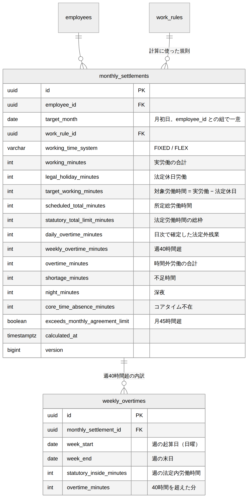

# 勤怠（月次清算） DB設計書

| 項目 | 内容 |
| --- | --- |
| 文書番号 | KNT-DES-402 |
| 版 | 0.2 |
| 対象スキーマ | `monthly_settlements` / `weekly_overtimes` |
| 関連要件 | BR-04 / BR-05 / BR-06 / BR-07 / BR-12 |
| 関連文書 | [ドメインモデル設計書](ドメインモデル設計書.md) / [API設計書](API設計書.md) / [設計規約チェックリスト](../00_共通/設計規約チェックリスト.md) |
| 改訂 | 0.2（2026-09-01）設計レビュー第 2 回の指摘を反映 |

---

## 1. ER 図



<sub>図のソース: [`diagrams/ER図.mmd`](diagrams/ER図.mmd)</sub>

---

## 2. 設計の要点

| # | 設計 | 理由 |
| --- | --- | --- |
| 1 | 月次清算の結果を**保存する**（都度計算しない） | 締めた後に就業規則を改定しても確定値が動いてはいけない |
| 2 | 労働時間制度ごとに **CHECK 制約で列の充足を変える** | 固定時間制とフレックスでは意味を持つ列が異なる。ドメインの `sealed interface` に対応させる |
| 3 | 算出式そのものを CHECK 制約にする | 対象労働時間・時間外労働の導出を DB でも検証し、集計ロジックの誤りを通さない |
| 4 | 週 40 時間超の内訳を別テーブルに持つ | どの週で何時間超えたかを提示できないと、労務の問い合わせに答えられない |
| 5 | 年度累計を列として持つ | 36 協定の年次上限の判定に、当月より前の累計が必要。毎回全月を再集計しない |
| 6 | **清算期間を列として持つ**（`period_from` / `period_to_exclusive`） | 清算期間は暦月とは限らない。月中入社・月中退職の月は在籍期間との交差になる |
| 7 | 清算に使った就業規則は **系列**で保持する | 版は月中に切り替わりうる（改定）。単一の版では表現できない |

---

## 3. テーブル定義

### 3.1 monthly_settlements（月次清算）

```sql
CREATE TABLE monthly_settlements (
    id                              uuid        PRIMARY KEY,
    employee_id                     uuid        NOT NULL REFERENCES employees (id),
    target_month                    date        NOT NULL,
    period_from                     date        NOT NULL,
    period_to_exclusive             date        NOT NULL,
    work_rule_series_id             uuid        NOT NULL REFERENCES work_rule_series (id),
    working_time_system             varchar(20) NOT NULL,

    working_minutes                 int         NOT NULL,
    legal_holiday_minutes           int         NOT NULL,
    target_working_minutes          int         NOT NULL,
    scheduled_total_minutes         int         NOT NULL,
    statutory_total_limit_minutes   int         NOT NULL,

    daily_overtime_minutes          int         NOT NULL DEFAULT 0,
    weekly_overtime_minutes         int         NOT NULL DEFAULT 0,
    carried_over_overtime_minutes   int         NOT NULL DEFAULT 0,
    overtime_minutes                int         NOT NULL,
    shortage_minutes                int         NOT NULL DEFAULT 0,
    night_minutes                   int         NOT NULL,
    core_time_absence_minutes       int         NOT NULL DEFAULT 0,

    annual_agreement_subject_before_minutes int NOT NULL DEFAULT 0,
    monthly_agreement_limit_minutes int         NOT NULL DEFAULT 2700,
    annual_agreement_limit_minutes  int         NOT NULL DEFAULT 21600,
    exceeds_monthly_agreement_limit boolean     NOT NULL,
    exceeds_annual_agreement_limit  boolean     NOT NULL,

    calculated_at                   timestamptz NOT NULL,
    version                         bigint      NOT NULL DEFAULT 0,
    created_at                      timestamptz NOT NULL DEFAULT now(),
    updated_at                      timestamptz NOT NULL DEFAULT now(),

    -- 対象月は必ず月初日で表現する（月の表現ゆらぎを DB で封じる）
    CONSTRAINT monthly_settlements_month_check
        CHECK (target_month = date_trunc('month', target_month)::date),

    -- ★ 清算期間は対象月の内側に収まる半開区間（暦月 ∩ 在籍期間）
    CONSTRAINT monthly_settlements_period_check CHECK (
        period_from >= target_month
        AND period_to_exclusive > period_from
        AND period_to_exclusive <= (target_month + INTERVAL '1 month')::date
    ),

    -- ★ 総枠 = 清算期間の暦日数 ÷ 7 × 週法定労働時間（分未満は切り捨て）。
    --   週法定労働時間は 40 時間で固定なので式を制約にできる
    CONSTRAINT monthly_settlements_statutory_limit_check
        CHECK (statutory_total_limit_minutes
               = (period_to_exclusive - period_from) * 2400 / 7),
    CONSTRAINT monthly_settlements_system_check
        CHECK (working_time_system IN ('FIXED', 'FLEX')),

    CONSTRAINT monthly_settlements_non_negative_check
        CHECK (working_minutes >= 0 AND legal_holiday_minutes >= 0
               AND target_working_minutes >= 0 AND scheduled_total_minutes >= 0
               AND statutory_total_limit_minutes > 0
               AND daily_overtime_minutes >= 0 AND weekly_overtime_minutes >= 0
               AND carried_over_overtime_minutes >= 0
               AND overtime_minutes >= 0 AND shortage_minutes >= 0
               AND night_minutes >= 0 AND core_time_absence_minutes >= 0
               AND annual_agreement_subject_before_minutes >= 0
               AND monthly_agreement_limit_minutes > 0
               AND annual_agreement_limit_minutes > 0),

    -- ★ 対象労働時間 = 実労働 − 法定休日労働（BR-05）
    CONSTRAINT monthly_settlements_target_working_check
        CHECK (target_working_minutes = working_minutes - legal_holiday_minutes),

    -- ★ 深夜労働が実労働を超えることはありえない
    CONSTRAINT monthly_settlements_night_check
        CHECK (night_minutes <= working_minutes),

    -- ★ 労働時間制度ごとの算出式。ドメインの sealed interface に対応する
    CONSTRAINT monthly_settlements_variant_check CHECK (
        (working_time_system = 'FIXED'
             AND overtime_minutes = daily_overtime_minutes + weekly_overtime_minutes
                                    + carried_over_overtime_minutes
             AND core_time_absence_minutes = 0)
        OR
        (working_time_system = 'FLEX'
             AND daily_overtime_minutes = 0
             AND weekly_overtime_minutes = 0
             AND carried_over_overtime_minutes = 0
             AND overtime_minutes = greatest(0, target_working_minutes - statutory_total_limit_minutes)
             AND shortage_minutes = greatest(0, scheduled_total_minutes - target_working_minutes))
    ),


    -- ★ 36 協定の判定は他の列から一意に決まる（BR-12）
    CONSTRAINT monthly_settlements_monthly_agreement_check
        CHECK (exceeds_monthly_agreement_limit
               = (overtime_minutes + legal_holiday_minutes
                  > monthly_agreement_limit_minutes)),
    CONSTRAINT monthly_settlements_annual_agreement_check
        CHECK (exceeds_annual_agreement_limit
               = (annual_agreement_subject_before_minutes
                  + overtime_minutes + legal_holiday_minutes
                  > annual_agreement_limit_minutes)),

    CONSTRAINT monthly_settlements_employee_month_uk UNIQUE (employee_id, target_month)
);

CREATE INDEX monthly_settlements_agreement_idx
    ON monthly_settlements (target_month)
    WHERE exceeds_monthly_agreement_limit OR exceeds_annual_agreement_limit;
```

#### 清算期間を列で持つ理由

第 1 版は `target_month` だけを持ち、総枠を `month.lengthOfMonth()` から計算していた。
**月中入社・月中退職の月で総枠が過大になる。**

4/15 入社の社員の初月は、清算期間が 16 日なので総枠は 5,485 分である。
暦月の 30 日で計算すると 10,285 分になり、
**時間外労働が計上されずに賃金が不足する。**

`period_from` / `period_to_exclusive` を列にすることで、
`monthly_settlements_statutory_limit_check` が総枠の算出式そのものを検証できる。

#### `exceeds_*` を CHECK で守る理由

第 1 版は素の `boolean` で、`overtime + legal_holiday` が 45 時間を超えていないのに
`exceeds_monthly_agreement_limit = true` という行を作れた。
**判定は他の列から一意に決まる**ので、式を制約にする
（[設計規約チェックリスト 4.3](../00_共通/設計規約チェックリスト.md)）。

閾値（45 時間 = 2,700 分 / 360 時間 = 21,600 分）を列として持つのは、
`CHECK` が他テーブルを参照できないためである。
36 協定の内容は本来 `work_rules` 側に置きたいが、
そうすると判定を CHECK で守れなくなる。**清算時点の閾値を写して保存する。**
36 協定を結び直しても、確定済みの月の判定が後から動かない利点もある。

#### `monthly_settlements_variant_check` について

**算出式そのものを制約にしている。**
フレックスの時間外労働は `max(0, 対象労働時間 − 総枠)` であり、
これは計算するまでもなく他の列から決まる。
制約にしておけば、集計ロジックが壊れたときに **DB へ到達する前に落ちる。**

固定時間制では `daily + weekly + carried_over`、フレックスでは総枠との比較というように、
**制度によって意味を持つ列が異なる** ことも同時に表現している。

#### 第 2 版で外した 2 つの条件

実装時に、**正当な行を保存できない制約が 2 つある**ことが分かった。
どちらも「排他を主張する検査は、両方が正になる正当なケースが無いか先に探す」
（[CLAUDE.md 5 章の落とし穴 23・51](../../../CLAUDE.md)）に反していた。

**1. `variant_check` の `FIXED AND shortage_minutes = 0`**

固定時間制でも不足時間は生じる。所定 21 日の月に 6 日しか働かなければ不足は 114 時間である。
第 1 版は「固定時間制は所定どおり働くもの」と暗黙に決め打ちしていた。
**欠勤のある月をひとつも保存できない。**

**2. `overtime_shortage_check` を制度によらず当てていたこと**

フレックスでは時間外を「総枠に対する超過」、不足を「所定総に対する不足」として
**同じ実績（対象労働時間）から**求めるので、2 つの基準が交差しない月では両方が正になりえない。
固定時間制はそうではない。時間外は日次・週次で確定した実績で、総枠との比較では求めていない。
**忙しい週に残業し、別の週に欠勤した月**は正当に両方が正になる。

この制約は**フレックスに限定したうえで、削除した。**
限定するとフレックスにしか当たらなくなるが、フレックスの行は `variant_check` によって

```
overtime_minutes = greatest(0, target_working_minutes - statutory_total_limit_minutes)
shortage_minutes = greatest(0, scheduled_total_minutes - target_working_minutes)
```

を満たしている。両方が正なら
`所定総 > 対象労働 > 総枠` が導けるので、**所定総 > 総枠 は自動的に成り立つ。**
`variant_check` を満たす行はこの制約を必ず満たすので、
**破れる行が 1 つも存在しない検査**になっていた。
別の制約で保証されている条件を重ねて書かない
（[CLAUDE.md 落とし穴 16](../../../CLAUDE.md)）。

固定時間制側を守るものは残らないが、
そもそも固定時間制では両方が正になるのが正当なので、守るべきものが無い。

#### `carried_over_overtime_minutes` を持つ理由

法定休日から翌暦日へ通算して生じた法定外残業（BR-07）である。
`daily` / `weekly` と足して `overtime_minutes` になることを `variant_check` が守る。

**合計だけを持たない。** 3 つの由来は割増の根拠が異なり（1 日 8 時間超・週 40 時間超・暦日の通算）、
給与計算側や労基署の調査で「なぜこの時間外が付いたのか」を説明できる必要がある。
内訳を捨てると、清算をやり直さないと答えられなくなる。

#### 月 60 時間超（50% 割増）を列にしない

`overtime_minutes` から一意に決まる（`greatest(0, overtime_minutes - 3600)`）ので、
列として持たない。持つなら食い違いを禁じる `CHECK` が要る
（[CLAUDE.md 落とし穴 39](../../../CLAUDE.md)）が、
**導出できる値を状態にしないことでその必要自体を無くす。**
抽出に使うようになったら生成列にする。

`monthly_settlements_agreement_idx` は部分インデックスで、
**36 協定の超過者だけを人事が抽出する** 用途に使う。
超過者は全体の数 % なので、部分インデックスが小さく保たれる。

### 3.2 weekly_overtimes（週 40 時間超の内訳）

```sql
CREATE TABLE weekly_overtimes (
    id                      uuid PRIMARY KEY,
    monthly_settlement_id   uuid NOT NULL
                            REFERENCES monthly_settlements (id) ON DELETE CASCADE,
    week_start              date NOT NULL,
    week_end_exclusive      date NOT NULL,
    statutory_inside_minutes int NOT NULL,
    overtime_minutes         int NOT NULL,

    -- 週は必ず 7 日間。上限は半開区間なので +7
    CONSTRAINT weekly_overtimes_span_check
        CHECK (week_end_exclusive = week_start + 7),
    -- 起算日は日曜（法定休日と週の区切りを揃える）
    CONSTRAINT weekly_overtimes_start_dow_check
        CHECK (extract(isodow FROM week_start) = 7),
    CONSTRAINT weekly_overtimes_non_negative_check
        CHECK (statutory_inside_minutes >= 0 AND overtime_minutes >= 0),
    -- ★ 40 時間を超えた分が時間外。算出式を制約にする
    CONSTRAINT weekly_overtimes_calculation_check
        CHECK (overtime_minutes = greatest(0, statutory_inside_minutes - 2400)),

    CONSTRAINT weekly_overtimes_week_uk UNIQUE (monthly_settlement_id, week_start)
);
```

> **`2400`（40 時間）をリテラルで書いている点について**
> 法定労働時間は就業規則の設定項目（`work_rules.statutory_weekly_minutes`）だが、
> `CHECK` 制約は他テーブルを参照できない。
> 現時点では法定どおり 40 時間で固定されているため制約に直書きしているが、
> **週の法定労働時間を変更可能にするなら、この制約は外して制約トリガに変える必要がある。**
> 未決事項 #1 として記録する。

### 3.3 updated_at の自動更新

`set_updated_at()` の定義は
[01_社員・組織 DB設計書 3.8](../01_社員・組織/DB設計書.md) にある。

```sql
CREATE TRIGGER monthly_settlements_set_updated_at BEFORE UPDATE ON monthly_settlements
    FOR EACH ROW EXECUTE FUNCTION set_updated_at();
```

`weekly_overtimes` には監査列を置かない。
**再計算のたびに `DELETE` して入れ直す**従属表であり、
行そのものの寿命に意味が無いため。親の `monthly_settlements` が
`calculated_at` と `version` を持つ。

---

## 4. 主要なクエリ

### 4.1 指定月の清算結果（週の内訳つき）

```sql
SELECT s.*, w.week_start, w.week_end_exclusive, w.statutory_inside_minutes, w.overtime_minutes
FROM monthly_settlements s
LEFT JOIN weekly_overtimes w ON w.monthly_settlement_id = s.id
WHERE s.employee_id = :employeeId AND s.target_month = :month
ORDER BY w.week_start;
```

### 4.2 年度累計の時間外労働（36 協定の年次上限）

```sql
SELECT coalesce(sum(s.overtime_minutes + s.legal_holiday_minutes), 0) AS annual_minutes
FROM monthly_settlements s
WHERE s.employee_id = :employeeId
  AND s.target_month >= :fiscalYearStart
  AND s.target_month < :targetMonth;
```

対象月より **前** の月だけを合計する。当月分は計算中のため含めない。
結果を `annual_agreement_subject_before_minutes` に保存し、再計算時の再集計を避ける。

> **過去月を再計算したら、同一年度の後続月も再計算する。**
> 打刻の訂正が承認されると過去月の `overtime_minutes` が変わる。
> 保存済みの累計を更新しないと、後続月の年次上限の判定が誤る。
> この連鎖は [API設計書 3.1](API設計書.md) の再計算の契機に含める。

列名を `annual_overtime_before_minutes` から改めたのは、
中身が「時間外 **+ 法定休日労働**」であり、時間外だけではないためである。

### 4.3 36 協定の超過者一覧（人事向け）

```sql
SELECT s.employee_id,
       s.overtime_minutes, s.legal_holiday_minutes,
       s.exceeds_monthly_agreement_limit, s.exceeds_annual_agreement_limit
FROM monthly_settlements s
WHERE s.target_month = :month
  AND (s.exceeds_monthly_agreement_limit OR s.exceeds_annual_agreement_limit)
ORDER BY (s.overtime_minutes + s.legal_holiday_minutes) DESC;
```

`monthly_settlements_agreement_idx`（部分インデックス）が効く。

**`employees` を結合して氏名を取らない。** 社員番号と氏名は
`employee` コンテキストが所有する概念であり、`attendance` の応答に混ぜない
（[設計規約チェックリスト 3](../00_共通/設計規約チェックリスト.md)）。
画面は `GET /api/employees?ids=...` で名前を引く。

**`monthly_settlements_month_idx` は置かない。**
4.1・4.2 は `employee_id` 先頭の `monthly_settlements_employee_month_uk` が効き、
4.3 は部分インデックスが効く。どのクエリにも使われないため。

---

## 5. 制約の一覧

| 制約名 | 種類 | 守るもの |
| --- | --- | --- |
| `monthly_settlements_month_check` | CHECK | 対象月が月初日で表現される |
| `monthly_settlements_target_working_check` | CHECK | **対象労働時間 = 実労働 − 法定休日労働** |
| `monthly_settlements_variant_check` | CHECK | **制度ごとの算出式と、意味を持つ列の充足** |
| `monthly_settlements_period_check` | CHECK | **清算期間が対象月の内側に収まる半開区間** |
| `monthly_settlements_statutory_limit_check` | CHECK | **総枠 = 清算期間の暦日数 ÷ 7 × 40 時間** |
| `monthly_settlements_monthly_agreement_check` | CHECK | **36 協定の月次判定が他の列から決まる** |
| `monthly_settlements_annual_agreement_check` | CHECK | **36 協定の年次判定が他の列から決まる** |
| `monthly_settlements_night_check` | CHECK | 深夜が実労働を超えない |
| `monthly_settlements_employee_month_uk` | UNIQUE | 社員・対象月の一意性 |
| `weekly_overtimes_span_check` | CHECK | 週が 7 日間 |
| `weekly_overtimes_start_dow_check` | CHECK | 週の起算日が日曜 |
| `weekly_overtimes_calculation_check` | CHECK | **40 時間を超えた分が時間外** |

### 5.1 DB では防げないもの

| 内容 | 守る場所 |
| --- | --- |
| `period_from` / `period_to_exclusive` が在籍期間と正しく交差していること | アプリケーション（`employees` の参照は `CHECK` で書けない） |
| `working_minutes` が日次勤怠の合計と一致すること | アプリケーション（別テーブルの集計は `CHECK` で書けない） |
| `scheduled_total_minutes` が清算期間の所定労働日数から導かれること | アプリケーション（会社カレンダー依存） |
| `annual_agreement_subject_before_minutes` が過去月の合計と一致すること | アプリケーション。**過去月を再計算したら同一年度の後続月も再計算する**（4.2） |
| `weekly_overtimes` の週が、その清算の対象月に正しく帰属していること | アプリケーション（週の末日基準。他テーブル参照になる） |
| 締め済みの月の清算結果が更新されないこと | アプリケーション（`shared` の `MonthClosureQuery` ポート） |
| `work_rule_series_id` が、その清算期間に実際に適用されていた系列であること | アプリケーション |

**黙って抜けているのが最も危険なので、DB で守れない範囲を明示する。**

---

## 6. 制約の検証

**検証環境**: PostgreSQL 16 / 2026-09-01 実施

| ID | 検証内容 | 期待 | 結果 |
| --- | --- | --- | --- |
| IT-SET-01 | 対象月を月初日以外で登録 | `month_check` で拒否 | 済 |
| IT-SET-02 | 対象労働時間が実労働 − 法定休日と一致しない | `target_working_check` で拒否 | 済 |
| IT-SET-03 | `FIXED` で時間外が日次 + 週次 + 通算と一致しない | `variant_check` で拒否 | 済 |
| IT-SET-04 | **`FIXED` に不足時間を設定**（欠勤のある月） | **成功する。** 第 1 版では拒否されていた | 済 |
| IT-SET-05 | `FLEX` に日次残業を設定 | `variant_check` で拒否 | 済 |
| IT-SET-21 | **`FLEX` に通算分の法定外残業を設定** | `variant_check` で拒否 | 済 |
| IT-SET-06 | `FLEX` で時間外が総枠超過分と一致しない | `variant_check` で拒否 | 済 |
| IT-SET-07 | **`FLEX`・所定総 ≤ 総枠 の月で時間外と不足を同時に設定** | `variant_check` で拒否（算出式に反するため、そもそも作れない） | 済 |
| IT-SET-22 | **`FIXED`・所定総 ≤ 総枠 の月で時間外と不足を同時に設定** | **成功する。** 制度が違えば正当な月である | 済 |
| IT-SET-23 | **`FIXED` で通算分を含む時間外**（日次 + 週次 + 通算） | 成功する | 済 |
| IT-SET-08 | 深夜が実労働を超える | `night_check` で拒否 | 済 |
| IT-SET-09 | 週の起算日が日曜でない | `start_dow_check` で拒否 | 済 |
| IT-SET-10 | 週が 7 日間でない | `span_check` で拒否 | 済 |
| IT-SET-11 | 週の時間外が 40 時間超過分と一致しない | `calculation_check` で拒否 | 済 |
| IT-SET-12 | **正常な `FIXED` の清算結果（所定 < 総枠）** | 成功する | 済 |
| IT-SET-13 | **正常な `FLEX` の清算結果（所定 < 総枠）** | 成功する | 済 |
| IT-SET-14 | **`FLEX`・所定総 > 総枠 の月（2026-06）で時間外 115 分・不足 160 分** | **成功する。** 第 1 版では拒否されていた | 済 |
| IT-SET-15 | **清算期間が対象月の外へはみ出す** | `period_check` で拒否 | 済 |
| IT-SET-16 | **月中入社の清算期間（4/15〜5/1）で総枠 5,485 分** | 成功する | 済 |
| IT-SET-17 | **総枠が清算期間の暦日数と一致しない** | `statutory_limit_check` で拒否 | 済 |
| IT-SET-18 | **時間外 40h + 法定休日 6h で `exceeds_monthly = false`** | `monthly_agreement_check` で拒否 | 済 |
| IT-SET-19 | **年度累計が上限を超えるのに `exceeds_annual = false`** | `annual_agreement_check` で拒否 | 済 |
| IT-SET-20 | `updated_at` が UPDATE で更新される | トリガにより現在時刻になる | 済 |

**IT-SET-14 が今回のレビューで最も重要な検証である。**
第 1 版は正常系を `FIXED` / `FLEX` の 1 行にまとめ、しかも
「所定 < 総枠」の月しか試していなかった。
**入力を 1 つずつ変える検証をしていれば設計段階で気づけた**
（[CLAUDE.md 5 章の落とし穴 12・23](../../../CLAUDE.md)）。

---

## 7. 未決事項

| # | 内容 | 判断の時期 |
| --- | --- | --- |
| 1 | 週の法定労働時間を設定可能にするか（現在は制約に 40 時間を直書き） | M1-b の実装時 |
| 2 | 週の起算曜日を設定可能にするか（現在は日曜固定） | M1-b の実装時 |
| 3 | 月をまたぐ週の計上先（現在は末日基準）を要件に明記する | 要件のレビュー時 |
| 4 | 36 協定の閾値を `work_rules` 側の設定項目にするか（現在は清算時点の値を写して保存） | M1-b の実装時 |
