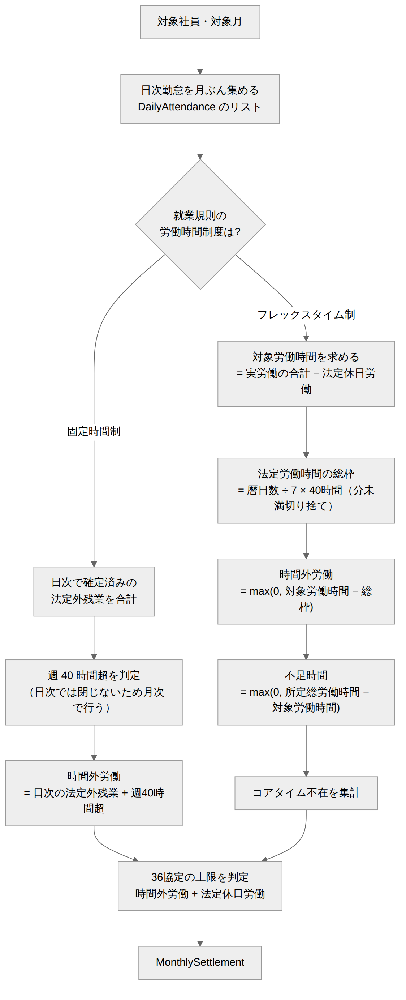
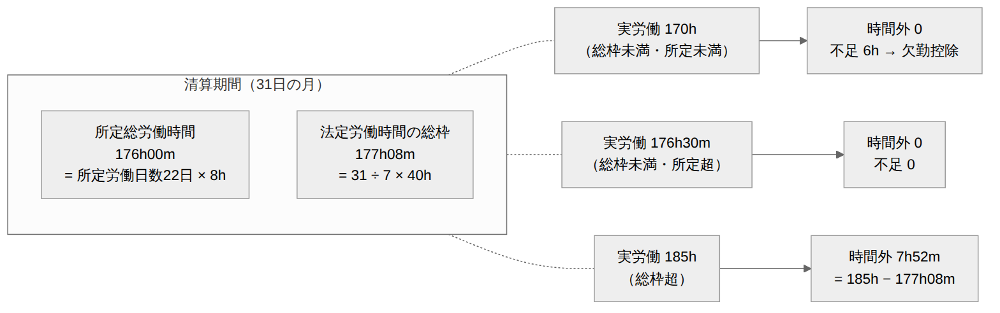

# 勤怠（月次清算） ドメインモデル設計書

| 項目 | 内容 |
| --- | --- |
| 文書番号 | KNT-DES-401 |
| 版 | 0.1 |
| 対象パッケージ | `jp.co.sample.kintai.attendance`（月次清算のサブパッケージ） |
| 関連要件 | BR-04（週 40 時間超）/ BR-05 / BR-12 |
| 関連文書 | [日次集計](../03_勤怠_打刻と日次集計/ドメインモデル設計書.md) / [就業規則](../02_就業規則・カレンダー/ドメインモデル設計書.md) / [DB設計書](DB設計書.md) |

---

## 1. このコンテキストの責務

**日次では確定しない労働時間を、月単位で確定させる。**

| 何が日次で確定しないか | 理由 |
| --- | --- |
| フレックスの時間外労働 | 清算期間の総労働時間で判定するため（BR-05） |
| 週 40 時間超の時間外労働 | 週をまたぐ判定であり、1 日を見ても分からない（BR-04） |
| 36 協定の上限超過 | 月の累計で判定するため（BR-12） |

日次で確定するもの（深夜、法定休日労働、1 日 8 時間超）は
[日次集計](../03_勤怠_打刻と日次集計/) が担当し、ここでは合計するだけである。



<sub>図のソース: [`diagrams/月次清算のフロー.mmd`](diagrams/月次清算のフロー.mmd)</sub>

---

## 2. フレックスタイム制の清算（BR-05）

### 2.1 3 つの時間を区別する



<sub>図のソース: [`diagrams/総枠と時間外の関係.mmd`](diagrams/総枠と時間外の関係.mmd)</sub>

| 名称 | 算出 | 用途 |
| --- | --- | --- |
| **対象労働時間** | 実労働の合計 − 法定休日労働 | 比較の対象になる実績 |
| **所定総労働時間** | 所定労働日数 × 8 時間 | 下回ると **不足時間**（欠勤控除） |
| **法定労働時間の総枠** | 暦日数 ÷ 7 × 40 時間 | 上回ると **時間外労働**（25% 割増） |

**所定総労働時間と法定労働時間の総枠は別物である。**
31 日の月なら所定 176 時間に対し総枠は 177 時間 8 分で、
**その間の約 1 時間は「所定は超えたが時間外ではない」区間**になる。
この 2 つを混同すると、時間外でない労働に割増を付けるか、
逆に割増すべき時間を見落とす。

### 2.2 法定休日労働を対象労働時間から除く理由

法定休日の労働は 35% 割増で別に計算され、時間外労働の概念と重複しない（BR-07）。
総枠の比較に含めると、**法定休日に働いた分だけ時間外労働が水増しされ、
35% と 25% の二重取りになる。**

```java
public Duration targetWorkingTime(List<DailyAttendance> days) {
    return days.stream()
            .map(day -> day.workingTime().minus(day.legalHolidayTime()))
            .reduce(Duration.ZERO, Duration::plus);
}
```

### 2.3 法定労働時間の総枠の計算

```java
/**
 * 清算期間の法定労働時間の総枠。労基法 32 条の 3。
 *
 * <p>暦日数 ÷ 7 × 40 時間。分未満は切り捨てる。
 */
public Duration statutoryTotalLimit(YearMonth month, Duration statutoryWeekly) {
    long days = month.lengthOfMonth();
    long minutes = days * statutoryWeekly.toMinutes() / 7;   // 整数除算 = 切り捨て
    return Duration.ofMinutes(minutes);
}
```

| 暦日数 | 計算 | 総枠 |
| --- | --- | --- |
| 28 日 | 28 × 2400 ÷ 7 = 9600 | 160 時間 00 分 |
| 29 日 | 29 × 2400 ÷ 7 = 9942.86 → 9942 | 165 時間 42 分 |
| 30 日 | 30 × 2400 ÷ 7 = 10285.71 → 10285 | 171 時間 25 分 |
| 31 日 | 31 × 2400 ÷ 7 = 10628.57 → 10628 | 177 時間 08 分 |

**分未満を切り捨てるのは、労働者に有利な方向だからである。**
総枠が小さいほど時間外労働として算定される時間が増え、割増賃金が多くなる。
切り上げると、本来割増すべき時間が総枠に吸収されて支払われなくなる。

> BR-01 は「労働時間は 1 分単位で丸めない」と定めるが、これは **実績の集計** の話である。
> 総枠は割り切れない除算の結果であり、どこかで端数を決めなければならない。
> 実績を丸めているのではないため、BR-01 とは矛盾しない。

### 2.4 不足時間の扱い

```java
public Duration shortage(Duration targetWorkingTime, Duration scheduledTotal) {
    Duration diff = scheduledTotal.minus(targetWorkingTime);
    return diff.isNegative() ? Duration.ZERO : diff;
}
```

不足分は **欠勤控除** の対象とする（要件定義書 BR-05）。
翌月への繰越は行わない。

> 労基法上は「不足分を翌清算期間へ繰り越して労働させる」ことも認められているが、
> 繰り越すと翌月の総労働時間が変動し、清算の基準が月ごとに変わる。
> 個人開発の範囲では扱わない。

### 2.5 コアタイム不在

```java
/** その日にコアタイム帯で労働していない時間。賃金控除の対象ではない。 */
public Duration coreTimeAbsence(DailyAttendance day, FlextimeSystem system) {
    if (day.dayType() != DayType.WORKDAY) {
        return Duration.ZERO;      // 休日にコアタイムの義務は無い
    }
    TimeRange core = system.coreTime().on(day.workDate());
    Duration worked = day.slices().stream()
            .map(slice -> slice.range().intersect(core))
            .flatMap(Optional::stream)
            .map(TimeRange::duration)
            .reduce(Duration.ZERO, Duration::plus);
    return core.duration().minus(worked);
}
```

**賃金の計算には影響させない。** 承認者への警告として表示するだけである。
コアタイム不在は就業規則違反であって、労働時間の計算とは別の問題だから。

---

## 3. 週 40 時間超の判定（BR-04）

### 3.1 二重計上を避ける

1 日 8 時間超として既に法定外残業に計上した時間を、
週 40 時間超として **もう一度数えてはならない。**

各日の「法定内労働時間」を求め、その週の合計が 40 時間を超えた分を追加の時間外とする。

```java
/** 1 日 8 時間以内に収まっている労働時間。法定休日労働は含めない。 */
private Duration statutoryInsideTime(DailyAttendance day) {
    return day.workingTime()
            .minus(day.overtimeBeyondStatutoryTime())
            .minus(day.legalHolidayTime());
}

public Duration weeklyOvertime(List<DailyAttendance> week, Duration statutoryWeekly) {
    Duration inside = week.stream()
            .map(this::statutoryInsideTime)
            .reduce(Duration.ZERO, Duration::plus);
    Duration excess = inside.minus(statutoryWeekly);
    return excess.isNegative() ? Duration.ZERO : excess;
}
```

### 3.2 週の区切り

| 項目 | 決定 | 理由 |
| --- | --- | --- |
| 起算曜日 | **日曜** | 法定休日を日曜としているため、週の区切りと休日の区切りが揃う |
| 月をまたぐ週の計上先 | **週の末日が属する月** | 週の労働時間が確定するのは末日であり、それ以前に時間外を確定できないため |

> **月をまたぐ週の扱いは業務上の判断であり、唯一の正解は無い。**
> 「日数按分して両月へ配分する」方式もあるが、按分の端数処理が必要になり、
> 給与計算側との突合が難しくなる。末日基準は「確定したときに計上する」という
> 単純な規則であり、説明しやすい。
> **要件定義書に明記されていないため、確認が必要**（未決事項 #1）。

### 3.3 フレックスには適用しない

フレックスタイム制では、清算期間を通じた総枠で判定する（BR-05）。
週単位の判定を重ねると、同じ労働時間を 2 つの基準で二重に評価することになる。

```java
Duration overtime = switch (workRule.workingTimeSystem()) {
    case FixedTimeSystem ignored ->
            dailyOvertimeTotal(days).plus(weeklyOvertimeTotal(weeks));
    case FlextimeSystem flex ->
            flexOvertime(days, flex, month);
};
// default 句を書かない。制度を追加した瞬間にコンパイルエラーになる
```

---

## 4. 36 協定の上限監視（BR-12）

```java
public record AgreementUsage(
        Duration overtimeMinutes,        // 時間外労働
        Duration legalHolidayMinutes,    // 法定休日労働
        Duration monthlyLimit,           // 45 時間
        Duration annualLimit,            // 360 時間
        Duration annualUsedBefore) {     // 当年度の当月より前の累計

    /** 36 協定の対象時間。法定内残業は含めない。 */
    public Duration subjectTime() {
        return overtimeMinutes.plus(legalHolidayMinutes);
    }

    public boolean exceedsMonthly() { return subjectTime().compareTo(monthlyLimit) > 0; }

    public boolean exceedsAnnual() {
        return annualUsedBefore.plus(subjectTime()).compareTo(annualLimit) > 0;
    }
}
```

| 項目 | 決定 | 理由 |
| --- | --- | --- |
| 対象に含めるもの | 法定外残業 + 法定休日労働 | 労基法 36 条の対象。法定内残業は時間外労働ではない |
| 年度の起算 | **4 月 1 日** | 対象企業の事業年度に合わせる |
| 超過時の挙動 | **警告のみ。打刻や提出は妨げない** | システムが労働を止めることはできない。是正は人事と上長の運用 |

**上限を超えたら登録を拒否する、という設計にしない。**
既に働いた事実を記録できなくすると、記録が実態と乖離し、
かえって労務リスクが上がるため。

---

## 5. モデル

```java
/** 月次の清算結果。 */
public record MonthlySettlement(
        YearMonth month,
        WorkingTimeSystemType systemType,
        Duration workingTime,            // 実労働の合計
        Duration legalHolidayTime,
        Duration targetWorkingTime,      // 対象労働時間（実労働 − 法定休日）
        Duration scheduledTotalTime,     // 所定総労働時間
        Duration statutoryTotalLimit,    // 法定労働時間の総枠
        Duration dailyOvertimeTime,      // 日次で確定した法定外残業
        Duration weeklyOvertimeTime,     // 週 40 時間超
        Duration overtimeTime,           // 時間外労働の合計
        Duration shortageTime,           // 不足時間
        Duration nightTime,
        Duration coreTimeAbsenceTime,
        List<WeeklyOvertime> weeklyBreakdown,
        AgreementUsage agreementUsage) {

    public MonthlySettlement {
        // 対象労働時間 = 実労働 − 法定休日労働
        if (!targetWorkingTime.equals(workingTime.minus(legalHolidayTime))) {
            throw new IllegalStateException("対象労働時間の算出が一致しません");
        }
        // 時間外労働は日次分と週次分の合計（フレックスでは週次分は 0）
        if (!overtimeTime.equals(dailyOvertimeTime.plus(weeklyOvertimeTime))
                && systemType == WorkingTimeSystemType.FIXED) {
            throw new IllegalStateException("時間外労働の内訳が一致しません");
        }
        // 時間外と不足は同時に発生しない
        if (overtimeTime.isPositive() && shortageTime.isPositive()) {
            throw new IllegalStateException("時間外労働と不足時間は同時に発生しません");
        }
    }
}

public record WeeklyOvertime(LocalDate weekStart, LocalDate weekEnd,
                             Duration statutoryInsideTime, Duration overtimeTime) {}
```

**「時間外労働と不足時間は同時に発生しない」を不変条件にする。**
どちらも同じ対象労働時間から導かれるため、両方が正になるのは計算の誤りである。

---

## 6. 単体テストの観点

| ID | 観点 | 期待 | 要件 |
| --- | --- | --- | --- |
| UT-BR05-01 | 総枠の計算（28 日の月） | 160 時間 00 分 | BR-05 |
| UT-BR05-02 | 総枠の計算（31 日の月） | 177 時間 08 分（分未満切り捨て） | BR-05 |
| UT-BR05-03 | 総枠の計算（うるう年 2 月） | 165 時間 42 分 | BR-05 |
| UT-BR05-04 | 実労働が総枠未満・所定未満 | 時間外 0、不足あり | BR-05 |
| UT-BR05-05 | 実労働が総枠未満・所定超 | **時間外 0、不足 0**（所定と総枠の間） | BR-05 |
| UT-BR05-06 | 実労働が総枠超 | 超過分が時間外労働 | BR-05 |
| UT-BR05-07 | **日々 8 時間超でも月の総枠内** | 時間外 0 | BR-05 |
| UT-BR05-08 | 法定休日労働がある月 | 対象労働時間から除かれ、時間外が水増しされない | BR-05 / BR-07 |
| UT-BR05-09 | 深夜労働 | 日次の合計がそのまま計上される | BR-06 |
| UT-BR05-10 | コアタイム不在 | 不在時間が記録され、賃金計算には影響しない | BR-05 |
| UT-BR04-01 | 週の法定内労働が 40 時間以内 | 週 40 時間超は 0 | BR-04 |
| UT-BR04-02 | 週の法定内労働が 42 時間 | 2 時間が週 40 時間超 | BR-04 |
| UT-BR04-03 | **1 日 10 時間 × 4 日（週 40 時間）** | 日次で 8 時間分の法定外残業。週 40 時間超は 0（二重計上しない） | BR-04 |
| UT-BR04-04 | 月をまたぐ週 | 末日が属する月に計上される | BR-04 |
| UT-BR04-05 | フレックスに週判定を適用しない | 週 40 時間超は常に 0 | BR-04 / BR-05 |
| UT-BR12-01 | 時間外 44 時間 | 月次上限の警告は立たない | BR-12 |
| UT-BR12-02 | 時間外 40 時間 + 法定休日 6 時間 | **合計 46 時間で警告が立つ** | BR-12 |
| UT-BR12-03 | 法定内残業のみ 50 時間 | 警告は立たない（36 協定の対象外） | BR-12 |
| UT-BR12-04 | 年度累計が 360 時間を超える | 年次上限の警告が立つ | BR-12 |

**UT-BR05-05 と UT-BR04-03 が本コンテキストの中心。**
前者は「所定と総枠の間」という見落としやすい区間、
後者は二重計上を検証する。

---

## 7. 未決事項

| # | 内容 | 判断の時期 |
| --- | --- | --- |
| 1 | **月をまたぐ週の時間外をどちらの月に計上するか**（現在は末日基準）。要件定義書への明記が必要 | 要件のレビュー時 |
| 2 | 週の起算曜日を就業規則の設定項目にするか（現在は日曜固定） | M1-b の実装時 |
| 3 | 36 協定の年度起算日を設定可能にするか（現在は 4 月 1 日固定） | M1-b の実装時 |
| 4 | 不足時間の欠勤控除の金額計算をどこで行うか（本システムの範囲外の可能性） | M3（給与連携） |
