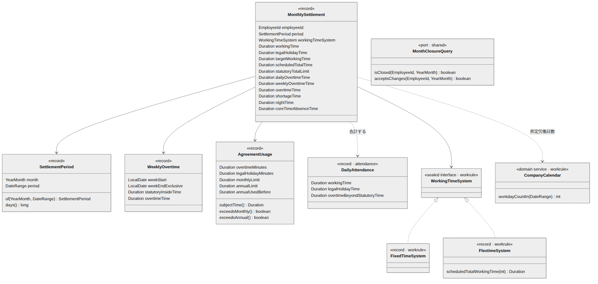

# 勤怠（月次清算） ドメインモデル設計書

| 項目 | 内容 |
| --- | --- |
| 文書番号 | KNT-DES-401 |
| 版 | 0.3 |
| 対象パッケージ | `jp.co.sample.kintai.attendance`（月次清算のサブパッケージ） |
| 関連要件 | BR-04（週 40 時間超）/ BR-05 / BR-06 / BR-07 / BR-12 |
| 関連文書 | [日次集計](../03_勤怠_打刻と日次集計/ドメインモデル設計書.md) / [就業規則](../02_就業規則・カレンダー/ドメインモデル設計書.md) / [DB設計書](DB設計書.md) / [API設計書](API設計書.md) / [設計規約チェックリスト](../00_共通/設計規約チェックリスト.md) |
| 改訂 | 0.2（2026-09-01）設計レビュー第 2 回の指摘を反映 |

---

## 1. このコンテキストの責務

**日次では確定しない労働時間を、月単位で確定させる。**

| 何が日次で確定しないか | 理由 |
| --- | --- |
| フレックスの時間外労働 | 清算期間の総労働時間で判定するため（BR-05） |
| 週 40 時間超の時間外労働 | 週をまたぐ判定であり、1 日を見ても分からない（BR-04） |
| 36 協定の上限超過 | 月の累計で判定するため（BR-12） |

日次で確定するもの（深夜、法定休日労働、**固定時間制の** 1 日 8 時間超）は
[日次集計](../03_勤怠_打刻と日次集計/) が担当し、ここでは合計するだけである。

**「1 日 8 時間超」に制度の限定を付けている。**
フレックスでは日々 8 時間を超えても、それ自体では時間外労働にならない（BR-05）。
日次集計もフレックスには残業を付けない。

### 1.1 他コンテキストへの依存

| 参照するもの | 置き場所 | 用途 |
| --- | --- | --- |
| `DailyAttendance` | `attendance.domain` | 同一コンテキスト（本書は `attendance` のサブパッケージ） |
| `WorkRule` / `FlextimeSystem` / `CompanyCalendar` | `workrule.domain` | 所定総労働時間・総枠・清算期間の算出 |
| `EmployeeId` / `DateRange` / `PremiumType` | `shared.domain` | 共有語彙 |
| `MonthClosureQuery` | `shared.domain`（実装は `approval`） | 締め済みの月の再計算を拒否する |

**`approval` の型は参照しない。** ポートを `shared` に置くので
`attendance → approval` の辺は生まれない
（[アーキテクチャ設計書](../00_共通/アーキテクチャ設計書.md)）。

### 1.2 使用する型の一覧

| 型 | 定義場所 | 内容 |
| --- | --- | --- |
| `MonthlySettlement` | 本コンテキスト | 月次の清算結果（5 章） |
| `WeeklyOvertime` | 本コンテキスト | 週 40 時間超の内訳（5 章） |
| `AgreementUsage` | 本コンテキスト | 36 協定の消化状況（4 章） |
| `SettlementPeriod` | **`workrule.domain`** | 清算期間。月と期間の対応、および法定総枠を持つ（2.0）。本コンテキストで再実装しない |
| `DailyAttendance` | `attendance.domain` | 日次の集計結果 |
| `DateRange` | `shared.domain` | 日付の半開区間 `[from, toExclusive)` |
| `FlextimeSystem` / `FixedTimeSystem` | `workrule.domain` | `sealed interface WorkingTimeSystem` の実装 |
| `CompanyCalendar` | `workrule.domain` | 暦日区分と所定労働日数 |
| `DayType` | `workrule.domain` | `WORKDAY` / `LEGAL_HOLIDAY` / `NON_LEGAL_HOLIDAY` |

| `WorkingTimeSystemType` | `workrule.domain` | `FIXED` / `FLEX`。永続化と表示のための判別値 |

**制度の判別に enum を新設しない。** `workrule` の `WorkingTimeSystemType` を使う。
**分岐は `sealed interface` に対する網羅性検査つき `switch` で行い**、
永続化のときだけ `WorkingTimeSystemType.of(...)` で判別値へ写す。


<sub>図のソース: [`diagrams/月次清算のフロー.mmd`](diagrams/月次清算のフロー.mmd)</sub>

---

## 2. フレックスタイム制の清算（BR-05）

### 2.0 清算期間は「暦月 ∩ 在籍期間」

**すべての算出はこの期間の上で行う。** 暦月に固定してはいけない。

定義は [就業規則 3.2](../02_就業規則・カレンダー/ドメインモデル設計書.md) にある。
**本コンテキストで再実装しない。**

```java
// workrule.domain
Optional<SettlementPeriod> of(YearMonth month, DateRange employmentPeriod)
long days()
Duration statutoryTotalLimit(Duration statutoryWeekly)
```

**`of` は `Optional` を返す。** 在籍期間と交差しない月（入社前・退職後）には
清算するものが無い。

| 状況 | 清算期間 | 暦日数 |
| --- | --- | --- |
| 通常（2026-06） | `[2026-06-01, 2026-07-01)` | 30 |
| 4/15 入社の初月 | `[2026-04-15, 2026-05-01)` | **16** |
| 9/20 退職の最終月 | `[2026-09-01, 2026-09-21)` | **20** |

**暦月で計算すると、4/15 入社の社員の総枠が 16 日ぶんではなく 30 日ぶんになる。**
総枠 5,485 分のところを 10,285 分として扱い、
**時間外労働が計上されずに賃金が不足する。** 所定総労働日数も同様に清算期間で数える。

定義は [就業規則 3.2](../02_就業規則・カレンダー/ドメインモデル設計書.md) と同一である。
本コンテキストで再実装せず、`workrule` の実装を呼ぶ。

### 2.0.1 清算期間に適用される就業規則は 1 つ

**月次清算は 1 か月を 1 つの版で計算する。**
所定総労働時間（2.4）も不足時間（2.4）も法定労働時間の総枠（2.3）も、
清算期間を通じた 1 つの所定から求まるからである。

だからといって<strong>末日の版だけを引いてはいけない。</strong>
所定が月中で割れていると、**片方の期間の所定が結果のどこにも現れない。**

```java
Map<LocalDate, WorkRule> byDate = workRules.findEffectiveByPeriod(employeeId, period);
```

**端の 2 点ではなく、期間の全日を見る**（CLAUDE.md 落とし穴 136）。
適用が月中で途切れて再開した月は、両端だけを見ると同じ版で一致する。

| 状況 | 扱い |
| --- | --- |
| 期間の全日が同じ版 | 計算する |
| **深夜帯・割増率だけが違う版に切り替わる** | **計算する。**月次には効かない |
| **所定労働時間・法定労働時間・労働時間制度が違う版に切り替わる** | `work-rule-revised-mid-month`（422） |
| 制度（FIXED ⇄ FLEX）が切り替わる | `working-time-system-changed-mid-month`（422）。案内が違うので分ける |
| 期間の途中に規則の無い日がある | `work-rule-not-assigned`（422） |

#### 月中の改定そのものは禁じない

社員は<strong>系列</strong>を指しているので、版を足しても適用は切れない（ADR 0003）。
日次計算は日ごとに版を引くので、深夜帯や割増率を月の途中から変えるのは正しく動く
（IT-SCN-09 がこれを通しで確かめている）。

**「月次清算に効く部分」だけを比べる。**
比較は `WorkRule.hasSameMonthlyBasisAs` が持ち、
<strong>効かない項目（深夜帯・割増率）を潰した版どうしを比べる</strong>形で書く。
項目名を並べた比較にすると、`WorkRule` に項目が増えて月次が使い始めたときに気づけない。
潰す形なら正準コンストラクタの引数が増えてコンパイルが落ちる（CLAUDE.md 落とし穴 87）。

#### 拒むのは改定の側が先

所定を変える月中の改定は
[就業規則 API 設計書 2.2](../02_就業規則・カレンダー/API設計書.md) が
`monthly-basis-changed-mid-month`（422）で拒む。

**そこで拒まないと、その月は提出も承認も締めもできなくなる。**
規則を戻す以外に出口の無い月が残る（CLAUDE.md 落とし穴 26・93）。
月次清算の側の検査は<strong>経路の外から作られた状態に対する最後の防波堤</strong>である
（落とし穴 58）。

### 2.1 3 つの時間を区別する


<sub>図のソース: [`diagrams/総枠と時間外の関係.mmd`](diagrams/総枠と時間外の関係.mmd)</sub>

| 名称 | 算出 | 用途 |
| --- | --- | --- |
| **対象労働時間** | 実労働の合計 − 法定休日労働 | 比較の対象になる実績 |
| **所定総労働時間** | （清算期間の所定労働日数 **− 年休の日数**）× 1 日あたりの時間 | 下回ると **不足時間**（欠勤控除） |
| **法定労働時間の総枠** | 清算期間の暦日数 ÷ 7 × 40 時間 | 上回ると **時間外労働**（25% 割増） |

所定総労働時間は `workrule` が算出する。本コンテキストで計算式を持たない。

#### 年休の日を所定労働日数から除く（BR-16）

年次有給休暇を取得した日は**所定労働日でありながら労働時間が 0** になる。
不就労として数えると、適法に休んだ社員の月次清算に不足時間が立つ（BR-05）。

**所定労働日数から引く**ことで、固定時間制とフレックスの両方が 1 か所で正しくなる。
数えるのは **「清算期間の中にあり、カレンダー上 `WORKDAY` である、承認済みの年休の日」**
だけである（3 つの条件の理由は
[年次有給休暇 ドメインモデル設計書 6.2](../06_年次有給休暇/ドメインモデル設計書.md)）。

**法定労働時間の総枠は年休で変わらない。** 総枠は暦日数だけで決まる（32 条の 3）。

`MonthlySettlement` は `paidLeaveDays`（`int`）を項目として持つ。
**所定総がなぜその値なのかを説明するための数値**であり、
`leave` が所有する概念（申請・付与）ではない。
取得日は `shared.domain.PaidLeaveDays`（ポート。実装は `leave`）から引く。

```java
Duration scheduledTotal = flex.scheduledTotalWorkingTime(
        companyCalendar.workdayCountIn(settlementPeriod.period()));
```

**所定総労働時間と法定労働時間の総枠は別物である。**
31 日の月なら所定 176 時間に対し総枠は 177 時間 8 分で、
**その間の約 1 時間は「所定は超えたが時間外ではない」区間**になる。
この 2 つを混同すると、時間外でない労働に割増を付けるか、
逆に割増すべき時間を見落とす。

#### 大小関係は月によって逆転する

| 月 | 暦日 | 所定労働日 | 所定総 | 総枠 | 関係 |
| --- | --- | --- | --- | --- | --- |
| 2026-05 | 31 | 20 | 9,600 分 | 10,628 分 | 所定 **<** 総枠 |
| 2026-06 | 30 | 22 | 10,560 分 | 10,285 分 | **所定 > 総枠** |

第 1 版は「所定 < 総枠」だけを想定していた。
2026 年 6 月のような月では、**所定どおり働くだけで法定外残業が 275 分発生する**
（[就業規則 3.3](../02_就業規則・カレンダー/ドメインモデル設計書.md)）。
このとき対象労働時間が両者の間に落ちると
**時間外労働と不足時間が同時に正になる**（5 章）。

### 2.2 法定休日労働を対象労働時間から除く理由

法定休日の労働は 35% 割増で別に計算され、時間外労働の概念と重複しない（BR-07）。
総枠の比較に含めると、**法定休日に働いた分だけ時間外労働が水増しされ、
35% と 25% の二重取りになる。**

```java
public Duration targetWorkingTime(List<DailyAttendance> days) {
    return days.stream()
            .map(day -> day.workingTime().minus(day.legalHolidayTime()))
            .reduce(Duration.ZERO, Duration::plus);
}
```

### 2.3 法定労働時間の総枠の計算

```java
/**
 * 清算期間の法定労働時間の総枠。労基法 32 条の 3。
 *
 * <p>暦日数 ÷ 7 × 40 時間。分未満は切り捨てる。
 */
// workrule.domain.SettlementPeriod のメソッド
public Duration statutoryTotalLimit(Duration statutoryWeekly) {
    long days = days();                                      // 暦月ではなく清算期間の日数
    long minutes = days * statutoryWeekly.toMinutes() / 7;   // 整数除算 = 切り捨て
    return Duration.ofMinutes(minutes);
}
```

**期間を引数で受け取らず、`SettlementPeriod` のメソッドにする。**
引数で受ける形にすると、暦月を渡す誤りが型で防げない。
月中入社・月中退職の月で暦月の日数を使うと、総枠が過大になる（2.0）。

| 暦日数 | 計算 | 総枠 |
| --- | --- | --- |
| 16 日（4/15 入社の初月） | 16 × 2400 ÷ 7 = 5485.71 → 5485 | 91 時間 25 分 |
| 28 日 | 28 × 2400 ÷ 7 = 9600 | 160 時間 00 分 |
| 29 日 | 29 × 2400 ÷ 7 = 9942.86 → 9942 | 165 時間 42 分 |
| 30 日 | 30 × 2400 ÷ 7 = 10285.71 → 10285 | 171 時間 25 分 |
| 31 日 | 31 × 2400 ÷ 7 = 10628.57 → 10628 | 177 時間 08 分 |

**分未満を切り捨てるのは、労働者に有利な方向だからである。**
総枠が小さいほど時間外労働として算定される時間が増え、割増賃金が多くなる。
切り上げると、本来割増すべき時間が総枠に吸収されて支払われなくなる。

> BR-01 は「労働時間は 1 分単位で丸めない」と定めるが、これは **実績の集計** の話である。
> 総枠は割り切れない除算の結果であり、どこかで端数を決めなければならない。
> 実績を丸めているのではないため、BR-01 とは矛盾しない。

### 2.4 不足時間の扱い

**制度によって数え方が違う。同じ式を当てると、固定時間制で残業が欠勤を相殺する。**

```java
// フレックス: 清算期間を通算して不足を見る（BR-05）
Duration shortage = floorAtZero(scheduledTotal.minus(targetWorkingTime));

// 固定時間制: 日ごとの不就労を積む（BR-04）
Duration fulfilled = inPeriod.stream()
        .map(day -> min(day.workingTime(), scheduledOf(day)))   // 所定を超えた分は数えない
        .reduce(Duration.ZERO, Duration::plus);
Duration shortage = floorAtZero(scheduledTotal.minus(fulfilled));
```

#### 固定時間制に清算期間の通算を当ててはならない

フレックスは**清算期間を通じた総労働時間**で過不足を見る制度なので（労基法 32 条の 3）、
ある日の超過が別の日の不足を埋めるのが制度の趣旨そのものである。

固定時間制はそうではない。**所定は 1 日ごとに約束されている。**
通算の式を当てると、次のことが起きる。

> 所定 21 日 × 8 時間 = 168 時間。19 日を 8 時間、1 日を 12 時間、1 日欠勤。
> 通算の式では `168 − 164 = 4 時間` の不足になるが、実際に欠勤したのは 1 日 = 8 時間。
> **4 時間ぶんの欠勤控除が消える。**
> しかもその 4 時間は日次の法定外残業として 25% 割増が支払われている。
> **同じ 4 時間が「割増の対象」と「欠勤の穴埋め」に二重に使われる。**

`min(実労働, 所定)` で日ごとに頭を打つことで、超過が不足を埋めなくなる。
打刻の無い所定労働日は一覧に現れないので、その日の所定がまるごと不足になる。

不足分は **欠勤控除** の対象とする（要件定義書 BR-04 / BR-05）。
翌月への繰越は行わない。

> 労基法上は「不足分を翌清算期間へ繰り越して労働させる」ことも認められているが、
> 繰り越すと翌月の総労働時間が変動し、清算の基準が月ごとに変わる。
> 個人開発の範囲では扱わない。

### 2.5 コアタイム不在

```java
/** その日にコアタイム帯で労働していない時間。賃金控除の対象ではない。 */
public Duration coreTimeAbsence(DailyAttendance day, FlextimeSystem system) {
    if (day.dayType() != DayType.WORKDAY) {
        return Duration.ZERO;      // 休日にコアタイムの義務は無い
    }
    TimeRange core = system.coreTime().on(day.workDate());
    Duration worked = day.slices().stream()
            .map(slice -> slice.range().intersect(core))
            .flatMap(Optional::stream)
            .map(TimeRange::duration)
            .reduce(Duration.ZERO, Duration::plus);
    return core.duration().minus(worked);
}
```

**賃金の計算には影響させない。** 承認者への警告として表示するだけである。
コアタイム不在は就業規則違反であって、労働時間の計算とは別の問題だから。

**重なりを足してから引く。** 労働区間は休憩で分かれているので、
区間ごとに「コアタイム − その区間」を足すと、**区間の数だけ二重に数える。**

**所定労働日だけを数える。** 休日にコアタイムの義務は無いので、
休日出勤した日の「コアタイム帯に働いていない時間」を不在として数えると、
**休んだ人より休日に働いた人のほうが違反が多い**という逆の結果になる。

**固定時間制は常に 0。** 制度の分岐は月次清算の網羅性検査つき `switch` が持つ
（別の `if` で分けると、制度を足したときに片方だけ直すことになる。落とし穴 22）。
DB の `monthly_settlements_variant_check` も同じことを守っている。

---

## 3. 固定時間制の月次判定（BR-04 / BR-07）

### 3.1 二重計上を避ける

1 日 8 時間超として既に法定外残業に計上した時間を、
週 40 時間超として **もう一度数えてはならない。**

各日の「法定内労働時間」を求め、その週の合計が 40 時間を超えた分を追加の時間外とする。

```java
/** 1 日 8 時間以内に収まっている労働時間。法定休日労働は含めない。 */
private Duration statutoryInsideTime(DailyAttendance day) {
    return day.workingTime()
            .minus(day.overtimeBeyondStatutoryTime())
            .minus(day.legalHolidayTime());
}

public Duration weeklyOvertime(List<DailyAttendance> week, Duration statutoryWeekly) {
    Duration inside = week.stream()
            .map(this::statutoryInsideTime)
            .reduce(Duration.ZERO, Duration::plus);
    Duration excess = inside.minus(statutoryWeekly);
    return excess.isNegative() ? Duration.ZERO : excess;
}
```

### 3.2 週の区切り

| 項目 | 決定 | 理由 |
| --- | --- | --- |
| 起算曜日 | **日曜** | 法定休日を日曜としているため、週の区切りと休日の区切りが揃う |
| 月をまたぐ週の計上先 | **超過が発生した暦日が属する月** | 末日へ寄せると、月末が金曜の月に退職した社員の最終週が「存在しない翌月」に割り当てられ、誰にも計上されなくなる |
| 取得する日次の範囲 | **対象月の初日を含む週の起算日から、対象月の末日を含む週の終わりまで** | 月初の週は前月の日を含み、月末の週は翌月の日を含む。どちらかが欠けるとその週の法定内労働が過少になり、週 40 時間超を取りこぼす |

```java
/** 週次判定に必要な日次の範囲。対象月の範囲より広い。 */
public static DateRange scanRangeFor(DateRange settlementPeriod) {
    LocalDate from = settlementPeriod.from()
            .with(TemporalAdjusters.previousOrSame(DayOfWeek.SUNDAY));
    LocalDate toExclusive = settlementPeriod.toExclusive()
            .with(TemporalAdjusters.nextOrSame(DayOfWeek.SUNDAY));
    return new DateRange(from, toExclusive);
}
```

**上限は「翌月初日を含む週の起算日」ではない。**
2026-05 の末日 5/31 は日曜で、その週は `[5/31, 6/7)` である。
翌月初日 6/1 の週の起算日（5/31）を上限にすると、
**末日 5/31 が属する週の月〜土が丸ごと欠ける。**
`nextOrSame` で 6/7 まで広げる。

**未計算の日を検出する範囲もこれに合わせる。**
対象月の中だけを見ると、月初の週に必要な前月の日が欠けたまま清算してしまう。

#### 末日基準では割増賃金が消える

第 1 版は「週の末日が属する月」に週の超過をまとめて計上していた。
**その月の清算が行われるとは限らない。**

> 退職日 2026-07-31（金）。清算期間は `[2026-07-01, 2026-08-01)`。
> 7/26(日)〜7/31(金) の 6 日に 8 時間ずつ働くと、週の法定内は 48 時間で超過 8 時間。
> 週は 8/1(土) に終わるので、末日基準では **2026-08** に計上される。
> しかし 8 月は在籍期間と交差しないので `SettlementPeriod.of` が空を返し、
> **8 月の清算そのものが行われない。**
> ⇒ 8 時間ぶんの 25% 割増が誰にも計上されない。

在職中でも問題は残る。7/26〜7/31 に発生した超過が 8 月の給与で支払われることになり、
**毎月払い**（労基法 24 条）に照らして説明が要る。
さらにその 8 時間は 8 月の月 60 時間超（37 条 1 項但書）の累計に乗り、
7 月の労働なのに 8 月の 50% 判定を押し上げる。

**超過が発生した暦日で振り分ける。**
週の法定内労働を日付順に積み、40 時間を超えた部分がどの日のものかで分ける。
日数按分と違って端数処理が要らず、「いつ働いた分か」で説明できる。

```java
// 週の中を日付順に歩き、40 時間を超えた部分をその日の月へ積む
for (DailyAttendance day : orderedByWorkDate) {
    Duration dayInside = 法定内(day) - 通算で法定外になった分(day);
    Duration excess = 累積が 40 時間を超えた部分(accumulated, dayInside);
    overtimeByMonth.merge(YearMonth.from(day.workDate()), excess, Duration::plus);
    accumulated += dayInside;
}
```

月次清算が持つのは `WeeklyOvertimeCharge`（週の合計と、**当該月が引き受ける分**）である。
週の合計だけを持たせると月をまたぐ週で時間外の合計と内訳が食い違い、
計上額だけを持たせると画面に「その週は何時間だったのか」を出せない。

### 3.3 フレックスには適用しない

フレックスタイム制では、清算期間を通じた総枠で判定する（BR-05）。
週単位の判定を重ねると、同じ労働時間を 2 つの基準で二重に評価することになる。

```java
Duration overtime = switch (workRule.workingTimeSystem()) {
    case FixedTimeSystem ignored ->
            dailyOvertimeTotal(days).plus(weeklyOvertimeTotal(weeks));
    case FlextimeSystem flex ->
            flexOvertime(days, flex, settlementPeriod);
};
// default 句を書かない。制度を追加した瞬間にコンパイルエラーになる
```

### 3.4 月 60 時間超の 50% 割増（BR-04 但書）

**その月の時間外労働の累計が 60 時間を超えた部分は 50% 割増になる**（労基法 37 条 1 項但書）。
25% と 50% を足すのではなく、**超えた部分の割増率が 50% になる**。

| 数える | 数えない |
| --- | --- |
| 法定外残業（1 日 8 時間超） | 法定内残業（所定超・法定内）。時間外労働ではない |
| 週 40 時間超 | 法定休日労働。時間外労働に算入しない（BR-07・労基法 36 条） |
| 法定休日から翌暦日へ通算した法定外残業（3.5） | |
| フレックスの総枠超過（BR-05） | |

**フレックスにも適用する。**
要件定義書は 60 時間超を BR-04（固定時間制）の表に置いているが、
37 条 1 項但書は<strong>時間外労働一般</strong>に対する規定であり、
制度で適用の有無が変わるものではない。
フレックスの時間外労働は清算期間の末日に確定するので、
確定した月の時間外労働をそのまま 60 時間と比べればよい。
要件定義書 0.5 でこの旨を BR-05 に明記した。

#### 状態として持たず、導出する

```java
/** 月 60 時間を超えた時間外労働。50% 割増の対象（労基法 37 条 1 項但書）。 */
public static final Duration HIGH_RATE_THRESHOLD = Duration.ofHours(60);

public Duration overtimeOver60Time() {
    Duration excess = overtimeTime.minus(HIGH_RATE_THRESHOLD);
    return excess.isNegative() ? Duration.ZERO : excess;
}
```

`overtimeTime` から一意に決まるので、**項目として持たない。**
持つなら食い違いを禁じる不変条件が要る（CLAUDE.md 落とし穴 39）が、
ここは持たない方を選んだ。閾値は法定値なので設定可能にしない。
自由に動かせると、割増率の下限だけ守っても 50% の対象そのものが消える
（CLAUDE.md 落とし穴 15）。

> **「深夜かつ 60 時間超」（75%）は分離しない**と決めた（BR-18）。
> **分離する必要が無い**からである。
>
> 深夜割増は他の割増に**上乗せ**して付く（+25%。労基法 37 条 4 項）。
> 労基則 20 条が重畳の率を定めており（1 項が時間外 × 深夜の 50%・
> 60 時間超 × 深夜の 75%、2 項が休日 × 深夜の 60%）、
> 75% とは「60 時間超の 50%」に「深夜の 25%」を足したものである。
> **排他区分の時間と深夜の合計を別々に渡せば、受け取った側が計算できる。**
>
> 75% を単一の率として扱おうとすると、60 時間に到達した**時点**を
> 時系列で特定して区間に紐づける必要がある。
> **週 40 時間超**（BR-04）は週単位の計算で特定の時間帯に紐づかず、
> **フレックスの時間外**（BR-05）は清算期間全体の計算で特定の日にすら紐づかないので、
> 到達時点は確定できない。上乗せとして渡せば、この問題そのものが生じない。
>
> したがって `nightTime` は**合計のまま**で足りる。
> 区分ごとのクロス集計を持つ必要は無い。

### 3.5 法定休日から翌暦日への通算（BR-07）

法定休日の労働が翌日 0 時以降に及んだ場合、**0 時以降は休日労働ではない**
（昭 63.3.14 基発 150 号）。その部分は<strong>翌暦日の労働時間として</strong>
時間外労働を判断するので、同じ暦日の通常シフトと**通算**する。

> 日曜（法定休日）22:00 → 月曜 06:00、続けて月曜 09:00 → 18:00（休憩 1 時間）。
> 月曜の暦日労働は 6 + 8 = 14 時間。8 時間を超えた **6 時間が法定外残業**（25%）。
> 通算しないと、6 時間は「所定 0 の勤務日の法定内残業」として 0% のまま残る。

**これは BR-03（労働時間の帰属は勤務日）の例外である。**
勤務日を単位に日次で計算するかぎり通算できないので、月次清算で暦日ごとに突き合わせる。

#### 日次を書き換えず、月次の追加項目として持つ

```java
// 暦日 D の区間を時系列に並べ、法定労働時間を超えた部分がどの勤務日のものかで振り分ける
for (Owned owned : 暦日 D の区間（勤務日つき・時系列）) {
    if (owned.slice().has(LEGAL_HOLIDAY)) continue;      // 時間外労働に算入しない
    if (owned.slice().has(OVERTIME_BEYOND_STATUTORY)) {  // 既に計上済み
        already.merge(owned.workDate(), owned.slice().duration(), plus);
    }
    shouldBe.merge(owned.workDate(), 法定を超えた部分(accumulated, 長さ), plus);
    accumulated += 長さ;
}
additional[workDate] = max(ZERO, shouldBe[workDate] - already[workDate]);
```

`already` を引くのが**二重計上を防ぐ要**である。3.1 の週 40 時間超と同じ形をとる。

**勤務日ごとに持つ。** 理由は 2 つある。

1. 週 40 時間の判定から引くときに、**どの週から引くかが引数から決まる。**
   持ち越し先の暦日の週から引く形だと、その暦日と超過の勤務日が一致することを
   暗黙に仮定することになる。法定休日を日曜としている現在の設定では一致するが、
   仮定が要るのと要らないのとでは、後から曜日を変えたときの安全性が違う。
2. **計上済みの控除も勤務日ごとに行える。** 合計で引くと、
   別の勤務日で計上済みの分まで差し引いてしまう。

持ち越しだけで 8 時間を超える場合は、法定休日の勤務日は所定 0 なので
**日次が既に法定外残業として計上している**（UT-BR07-07）。通算で足す分は残らない。

`DailyAttendance` を作り直して法定外残業を書き足す案は採らない。
日次は**打刻から確定した一次の集計**であり、後から別の暦日の事情で書き換えると、
日次の画面と月次の画面で同じ日の値が食い違う。
週 40 時間超が日次を書き換えずに `WeeklyOvertime` として別に持つのと同じ理由である。

| 項目 | 決定 | 理由 |
| --- | --- | --- |
| 対象 | **法定休日の勤務日から持ち越された区間を受けた暦日だけ** | 通常の日跨ぎ勤務は BR-03 のとおり勤務日に帰属する。ここで一般化すると BR-03 を壊す |
| 適用する制度 | **固定時間制のみ** | フレックスでは持ち越し分は既に対象労働時間に入っており、総枠で判定される。日次の 8 時間で重ねて判定すると二重評価になる（3.3 と同じ） |
| 週 40 時間超との関係 | 通算で法定外になった分を、**その時間が属する勤務日**の法定内労働から引く | 引かないと、法定外になった時間を週 40 時間の判定にも数えて二重計上する。持ち越し先の暦日で引くと、法定休日を日曜以外にした瞬間に時間を数えた週と引く週がずれて二重計上が復活する |
| 月への振り分け | **超過が生じた勤務日が属する月**。持ち越し先の暦日ではない | 実労働・法定休日労働・深夜・週 40 時間超はすべて勤務日で振り分けている（BR-03）。通算分だけを暦日で振り分けると、月末が法定休日でその勤務が翌日に及んだとき、同じ労働の基礎賃金と割増が別の月に分かれる。いまの日次計算では追加分がその勤務日に付かない（持ち越しが 8 時間を超えれば日次が既に計上している）ので結果は変わらないが、**それは日次側の性質に頼った一致**であり、基準は月次側でそろえておく |

---

## 4. 36 協定の上限監視（BR-12）

```java
public record AgreementUsage(
        Duration overtimeTime,           // 時間外労働
        Duration legalHolidayTime,       // 法定休日労働
        Duration monthlyLimit,           // 限度時間の月次上限 45 時間
        Duration annualLimit,            // 限度時間の年次上限 360 時間
        Duration annualUsedBefore) {     // 当年度の当月より前の時間外労働の累計

    /** 36 条 6 項 2 号。時間外 + 休日の単月上限。「未満」なのでちょうどで違反 */
    public static final Duration COMBINED_SINGLE_MONTH_LIMIT = Duration.ofHours(100);

    /** 限度時間の対象。時間外労働だけ。休日労働は含めない（36 条 3 項） */
    public Duration subjectTime() { return overtimeTime; }

    /** 36 条 6 項の対象。時間外 + 休日 */
    public Duration combinedTime() { return overtimeTime.plus(legalHolidayTime); }

    public boolean exceedsMonthly() { return subjectTime().compareTo(monthlyLimit) > 0; }

    public boolean exceedsAnnual() {
        return annualUsedBefore.plus(subjectTime()).compareTo(annualLimit) > 0;
    }

    public boolean exceedsCombinedSingleMonth() {
        return combinedTime().compareTo(COMBINED_SINGLE_MONTH_LIMIT) >= 0;
    }
}
```

#### 第 2 版まで 2 つの規制を 1 つに混ぜていた

限度時間（月 45 時間・年 360 時間）の対象は**時間外労働だけ**で、
休日労働は含まない（36 条 3 項・4 項）。
休日労働を含めるのは 6 項 2 号・3 号の**単月 100 時間未満・複数月平均 80 時間以内**という
別の規制である。

混ぜていたため、**時間外 44 時間 + 法定休日 8 時間という適法な月に偽の警告が立っていた。**
逆に、時間外 44 時間 + 法定休日 60 時間（＝単月 104 時間で 6 項 2 号違反）を
「限度時間の超過」としか言えず、**どの規制に触れたのかが誤って伝わっていた。**

> **未決** 6 項 3 号の**複数月平均 80 時間以内**は未実装である。
> 判定に過去 2〜6 か月の実績が要り、1 行の `CHECK` で守れない。
> 実装するなら「過去月を再計算したら後続月も再計算する」（4.2）の対象がさらに増える。

| 項目 | 決定 | 理由 |
| --- | --- | --- |
| 限度時間の対象 | **法定外残業のみ** | 労基法 36 条 3 項。法定内残業は時間外労働ではなく、休日労働は 6 項の別規制 |
| 6 項 2 号の対象 | 法定外残業 + 法定休日労働 | 労基法 36 条 6 項 2 号。**「以下」ではなく「未満」** |
| 年度の起算 | **4 月 1 日** | 対象企業の事業年度に合わせる |
| 超過時の挙動 | **警告のみ。打刻や提出は妨げない** | システムが労働を止めることはできない。是正は人事と上長の運用 |

**上限を超えたら登録を拒否する、という設計にしない。**
既に働いた事実を記録できなくすると、記録が実態と乖離し、
かえって労務リスクが上がるため。

---

## 5. モデル



<sub>図のソース: [`diagrams/ドメインモデル.mmd`](diagrams/ドメインモデル.mmd)</sub>

```java
/** 月次の清算結果。 */
public record MonthlySettlement(
        EmployeeId employeeId,
        SettlementPeriod period,           // 暦月 ∩ 在籍期間（2.0）
        WorkRuleSeriesId workRuleSeriesId, // 版ではなく系列を指す（ADR 0003）
        WorkingTimeSystemType workingTimeSystem,  // 永続化と表示のための判別値
        Duration workingTime,              // 実労働の合計
        Duration legalHolidayTime,
        Duration targetWorkingTime,        // 対象労働時間（実労働 − 法定休日）
        Duration scheduledTotalTime,       // 所定総労働時間
        Duration statutoryTotalLimit,      // 法定労働時間の総枠
        Duration dailyOvertimeTime,        // 日次で確定した法定外残業
        Duration weeklyOvertimeTime,       // 週 40 時間超
        Duration carriedOverOvertimeTime,  // 法定休日から翌暦日への通算（3.5）
        Duration overtimeTime,             // 時間外労働の合計
        Duration shortageTime,             // 不足時間
        Duration nightTime,
        List<WeeklyOvertimeCharge> weeklyBreakdown,
        AgreementUsage agreementUsage) {

    public MonthlySettlement {
        // 対象労働時間 = 実労働 − 法定休日労働
        // 時間外労働 ≤ 対象労働時間（割増の区分は実労働を分割する。外から生えない）
        // 所定総 − 不足 ≤ 実労働（所定内の実績は実労働の一部。破れると所定超が負になる）
        // 制度ごとの内訳（FIXED は 日次 + 週次 + 通算、FLEX は 3 つとも 0）
        // 週次の時間外 = 週ごとの内訳のうち当該月に計上される分の合計
        // フレックスに限り、時間外と不足が同時に正になるのは 所定総 > 法定総枠 の月だけ
    }

    /** 月 60 時間超は overtimeTime から導く。項目として持たない（3.4） */
    public Duration overtimeOver60Time() { ... }

    /** 所定内労働時間（= 所定総 − 不足）。月給に含まれる（BR-18 の⑪） */
    public Duration scheduledInsideTime() { ... }

    /** 所定超労働時間（= 実労働 − 所定内）。通常の賃金 1.0 倍の追加支払（BR-18 の⑫） */
    public Duration beyondScheduledTime() { ... }
}
```

**判別値は `WorkingTimeSystemType`（enum）にする。**
`WorkingTimeSystem`（sealed interface）は所定労働時間やコアタイムを持つが、
清算結果はそれらを保持する必要が無く、永続化と表示のためだけに種類が要る。
分岐は計算側の網羅性検査つき `switch` が担う（CLAUDE.md 2.3）。

**`coreTimeAbsence` を持たせる**（列は `core_time_absence_minutes`）。
2.5 の算出は M7 で実装した。日ごとに数えて足し、応答では
`coreTimeAbsenceMinutes` として返して承認者の画面（SC-06）に警告として出す。
**固定時間制では常に 0** であり、`variant_check` が DB でも同じことを守っている。

> **かつてここには「算出は未実装である」と書いてあった。**
> M7 で実装したあとも数か月そのまま残っていた。
> 実装したときに、根拠になった節を同じコミットで直していなかった
> （CLAUDE.md 落とし穴 38）。

#### 基礎賃金の要否は、割増の区分とは別の切り方である

給与へ渡す値は 2 つの軸で切る（BR-18）。

| 切り方 | 何を分けるか |
| --- | --- |
| 基礎賃金 | その時間の 1.0 倍が月給に含まれているか（所定内 / 所定超）|
| 割増（37 条） | その時間に何 % を上乗せするか |

**2 つは入れ子になっていない。**
所定総が法定総枠を上回る月では、**所定に届いていないのに時間外労働が生じる**
（「時間外と不足は同時に発生しない、は誤りだった」で挙げた月がまさにこれである）。
その月の所定超は 0 で、支払うのは割増だけである。

所定内は `所定総 − 不足時間` で求める。
不足時間はどちらの制度でも「所定総 − 実績（実績は所定で頭打ち）」の形なので、
引くと所定の範囲内で働いた実績が残る。
式は `MonthlySettlement` の導出メソッドとして持ち、
`payroll` には置かない（不足時間の定義を持つのは `attendance` である。落とし穴 67）。

> **`⑪ + ⑫ = ⑩` をテストの期待に書かない。**
> `beyondScheduledTime()` を `workingTime − scheduledInsideTime()` として定義した以上、
> この等式は**定義を代入しただけ**であり、所定内の式を何に変えても成り立つ。
> 意味があるのは `⑫ ≥ 0`（＝ `所定総 − 不足 ≤ 実労働`）のほうで、
> それは compact constructor が守っている（落とし穴 117）。

#### 給与へ渡す日数（`MonthlyDayCounts`）

```java
/** 給与へ渡す日数（BR-18 の⑤⑥⑦⑧⑨）。 */
public record MonthlyDayCounts(
        int monthlyScheduledDays,   // ⑤ 暦月の所定労働日数（日額の分母）
        int scheduledDays,          // ⑥ 清算期間の所定労働日数（年休を引く前）
        int attendedDays,           // ⑦ 出勤日数
        int paidLeaveDays,          // ⑧ 年次有給休暇の取得日数
        int absentDays) {           // ⑨ 欠勤日数
```

| 決定 | 理由 |
| --- | --- |
| **所定労働日数を 2 つ持つ** | 日額（月給 ÷ これ）の分母は**暦月**、⑰ の根拠は**清算期間**である。月中入社・退職の月では食い違い、清算期間のほうを分母に使うと控除が約 1.9 倍になる（労基法 24 条）。しかも暦月の所定労働日数は他のどの項目からも復元できない |
| **欠勤日数を引き算で導かない** | 年休を承認した日に出勤した月（落とし穴 97）では、その日が年休の日数にも実労働のある日にも数えられる。`所定労働日数 − 年休 − 出勤` だと同じ日を 2 回引き、欠勤が 1 日少なく出る。`Math.max(0, …)` は負を止めるだけで重なりを取り除かない |
| **清算期間を外から渡せるようにする** | 締めたあとに退職日が登録されると清算期間が縮む。CSV を作り直すたびに引き直すと、**同じ出力の記録から出る CSV が変わる**（落とし穴 122）|
| `⑥ ≤ ⑤` / `⑧ + ⑨ ≤ ⑥` を不変条件にする | 清算期間は暦月の部分集合であり、年休と欠勤は所定労働日のうちである |

**`⑦ ≤ ⑥` は置かない。** 法定休日・所定休日に出勤した日は⑦に数えるが⑥には入らない
（落とし穴 23・51）。

#### 時間外労働は対象労働時間の内側にある

割増の区分は**実労働を分割する**ものであり、実労働の外から生えることはない。
したがって `時間外 ≤ 対象労働時間（= 実労働 − 法定休日労働）` が常に成り立つ。

破れると「割増の付かない労働時間 = 実労働 − 法定休日労働 − 時間外」が負になり、
給与へ渡す内訳（BR-18）が成り立たない。
破り方は **月へ振り分ける基準が項目ごとに違う**形で現れる。
実労働は勤務日、時間外の一部は暦日、という状態を作ると、
月末が法定休日でその勤務が翌日に及んだ月に「実労働 0 で時間外だけの月」ができる。
3.5 の振り分けをそろえてあるので起きないが、
**そろっていることを集約の側で言い切る**ために不変条件として置く。

この検査は計算を通っては働かない（通れば必ず成り立つ）。
集約に直接あてるテストで確かめる（UT-BR05-30 / CLAUDE.md 落とし穴 58）。

#### 「時間外と不足は同時に発生しない」は誤りだった

第 1 版はこれを無条件の不変条件にしていた。**適法な月を保存できなくなる。**

2026 年 6 月（所定総 10,560 分 / 総枠 10,285 分）に、
対象労働時間が 10,400 分だったとする。

| 項目 | 計算 | 値 |
| --- | --- | --- |
| 時間外労働 | `max(0, 10400 − 10285)` | **115 分** |
| 不足時間 | `max(0, 10560 − 10400)` | **160 分** |

**両方が正になる。** 時間外労働は法定の上限（総枠）に対する超過、
不足時間は契約上の約束（所定総）に対する不足であり、**ものさしが違う。**
所定総が総枠を上回る月では、その間の区間で両方が同時に成立する。

奇妙に見えるが、原因は **所定総が総枠を上回る就業規則そのもの**にある。
だからこそ [就業規則](../02_就業規則・カレンダー/API設計書.md) が
規則の登録・改定時に警告を返す。

不変条件は「**同時に正なら、所定総 > 総枠 のはずである**」に置き換える。
これなら計算の誤り（両者が交差しない月で両方が正になる）は依然として検出できる。

#### この不変条件はフレックスにしか当てはまらない

実装時に判明した。**固定時間制に当てると、正当な月を保存できなくなる。**

フレックスでは、時間外を「総枠に対する超過」、不足を「所定総に対する不足」として
**同じ実績（対象労働時間）から**求める。だから 2 つの基準が交差しない月では
両方が正になりえず、なったなら計算の誤りである。

固定時間制はそうではない。時間外は日次の 8 時間超と週 40 時間超で確定した実績であり、
**総枠との比較では求めていない。** 不足は所定総に対する不足で、まったく別の軸である。

> 21 日の所定に対し、6 日だけ 9 時間ずつ働いた月を考える。
> 時間外は日次 6 時間 + 週次 8 時間 = 14 時間、不足は 114 時間。
> **忙しい週に残業し、他の日に欠勤した**というだけの正当な月だが、
> 所定総（168 時間）は総枠（177 時間 8 分）以下なので、
> 無条件の不変条件だと保存できない。

`workingTimeSystem == FLEX` の条件を足す。
**「排他を主張する検査は、両方が正になる正当なケースが無いか先に探す」**
（CLAUDE.md 落とし穴 23）の再発である。第 1 版で一度踏んだのと同じ形を、
制度をまたいだところでもう一度踏んだ。

---

## 6. 単体テストの観点

| ID | 観点 | 期待 | 要件 |
| --- | --- | --- | --- |
| UT-BR05-01 | 総枠の計算（28 日の月） | 160 時間 00 分 | BR-05 |
| UT-BR05-02 | 総枠の計算（31 日の月） | 177 時間 08 分（分未満切り捨て） | BR-05 |
| UT-BR05-03 | 総枠の計算（うるう年 2 月） | 165 時間 42 分 | BR-05 |
| UT-BR05-04 | 実労働が総枠未満・所定未満 | 時間外 0、不足あり | BR-05 |
| UT-BR05-05 | 実労働が総枠未満・所定超 | **時間外 0、不足 0**（所定と総枠の間） | BR-05 |
| UT-BR05-06 | 実労働が総枠超 | 超過分が時間外労働 | BR-05 |
| UT-BR05-07 | **日々 8 時間超でも月の総枠内** | 時間外 0 | BR-05 |
| UT-BR05-08 | 法定休日労働がある月 | 対象労働時間から除かれ、時間外が水増しされない | BR-05 / BR-07 |
| UT-BR05-09 | 深夜労働 | 日次の合計がそのまま計上される | BR-06 |
| UT-BR05-10 | コアタイム不在 | 不在時間が記録され、賃金計算には影響しない | BR-05 |
| UT-BR05-31 | コアタイム不在 | コアタイムを含めて働いた日の不在は 0 | BR-05 |
| UT-BR05-32 | コアタイム不在 | **日ごとに数えて足す**（月をまとめて数えると日の境目が消える）| BR-05 |
| UT-BR05-33 | コアタイム不在 | **固定時間制は常に 0**（コアタイムという概念が無い。DB の `monthly_settlements_variant_check` も同じことを守る）| BR-05 |
| UT-BR04-01 | 週の法定内労働が 40 時間以内 | 週 40 時間超は 0 | BR-04 |
| UT-BR04-02 | 週の法定内労働が 42 時間 | 2 時間が週 40 時間超 | BR-04 |
| UT-BR04-03 | **1 日 10 時間 × 4 日（週 40 時間）** | 日次で 8 時間分の法定外残業。週 40 時間超は 0（二重計上しない） | BR-04 |
| UT-BR04-04 | 月をまたぐ週 | 末日が属する月に計上される | BR-04 |
| UT-BR04-05 | フレックスに週判定を適用しない | 週 40 時間超は常に 0 | BR-04 / BR-05 |
| UT-BR12-01 | 時間外 44 時間 | 月次上限の警告は立たない | BR-12 |
| UT-BR12-02 | **時間外 44 時間 + 法定休日 8 時間** | **限度時間の警告は立たない**（休日労働は限度時間の対象外）。第 1 版は立てていた | BR-12 |
| UT-BR12-03 | **所定休日に 8 時間 × 4 日（法定内残業 32 時間）** | 36 協定の対象時間は 0。月次清算を通して検査する | BR-12 |
| UT-BR12-08 | **時間外 44 時間 + 法定休日 56 時間（合計 100 時間ちょうど）** | 限度時間の警告は立たないが、**単月 100 時間未満に触れる**（36 条 6 項 2 号） | BR-12 |
| UT-BR12-09 | **時間外 44 時間 + 法定休日 55 時間（合計 99 時間）** | どちらの警告も立たない。境界の内側 | BR-12 |
| UT-BR12-10 | **年度累計に法定休日労働を数えない** | 年 360 時間の判定は時間外労働だけで行う | BR-12 |
| UT-BR12-11 | **月次清算経由で法定休日労働だけの月** | 限度時間の対象は 0、6 項の対象は 8 時間 | BR-07 / BR-12 |
| UT-BR12-12 | **過去月の再計算が同じ年度の後続月へ連鎖する** | 10 月が増えると 11 月が握る年度累計も増える。連鎖しないと年 360 時間の判定が過少なまま残る | BR-12 |
| UT-BR12-04 | 年度累計が 360 時間を超える | 年次上限の警告が立つ | BR-12 |
| UT-BR05-11 | **4/15 入社の初月の総枠** | 16 日ぶんの 5,485 分（暦月の 10,285 分ではない） | BR-05 |
| UT-BR05-12 | **9/20 退職の最終月の総枠** | 清算期間は `[2026-09-01, 2026-09-21)` の **20 日**。総枠は 20 ÷ 7 × 2,400 = **6,857 分**（分未満切り捨て） | BR-05 |
| UT-BR05-13 | **月中入社の所定総労働時間** | 清算期間の所定労働日数で数える | BR-05 |
| UT-BR05-14 | **所定総 > 総枠 の月（2026-06）で対象労働が両者の間** | 時間外 115 分・不足 160 分の**両方**が正になる | BR-05 |
| UT-BR05-15 | **所定総 < 総枠 の月で両方が正の値を渡す** | 生成時に例外（計算の誤り） | BR-05 |
| UT-BR05-16 | **対象労働時間が総枠ちょうど** | 時間外 0 | BR-05 |
| UT-BR05-17 | **対象労働時間が所定総ちょうど** | 不足 0 | BR-05 |
| UT-BR05-18 | **打刻が 1 件も無い月** | 対象労働 0・時間外 0・不足＝所定総。例外にしない | BR-05 |
| UT-BR04-06 | **週の法定内労働がちょうど 40 時間** | 週 40 時間超は 0 | BR-04 |
| UT-BR04-07 | **月初の週が前月の日を含む** | 前月の日を含めて 40 時間を判定する | BR-04 |
> **`UT-BR05-19`（月中に就業規則が改定された月）は廃止した。**
> M7-b で、**月次清算に効く値（所定・法定労働時間・制度）を月中に変える改定そのものを
> 拒む**ようにした（`monthly-basis-changed-mid-month`）。コアタイムは
> `WorkingTimeSystem` の一部なので、この規則の中にある。
> つまり「改定日の前後でコアタイムが切り替わる月」は**もう作れない**。
> 到達できない観点を一覧に残すと、いつまでも「未実装」が並ぶ。
> 月中の改定を拒むこと自体は `IT-WR-42`／`43` が確かめている。

| UT-BR04-08 | **法定休日労働を含む週** | 週 40 時間の判定に入れない（36 条の対象だが時間外ではない） | BR-04 / BR-07 |
| UT-BR04-09 | **走査範囲の起算日が既に日曜** | その日から始まる | BR-04 |
| UT-BR04-10 | **日曜から土曜まで** | 1 つの週にまとまる。次の日曜は別の週 | BR-04 |
| UT-BR12-05 | **対象時間がちょうど 45 時間** | 警告は立たない。1 分超えると立つ | BR-12 |
| UT-BR12-06 | **年度累計がちょうど 360 時間** | 警告は立たない | BR-12 |
| UT-BR12-07 | **年度の起算（1〜3 月）** | 前年の 4/1 が起算日。暦年で数えると 1 月に上限がリセットされる | BR-12 |
| UT-BR05-20 | **固定時間制の時間外の内訳** | 日次の法定外残業と週 40 時間超の合計になる（総枠との比較では求めない） | BR-04 / BR-05 |
| UT-BR05-21 | **固定時間制で時間外と不足が同時に正** | 所定総 < 総枠 の月でも正当。生成できる | BR-05 |
| UT-BR04-15 | **固定時間制で 19 日 8 時間・1 日 12 時間・1 日欠勤** | 不足は 8 時間（欠勤 1 日ぶん）。通算の式だと 4 時間になり欠勤控除が消える | BR-04 |
| UT-BR04-16 | **週の末日が翌月・超過は当月に発生** | 当月に計上する。末日基準だと退職月で計上が消える | BR-04 |
| UT-BR04-17 | **超過が月をまたぐ週** | 日ごとにそれぞれの月へ分かれる | BR-04 |
| UT-BR07-06 | **追加の法定外残業の勤務日ごとの内訳** | 超過が発生した勤務日に付く | BR-07 |
| UT-BR07-07 | **持ち越しだけで 8 時間超** | 日次が計上済みなので追加は 0（二重計上しない） | BR-07 |
| UT-BR07-08 | **計上済みの控除を勤務日ごとに行う** | 別の勤務日の計上済み分まで差し引かない | BR-07 |
| UT-BR07-09 | **持ち越し > 暦日の労働時間** | 生成時に例外 | BR-07 |
| UT-BR07-10 | **追加分 + 計上済み > 暦日の労働時間** | 生成時に例外（同じ時間を 2 か所で数えている） | BR-07 |
| UT-BR07-11 | **計上済みの時間を通算で二重に数えない** | 暦日の 8 時間超から計上済み分を引く | BR-07 |
| UT-BR07-12 | **翌暦日も法定休日** | 持ち越しにならず休日労働のまま | BR-07 |
| UT-BR07-13 | **月末の法定休日から翌月へ及ぶ勤務** | 実労働と時間外が同じ月に載る。翌月は実労働 0 なので時間外も 0 | BR-07 |
| UT-BR05-22 | **走査範囲の外側（前月）の日** | 集計に入らない | BR-05 |
| UT-BR05-23 | **前月末の法定休日から当月へ持ち越し** | 超過が生じた勤務日が属する月が引き受ける | BR-07 |
| UT-BR05-24 | **同じ勤務日の日次を 2 件渡す** | 例外。素通りさせると労働時間が二重に合計される | BR-05 |
| UT-BR05-34 | **他の社員の日次を混ぜる** | 例外。勤務日が重ならないと UT-BR05-24 では捕まらない | BR-05 |
| UT-BR05-25 | **走査範囲の外の日次を渡す** | 例外 | BR-05 |
| UT-BR05-26 | **当月より前の年度累計** | そのまま 36 協定の年次判定に効く | BR-12 |
| UT-BR05-27 | **固定時間制で時間外 ≠ 日次 + 週次 + 通算** | 生成時に例外 | BR-04 |
| UT-BR05-28 | **フレックスに日次・週次・通算の時間外** | 生成時に例外 | BR-05 |
| UT-BR05-29 | **週次の時間外と週ごとの内訳が食い違う** | 生成時に例外。フレックスに週の内訳が付く欠陥をここで捕まえる | BR-04 / BR-05 |
| UT-BR05-30 | **時間外が対象労働時間を超える** | 生成時に例外。割増の区分は実労働の外から生えない | BR-18 |
| UT-BR04-11 | **月の時間外がちょうど 60 時間** | 50% 割増の対象は 0。1 分超えると 1 分だけ対象になる | BR-04 |
| UT-BR04-12 | **月の時間外が 70 時間** | 50% 割増の対象は 10 時間 | BR-04 |
| UT-BR04-13 | **所定休日に働いた日（法定内残業）だけの月** | 時間外労働 0。50% 割増の対象も 0（法定内残業は時間外労働ではない） | BR-04 |
| UT-BR04-14 | **フレックスで総枠超過が 70 時間** | 50% 割増の対象は 10 時間（制度で適用が変わらない） | BR-04 / BR-05 |
| UT-BR07-01 | **法定休日 22:00 → 翌 06:00 + 同じ暦日の通常シフト 8 時間** | 暦日の通算 14 時間。8 時間超の 6 時間が法定外残業 | BR-07 |
| UT-BR07-02 | **法定休日から持ち越した 6 時間だけ（翌暦日に他の勤務が無い）** | 8 時間以内なので追加の法定外残業は 0 | BR-07 |
| UT-BR07-03 | **通算で法定外になった分を週 40 時間の法定内から引く** | 同じ時間を週 40 時間超としても数えない | BR-04 / BR-07 |
| UT-BR07-04 | **法定休日をまたがない通常の日跨ぎ勤務** | 通算しない。BR-03 のとおり勤務日に帰属する | BR-03 / BR-07 |
| UT-BR07-05 | **フレックスで法定休日から翌暦日へ及ぶ** | 通算による法定外残業は 0（総枠で判定するため） | BR-05 / BR-07 |

**UT-BR05-05・UT-BR05-14・UT-BR04-03 が本コンテキストの中心。**
UT-BR05-05 は「所定と総枠の間」という見落としやすい区間、
UT-BR05-14 は**その大小関係が逆転する月**、
UT-BR04-03 は二重計上を検証する。

> **UT-BR05-14 が第 1 版の欠陥を捕まえる。**
> 「所定 < 総枠」の月しか試していなかったため、
> 「時間外と不足は同時に発生しない」という誤った不変条件を置いてしまった
> （[CLAUDE.md 5 章の落とし穴 23](../../../CLAUDE.md)）。

---

## 7. 未決事項

**番号は表の一番下を見てから振る**（CLAUDE.md 落とし穴 154）。
一度、`4` と `5` を 2 つの項目が名乗る状態になっていた。

| # | 内容 | 判断の時期 |
| --- | --- | --- |
| 1 | ~~週の起算曜日を就業規則の設定項目にするか~~ **解決済み。設定項目にしない。** 日曜固定とする。労基法上の週は就業規則に別段の定めが無ければ日曜起算であり（昭 63.1.1 基発 1 号）、対象企業（要件 2.2）は別段の定めを置いていない。**設定項目にすると、起算曜日を変えた月の前後で週 40 時間超の帰属先が動く**ので、その変更を締め済みの月から守る仕組みまで要る | 完了 |
| 2 | ~~36 協定の年度起算日を設定可能にするか~~ **解決済み。設定項目にしない。** 4 月 1 日固定とする。会社カレンダーの年度（BR-18 の割増賃金の基礎額の分母）と起算日をそろえないと、同じ「年度」という語が 2 つの期間を指すことになる | 完了 |
| 3 | ~~**月中に就業規則が改定された月の扱い**~~ **解決済み。2.0.1 で決めた。** 月次清算に効く値（所定労働時間・法定労働時間・労働時間制度）が清算期間の中で割れていたら計算せずに拒み、改定の側でも拒む（`monthly-basis-changed-mid-month`）。**深夜帯・割増率だけの改定は月中でもよい。** 「適用開始日が月初日に限られるので改定は月初にしか起きない」と書いていたが、これは<strong>適用（`work_rule_assignments`）と改定（`work_rules` の版）を取り違えていた</strong>。改定の開始日に制約は無く、IT-SCN-09 は月中改定を通しで確かめている | 完了 |
| 4 | ~~**コアタイム不在**（2.5・UT-BR05-10）。算出も項目も未実装~~ **解決済み。M7 で実装した。** 月次清算が日ごとに数えて足し、`coreTimeAbsenceMinutes` として返す。承認者の画面（SC-06）に警告として出す | 完了 |
| 5 | ~~**`WorkSlice` が暦日をまたがないことを型で守っていない**~~ **解決済み。** `calendarDate()` はまたぐ区間に答えず例外を投げ、`DailyAttendance` は内訳にまたぐ区間があれば生成できない（[03 の 2.3](../03_勤怠_打刻と日次集計/ドメインモデル設計書.md)）。通算（3.5）はこの前提の上に立っている | 完了 |
| 6 | ~~**`DailyAttendance` が「誰の」かを持たない**~~ **解決済み。** `employeeId` を持たせ、月次清算は渡された日次が全員その社員のものかを検査する（UT-BR05-34）。勤務日が重ならない 2 人ぶんは、重複の検査では止められない（落とし穴 42） | 完了 |
| 7 | ~~不足時間の欠勤控除の金額計算をどこで行うか~~ **解決済み。本システムでは行わない**（BR-18）。不足時間を分で渡し、単価と控除の計算は給与側が持つ | 完了 |
| 8 | ~~時間外と不足が同時に発生したときの給与処理~~ **解決済み。相殺しない**（BR-18）。両方をそのまま渡す。相殺すると同じ時間が「割増の対象」と「欠勤の穴埋め」に二重に使われる。相殺するかどうかは賃金規程の判断である | 完了 |
| 9 | **36 条 6 項 3 号（2〜6 か月平均 80 時間以内）を監視するか。** 判定に過去 2〜6 か月の確定値が要り、訂正・年休の承認で過去の月が動くたびに再判定の連鎖が広がる。**監視していないことは要件 BR-12 に明記してある**ので、守っているように見えるだけの状態にはなっていない | **行き先を書かない。** 書ける milestone が無い（落とし穴 166）
