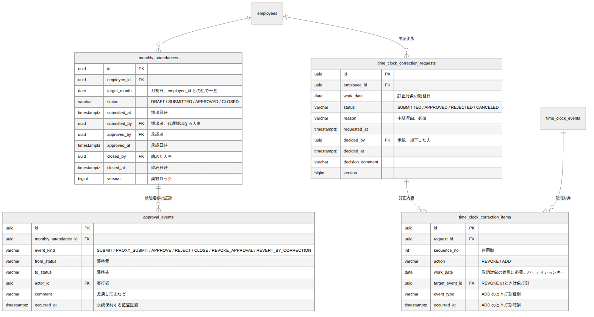

# 申請・承認・締め DB設計書

| 項目 | 内容 |
| --- | --- |
| 文書番号 | KNT-DES-502 |
| 版 | 0.2 |
| 対象スキーマ | `monthly_attendances` / `approval_events` / `time_clock_correction_requests` / `time_clock_correction_items` |
| 関連要件 | BR-09 / BR-10 / BR-11 |
| 関連文書 | [ドメインモデル設計書](ドメインモデル設計書.md) / [API設計書](API設計書.md) / [設計規約チェックリスト](../00_共通/設計規約チェックリスト.md) |
| 改訂 | 0.2（2026-09-01）設計レビュー第 2 回の指摘を反映 |

---

## 1. ER 図



<sub>図のソース: [`diagrams/ER図.mmd`](diagrams/ER図.mmd)</sub>

---

## 2. 設計の要点

| # | 設計 | 理由 |
| --- | --- | --- |
| 1 | 状態と付随カラムの整合を CHECK 制約で守る | 「承認済みなのに承認者が不明」を作れなくする。ドメインの `sealed interface` に対応 |
| 2 | **自己承認を DB でも禁止する** | BR-11 の中核。アプリのバグや手作業の SQL でも破られないようにする |
| 3 | **締め済みからの遷移を証跡テーブルの CHECK で禁止する** | 締めた月が戻らないことを、履歴の記録レベルで保証する |
| 4 | 訂正申請を「取消」と「追加」の項目に分解する | 「変更」という操作を作らないことで、打刻が追記のみである性質を保つ（BR-09） |
| 5 | 同一勤務日に未処理の訂正申請を 1 件だけに制限する | 部分一意インデックス。競合する訂正が同時に承認されるのを防ぐ |
| 6 | 状態遷移の証跡を永続保持する | 要件定義書 7 章（5 年保持） |

---

## 3. テーブル定義

### 3.1 monthly_attendances（月次勤怠）

```sql
CREATE TABLE monthly_attendances (
    id           uuid        PRIMARY KEY,
    employee_id  uuid        NOT NULL REFERENCES employees (id),
    target_month date        NOT NULL,
    status       varchar(20) NOT NULL,
    submitted_at timestamptz,
    submitted_by uuid        REFERENCES employees (id),
    approved_by  uuid        REFERENCES employees (id),
    approved_at  timestamptz,
    closed_by    uuid        REFERENCES employees (id),
    closed_at    timestamptz,
    version      bigint      NOT NULL DEFAULT 0,
    created_at   timestamptz NOT NULL DEFAULT now(),
    updated_at   timestamptz NOT NULL DEFAULT now(),

    CONSTRAINT monthly_attendances_status_check
        CHECK (status IN ('DRAFT', 'SUBMITTED', 'APPROVED', 'CLOSED')),
    -- 対象月は必ず月初日で表現する
    CONSTRAINT monthly_attendances_month_check
        CHECK (target_month = date_trunc('month', target_month)::date),

    -- ★ 状態ごとに、埋まっているべき列と空であるべき列を規定する。
    --   ドメインの sealed interface（Draft / Submitted / Approved / Closed）に対応
    CONSTRAINT monthly_attendances_state_check CHECK (
        (status = 'DRAFT'
             AND submitted_at IS NULL AND submitted_by IS NULL
             AND approved_by IS NULL AND approved_at IS NULL
             AND closed_by IS NULL AND closed_at IS NULL)
        OR (status = 'SUBMITTED'
             AND submitted_at IS NOT NULL AND submitted_by IS NOT NULL
             AND approved_by IS NULL AND approved_at IS NULL
             AND closed_by IS NULL AND closed_at IS NULL)
        OR (status = 'APPROVED'
             AND submitted_at IS NOT NULL AND submitted_by IS NOT NULL
             AND approved_by IS NOT NULL AND approved_at IS NOT NULL
             AND closed_by IS NULL AND closed_at IS NULL)
        OR (status = 'CLOSED'
             AND submitted_at IS NOT NULL AND submitted_by IS NOT NULL
             AND approved_by IS NOT NULL AND approved_at IS NOT NULL
             AND closed_by IS NOT NULL AND closed_at IS NOT NULL)
    ),

    -- ★ 自己承認の禁止（BR-11 の 4）
    CONSTRAINT monthly_attendances_no_self_approval_check
        CHECK (approved_by IS NULL OR approved_by <> employee_id),

    -- 時系列の整合。承認は提出より後、締めは承認より後
    CONSTRAINT monthly_attendances_approved_after_submitted_check
        CHECK (approved_at IS NULL OR submitted_at IS NULL OR approved_at >= submitted_at),
    CONSTRAINT monthly_attendances_closed_after_approved_check
        CHECK (closed_at IS NULL OR approved_at IS NULL OR closed_at >= approved_at),

    CONSTRAINT monthly_attendances_employee_month_uk UNIQUE (employee_id, target_month)
);

-- 承認待ちの一覧を引く。承認者は「自分が承認すべきもの」を毎回探すため
CREATE INDEX monthly_attendances_pending_idx
    ON monthly_attendances (target_month, employee_id) WHERE status = 'SUBMITTED';
```

**自己承認の禁止を DB に置いた。**
BR-11 の中核であり、破られると承認という統制そのものが無意味になる。
アプリケーションの判定だけに任せない。

**`submitted_by` を持つ。** 退職者の最終月は本人がログインできないため、
`HR` が代理で提出する（[ドメインモデル設計書 2.4](ドメインモデル設計書.md)）。
誰が提出したかを残さないと、代理提出だったのかが後から分からない。

> **`monthly_attendances_status_idx (status, target_month)` は置かない。**
> 4.1 の承認待ち一覧は `monthly_attendances_pending_idx`（部分インデックス）で足りる。
> 先頭列が同じ `status` で役割が重複し、書き込みコストだけが増える。

### 3.2 approval_events（状態遷移の証跡）

```sql
CREATE TABLE approval_events (
    id                    uuid         PRIMARY KEY,
    monthly_attendance_id uuid         NOT NULL REFERENCES monthly_attendances (id),
    from_status           varchar(20)  NOT NULL,
    to_status             varchar(20)  NOT NULL,
    event_kind            varchar(30)  NOT NULL,
    actor_id              uuid         NOT NULL REFERENCES employees (id),
    comment               varchar(500),
    occurred_at           timestamptz  NOT NULL,
    created_at            timestamptz  NOT NULL DEFAULT now(),

    CONSTRAINT approval_events_from_status_check
        CHECK (from_status IN ('DRAFT', 'SUBMITTED', 'APPROVED', 'CLOSED')),
    CONSTRAINT approval_events_to_status_check
        CHECK (to_status IN ('DRAFT', 'SUBMITTED', 'APPROVED', 'CLOSED')),
    -- ★ 許可される遷移の組をすべて列挙する。
    --   ドメインの AttendanceTransition（6 種）と 1 対 1 に対応する
    CONSTRAINT approval_events_transition_check CHECK (
        (from_status, to_status) IN (
            ('DRAFT',     'SUBMITTED'),   -- Submit
            ('SUBMITTED', 'APPROVED'),    -- Approve
            ('SUBMITTED', 'DRAFT'),       -- Reject / RevertByCorrection
            ('APPROVED',  'CLOSED'),      -- Close
            ('APPROVED',  'DRAFT')        -- RevokeApproval
        )
    ),

    -- ★ 差戻し・承認の取消・訂正承認による自動差戻しは理由が必須（BR-10）。
    --   空文字と空白も許さない
    CONSTRAINT approval_events_reason_required_check
        CHECK (to_status <> 'DRAFT' OR length(btrim(coalesce(comment, ''))) > 0),

    -- ★ 代理提出は理由が必須
    CONSTRAINT approval_events_proxy_reason_check
        CHECK (to_status <> 'SUBMITTED' OR event_kind <> 'PROXY_SUBMIT'
               OR length(btrim(coalesce(comment, ''))) > 0),

    CONSTRAINT approval_events_kind_check
        CHECK (event_kind IN ('SUBMIT', 'PROXY_SUBMIT', 'APPROVE', 'REJECT',
                              'CLOSE', 'REVOKE_APPROVAL', 'REVERT_BY_CORRECTION'))
);

CREATE INDEX approval_events_target_idx
    ON approval_events (monthly_attendance_id, occurred_at);
-- 監査時に「誰が何をしたか」を実行者から追う（4.4）
CREATE INDEX approval_events_actor_idx ON approval_events (actor_id, occurred_at);
```

#### `event_kind` を持つ理由

`(from_status, to_status)` だけでは遷移の意味が決まらない。
`SUBMITTED → DRAFT` は **差戻し（`REJECT`）** と
**訂正承認による自動差戻し（`REVERT_BY_CORRECTION`）** の 2 つがありうる。

前者は承認者の判断、後者は内容が変わったことによる巻き戻しであり、
本人に非があるわけではない。
**証跡でこの 2 つが区別できないと「何度も差し戻されている社員」という誤読が生まれる。**

`DRAFT → SUBMITTED` も、本人の提出（`SUBMIT`）と
`HR` の代理提出（`PROXY_SUBMIT`）で意味が違う。

#### 遷移の組を列挙する理由

第 1 版は `from <> to` と `from <> 'CLOSED'` の 2 つしか持たず、
**`DRAFT → CLOSED` や `DRAFT → APPROVED` を証跡として記録できた。**
「証跡の側でも状態機械を保証する」という主張が成立していなかった。

許可される組を列挙すれば、`CLOSED` が終端であることも自動的に守られる
（`CLOSED` が `from_status` に現れる組が無い）。

**このテーブルは追記のみ。** UPDATE も DELETE もしない。
要件定義書 7 章が 5 年間の保持を求めているため。

`occurred_at` は業務上の日時なのでアプリケーションが `Clock` から設定する。
`created_at` は DB の `now()`。用途が違う
（[社員・組織 DB設計書 2.2](../01_社員・組織/DB設計書.md)）。

### 3.3 time_clock_correction_requests（打刻の訂正申請）

```sql
CREATE TABLE time_clock_correction_requests (
    id               uuid         PRIMARY KEY,
    employee_id      uuid         NOT NULL REFERENCES employees (id),
    work_date        date         NOT NULL,
    status           varchar(20)  NOT NULL,
    reason           varchar(500) NOT NULL,
    requested_at     timestamptz  NOT NULL,
    decided_by       uuid         REFERENCES employees (id),
    decided_at       timestamptz,
    decision_comment varchar(500),
    version          bigint       NOT NULL DEFAULT 0,
    created_at       timestamptz  NOT NULL DEFAULT now(),
    updated_at       timestamptz  NOT NULL DEFAULT now(),

    CONSTRAINT correction_requests_status_check
        CHECK (status IN ('SUBMITTED', 'APPROVED', 'REJECTED', 'CANCELED')),
    -- 申請理由は必須。空文字も許さない
    CONSTRAINT correction_requests_reason_check
        CHECK (length(btrim(reason)) > 0),

    -- 状態と決裁情報の整合
    CONSTRAINT correction_requests_state_check CHECK (
        (status = 'SUBMITTED' AND decided_by IS NULL AND decided_at IS NULL)
        OR (status IN ('APPROVED', 'REJECTED')
             AND decided_by IS NOT NULL AND decided_at IS NOT NULL)
        -- 取下げは本人が行うので、決裁者は本人になる
        OR (status = 'CANCELED' AND decided_by IS NOT NULL AND decided_at IS NOT NULL)
    ),
    -- 却下は理由が必須
    CONSTRAINT correction_requests_rejection_comment_check
        CHECK (status <> 'REJECTED' OR length(btrim(coalesce(decision_comment, ''))) > 0),
    -- ★ 自分の訂正を自分で承認・却下できない。取下げだけは本人が行う
    CONSTRAINT correction_requests_no_self_approval_check
        CHECK (decided_by IS NULL
               OR status = 'CANCELED'
               OR decided_by <> employee_id),
    CONSTRAINT correction_requests_cancel_by_self_check
        CHECK (status <> 'CANCELED' OR decided_by = employee_id),
    CONSTRAINT correction_requests_decided_after_requested_check
        CHECK (decided_at IS NULL OR decided_at >= requested_at)
);

-- ★ 同一勤務日に未処理の申請は 1 件まで。
--   競合する訂正が同時に承認されると、打刻列が壊れる
CREATE UNIQUE INDEX correction_requests_pending_uk
    ON time_clock_correction_requests (employee_id, work_date)
    WHERE status = 'SUBMITTED';

CREATE INDEX correction_requests_employee_idx
    ON time_clock_correction_requests (employee_id, work_date DESC);
```

**`CANCELED` を状態に加えた。** 誤って申請した本人が取り下げられないと、
`correction_requests_pending_uk` により
**承認者が却下するまで正しい申請を出し直せない。**
承認者が不在なら、その勤務日の訂正が滞留する。

取下げは本人が行うので、`decided_by` は本人になる。
そのため自己承認の禁止から `CANCELED` を除外し、
逆に「`CANCELED` なら `decided_by` は本人でなければならない」を別の制約で守る。

### 3.4 time_clock_correction_items（訂正の内容）

```sql
CREATE TABLE time_clock_correction_items (
    id              uuid        PRIMARY KEY,
    request_id      uuid        NOT NULL
                                REFERENCES time_clock_correction_requests (id) ON DELETE CASCADE,
    sequence_no     int         NOT NULL,
    action          varchar(20) NOT NULL,
    work_date       date        NOT NULL,
    target_event_id uuid,
    event_type      varchar(20),
    occurred_at     timestamptz,

    CONSTRAINT correction_items_action_check
        CHECK (action IN ('REVOKE', 'ADD')),
    CONSTRAINT correction_items_event_type_check
        CHECK (event_type IS NULL
               OR event_type IN ('CLOCK_IN', 'CLOCK_OUT', 'BREAK_START', 'BREAK_END')),

    -- ★ 操作ごとに必要な列が揃い、不要な列が NULL であること。
    --   ドメインの sealed interface（Revoke / Add）に対応
    CONSTRAINT correction_items_variant_check CHECK (
        (action = 'REVOKE'
             AND target_event_id IS NOT NULL
             AND event_type IS NULL AND occurred_at IS NULL)
        OR
        (action = 'ADD'
             AND target_event_id IS NULL
             AND event_type IS NOT NULL AND occurred_at IS NOT NULL)
    ),

    -- 取消対象は実在する打刻でなければならない。
    -- time_clock_events の主キーが (work_date, id) の複合なので work_date を持つ
    CONSTRAINT correction_items_target_fk
        FOREIGN KEY (work_date, target_event_id)
        REFERENCES time_clock_events (work_date, id),

    CONSTRAINT correction_items_order_uk UNIQUE (request_id, sequence_no)
);
```

### 3.5 updated_at の自動更新

`set_updated_at()` の定義は
[01_社員・組織 DB設計書 3.8](../01_社員・組織/DB設計書.md) にある。

```sql
CREATE TRIGGER monthly_attendances_set_updated_at BEFORE UPDATE ON monthly_attendances
    FOR EACH ROW EXECUTE FUNCTION set_updated_at();
CREATE TRIGGER correction_requests_set_updated_at
    BEFORE UPDATE ON time_clock_correction_requests
    FOR EACH ROW EXECUTE FUNCTION set_updated_at();
```

`approval_events` と `time_clock_correction_items` にはトリガを置かない。
**追記のみで UPDATE しない**ため、`updated_at` 列そのものを持たせていない。
```

> **`work_date` を項目にも持たせている理由**
> `time_clock_events` の主キーはパーティションキーを含む `(work_date, id)` の複合である。
> 取消対象の実在を外部キーで保証するには、参照する側も `work_date` を持つ必要がある。
> **申請の `work_date` と項目の `work_date` が一致することは `CHECK` では書けない**
> （他テーブルを参照するため）。アプリケーションで保証し、5.1 に明記する。

---

## 4. 主要なクエリ

### 4.1 承認待ちの一覧（承認者向け）

```sql
SELECT m.id, m.employee_id, m.target_month, m.submitted_at, m.version
FROM monthly_attendances m
WHERE m.status = 'SUBMITTED'
  AND m.employee_id = ANY (:subordinateIds)
ORDER BY m.target_month, m.employee_id;
```

`:subordinateIds` は `employee` コンテキストが返す「自分が承認すべき社員」の一覧である。
**BR-11 の適用結果を SQL に埋め込まない。**
承認者の判定は業務ルールであり、`ApproverPolicy` が担う。

`monthly_attendances_pending_idx`（部分インデックス）が効く。

### 4.2 状態遷移の履歴

```sql
SELECT ev.event_kind, ev.from_status, ev.to_status, ev.comment,
       ev.actor_id, ev.occurred_at
FROM approval_events ev
WHERE ev.monthly_attendance_id = :id
ORDER BY ev.occurred_at;
```

**`employees` を結合して氏名を取らない。** 社員番号と氏名は
`employee` コンテキストが所有する概念であり、`approval` の応答に混ぜない
（[設計規約チェックリスト 3](../00_共通/設計規約チェックリスト.md)）。

### 4.2.1 実行者による証跡の追跡（監査）

```sql
SELECT ev.monthly_attendance_id, ev.event_kind, ev.from_status, ev.to_status,
       ev.comment, ev.occurred_at
FROM approval_events ev
WHERE ev.actor_id = :actorId
  AND ev.occurred_at >= :from AND ev.occurred_at < :toExclusive
ORDER BY ev.occurred_at;
```

「この人事担当が誰の何を締めたか」を追う。`approval_events_actor_idx` が効く。
要件 7 章の監査要件に対応する。

### 4.3 締め状態の問い合わせ（他コンテキストから）

```sql
SELECT status FROM monthly_attendances
WHERE employee_id = :employeeId AND target_month = :month;
```

**行が無い場合は「まだ何も記録されていない」＝下書き相当として扱う。**

`monthly_attendances` の行は **提出時に初めて作る。**
打刻のたびに `approval` の表へ行を作ると、
`attendance → approval` の書き込み方向の依存が生まれてしまう
（`MonthClosureQuery` は読み取りのポートである）。

### 4.4 訂正申請と内容

```sql
SELECT r.*, i.sequence_no, i.action, i.target_event_id, i.event_type, i.occurred_at
FROM time_clock_correction_requests r
LEFT JOIN time_clock_correction_items i ON i.request_id = r.id
WHERE r.employee_id = :employeeId AND r.work_date = :workDate
ORDER BY r.requested_at DESC, i.sequence_no;
```

---

## 5. 制約の一覧

| 制約名 | 種類 | 守るもの |
| --- | --- | --- |
| `monthly_attendances_state_check` | CHECK | **状態ごとの列の充足**（承認済みなのに承認者が不明を防ぐ） |
| `monthly_attendances_no_self_approval_check` | CHECK | **自己承認の禁止** |
| `monthly_attendances_*_after_*_check` | CHECK | 提出 → 承認 → 締めの時系列 |
| `approval_events_transition_check` | CHECK | **許可された 5 組の遷移だけが記録される**（締め済みからの遷移も自動的に排除される） |
| `approval_events_kind_check` | CHECK | 遷移の種類が定義された 7 種のいずれか |
| `approval_events_reason_required_check` | CHECK | 差戻し・承認取消・訂正承認による自動差戻しの理由が必須（**空文字も不可**） |
| `approval_events_proxy_reason_check` | CHECK | **代理提出の理由が必須** |
| `correction_requests_reason_check` | CHECK | 申請理由が空でない |
| `correction_requests_state_check` | CHECK | 状態と決裁情報の整合 |
| `correction_requests_no_self_approval_check` | CHECK | **自分の訂正を自分で承認・却下できない** |
| `correction_requests_cancel_by_self_check` | CHECK | 取下げは本人が行う |
| `correction_requests_pending_uk` | 部分 UNIQUE | **同一勤務日の未処理申請は 1 件まで** |
| `correction_items_variant_check` | CHECK | **操作ごとの列の充足**（取消 / 追加） |
| `correction_items_target_fk` | FK | 取消対象の打刻が実在する |
| `*_set_updated_at` | TRIGGER | `updated_at` の自動更新 |

### 5.1 DB では防げないもの

| 内容 | 守る場所 |
| --- | --- |
| 訂正申請の `work_date` と項目の `occurred_at` の日付の関係 | ドメイン。**BR-03 の日跨ぎ勤務では一致しないのが正しい**ので、DB では判定できない |
| 訂正を適用した後の打刻列が状態機械として妥当であること | ドメイン（申請時に検証） |
| 提出時に対象月の末日が到来し、全勤務日の日次勤怠が確定していること | アプリケーション |
| 承認者が BR-11 の承認者と一致すること | ドメイン（`ApproverPolicy`）。DB は自己承認の禁止だけを守る |
| `approved_by` / `closed_by` が `HR` ロールまたは BR-11 の承認者であること | アプリケーション（`employee_roles` の参照は `CHECK` で書けない） |
| `submitted_by` が本人、または本人が在籍していない場合の `HR` であること | アプリケーション |
| **`approval_events.to_status` と `monthly_attendances.status` の一致** | アプリケーション（同一トランザクションで両方を書く） |
| **遷移の順序**（証跡の並びが実際の遷移列と一致すること） | アプリケーション。1 行ごとの妥当性は `transition_check` が守るが、行の並びは守れない |
| 締め済みの月への打刻・再計算の拒否 | 各コンテキストが `shared` の `MonthClosureQuery` で判定する |
| 訂正申請の承認者が `workDate` の月の BR-11 の承認者であること | ドメイン（`ApproverPolicy`） |

**DB が守れるのは「1 行の内部の整合」と「参照の実在」までである。**
それを超える業務ルールはドメインが守る、という線引きを明示しておく。
**黙って抜けているのが最も危険なので、守れない範囲を列挙する。**

---

## 6. 制約の検証

**検証環境**: PostgreSQL 16 / 2026-09-01 実施

| ID | 検証内容 | 期待 | 結果 |
| --- | --- | --- | --- |
| IT-APV-01 | `DRAFT` なのに承認者を設定 | `state_check` で拒否 | 済 |
| IT-APV-02 | `APPROVED` なのに承認者が空 | `state_check` で拒否 | 済 |
| IT-APV-03 | `CLOSED` なのに締めた人が空 | `state_check` で拒否 | 済 |
| IT-APV-04 | **`SUBMITTED` なのに提出者が空** | `state_check` で拒否 | 済 |
| IT-APV-05 | **本人が自分を承認** | `no_self_approval_check` で拒否 | 済 |
| IT-APV-06 | 承認日時が提出日時より前 | `approved_after_submitted_check` で拒否 | 済 |
| IT-APV-07 | **締め済みからの遷移を記録** | `transition_check` で拒否 | 済 |
| IT-APV-08 | **`DRAFT` から `CLOSED` へ飛ばす遷移を記録** | `transition_check` で拒否 | 済 |
| IT-APV-09 | **`DRAFT` から `APPROVED` へ飛ばす遷移を記録** | `transition_check` で拒否 | 済 |
| IT-APV-10 | 差戻しの理由が `NULL` | `reason_required_check` で拒否 | 済 |
| IT-APV-11 | **差戻しの理由が空文字** | `reason_required_check` で拒否 | 済 |
| IT-APV-12 | **差戻しの理由が空白のみ** | `reason_required_check` で拒否 | 済 |
| IT-APV-13 | **代理提出の理由が空** | `proxy_reason_check` で拒否 | 済 |
| IT-APV-14 | **未定義の `event_kind`** | `kind_check` で拒否 | 済 |
| IT-APV-15 | **訂正承認による自動差戻しを理由つきで記録** | 成功し、差戻しと区別できる | 済 |
| IT-APV-16 | 同一勤務日に未処理の訂正申請を 2 件 | `pending_uk` で拒否 | 済 |
| IT-APV-17 | **取り下げた申請と同じ勤務日に再申請** | 成功する | 済 |
| IT-APV-18 | 却下なのにコメントが空 | `rejection_comment_check` で拒否 | 済 |
| IT-APV-19 | **自分の訂正を自分で承認** | `no_self_approval_check` で拒否 | 済 |
| IT-APV-20 | **自分の訂正を自分で取り下げる** | 成功する | 済 |
| IT-APV-21 | **他人の訂正を取下げとして記録** | `cancel_by_self_check` で拒否 | 済 |
| IT-APV-22 | `REVOKE` なのに打刻種別を設定 | `correction_items_variant_check` で拒否 | 済 |
| IT-APV-23 | `ADD` なのに取消対象を設定 | `correction_items_variant_check` で拒否 | 済 |
| IT-APV-24 | 存在しない打刻を取消対象にする | `correction_items_target_fk` で拒否 | 済 |
| IT-APV-25 | 正常な状態遷移（提出 → 承認 → 締め）と訂正申請 | 成功する | 済 |
| IT-APV-26 | `updated_at` が UPDATE で更新される | トリガにより現在時刻になる | 済 |

**この検証は、01（社員・組織）と 03（打刻）の DDL を先に適用した上で行う。**
`employees` と `time_clock_events` を参照するため、本書の DDL だけでは適用できない。
`btree_gist` は本コンテキストでは不要。

---

## 7. 未決事項

| # | 内容 | 判断の時期 |
| --- | --- | --- |
| 1 | 訂正申請の `work_date` と項目の `work_date` の整合を制約トリガで守るか | M1-c の実装時 |
| 2 | 締め済みの月をやむを得ず訂正する特権操作の記録方法 | M1-c の実装時 |
| 3 | `approval_events` と `monthly_attendances.status` の一致を制約トリガで守るか | M1-c の実装時 |
