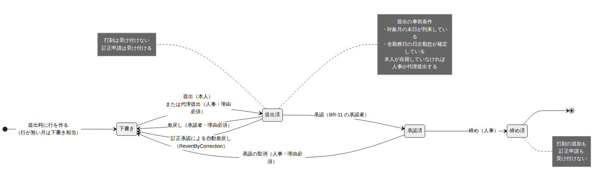
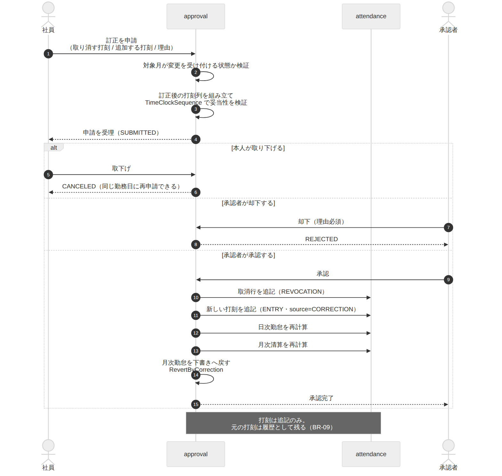

# 申請・承認・締め ドメインモデル設計書

| 項目 | 内容 |
| --- | --- |
| 文書番号 | KNT-DES-501 |
| 版 | 0.2 |
| 対象パッケージ | `jp.co.sample.kintai.approval` |
| 関連要件 | BR-08 / BR-09 / BR-10 / BR-11 |
| 関連文書 | [社員・組織](../01_社員・組織/ドメインモデル設計書.md) / [日次集計](../03_勤怠_打刻と日次集計/ドメインモデル設計書.md) / [月次清算](../04_勤怠_月次清算/ドメインモデル設計書.md) / [DB設計書](DB設計書.md) / [API設計書](API設計書.md) / [設計規約チェックリスト](../00_共通/設計規約チェックリスト.md) |
| 改訂 | 0.2（2026-09-01）設計レビュー第 2 回の指摘を反映 |

---

## 1. このコンテキストの責務

**勤怠の記録を「確定」させる。** 3 つを担う。

| 責務 | 対応要件 |
| --- | --- |
| 月次勤怠の状態遷移（提出 → 承認 → 締め） | BR-10 |
| 承認者の決定（承認の業務ルールの適用） | BR-11 |
| 打刻の訂正申請と、その承認 | BR-09 |

労働時間の計算は行わない。`attendance` の計算結果を **確定させる責務のみ** を持つ。

### 1.1 使用する型の一覧

| 型 | 定義場所 | 内容 |
| --- | --- | --- |
| `MonthlyAttendance` | 本コンテキスト | 月次勤怠。状態と監査証跡を持つ集約 |
| `MonthlyAttendanceId` | 本コンテキスト | 月次勤怠の識別子（UUID） |
| `MonthlyAttendanceStatus` | 本コンテキスト | `sealed interface`。`Draft` / `Submitted` / `Approved` / `Closed`（2.1） |
| `AttendanceTransition` | 本コンテキスト | `sealed interface`。状態遷移（2.2） |
| `ApproverPolicy` | 本コンテキスト | BR-11 の適用（3 章） |
| `Approver` / `ApproverKind` / `ResolutionStep` / `SkipReason` | 本コンテキスト | 承認者と導出の経路（3.1） |
| `CorrectionRequest` / `CorrectionItem` / `CorrectionRequestId` | 本コンテキスト | 打刻の訂正申請（4.1） |
| `CorrectionStatus` | 本コンテキスト | `SUBMITTED` / `APPROVED` / `REJECTED` / `CANCELED`（4.1） |
| `SubmitValidation` / `CorrectionValidation` | 本コンテキスト | 検証結果。`ok` か、理由つきの失敗 |
| `ApprovalEvent` / `ApprovalEventId` | 本コンテキスト | 監査証跡（6 章） |
| `OrganizationChart` / `Department` / `Managership` | `employee.domain` | 組織構造の**事実** |
| `DailyAttendance` | `attendance.domain` | 日次の集計結果。提出の事前条件に使う |
| `TimeClockEvent` / `TimeClockEventId` / `TimeClockSequence` | `attendance.domain` | 打刻。訂正の検証に使う |
| `EmployeeId` / `Role` | `shared.domain` | 共有語彙 |
| `MonthClosureQuery` | `shared.domain` | 締め判定のポート。**実装は本コンテキスト**（5.1） |

### 1.2 他コンテキストへの依存

依存図の辺は `approval → employee` と `approval → attendance` の 2 本である。
**逆向きの辺は無い。**

締め状態は他コンテキストが知りたがるが、`workrule → approval` や
`attendance → approval` の辺を作らない。
**ポートを `shared.domain` に置き、その実装を本コンテキストが提供する**（5.1）。

---

## 2. 月次勤怠の状態機械（BR-10）



<sub>図のソース: [`diagrams/月次勤怠の状態遷移.mmd`](diagrams/月次勤怠の状態遷移.mmd)</sub>

### 2.1 状態を sealed interface で表現する

状態ごとに **持つべきデータが異なる。** enum では表現できない。

```java
public sealed interface MonthlyAttendanceStatus
        permits Draft, Submitted, Approved, Closed {

    /** 本人が直接打刻してよい状態か。 */
    boolean acceptsTimeClock();

    /** 訂正申請を受け付けてよい状態か。 */
    boolean acceptsCorrectionRequest();

    record Draft() implements MonthlyAttendanceStatus {
        public boolean acceptsTimeClock()         { return true; }
        public boolean acceptsCorrectionRequest() { return true; }
    }

    record Submitted(LocalDateTime submittedAt) implements MonthlyAttendanceStatus {
        // ★ 提出後は直接打刻できない。承認者が見た内容と確定する内容が食い違うため
        public boolean acceptsTimeClock()         { return false; }
        // 訂正申請は受け付ける。差戻しを待たずに気づいた誤りを直せるようにする
        public boolean acceptsCorrectionRequest() { return true; }
    }

    record Approved(EmployeeId approvedBy, LocalDateTime approvedAt)
            implements MonthlyAttendanceStatus {
        // 承認後は変更できない。変えるには承認を取り消す
        public boolean acceptsTimeClock()         { return false; }
        public boolean acceptsCorrectionRequest() { return false; }
    }

    record Closed(EmployeeId approvedBy, LocalDateTime approvedAt,
                  EmployeeId closedBy, LocalDateTime closedAt)
            implements MonthlyAttendanceStatus {
        public boolean acceptsTimeClock()         { return false; }
        public boolean acceptsCorrectionRequest() { return false; }
    }
}
```

#### 「打刻」と「訂正申請」を分ける理由

第 1 版は `acceptsChanges()` の 1 つで両方を表していた。
提出済みが `true` を返すので、**本人が提出後に直接打刻できてしまう。**
月次勤怠は提出済みのまま内容だけが変わり、
**承認者が確認した内容と、実際に確定される内容が食い違う。**

4.3 は訂正申請についてだけ「4 を忘れると提出済みのまま内容が変わる」と
正しく指摘していたが、**訂正申請より容易な直接打刻の経路が塞がれていなかった。**

| 状態 | 直接打刻 | 訂正申請 | 理由 |
| --- | --- | --- | --- |
| 下書き | ○ | ○ | まだ誰も見ていない |
| 提出済 | **×** | ○ | 承認者が見ている内容を勝手に変えない。直したいなら申請する |
| 承認済 | × | × | 確定した。変えるには承認を取り消す |
| 締め済 | × | × | 動かない |

**`Approved` は承認者と承認日時を必ず持つ。**
「承認済みなのに承認者が不明」という状態を型として作れなくする。
同じ不変条件を DB の CHECK 制約でも守る（[DB設計書](DB設計書.md) 3.1）。

### 2.2 遷移の定義

```java
public sealed interface AttendanceTransition
        permits Submit, Approve, Reject, Close, RevokeApproval, RevertByCorrection {

    MonthlyAttendanceStatus applyTo(MonthlyAttendance attendance, EmployeeId actor);
}
```

| 遷移 | 遷移元 → 遷移先 | 実行者 | 事前条件 |
| --- | --- | --- | --- |
| `Submit` | 下書き → 提出済 | 本人、または **`HR`（本人が在籍していない場合）** | 対象月の末日が到来していること／全勤務日の日次勤怠が確定していること |
| `Approve` | 提出済 → 承認済 | BR-11 の承認者 | 実行者が承認者と一致すること |
| `Reject` | 提出済 → 下書き | BR-11 の承認者 | **理由の入力が必須** |
| `Close` | 承認済 → 締め済 | `HR` | 対象月の末日が到来していること |
| `RevokeApproval` | 承認済 → 下書き | `HR` | **理由の入力が必須** |
| **`RevertByCorrection`** | 提出済 → 下書き | 訂正申請の承認者（システムが自動実行） | 訂正申請が承認されたこと |

**締め済みからの遷移は定義しない。** 締めた月を戻す手段を作らないことで、
確定値が動かないことを型で保証する。

> **`RevokeApproval` を設けた理由**
> 承認後・締め前に誤りが見つかることは実務で起きる。
> 承認済みから戻す手段が無いと、締めてしまうか、DB を直接触るしかなくなる。
> ただし実行できるのは人事に限り、理由を必須とする。

#### `RevertByCorrection` — 自動で起きる遷移も型にする

```java
/** 訂正申請の承認により、提出済の月次勤怠を下書きへ戻す。 */
record RevertByCorrection(CorrectionRequestId requestId) implements AttendanceTransition {
    @Override
    public MonthlyAttendanceStatus applyTo(MonthlyAttendance attendance, EmployeeId actor) {
        require(attendance.status() instanceof Submitted, "提出済みの月次勤怠ではありません");
        return new Draft();
    }
    /** 監査証跡に残すコメント。差戻しと同じく DRAFT への遷移なので必須。 */
    public String comment() {
        return "打刻訂正の承認による自動差戻し（申請 ID: %s）".formatted(requestId);
    }
}
```

第 1 版は 4.3 で「月次勤怠を下書きへ戻す」を副作用として要求しながら、
**その遷移を実行する手段が型として存在しなかった。**
状態遷移図にも描かれておらず、`approval_events` は
`DRAFT` への遷移にコメントを必須としているのに、
誰を `actor_id` にし何をコメントにするかが決まっていなかった。

**副作用として自動で起きる遷移も、明示的な遷移と同じく型にする。**
そうしないと監査証跡に残せない。

| 項目 | 値 |
| --- | --- |
| `actor_id` | 訂正申請を承認した人 |
| `comment` | 「打刻訂正の承認による自動差戻し（申請 ID: …）」 |

`Reject`（差戻し）とは別の遷移にする。
差戻しは承認者の判断だが、`RevertByCorrection` は内容が変わったことによる巻き戻しであり、
**本人に非があるわけではない。** 証跡でこの 2 つが区別できないと、
「何度も差し戻されている社員」という誤った読み取りが生まれる。

### 2.3 提出の事前条件

```java
/** 対象月が終わっており、全勤務日の日次勤怠が確定しているか。 */
public SubmitValidation validateSubmit(YearMonth month, DateRange settlementPeriod,
                                       List<DailyAttendance> calculated, Clock clock) {
    // ★ 対象月の末日が到来していること
    if (!LocalDate.now(clock).isAfter(month.atEndOfMonth())) {
        return SubmitValidation.monthNotFinished(month);
    }
    // 勤務日は会社カレンダーから引く（workrule）。清算期間で絞る
    List<LocalDate> workDates = companyCalendar.workDatesIn(settlementPeriod);
    Set<LocalDate> done = calculated.stream().map(DailyAttendance::workDate)
            .collect(toSet());
    List<LocalDate> missing = workDates.stream().filter(d -> !done.contains(d)).toList();
    return missing.isEmpty() ? SubmitValidation.ok() : SubmitValidation.incomplete(missing);
}
```

**対象月の末日が到来していることを検査する。**
第 1 版は「全勤務日の日次勤怠が確定していること」だけを見ていた。
月初なら勤務日がまだ来ていないので未確定リストが空になり、
**提出・承認・締めが通ってしまう。** 締めると 2.2 のとおり戻せない。

勤務日の一覧は `workrule` の会社カレンダーから引く。範囲は清算期間
（[月次清算 2.0](../04_勤怠_月次清算/ドメインモデル設計書.md)）であり、暦月ではない。
月中入社の初月は入社日から数える。

**未確定の日を列挙して返す。** 「提出できません」だけでは、
利用者はどの日を直せばよいか分からない。

欠勤の日は「打刻が無い」ことが確定した状態であり、未確定ではない
（[日次集計 ドメインモデル設計書 2.2](../03_勤怠_打刻と日次集計/ドメインモデル設計書.md)）。

休憩不足の警告（BR-08）は **提出を妨げない。**
BR-08 は「不足していても計算は打刻どおりに行い、警告を出すだけ」と定めている。
警告は承認者が見るべき情報なので、承認待ち一覧に含める（[API設計書 2.6](API設計書.md)）。

### 2.4 退職した社員の最終月

**提出の実行者を本人だけに限ると、退職者の最終月が永久に締められない。**

要件 7 章は認証 ID を社員番号としており、退職者はログインできない。
3/31 退職の社員の 3 月分は、提出できるのが 4 月以降なので
**提出済に到達できず、承認も締めもできない。**
一括締めは毎月「未承認だからスキップ」と報告し続けることになる。

| 状況 | 提出の実行者 |
| --- | --- |
| 通常 | 本人 |
| **提出時点で本人が在籍していない** | **`HR`（代理提出）** |

代理提出は `approval_events` に記録する。

| 項目 | 値 |
| --- | --- |
| `actor_id` | 代理提出した人事担当 |
| `comment` | 「退職者（最終在籍日 2026-03-31）の代理提出」。**必須** |

> これは第 1 回レビューで見つけた「部署長本人の勤怠が永久に締められない」と同じ形の欠陥である。
> **提出・承認・締めの実行者が不在になる経路を洗い出す**ことを
> [設計規約チェックリスト](../00_共通/設計規約チェックリスト.md) に加えた。

---

## 3. 承認者の決定（BR-11）

[社員・組織](../01_社員・組織/ドメインモデル設計書.md) の `OrganizationChart` が返す
**組織構造の事実** に対して、**承認の業務ルール** を適用する。

```java
public class ApproverPolicy {

    public Approver resolve(EmployeeId target, YearMonth month, LocalDate today) {
        // BR-11 の 1。月中に所属が始まっていればその日、そうでなければ月初日
        LocalDate basis = organizationChart.assignmentStartWithin(target, month)
                .orElse(month.atDay(1));

        Optional<Department> own = organizationChart.departmentOf(target, basis);
        if (own.isEmpty()) {
            return Approver.none(List.of());                                 // 対象月に所属なし
        }

        List<ResolutionStep> path = new ArrayList<>();
        for (Department department : organizationChart.selfAndAncestorsOf(own.get().id())) {
            if (!department.isActiveOn(basis)) {
                path.add(new ResolutionStep(department, SkipReason.DEPARTMENT_ABOLISHED));
                continue;
            }
            Optional<Managership> manager = organizationChart.managerOf(department.id(), basis);
            if (manager.isEmpty()) {
                path.add(new ResolutionStep(department, SkipReason.NO_MANAGER));
                continue;
            }
            if (manager.get().employeeId().equals(target)) {
                path.add(new ResolutionStep(department, SkipReason.SELF_APPROVAL_AVOIDED));
                continue;
            }
            if (!organizationChart.isActiveOn(manager.get().employeeId(), today)) {
                path.add(new ResolutionStep(department, SkipReason.MANAGER_RETIRED));
                continue;
            }
            path.add(new ResolutionStep(department, SkipReason.NONE));        // ここで決まった
            return Approver.of(manager.get(), path);
        }
        return Approver.humanResources(path);                                // BR-11 の 5
    }
}
```

**在籍判定だけ `today`（承認実行時点）を使う。** 他は基準日を使う。
この 2 つの日付を取り違えると、退職済みの部署長が承認者として返る。

**基準日の決定も `OrganizationChart` に問う。**
第 1 版は `assignments.findFirstStartIn(...)` という
`employee` の別ポートを直接引いていた。そのメソッドは
[社員・組織 4 章](../01_社員・組織/ドメインモデル設計書.md) の
`AssignmentRepository` に存在せず、
なにより **BR-11 の 1（基準日）は組織構造の事実**である。
`ApproverPolicy` が `employee` の内部を覗くと、BR-11 の実装が 2 か所に散る
（[アーキテクチャ設計書 6.4](../00_共通/アーキテクチャ設計書.md)）。

### 3.0 `Approver.none()` が返るのはどんなときか

BR-11 は 1〜5 のどのステップでも「承認者なし」を結論にしない。
5 で必ず人事へ到達する。`NONE` は
[社員・組織 3.2 の #7](../01_社員・組織/ドメインモデル設計書.md)
「対象月にまったく所属が無い（入社前・退職後）」に対応する。

**この月には月次勤怠が存在しないので、提出も承認も起きない。**
承認者を問う場面が無いという意味での `NONE` であり、
BR-11 の 5 に反しているわけではない。

### 3.1 承認者の表現

```java
public record Approver(ApproverKind kind, Optional<EmployeeId> employeeId,
                       List<ResolutionStep> path) {

    public Approver {
        if (kind == ApproverKind.INDIVIDUAL && employeeId.isEmpty()) {
            throw new IllegalArgumentException("個人承認なのに承認者が空です");
        }
        if (kind != ApproverKind.INDIVIDUAL && employeeId.isPresent()) {
            throw new IllegalArgumentException("個人承認でないのに承認者が設定されています");
        }
        path = List.copyOf(path);        // 防御的コピー
    }
}

public enum ApproverKind { INDIVIDUAL, HUMAN_RESOURCES, NONE }

/** 経路の 1 ステップ。その部署でなぜ決まらなかったか（決まったなら NONE）。 */
public record ResolutionStep(Department department, SkipReason reason) {}

public enum SkipReason {
    NONE,                     // ここで承認者が決まった
    DEPARTMENT_ABOLISHED,
    NO_MANAGER,
    SELF_APPROVAL_AVOIDED,
    MANAGER_RETIRED
}
```

**遡った理由を、部署ごとに保持する。**
「なぜこの人が承認者なのか」は運用中に必ず問い合わせが来る。

第 1 版は単一の `ResolvedFrom` を持たせていたが、
**渡していたのは「決まった部署」と「自部署」の 2 つだけ**で、
途中でスキップした理由はどこにも残らなかった。
自部署は長が未設定・親では本人、のように経路上に複数の理由が混在する場合、
1 つの enum では表現できない。

```
第一営業課   長が未設定           → NO_MANAGER
第一営業部   長が本人             → SELF_APPROVAL_AVOIDED
営業本部     長が承認時点で退職済み → MANAGER_RETIRED
（根まで到達）                    → 人事が承認
```

**この経路そのものが、人事への問い合わせに対する答えになる。**

### 3.2 人事による承認（HR_FALLBACK）

`HUMAN_RESOURCES` の場合、承認できるのは
**`HR` ロールを持つ社員のうち、対象社員本人を除いた者**である。
**特定の 1 人には固定しない。** 人事担当が休暇中でも承認が止まらないようにするため。

**本人を除くことを明記する。** 人事担当が本部長を兼ねる構成では、
BR-11 の遡りで人事へ到達したときに本人が自分を承認できてしまう。
DB の `monthly_attendances_no_self_approval_check` が INSERT を弾くので、
アプリからは原因不明の制約違反に見える。

| 該当者の数 | 扱い |
| --- | --- |
| 1 人以上 | そのいずれかが承認する |
| **0 人**（`HR` が対象社員 1 人だけ） | **`ADMIN` へエスカレーションする** |

`ADMIN` は社員マスタとロールの管理者であり、`HR` を追加で付与できる立場にある。
運用としては「人事担当を 2 名以上置く」ことで回避する。

承認を実行した人事担当は `approval_events.actor_id` に記録される。

---

## 4. 打刻の訂正申請（BR-09）



<sub>図のソース: [`diagrams/打刻訂正のフロー.mmd`](diagrams/打刻訂正のフロー.mmd)</sub>

### 4.1 申請の構造

```java
public record CorrectionRequest(
        CorrectionRequestId id,
        EmployeeId employeeId,
        LocalDate workDate,
        List<CorrectionItem> items,
        String reason,                    // 必須
        CorrectionStatus status) {

    public CorrectionRequest {
        if (reason == null || reason.isBlank()) {
            throw new IllegalArgumentException("訂正理由は必須です");
        }
        if (items.isEmpty()) {
            throw new IllegalArgumentException("訂正内容が空です");
        }
        items = List.copyOf(items);
    }
}

public sealed interface CorrectionItem permits Revoke, Add {
    /** 既存の打刻を取り消す。パーティションを絞るため workDate を持つ。 */
    record Revoke(LocalDate workDate, TimeClockEventId targetId) implements CorrectionItem {}
    /** 新しい打刻を追加する。打刻漏れの補完もこれで行う。 */
    record Add(TimeClockEventType type, LocalDateTime occurredAt) implements CorrectionItem {}
}

/** 訂正申請の状態。 */
public enum CorrectionStatus { SUBMITTED, APPROVED, REJECTED, CANCELED }
```

**時刻の「変更」という操作を用意しない。**
変更を許すと元の値が失われる。取消と追加の組み合わせで表現することで、
打刻が追記のみである性質を型のレベルで保つ（BR-09）。

**打刻漏れは `Add` だけで訂正する。** 取り消す対象が存在しないため
（[日次集計 3.1](../03_勤怠_打刻と日次集計/ドメインモデル設計書.md)）。

### 4.1.1 取下げ（CANCELED）

**本人が申請を取り下げられるようにする。**

DB の `correction_requests_pending_uk` は「同一勤務日の未処理の申請は 1 件まで」を守る。
取下げが無いと、誤って申請した本人は
**承認者が却下するまで正しい申請を出し直せない。**
承認者が不在なら、その勤務日の訂正が滞留する。

| 状態遷移 | 実行者 |
| --- | --- |
| `SUBMITTED` → `APPROVED` | 承認者 |
| `SUBMITTED` → `REJECTED` | 承認者（理由必須） |
| **`SUBMITTED` → `CANCELED`** | **本人** |

`CANCELED` と `REJECTED` を分けるのは、
**却下は承認者の判断、取下げは本人の意思**であり、
証跡で区別できないと「何度も却下されている社員」という誤読が生まれるためである。

### 4.1.2 訂正申請の承認者

**`workDate` が属する月の `ApproverPolicy.resolve` の結果とする。**

BR-11 は月次勤怠の承認者を定める規則だが、訂正申請は `workDate` 単位である。
月次と訂正で承認者が食い違うと、
「月次は承認できるが訂正は承認できない」上長が生まれる。

```java
Approver approver = approverPolicy.resolve(
        request.employeeId(), YearMonth.from(request.workDate()), today);
```

日をまたぐ勤務では `workDate` が始業日なので、
3/31 22:00 出勤 → 4/1 06:00 退勤の訂正は **3 月**の承認者が扱う（BR-03）。

### 4.2 申請時の検証

**承認を待たずに、申請の時点で検証する。**

```java
public CorrectionValidation validate(CorrectionRequest request,
                                     List<TimeClockEvent> current) {
    if (!monthlyAttendance.statusOf(request.employeeId(), YearMonth.from(request.workDate()))
            .acceptsCorrectionRequest()) {
        return CorrectionValidation.monthNotOpen();
    }
    // 訂正を適用した後の打刻列が、状態機械として妥当か
    List<TimeClockEvent> applied = apply(current, request.items());
    try {
        TimeClockSequence.of(applied).validateTransitions();
    } catch (InvalidTimeClockSequenceException e) {
        return CorrectionValidation.invalidSequence(e.getMessage());
    }
    return CorrectionValidation.ok();
}
```

承認者が承認した後で「その訂正を適用すると打刻列が壊れる」と分かるのでは遅い。
**申請の時点で弾き、申請者に修正させる。**

### 4.3 承認時の副作用

承認は 4 つの更新を **1 トランザクション** で行う。

| # | 処理 | 対象コンテキスト |
| --- | --- | --- |
| 1 | 取消行を追記（`REVOCATION`） | `attendance` |
| 2 | 新しい打刻を追記（`ENTRY`。`source = CORRECTION`・理由つき） | `attendance` |
| 3 | 日次勤怠を再計算 | `attendance` |
| 4 | **月次清算を再計算** | `attendance`（月次清算） |
| 5 | 月次勤怠を下書きへ戻す（`RevertByCorrection`） | `approval` |

**5 を忘れると、提出済みのまま内容だけが変わる。**
承認者が確認した内容と、実際に確定される内容が食い違う。

**4 を忘れると、日次だけが直って月次の時間外が古いままになる。**
[月次清算 API設計書 3.1](../04_勤怠_月次清算/API設計書.md) は
「打刻の訂正が承認されたとき」を再計算の契機として挙げている。
過去月を再計算したときは、同一年度の後続月の年度累計にも連鎖する。

> **[日次集計 API設計書 3.3](../03_勤怠_打刻と日次集計/API設計書.md) の
> 「再計算は自動では走らない」は、就業規則の改定を契機とする場合の話である。**
> 訂正の承認は再計算の目的そのものなので自動で走る。

---

## 5. 締め（BR-10）

```java
@Transactional
public void close(EmployeeId employeeId, YearMonth month, EmployeeId actor, long version) {
    requireRole(actor, Role.HR);
    MonthlyAttendance attendance = repository.find(employeeId, month).orElseThrow();
    attendance.transit(new Close(), actor);       // 承認済み以外なら例外
    repository.save(attendance, version);         // 楽観ロック
    events.record(attendance, Approved.class, Closed.class, actor, null);
}
```

### 5.1 締め後に禁止すること

| 操作 | 拒否する場所 |
| --- | --- |
| 打刻の追加 | `attendance` が `MonthClosureQuery` で判定して拒否 |
| 訂正申請 | `approval`（4.2 の検証） |
| 日次勤怠・月次清算の再計算 | `attendance` が `MonthClosureQuery` で判定して拒否 |
| 会社カレンダーの変更 | `workrule` が `MonthClosureQuery` で判定して拒否 |
| 就業規則の遡及適用 | `workrule`（同上） |
| 遡及する異動・退職の登録 | `employee`（同上） |

**締め状態は `approval` が保持し、他コンテキストはポート経由で問い合わせる。**
各コンテキストが独自に締め状態を持つと、必ず食い違う。

#### ポートは `shared.domain` に置く

```java
// shared/domain --- どのコンテキストからも見える
public interface MonthClosureQuery {
    boolean isClosed(EmployeeId employeeId, YearMonth month);
    boolean acceptsChanges(EmployeeId employeeId, YearMonth month);
}

// approval/infrastructure --- 実装は締め状態を持つ本コンテキストが提供する
class MonthClosureQueryAdapter implements MonthClosureQuery { ... }
```

**`attendance/domain` に置いてはいけない。**
締め状態を知りたいのは `attendance` だけではなく、`workrule` も `employee` も同じである。
`attendance` に置くと、`workrule → attendance` という
**依存図に無い辺**が必要になり、AR-06 / AR-07 に反する。

`shared` に置けば **新しい辺は 1 本も増えない。**
どのコンテキストも `shared` には依存してよいと決めているため
（[アーキテクチャ設計書 4](../00_共通/アーキテクチャ設計書.md)）。

判定に使う月は **勤務日（`work_date`）が属する月**である。
3/31 22:00 出勤 → 4/1 06:00 退勤の退勤打刻は 3 月として判定する
（[日次集計 3.2](../03_勤怠_打刻と日次集計/ドメインモデル設計書.md)）。

### 5.2 一括締め

人事は月末に全社員をまとめて締める。

```java
/** トランザクション境界を張らない。社員ごとに独立して締める。 */
public BulkCloseResult closeAll(YearMonth month, EmployeeId actor) {
    List<CloseOutcome> outcomes = new ArrayList<>();
    for (EmployeeId employeeId : targets(month)) {
        outcomes.add(closeOne(employeeId, month, actor));   // ここが @Transactional
    }
    return new BulkCloseResult(outcomes);
}

@Transactional
CloseOutcome closeOne(EmployeeId employeeId, YearMonth month, EmployeeId actor) { ... }
```

**1 人でも承認済みでない社員がいたら、全体を失敗させない。**
締められた社員と、締められなかった社員（と理由）を返す。
100 人のうち 1 人が未承認なだけで 99 人の締めが止まると、運用が回らない。

**`closeAll` に `@Transactional` を付けない。**
全体を 1 トランザクションにすると、1 件の失敗で全件が巻き戻り、
上の意図がそのまま失われる。トランザクションは `closeOne` に張る。

> 一括締めは対象が複数なので、リクエストで `version` を受け取らない。
> 同時実行は `closeOne` の中の楽観ロックで検出し、
> 失敗した社員として結果に含める。

---

## 6. 監査証跡

```java
public record ApprovalEvent(
        ApprovalEventId id,
        MonthlyAttendanceId monthlyAttendanceId,
        String fromStatus,
        String toStatus,
        EmployeeId actorId,
        String comment,
        LocalDateTime occurredAt) {
}
```

**すべての状態遷移を記録し、消さない。**
要件定義書 7 章が「打刻・承認・締めの操作履歴を、実行者と日時とともに永続保持する」
「労働関係の記録として 5 年間保持する」と定めているため。

`occurredAt` は業務上の日時なので `Clock` から取得する
（`created_at` の DB 側 `now()` とは別物。[社員・組織 DB設計書 2.2](../01_社員・組織/DB設計書.md)）。

---

## 7. 単体テストの観点

| ID | 観点 | 期待 | 要件 |
| --- | --- | --- | --- |
| UT-BR10-01 | 下書きから提出 | 提出済みになる | BR-10 |
| UT-BR10-02 | 未確定の日がある状態で提出 | 拒否し、未確定の日を列挙する | BR-10 |
| UT-BR10-03 | 承認者でない社員が承認 | 拒否 | BR-10 / BR-11 |
| UT-BR10-04 | 差戻しで理由が空 | 拒否 | BR-10 |
| UT-BR10-05 | 差戻し後は下書きに戻る | 打刻を受け付ける | BR-10 |
| UT-BR10-06 | 承認済みの月に打刻 | 拒否 | BR-10 |
| UT-BR10-07 | 締め済みの月に打刻・訂正申請 | いずれも拒否 | BR-10 |
| UT-BR10-08 | 締め済みからの遷移 | **型として存在しない**（コンパイル時に保証） | BR-10 |
| UT-BR10-09 | 人事以外が締める | 拒否 | BR-10 |
| UT-BR10-10 | 承認の取消 | 下書きに戻り、理由が記録される | BR-10 |
| UT-BR10-11 | 一括締めで一部が未承認 | 締めた社員と締められなかった社員を両方返す | BR-10 |
| UT-BR10-12 | **提出済の月に本人が直接打刻** | 拒否（`acceptsTimeClock()` が false） | BR-10 |
| UT-BR10-13 | **提出済の月に訂正申請** | 受け付ける（`acceptsCorrectionRequest()` が true） | BR-09 / BR-10 |
| UT-BR10-14 | **対象月の末日が到来する前に提出** | 拒否 | BR-10 |
| UT-BR10-15 | **退職者の最終月を `HR` が代理提出** | 提出済になり、証跡に代理理由が残る | BR-10 |
| UT-BR10-16 | **退職者の最終月を本人以外の一般社員が提出** | 拒否 | BR-10 |
| UT-BR10-17 | **休憩不足の警告が立ったまま提出** | 提出できる。警告は承認待ち一覧に表示される | BR-08 |
| UT-BR10-18 | **月中入社の初月の提出** | 勤務日は入社日から数える。初月が締められる | BR-10 |
| UT-BR11-01 | **対象社員本人が唯一の `HR` で人事へ到達** | `ADMIN` へエスカレーションする | BR-11 |
| UT-BR11-02 | **自部署は長が未設定、親は本人、その親の長が退職済み** | 経路に 3 つの理由が順に記録される | BR-11 |
| UT-BR11-03 | **月中に所属が始まった社員の基準日** | 所属開始日が基準日になる | BR-11 |
| UT-BR09-06 | **本人が訂正申請を取り下げる** | `CANCELED` になり、同じ勤務日に再申請できる | BR-09 |
| UT-BR09-07 | **訂正申請の承認者** | `workDate` が属する月の承認者と一致する | BR-09 / BR-11 |
| UT-BR09-08 | **打刻漏れの補完（`Add` だけの申請）** | 受け付ける。取り消す対象が無くてよい | BR-09 |
| UT-BR09-09 | **訂正の承認で月次清算も再計算される** | 日次と月次の両方が更新される | BR-09 |
| UT-AUD-02 | **訂正承認による自動差戻し** | `RevertByCorrection` として証跡に残り、差戻しと区別できる | 要件 7 章 |
| UT-BR09-01 | 訂正申請の理由が空 | 生成時に例外 | BR-09 |
| UT-BR09-02 | 訂正を適用すると打刻列が壊れる | **申請の時点で**拒否 | BR-09 |
| UT-BR09-03 | 訂正の承認 | 取消行と新しい打刻が追記され、元の打刻が残る | BR-09 |
| UT-BR09-04 | 訂正の承認後 | 月次勤怠が下書きに戻る | BR-09 / BR-10 |
| UT-BR09-05 | 締め済みの月への訂正申請 | 拒否 | BR-09 / BR-10 |
| UT-AUD-01 | すべての状態遷移 | `ApprovalEvent` が記録される | 要件 7 章 |

**UT-BR10-08 はテストコードとして書けない。**
締め済みからの遷移が型として存在しないことをコンパイラが保証するため、
「書こうとするとコンパイルエラーになる」ことをドキュメントで示す。

---

## 8. 未決事項

| # | 内容 | 判断の時期 |
| --- | --- | --- |
| 1 | 提出・承認・差戻しの通知（メール等）を送るか | M2 |
| 2 | 承認者が長期不在の場合の代理承認 | M2 |
| 3 | 締め済みの月をやむを得ず訂正する手段（監査ログ付きの特権操作） | M1-c の実装時 |
| 4 | `HR` が対象社員 1 人だけの場合に `ADMIN` へエスカレーションする運用でよいか | M1-c の実装時 |
| 5 | 代理提出できるのを `HR` に限るか、`ADMIN` にも認めるか | M1-c の実装時 |
