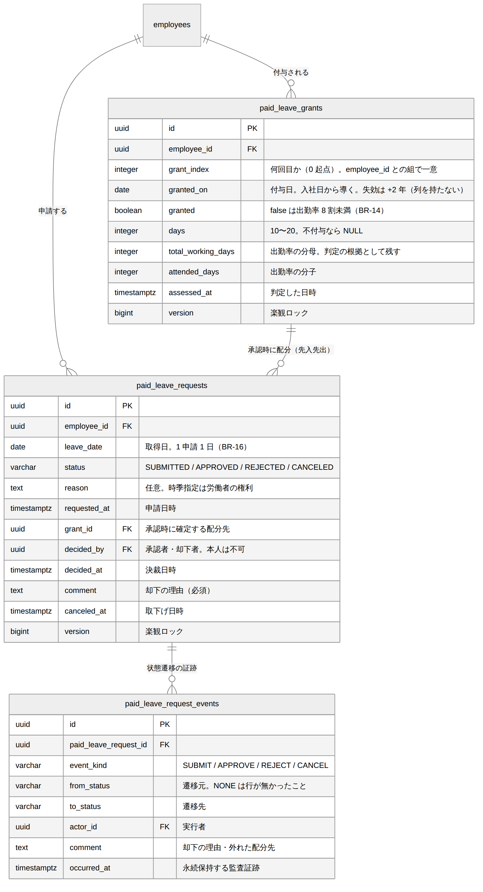

# 年次有給休暇 DB設計書

| 項目 | 内容 |
| --- | --- |
| 文書番号 | KNT-DES-602 |
| 版 | 0.1 |
| 対象スキーマ | `paid_leave_grants` / `paid_leave_requests` / `paid_leave_request_events` |
| 関連要件 | BR-14 / BR-15 / BR-16 / BR-17 |
| 関連文書 | [ドメインモデル設計書](ドメインモデル設計書.md) / [API設計書](API設計書.md) / [設計規約チェックリスト](../00_共通/設計規約チェックリスト.md) |

---

## 1. ER 図



<sub>図のソース: [`diagrams/ER図.mmd`](diagrams/ER図.mmd)</sub>

---

## 2. 設計の要点

| # | 設計 | 理由 |
| --- | --- | --- |
| 1 | **残日数の列を持たない** | 付与と配分から導く。列にすると付与・取得・取下げ・時効の 4 か所で更新することになり、1 か所落とすと静かにずれる（落とし穴 39） |
| 2 | **失効の行も作らない** | 失効は「付与日 + 2 年」だけで決まる。行にするとバッチの実行漏れで残日数が過大になる |
| 3 | **配分（どの付与から消化したか）は列で持つ** | 再判定で過去に付与が増えたときに、承認済みの配分先が入れ替わらないようにする（[ADR 0006](../../05_ADR/0006_残数は導出し配分だけを行として残す.md)） |
| 4 | 付与に**判定の根拠**（全労働日・出勤日）を残す | 「なぜ不付与だったか」を後から説明できるようにする |
| 5 | 不付与の年も行として残す | 「付与処理をしていない」と「法どおり不付与」を区別する |
| 6 | 状態と付随カラムの整合を CHECK で守る | ドメインの `sealed interface` / `enum` に対応させる |
| 7 | **自己承認を DB でも禁止する** | BR-11 の中核。`monthly_attendances` と揃える |
| 8 | **有効な申請は同一日に 1 件まで**（部分一意インデックス） | 同じ日を二重に取得できなくする |
| 9 | 状態遷移の証跡を永続保持する | 要件定義書 7 章（5 年保持） |
| 10 | `approval_events` の種類に `REVERT_BY_LEAVE` を**追加する**（既存の V6 は書き換えない） | 適用済みのマイグレーションを直すと Flyway のチェックサムが壊れる |

---

## 3. テーブル定義

### 3.1 paid_leave_grants（付与）

```sql
CREATE TABLE paid_leave_grants (
    id                 uuid        PRIMARY KEY,
    employee_id        uuid        NOT NULL REFERENCES employees (id),
    -- 何回目の付与か（0 起点）。0 = 入社 6 か月後。継続勤務年数の表（BR-14）を引く鍵
    grant_index        integer     NOT NULL,
    granted_on         date        NOT NULL,
    -- 付与したか。false は「出勤率 8 割に満たなかった」（BR-14）
    granted            boolean     NOT NULL,
    days               integer,
    -- 出勤率の根拠。なぜ不付与だったかを後から説明するために残す
    total_working_days integer     NOT NULL,
    attended_days      integer     NOT NULL,
    -- 人事が申告した出勤扱いの日数（休業・BR-14）。理由は日数が 1 以上なら必須
    deemed_attended_days integer   NOT NULL DEFAULT 0,
    deemed_reason      text,
    assessed_at        timestamptz NOT NULL,
    -- 行の作成時に 1 を入れる。0 は「行が無い」ことだけを指す（05 と同じ約束）
    version            bigint      NOT NULL DEFAULT 1,
    created_at         timestamptz NOT NULL DEFAULT now(),
    updated_at         timestamptz NOT NULL DEFAULT now(),

    CONSTRAINT paid_leave_grants_index_check CHECK (grant_index >= 0),

    -- ★ 付与したかどうかと日数の整合。ドメインの GrantDecision（sealed）に対応する。
    --   「不付与なのに日数がある」「付与したのに日数が無い」を作れなくする
    CONSTRAINT paid_leave_grants_decision_check CHECK (
        (granted AND days IS NOT NULL) OR (NOT granted AND days IS NULL)
    ),
    -- ★ 法定の表にある日数しか存在しない（BR-14）。上限も置く（落とし穴 15）
    CONSTRAINT paid_leave_grants_days_check
        CHECK (days IS NULL OR days BETWEEN 10 AND 20),

    -- 出勤率の分子は分母を超えない。出勤扱いを足しても超えない
    CONSTRAINT paid_leave_grants_rate_check
        CHECK (total_working_days >= 0 AND attended_days >= 0
               AND deemed_attended_days >= 0
               AND attended_days + deemed_attended_days <= total_working_days),
    -- ★ 出勤扱いを申告したなら理由が要る。空文字・空白のみも認めない
    CONSTRAINT paid_leave_grants_deemed_reason_check
        CHECK (deemed_attended_days = 0
               OR length(btrim(coalesce(deemed_reason, ''))) > 0),

    -- ★ 冪等性の根拠。付与処理を 2 回実行しても二重に付与されない
    CONSTRAINT paid_leave_grants_employee_index_uk UNIQUE (employee_id, grant_index),
    CONSTRAINT paid_leave_grants_employee_date_uk  UNIQUE (employee_id, granted_on),
    -- ★ 配分先が「本人の付与」であることを申請側から参照するための複合キー（3.2）
    CONSTRAINT paid_leave_grants_id_employee_uk    UNIQUE (id, employee_id)
);

-- 残日数は「その日に有効な付与」を古い順に読む（4.1）
CREATE INDEX paid_leave_grants_employee_granted_on_idx
    ON paid_leave_grants (employee_id, granted_on);
```

**失効日（`granted_on + 2 年`）の列を持たない。**
`granted_on` から一意に決まるので、持つと食い違いを防ぐ CHECK が要る（落とし穴 39）。
問い合わせは `granted_on > :asOf - interval '2 years'` と書けば
`paid_leave_grants_employee_granted_on_idx` がそのまま効く。

**`(employee_id, grant_index)` と `(employee_id, granted_on)` の両方を一意にする。**
前者は付与処理の冪等性を、後者は「同じ日に 2 回付与された」状態を防ぐ。
入社日から `grant_index` と `granted_on` は 1 対 1 に決まるので、
**片方だけでは、計算を間違えた実装が両方の列に矛盾した行を入れられる。**

> **`days` に `DEFAULT 0` を置かない。** 0 を「不付与」と読ませると、
> `granted` と `days` の 2 か所で同じことを表すことになる。
> 不付与は `NULL` とし、`decision_check` で `granted` と結び付ける。

### 3.2 paid_leave_requests（取得の申請）

```sql
CREATE TABLE paid_leave_requests (
    id           uuid        PRIMARY KEY,
    employee_id  uuid        NOT NULL REFERENCES employees (id),
    -- 取得日。1 申請 1 日（BR-16）
    leave_date   date        NOT NULL,
    reason       text,
    status       varchar(20) NOT NULL,
    requested_at timestamptz NOT NULL,
    -- 承認時に確定する配分先。先入先出で選ばれた付与（BR-15）
    grant_id     uuid,
    decided_by   uuid        REFERENCES employees (id),
    decided_at   timestamptz,
    comment      text,
    -- 取り消した人。本人（取下げ）か、取得日の当日以降なら HR（BR-16）
    canceled_by  uuid        REFERENCES employees (id),
    canceled_at  timestamptz,
    -- 行の作成時に 1 を入れる。0 は「行が無い」ことだけを指す（05 と同じ約束）
    version      bigint      NOT NULL DEFAULT 1,
    created_at   timestamptz NOT NULL DEFAULT now(),
    updated_at   timestamptz NOT NULL DEFAULT now(),

    CONSTRAINT paid_leave_requests_status_check
        CHECK (status IN ('SUBMITTED', 'APPROVED', 'REJECTED', 'CANCELED')),

    -- ★ 状態ごとに、埋まっているべき列と空であるべき列を規定する
    CONSTRAINT paid_leave_requests_state_check CHECK (
        (status = 'SUBMITTED'
             AND grant_id IS NULL AND decided_by IS NULL AND decided_at IS NULL
             AND comment IS NULL AND canceled_at IS NULL)
        -- 承認済みは必ず配分先を持つ。「消化したのにどの付与から引いたか不明」を作らない
        OR (status = 'APPROVED'
             AND grant_id IS NOT NULL AND decided_by IS NOT NULL AND decided_at IS NOT NULL
             AND canceled_at IS NULL)
        -- 却下はコメントが必須。空文字・空白のみも認めない
        OR (status = 'REJECTED'
             AND grant_id IS NULL AND decided_by IS NOT NULL AND decided_at IS NOT NULL
             AND length(btrim(coalesce(comment, ''))) > 0
             AND canceled_at IS NULL)
        -- 取消は配分を外す。承認済みだった場合の decided_by / decided_at は残す
        OR (status = 'CANCELED'
             AND grant_id IS NULL
             AND canceled_by IS NOT NULL AND canceled_at IS NOT NULL)
    ),

    -- ★ 自己承認・自己却下の禁止（BR-11）
    CONSTRAINT paid_leave_requests_no_self_decision_check
        CHECK (decided_by IS NULL OR decided_by <> employee_id),

    -- ★ 本人以外が取り消す（人事による当日以降の取消・BR-16）なら理由が要る
    CONSTRAINT paid_leave_requests_revoke_reason_check
        CHECK (canceled_by IS NULL OR canceled_by = employee_id
               OR length(btrim(coalesce(comment, ''))) > 0),

    -- ★ 配分先は「本人の付与」でなければならない。
    --   単純な id への外部キーだと、他人の付与から自分の年休を消化する行が作れる
    CONSTRAINT paid_leave_requests_grant_fk
        FOREIGN KEY (grant_id, employee_id)
        REFERENCES paid_leave_grants (id, employee_id),

    -- 決裁は申請より後
    CONSTRAINT paid_leave_requests_decided_after_requested_check
        CHECK (decided_at IS NULL OR decided_at >= requested_at),
    CONSTRAINT paid_leave_requests_canceled_after_requested_check
        CHECK (canceled_at IS NULL OR canceled_at >= requested_at)
);

-- ★ 同じ日を二重に取得できない。却下・取下げは対象外なので再申請できる
CREATE UNIQUE INDEX paid_leave_requests_active_uk
    ON paid_leave_requests (employee_id, leave_date)
    WHERE status IN ('SUBMITTED', 'APPROVED');

-- 承認待ちの一覧（4.3）
CREATE INDEX paid_leave_requests_pending_idx
    ON paid_leave_requests (leave_date, employee_id) WHERE status = 'SUBMITTED';
-- 残日数・年 5 日の集計は承認済みだけを読む（4.1 / 4.2）
CREATE INDEX paid_leave_requests_approved_idx
    ON paid_leave_requests (employee_id, leave_date) WHERE status = 'APPROVED';
```

**取下げで `grant_id` を外す。** 承認済みの取消は残日数を戻す操作であり、
配分が残ったままだと**残日数が戻らない。**
どの付与から戻したかは `paid_leave_request_events` に残る（3.3）。

**`decided_by` / `decided_at` は取消後も残す。** 消すと、
承認済みだった申請を取り消したときに**誰がいつ承認したのかが行から消える。**

**取り消した人を `canceled_by` として持つ。**
`decided_by` に入れると、承認者と取消者の区別が付かない。
本人以外（＝人事）が取り消せるのは取得日の当日以降だけで、そのときは理由が要る（BR-16）。

**配分先は複合外部キーで守る。** `grant_id` だけを `paid_leave_grants (id)` へ
向けると、**他人の付与から自分の年休を消化する行**が作れる。
残日数の集計（4.1）は付与側を `employee_id` で絞るので、
その行はどちらの社員の残日数からも消え、**付与と配分の合計が合わなくなる**
（[CLAUDE.md 落とし穴 42](../../../CLAUDE.md) と同型）。

**却下と取下げで一意インデックスの対象から外れる。**
`correction_requests_pending_uk` と同じ形である。
却下された日に再申請できないと、承認者の誤操作を本人が回復できない。

> **`leave_date` に「所定労働日であること」の CHECK を置かない。**
> 暦日区分は `company_calendar_days` を引かないと分からず、
> **`CHECK` に副問い合わせは書けない**（落とし穴 8）。
> アプリケーションで検証する（5.1）。

### 3.3 paid_leave_request_events（状態遷移の証跡）

```sql
CREATE TABLE paid_leave_request_events (
    id                     uuid        PRIMARY KEY,
    paid_leave_request_id  uuid        NOT NULL REFERENCES paid_leave_requests (id),
    from_status            varchar(20) NOT NULL,
    to_status              varchar(20) NOT NULL,
    event_kind             varchar(20) NOT NULL,
    actor_id               uuid        NOT NULL REFERENCES employees (id),
    -- 却下の理由。取下げ時は、外れた配分先を記録する
    comment                text,
    occurred_at            timestamptz NOT NULL,
    created_at             timestamptz NOT NULL DEFAULT now(),

    CONSTRAINT paid_leave_request_events_kind_check
        CHECK (event_kind IN ('SUBMIT', 'APPROVE', 'REJECT', 'CANCEL', 'REVOKE')),

    -- ★ 起きうる遷移だけを記録できる。締め済みと同じく、決裁済みからは戻らない
    CONSTRAINT paid_leave_request_events_transition_check CHECK (
        (from_status = 'NONE'      AND to_status = 'SUBMITTED' AND event_kind = 'SUBMIT')
        OR (from_status = 'SUBMITTED' AND to_status = 'APPROVED'  AND event_kind = 'APPROVE')
        OR (from_status = 'SUBMITTED' AND to_status = 'REJECTED'  AND event_kind = 'REJECT')
        OR (from_status = 'SUBMITTED' AND to_status = 'CANCELED'  AND event_kind = 'CANCEL')
        -- 承認済みの取消。取得日の前日まで本人が行える（BR-16）
        OR (from_status = 'APPROVED'  AND to_status = 'CANCELED'  AND event_kind = 'CANCEL')
        -- 取得日の当日以降に人事が取り消した（BR-16）。理由が必須
        OR (from_status = 'APPROVED'  AND to_status = 'CANCELED'  AND event_kind = 'REVOKE')
    ),

    CONSTRAINT paid_leave_request_events_reason_check
        CHECK (event_kind NOT IN ('REJECT', 'REVOKE')
               OR length(btrim(coalesce(comment, ''))) > 0)
);

CREATE INDEX paid_leave_request_events_target_idx
    ON paid_leave_request_events (paid_leave_request_id, occurred_at);
-- 監査時に「誰が何をしたか」を実行者から追う
CREATE INDEX paid_leave_request_events_actor_idx
    ON paid_leave_request_events (actor_id, occurred_at);
```

**遷移の組を列挙する。** 状態の一覧を持つだけでは
`REJECTED → APPROVED` のような戻る遷移を記録できてしまう。
`approval_events_transition_check` と同じ考え方である。

**`from_status = 'NONE'` は「行が無かった」ことを表す。**
新規申請の遷移元を `SUBMITTED` にすると、自分自身への遷移になって意味が崩れる。

### 3.4 approval_events への追加（`REVERT_BY_LEAVE`）

年休の承認は、提出済みの月次勤怠を下書きへ戻す
（[ドメインモデル設計書 4.2](ドメインモデル設計書.md)）。
その遷移の種類を `approval_events_kind_check` に追加する。

```sql
-- 適用済みのマイグレーション（V6）は書き換えない。Flyway のチェックサムが壊れる
ALTER TABLE approval_events DROP CONSTRAINT approval_events_kind_check;
ALTER TABLE approval_events ADD CONSTRAINT approval_events_kind_check
    CHECK (event_kind IN ('SUBMIT', 'PROXY_SUBMIT', 'APPROVE', 'REJECT',
                          'CLOSE', 'REVOKE_APPROVAL',
                          'REVERT_BY_CORRECTION', 'REVERT_BY_LEAVE'));
```

**`REVERT_BY_CORRECTION` を流用しない。**
どちらも「提出済 → 下書き」だが、原因が違う。
証跡で区別できないと、打刻を一度も訂正していない社員の履歴に
「訂正による差戻し」が並ぶ。

`approval_events_reason_required_check` は `to_status = 'DRAFT'` に理由を要求するので、
`REVERT_BY_LEAVE` でも理由が必須になる。追加の制約は要らない。

### 3.5 monthly_settlements への追加（`paid_leave_days`）

所定総労働時間から年休の日を除いた根拠を残す
（[ドメインモデル設計書 6.2](ドメインモデル設計書.md)）。

```sql
ALTER TABLE monthly_settlements
    ADD COLUMN paid_leave_days integer NOT NULL DEFAULT 0;
ALTER TABLE monthly_settlements
    ADD CONSTRAINT monthly_settlements_paid_leave_days_check
    CHECK (paid_leave_days >= 0);
```

**`DEFAULT 0` を置く。** 既存の行は年休を考慮せずに計算されており、
その時点の年休の日数は 0 である（機能が無かった）。
再計算されれば実際の値に置き換わる。

### 3.6 updated_at の自動更新

```sql
CREATE TRIGGER paid_leave_grants_set_updated_at
    BEFORE UPDATE ON paid_leave_grants
    FOR EACH ROW EXECUTE FUNCTION set_updated_at();

CREATE TRIGGER paid_leave_requests_set_updated_at
    BEFORE UPDATE ON paid_leave_requests
    FOR EACH ROW EXECUTE FUNCTION set_updated_at();
```

`paid_leave_request_events` は追記専用で UPDATE しないため、
`updated_at` を持たせない。持たせると「更新されうる表」に見える。

---

## 4. 主要なクエリ

### 4.1 残日数（BR-15）

```sql
-- 候補：失効しているかもしれないものも含めて、必ず広めに取る
SELECT g.id,
       g.granted_on,
       g.days,
       count(r.id) AS allocated
  FROM paid_leave_grants g
  LEFT JOIN paid_leave_requests r
         ON r.grant_id = g.id AND r.status = 'APPROVED'
 WHERE g.employee_id = :employeeId
   AND g.granted
   AND g.granted_on <= :asOf
   AND g.granted_on > :asOf - interval '2 years 1 day'
 GROUP BY g.id, g.granted_on, g.days
 ORDER BY g.granted_on;
```

**失効しているかどうかは、この SQL では判定しない。**
判定は `PaidLeaveGrant.validPeriod()` の 1 か所だけに置き、
SQL は候補を**必ず広めに**返すところまでにとどめる
（時点解決を SQL に写さない・[CLAUDE.md](../../../CLAUDE.md) の確定事項）。

`granted_on + interval '2 years' > :asOf` を移項して
`granted_on > :asOf - interval '2 years'` と書くと、
**日付演算のクランプがあるため等価にならない。**

| 付与日 | ドメイン | 移項した SQL |
| --- | --- | --- |
| 2024-02-29 | `plusYears(2)` = 2026-02-28。**2026-02-28 は失効** | `2026-02-28 - 2 年 = 2024-02-28` なので **有効** |

`2 years 1 day` と 1 日ぶん広く取るのは、この境界でドメインの判定より
**先に切り落とさない**ためである。列に関数を掛けないので
`paid_leave_grants_employee_granted_on_idx` はそのまま効く。

### 4.2 年 5 日の取得義務（BR-17）

```sql
-- 10 日以上を付与された付与ごとに、その付与日から 1 年で取得した日数を数える
SELECT g.id,
       g.granted_on,
       (SELECT count(*)
          FROM paid_leave_requests r
         WHERE r.employee_id = g.employee_id
           AND r.status = 'APPROVED'
           AND r.leave_date >= g.granted_on
           AND r.leave_date <  g.granted_on + interval '1 year') AS taken_days
  FROM paid_leave_grants g
 WHERE g.employee_id = :employeeId
   AND g.granted
   AND g.days >= 10
 ORDER BY g.granted_on DESC;
```

**`r.grant_id` で絞らない。** BR-17 は「その期間中に取得した日数」を数えるもので、
**どの付与から消化したかは問わない。** 絞ると前年の繰越を使った日が数から漏れる。

### 4.2.1 年 5 日が未達の社員（全社・BR-17）

```sql
-- 閲覧できる社員だけに絞る。承認者は配下しか見られない（要件 4.1）
SELECT g.employee_id,
       g.id,
       g.granted_on,
       (SELECT count(*)
          FROM paid_leave_requests r
         WHERE r.employee_id = g.employee_id
           AND r.status = 'APPROVED'
           AND r.leave_date >= g.granted_on
           AND r.leave_date <  g.granted_on + interval '1 year') AS taken_days
  FROM paid_leave_grants g
 WHERE g.employee_id = ANY(:visibleEmployeeIds)
   AND g.granted
   AND g.days >= 10
   AND g.granted_on <= :asOf
   AND g.granted_on + interval '1 year' > :asOf
 ORDER BY g.granted_on, g.employee_id;
```

**閲覧範囲で絞る。** 絞らないと、一般の承認者が
**配下でない社員の年休の取得状況**を見られる（要件 4.1）。
判定は `shared.domain.EmployeeVisibility` が行う。

```sql
-- 全社の未達一覧が使う。社員 ID の集合で引くので employee_id が先頭
CREATE INDEX paid_leave_grants_granted_on_idx
    ON paid_leave_grants (granted_on) WHERE granted;
```

> **`g.days >= 10` は現状すべての付与が満たす。**
> 比例付与を対象外にした結果（BR-14）、10 日未満の付与は
> `paid_leave_grants_days_check` が作らせない。
> それでも書くのは、**BR-17 が定めているのが「10 日以上を付与された者」**だからで、
> 比例付与を扱うようになったときにこの行が効く。

### 4.3 承認待ちの一覧

```sql
SELECT r.id, r.employee_id, r.leave_date, r.requested_at, r.version
  FROM paid_leave_requests r
 WHERE r.status = 'SUBMITTED'
   AND r.employee_id = ANY(:visibleEmployeeIds)
 ORDER BY r.leave_date, r.requested_at;
```

### 4.4 年休の取得日（`attendance` からの問い合わせ）

```sql
SELECT leave_date
  FROM paid_leave_requests
 WHERE employee_id = :employeeId
   AND status = 'APPROVED'
   AND leave_date >= :from
   AND leave_date <  :toExclusive;
```

`paid_leave_requests_approved_idx` がそのまま効く。

---

## 5. 制約の一覧

| 制約名 | 種類 | 守るもの |
| --- | --- | --- |
| `paid_leave_grants_decision_check` | CHECK | **付与の有無と日数の整合**（不付与なのに日数がある、を防ぐ） |
| `paid_leave_grants_days_check` | CHECK | 法定の付与日数の範囲（**上限も置く**） |
| `paid_leave_grants_rate_check` | CHECK | 出勤日 + 出勤扱い ≤ 全労働日 |
| `paid_leave_grants_deemed_reason_check` | CHECK | **出勤扱いを申告したなら理由が必須**（空文字も不可） |
| `paid_leave_grants_id_employee_uk` | UNIQUE | 申請側から「本人の付与か」を参照するための複合キー |
| `paid_leave_grants_employee_index_uk` | UNIQUE | **付与処理の冪等性**（二重付与の禁止） |
| `paid_leave_grants_employee_date_uk` | UNIQUE | 同じ日に 2 回付与されない |
| `paid_leave_requests_state_check` | CHECK | **状態ごとの列の充足**（承認済みなのに配分先が不明を防ぐ） |
| `paid_leave_requests_no_self_decision_check` | CHECK | **自己承認の禁止** |
| `paid_leave_requests_revoke_reason_check` | CHECK | **本人以外による取消は理由が必須**（BR-16） |
| `paid_leave_requests_grant_fk` | 複合 FK | **配分先が本人の付与であること** |
| `paid_leave_requests_*_after_requested_check` | CHECK | 決裁・取下げは申請より後 |
| `paid_leave_requests_active_uk` | 部分 UNIQUE | **同じ日に有効な申請は 1 件まで** |
| `paid_leave_request_events_transition_check` | CHECK | **起きうる遷移だけが記録される** |
| `paid_leave_request_events_kind_check` | CHECK | 遷移の種類が定義された 5 種のいずれか |
| `paid_leave_request_events_reason_check` | CHECK | 却下と人事による取消の理由が必須（**空文字も不可**） |
| `approval_events_kind_check`（改訂） | CHECK | `REVERT_BY_LEAVE` を含む 8 種 |
| `monthly_settlements_paid_leave_days_check` | CHECK | 年休の日数が負にならない |
| `*_set_updated_at` | TRIGGER | `updated_at` の自動更新 |

### 5.1 DB では防げないもの

| 内容 | 守る場所 |
| --- | --- |
| **付与日が入社日から導いた日と一致すること** | アプリケーション（`employees.hired_on` を引く CHECK は書けない） |
| **付与日にその社員が在籍していること** | アプリケーション。退職者に毎年 20 日が積み上がるのを防ぐ（ドメインモデル設計書 2.5） |
| 出勤扱いの日数が実際の休業日数と一致すること | **確かめる手段が無い**（休業を記録する表が無い）。人事の申告を信頼し、理由を残す |
| 取消が本人か、当日以降なら `HR` であること | アプリケーション。`canceled_by` が本人でないことは DB で見えるが、`HR` かどうかは `employee_roles` の参照が要る |
| **出勤率が算定期間の実績と一致すること** | アプリケーション（日次勤怠とカレンダーの集計） |
| 付与日数が継続勤務年数の表（BR-14）と一致すること | ドメイン（`LeaveEntitlement`）。DB は 10〜20 の範囲だけを守る |
| **残日数を超えて承認されないこと** | ドメイン（`PaidLeaveBalance`）。付与と配分の集計は `CHECK` に書けない |
| 配分先が取得日の時点で有効な付与であること | ドメイン（`PaidLeaveBalance.allocationFor`） |
| 配分が先入先出であること | ドメイン |
| `leave_date` が所定労働日であること | アプリケーション（暦日区分の参照は `CHECK` に書けない・落とし穴 8） |
| 取消が取得日の前日までであること | ドメイン（`Clock` から解決した「今日」に依存する） |
| 承認者が BR-11 の承認者と一致すること | ドメイン（`ApproverPolicy`）。DB は自己承認の禁止だけを守る |
| 締め済み・承認済みの月への申請・承認の拒否 | アプリケーション（`MonthClosureQuery`） |
| `paid_leave_request_events.to_status` と `paid_leave_requests.status` の一致 | アプリケーション（同一トランザクションで両方を書く） |

**残日数を DB で守れないことを明示しておく。**
`CHECK` に副問い合わせを書けない以上（落とし穴 8）、
「付与 20 日に対して配分 21 件」は DB では作れてしまう。
守るのはドメインであり、**そこに検査があることをテストで確かめる**（[7 章](#7-制約の検証)）。

---

## 6. 順序の依存

本書の DDL は `employees`（01）・`monthly_settlements`（04）・`approval_events`（05）が
先に適用されていることを前提とする。
3.4 と 3.5 は既存の表を変更するため、単独では適用できない。

`btree_gist` は本コンテキストでは不要である
（範囲型を使う表が無い。有効期間は `granted_on` の 1 列から導く）。

---

## 7. 制約の検証

**検証環境**: PostgreSQL 16 / 2026-09-04 実施（設計レビューの指摘を反映して再実施）

| ID | 検証内容 | 期待 | 結果 |
| --- | --- | --- | --- |
| IT-LV-01 | 不付与なのに日数がある | `decision_check` で拒否 | 済 |
| IT-LV-02 | **付与なのに日数が `NULL`** | `decision_check` で拒否 | 済 |
| IT-LV-03 | 付与日数が 9 日 | `days_check` で拒否 | 済 |
| IT-LV-04 | **付与日数が 21 日**（上限） | `days_check` で拒否 | 済 |
| IT-LV-05 | 出勤日が全労働日を超える | `rate_check` で拒否 | 済 |
| IT-LV-06 | 同じ社員に同じ `grant_index` を 2 回 | `employee_index_uk` で拒否 | 済 |
| IT-LV-07 | **同じ社員に同じ `granted_on` を 2 回**（連番は別） | `employee_date_uk` で拒否 | 済 |
| IT-LV-08 | 正常な付与（10 日）と不付与の 2 行 | 成功する | 済 |
| IT-LV-09 | `SUBMITTED` なのに配分先がある | `requests_state_check` で拒否 | 済 |
| IT-LV-10 | **`APPROVED` なのに配分先が `NULL`** | `requests_state_check` で拒否 | 済 |
| IT-LV-11 | `REJECTED` なのにコメントが空文字 | `requests_state_check` で拒否 | 済 |
| IT-LV-12 | **`REJECTED` なのにコメントが空白のみ** | `requests_state_check` で拒否 | 済 |
| IT-LV-13 | `CANCELED` なのに配分先が残っている | `requests_state_check` で拒否 | 済 |
| IT-LV-14 | **自分の年休申請を自分で承認** | `no_self_decision_check` で拒否 | 済 |
| IT-LV-15 | 決裁日時が申請日時より前 | `decided_after_requested_check` で拒否 | 済 |
| IT-LV-16 | 同じ社員・同じ日に未処理の申請を 2 件 | `active_uk` で拒否 | 済 |
| IT-LV-17 | **承認済みと同じ日に新しい申請** | `active_uk` で拒否 | 済 |
| IT-LV-18 | **取り下げた日に再申請** | 成功する | 済 |
| IT-LV-19 | **却下された日に再申請** | 成功する | 済 |
| IT-LV-20 | `REJECTED` から `APPROVED` への遷移を記録 | `events_transition_check` で拒否 | 済 |
| IT-LV-21 | **`CANCELED` からの遷移を記録** | `events_transition_check` で拒否 | 済 |
| IT-LV-22 | 遷移の組と `event_kind` が食い違う | `events_transition_check` で拒否 | 済 |
| IT-LV-23 | 未定義の `event_kind` | `events_kind_check` で拒否 | 済 |
| IT-LV-24 | 却下の理由が空 | `events_reject_comment_check` で拒否 | 済 |
| IT-LV-25 | **承認済みからの取消を記録** | 成功する | 済 |
| IT-LV-26 | **`REVERT_BY_LEAVE` の証跡を理由つきで記録** | 成功し、訂正による差戻しと区別できる | 済 |
| IT-LV-27 | **`REVERT_BY_LEAVE` を理由なしで記録** | `reason_required_check` で拒否 | 済 |
| IT-LV-28 | `monthly_settlements.paid_leave_days` が負 | `paid_leave_days_check` で拒否 | 済 |
| IT-LV-29 | 正常な申請 → 承認 → 取消の 1 巡 | 成功する | 済 |
| IT-LV-30 | `updated_at` が UPDATE で更新される | トリガにより現在時刻になる | 済 |
| IT-LV-68 | **出勤日 + 出勤扱いが全労働日を超える** | `rate_check` で拒否 | 済 |
| IT-LV-69 | **出勤扱いを申告して理由が空** | `deemed_reason_check` で拒否 | 済 |
| IT-LV-70 | **出勤扱い 0 で理由が空** | 成功する（申告していないので理由は要らない） | 済 |
| IT-LV-71 | **他人の付与を配分先にする** | `requests_grant_fk` で拒否 | 済 |
| IT-LV-72 | **本人以外が取り消して理由が空** | `revoke_reason_check` で拒否 | 済 |
| IT-LV-73 | **本人以外が理由を付けて取り消す**（人事・BR-16） | 成功する | 済 |
| IT-LV-74 | **取消で `canceled_by` が空** | `requests_state_check` で拒否 | 済 |
| IT-LV-75 | **承認済みを取り消しても `decided_by` が残る** | 成功し、誰が承認したかを追える | 済 |
| IT-LV-76 | **`REVOKE` の証跡を理由つきで記録** | 成功し、本人の取下げと区別できる | 済 |
| IT-LV-77 | **`REVOKE` を理由なしで記録** | `events_reason_check` で拒否 | 済 |

**「拒否された」ではなく「狙った制約で拒否された」ことを確かめる**（落とし穴 17・25）。
とくに IT-LV-10 は `no_self_decision_check` にも `active_uk` にも掛からない値を使う。

### 7.1 版（`version`）の初期値

**行を作るときは版を 1 から入れる。** 列の既定値（0）に任せない。

`monthly_attendances` と同じ約束にそろえる（[05 DB設計書 6](../05_申請承認と締め/DB設計書.md)）。
年休の申請は「行が無い」状態を経由しないので落とし穴 57 そのものは起きないが、
**同じ種類の表で約束が違うほうが危うい。**
実装が既定値のまま挿入すると、API が返す版と DDL の既定値が食い違う。

`paid_leave_grants.version` を使うのは**再判定**（`reassess`）だけである。
同じ付与を人事が同時に再判定する場面は稀だが、
出勤扱いの日数を上書きする操作なので、版で守る。

---

## 8. 未決事項

| # | 内容 | 判断の時期 |
| --- | --- | --- |
| 1 | 付与の再判定を証跡テーブルに残すか（現状は `assessed_at` と `version` の更新のみ） | M2 の実装時 |
| 2 | `paid_leave_requests` と `paid_leave_request_events` の状態の一致を制約トリガで守るか | M2 の実装時 |
| 3 | 休業（労災・産育休）の記録表。BR-14 の出勤扱いに要る | M3 |
