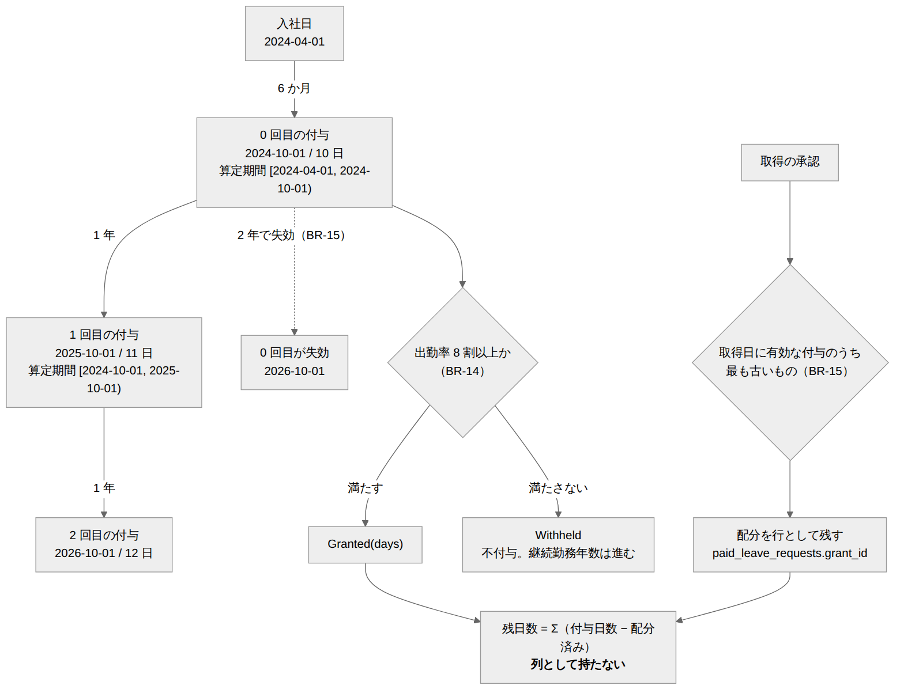
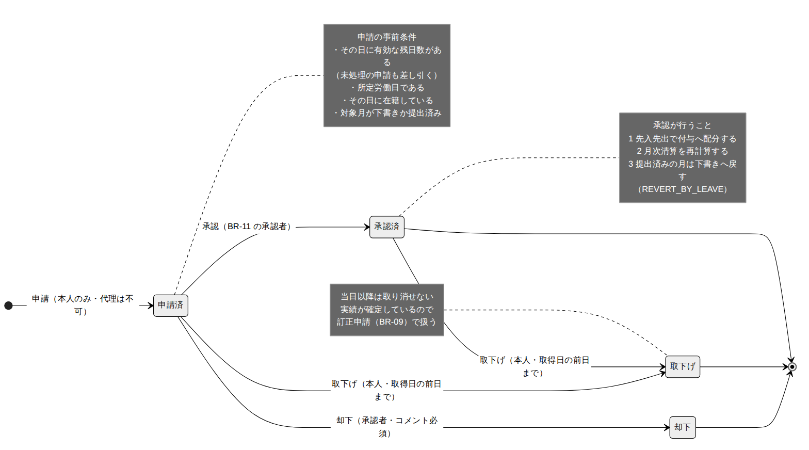

# 年次有給休暇 ドメインモデル設計書

| 項目 | 内容 |
| --- | --- |
| 文書番号 | KNT-DES-601 |
| 版 | 0.1 |
| 対象パッケージ | `jp.co.sample.kintai.leave` |
| 関連要件 | BR-14 / BR-15 / BR-16 / BR-17（BR-05 / BR-11 に接続） |
| 関連文書 | [社員・組織](../01_社員・組織/ドメインモデル設計書.md) / [就業規則](../02_就業規則・カレンダー/ドメインモデル設計書.md) / [月次清算](../04_勤怠_月次清算/ドメインモデル設計書.md) / [申請承認](../05_申請承認と締め/ドメインモデル設計書.md) / [DB設計書](DB設計書.md) / [API設計書](API設計書.md) / [設計規約チェックリスト](../00_共通/設計規約チェックリスト.md) |

---

## 1. このコンテキストの責務

**年次有給休暇の「持っている日数」と「使った日」を管理する。**

| 責務 | 対応要件 |
| --- | --- |
| 入社日を基準とした付与と、出勤率 8 割の判定 | BR-14 |
| 時効（付与日から 2 年）と、先入先出による消化 | BR-15 |
| 取得の申請・承認・取下げ | BR-16 |
| 年 5 日の取得義務の可視化 | BR-17 |

労働時間の計算は行わない。**年休を取得した日を `attendance` へ伝えるところまで**を担う。

### 1.1 使用する型の一覧

| 型 | 定義場所 | 内容 |
| --- | --- | --- |
| `PaidLeaveGrant` | 本コンテキスト | 1 回の付与。判定の根拠を含む（2.3） |
| `PaidLeaveGrantId` | 本コンテキスト | 付与の識別子（UUID） |
| `GrantDecision` | 本コンテキスト | `sealed interface`。`Granted` / `Withheld`（2.3） |
| `LeaveEntitlement` | 本コンテキスト | `enum`。継続勤務年数と付与日数の対応（2.1） |
| `GrantSchedule` | 本コンテキスト | 入社日から付与日・算定期間を導く（2.2） |
| `AttendanceRate` | 本コンテキスト | 出勤率。全労働日と出勤日を持つ（2.4） |
| `PaidLeaveRequest` | 本コンテキスト | 取得の申請。集約（4.1） |
| `PaidLeaveRequestId` | 本コンテキスト | 申請の識別子（UUID） |
| `LeaveRequestStatus` | 本コンテキスト | `enum`。`SUBMITTED` / `APPROVED` / `REJECTED` / `CANCELED` |
| `LeaveRequestEvent` / `LeaveRequestEventKind` | 本コンテキスト | 状態遷移の証跡（4.4） |
| `PaidLeaveBalance` | 本コンテキスト | 残日数と先入先出の配分（3 章） |
| `LeaveAllocation` | 本コンテキスト | どの付与から 1 日を消化したか（3.2） |
| `AnnualObligation` | 本コンテキスト | 年 5 日の取得義務の充足状況（5 章） |
| `Employee` | `employee.domain` | 入社日・退職日・在籍判定 |
| `CompanyCalendar` | `workrule.domain` | 暦日区分。**全労働日を数えるのに使う** |
| `DailyAttendance` | `attendance.domain` | 出勤日を数えるのに使う |
| `ApproverPolicy` / `Approver` | `approval.domain` | BR-11 の承認者（4.2） |
| `MonthClosureQuery` | `shared.domain` | 締め判定のポート。実装は `approval` |
| `PaidLeaveDays` | `shared.domain` | **本コンテキストが実装するポート**（6 章） |
| `EmployeeVisibility` | `shared.domain`（実装は `employee`） | 閲覧範囲の判定（2.1・API設計書 2.2） |
| `EmployeeId` / `DateRange` / `Requester` | `shared.domain` | 共有語彙 |

### 1.2 他コンテキストへの依存


追加される辺は `leave → employee` / `leave → workrule` / `leave → attendance` /
`leave → approval` の 4 本である。**入る辺は無い。**

| 依存 | 何のために |
| --- | --- |
| `leave → employee` | 入社日（付与日の起点）、在籍期間（全労働日の絞り込み）、閲覧範囲 |
| `leave → workrule` | 会社カレンダー。所定労働日を数える |
| `leave → attendance` | 日次勤怠。出勤日を数える。承認による月次清算の再計算 |
| `leave → approval` | `ApproverPolicy`（BR-11）、承認による月次勤怠の差戻し |

逆向き（`attendance` が「この日は年休か」を知りたい）は
**ポートを `shared.domain` に置く**（6 章）。`MonthClosureQuery` と同じ形である。

> **`approval → leave` の辺は作らない。**
> 「未処理の年休申請が残っている月を締められなくする」という案を検討したが、
> 承認者が不在の間その月が永久に締められなくなる（[CLAUDE.md 落とし穴 26](../../../CLAUDE.md)）。
> 締めは月次勤怠の状態だけで決まる（BR-10）。
> 締め済みの月に対する年休の承認は、**`leave` の側が `MonthClosureQuery` で拒否する。**

---

## 2. 付与（BR-14）



<sub>図のソース: [`diagrams/付与と消化.mmd`](diagrams/付与と消化.mmd)</sub>

### 2.1 日数の表は enum にする

継続勤務年数と付与日数の対応は**労基法 39 条が固定している。**
[CLAUDE.md 4.3](../../../CLAUDE.md) のとおり、取りうる値が法で固定された概念は `enum` にする。

```java
public enum LeaveEntitlement {

    MONTHS_6(6, 10),
    YEARS_1_6(18, 11),
    YEARS_2_6(30, 12),
    YEARS_3_6(42, 14),
    YEARS_4_6(54, 16),
    YEARS_5_6(66, 18),
    /** 6 年 6 か月以降は 20 日で頭打ち（39 条 2 項の表の末行）。 */
    YEARS_6_6(78, 20);

    private final int monthsOfService;
    private final int days;

    /** 何回目の付与か（0 起点）から引く。7 回目以降はすべて 20 日。 */
    public static LeaveEntitlement of(int grantIndex) {
        if (grantIndex < 0) {
            throw new IllegalArgumentException("付与の連番が負です: " + grantIndex);
        }
        LeaveEntitlement[] all = values();
        return all[Math.min(grantIndex, all.length - 1)];
    }
}
```

**`record` + 実行時検証にしない。** 付与日数を引数で受け取れる形にすると、
型の上では 3 日でも 100 日でも渡せる。法定の表そのものを型にする。

### 2.2 付与日と算定期間は入社日から導く

```java
public record GrantSchedule(LocalDate hiredOn) {

    /** grantIndex 回目の付与日。0 回目は入社から 6 か月後、以後 1 年ごと。 */
    public LocalDate grantDateOf(int grantIndex) {
        return hiredOn.plusMonths(6).plusYears(grantIndex);
    }

    /**
     * 出勤率の算定期間。<strong>半開区間</strong>。
     *
     * <p>0 回目は入社日から最初の付与日まで（6 か月）、
     * 1 回目以降は前回の付与日から今回の付与日まで（1 年）。
     */
    public DateRange assessmentPeriodOf(int grantIndex) {
        LocalDate from = grantIndex == 0 ? hiredOn : grantDateOf(grantIndex - 1);
        return DateRange.of(from, grantDateOf(grantIndex));
    }

    /** 基準日までに到来した付与の連番（0 起点）を古い順に返す。 */
    public IntStream indexesDueOn(LocalDate asOf) { ... }
}
```

**付与日は「経過した日」である。** 入社日 2026-04-01 の 6 か月後は 2026-10-01。
`plusMonths(6)` が返すのはこの日であり、算定期間は `[2026-04-01, 2026-10-01)` の
**半開区間** になる（[設計規約チェックリスト 2](../00_共通/設計規約チェックリスト.md)）。

**月末入社は `plusMonths` の丸めに従う。** 1/31 入社の 6 か月後は 7/31、
8/31 入社の 6 か月後は翌年 2/28（うるう年は 2/29）である。
`java.time` の規則をそのまま採り、独自の丸めを持ち込まない。

> **応当日の無い月末入社では、法定より 1 日早く付与される。**
> 民法 143 条 2 項により、8/31 から 6 か月の期間は応当日が無いので
> **その月の末日（2/28 または 2/29）に満了**し、法定の付与日はその**翌日**（3/1）になる。
> `plusMonths(6)` が返すのは満了日そのものなので 1 日早い。
> **労働者に有利な前倒しなので、これを採る。**
> 時効（付与日 + 2 年）と年 5 日の期間（付与日 + 1 年）も 1 日早く始まり、1 日早く終わる。

### 2.3 付与するかどうかを sealed interface で表す

**「不付与なのに日数がある」を型で作れなくする。**

```java
public sealed interface GrantDecision permits Granted, Withheld {

    record Granted(int days) implements GrantDecision {
        public Granted {
            // 法定の表にある日数しか存在しない
            if (days < 10 || days > 20) {
                throw new IllegalArgumentException("付与日数が法定の範囲外です: " + days);
            }
        }
    }

    /** 出勤率が 8 割に満たなかった年（BR-14）。 */
    record Withheld() implements GrantDecision { }
}
```

```java
public record PaidLeaveGrant(PaidLeaveGrantId id, EmployeeId employeeId,
                             int grantIndex, LocalDate grantedOn,
                             AttendanceRate rate, GrantDecision decision,
                             LocalDateTime assessedAt) {

    /** 有効期間。付与日から 2 年（BR-15・労基法 115 条）。<strong>半開区間</strong>。 */
    public DateRange validPeriod() {
        return DateRange.of(grantedOn, grantedOn.plusYears(2));
    }

    public int days() {
        return switch (decision) {
            case Granted granted -> granted.days();
            case Withheld ignored -> 0;
        };
    }
}
```

**不付与の年も行として残す。** 残さないと次の 2 つが区別できない。

| 状態 | 意味 |
| --- | --- |
| 行が無い | まだ付与日が到来していない、または付与処理を実行していない |
| `Withheld` の行がある | 付与日は到来したが、出勤率 8 割に満たなかった |

区別できないと、**付与処理を実行し忘れたのか、法どおり不付与にしたのかが分からない。**

### 2.4 出勤率（BR-14）

```java
/**
 * @param totalWorkingDays    全労働日
 * @param attendedDays        実績から数えた出勤日
 * @param deemedAttendedDays  人事が申告した出勤扱いの日数（休業・BR-14）
 * @param deemedReason        その根拠。日数が 1 以上なら必須
 */
public record AttendanceRate(int totalWorkingDays, int attendedDays,
                             int deemedAttendedDays, String deemedReason) {

    public AttendanceRate {
        if (totalWorkingDays < 0 || attendedDays < 0 || deemedAttendedDays < 0) { ... }
        if (attendedDays + deemedAttendedDays > totalWorkingDays) {
            throw new IllegalArgumentException(
                    "出勤日が全労働日を超えています: %d + %d / %d"
                            .formatted(attendedDays, deemedAttendedDays, totalWorkingDays));
        }
        if (deemedAttendedDays > 0 && (deemedReason == null || deemedReason.isBlank())) {
            throw new IllegalArgumentException("出勤扱いの日数には根拠が必要です");
        }
    }

    /** 出勤扱いを含めた出勤日（BR-14・39 条 10 項）。 */
    public int effectiveAttendedDays() { return attendedDays + deemedAttendedDays; }

    /** 8 割以上か。<strong>整数のまま比較する。</strong> */
    public boolean meetsThreshold() {
        // 全労働日が 0 の期間は「8 割を満たさなかった」とは言えない。
        // 満たしたものとして扱い、社員に不利な方向へ倒れないようにする。
        // ★ ただしこれは「付与日に在籍している社員」にしか当てない（2.5）
        return totalWorkingDays == 0
                || effectiveAttendedDays() * 10 >= totalWorkingDays * 8;
    }
}
```

**割り算で書かない。** `attendedDays / totalWorkingDays >= 0.8` は
Java では**整数除算**になり、120/150 が `0` になって全員が不付与になる。
`(double) attendedDays / totalWorkingDays >= 0.8` と書けばこの誤りは消えるが、
今度は `0.8` という閾値がコードの側に現れる。
**法が定めているのは「5 分の 4」であって浮動小数点数ではない。**
掛け算で書けば、丸めの規約をどこにも持たずに済む。

#### 数え方

| 区分 | 全労働日 | 出勤日 | 判定に使うもの |
| --- | --- | --- | --- |
| 所定労働日に労働時間があった | ○ | ○ | `DailyAttendance.workingTime() > 0` |
| 所定労働日に労働時間が無い（欠勤） | ○ | × | 日次勤怠が無い、または実労働 0 |
| 年次有給休暇を取得した | ○ | ○ | 承認済みの `PaidLeaveRequest` |
| 所定休日・法定休日 | × | × | `CompanyCalendar.dayTypeOf()` |
| **在籍していない日** | **×** | × | `Employee.isActiveOn()` |

**在籍期間で絞る。** ただし 2.5 で付与の対象を
「付与日に在籍している社員」に限ったので、**通常の経路では切り詰めが起きない。**
付与日に在籍しているなら、算定期間 `[前回付与日, 付与日)` の全日が在籍期間に入る。

絞り込みを残すのは、`grantAsOf` を経由しない経路のための保険である。

| 経路 | 切り詰めが起きるか |
| --- | --- |
| `grantAsOf`（日次バッチ・人事の実行） | **起きない**（付与日に在籍している社員だけが対象） |
| `reassess`（不付与の再判定） | **起きうる。** 付与のあとに退職しても、過去の付与は再判定できる |
| 過去データの取り込み | 起きうる |

絞らないと在籍していない日の所定労働日が全労働日に入り、出勤率が不当に下がる
（[CLAUDE.md 落とし穴 70](../../../CLAUDE.md) と同型）。

#### 休業は「出勤扱いの日数」として人事が申告する（BR-14）

BR-14 は労災休業・産前産後休業・育児介護休業を**出勤扱い**と定めている（39 条 10 項）。
ところが**本システムには休業を登録する機能が無い**（要件 8 章のスコープ外）。
そのままでは該当日が欠勤に数えられ、
**産休・育休を取った社員はその年の出勤率がほぼ 0% になって必ず不付与になる。**

要件 1.1 で、人事が **`deemedAttendedDays`（出勤扱いの日数）** を申告できることとした。

`AttendanceRate` の `deemedAttendedDays` と `deemedReason` がこれを担う（上記）。

| 決定 | 理由 |
| --- | --- |
| 申告するのは**日数と理由**であって、日付ではない | 休業日を日付で持たせると、休業を登録する機能を要件の外で作ることになる |
| 申告した日数と理由を**付与の行に残す** | 「なぜこの社員だけ 8 割を満たしたのか」を後から説明できるようにする |
| `deemedAttendedDays + attendedDays <= totalWorkingDays` を不変条件にする | 全労働日を超える出勤扱いは作れない |
| **打刻を足して実績を整える運用は採らない** | 働いていない日の労働時間が一次証拠として残り、日次勤怠と月次清算を通って割増賃金の計算に入る（BR-09 の前提が壊れる） |

休業を登録する機能を入れる（M3）までの措置である。

### 2.5 付与はいつ計算するか

**行として実体化する。参照時に導出しない。**

| 案 | 採否 | 理由 |
| --- | --- | --- |
| 参照時に入社日と実績から毎回導出する | **却下** | 実績が訂正されると**過去の付与日数が黙って変わる。** 消化済みの日数を上回る日数が消えることもありうる |
| 行として実体化する | **採用** | 消化が付与を指す（先入先出）ので識別子が要る。判定の根拠を残せる |

実体化の契機は **`PaidLeaveGrantService.grantAsOf(LocalDate)` の 1 本だけ**とする。

```java
// 基準日までに到来した未処理の付与を、社員ごとに古い順で作る
public GrantResult grantAsOf(LocalDate asOf);
```

| 決定 | 理由 |
| --- | --- |
| **対象は付与日に在籍している社員だけ**（`Employee.isActiveOn(grantDate)`） | 退職者を除かないと、退職後も毎年付与が積み上がる。しかも退職者の算定期間は在籍期間で絞ると**全労働日 0** になり、2.4 の「0 なら満たしたものとして扱う」により**必ず 20 日が付与される**。未来日入社の社員は付与日が到来しないので自然に外れる |
| **冪等にする**（`(employee_id, grant_index)` が一意） | 同じ日に 2 回実行しても二重に付与しない |
| **到来済みで未処理のものをすべて作る**（当日ぶんだけではない） | 実行し損ねた日があっても次の実行で追いつく。実行者が不在になる経路を塞ぐ（落とし穴 26） |
| **古い順に作る** | 1 回目の判定に 0 回目の年休取得日が要る（年休は出勤扱い） |
| 参照（`GET`）では付与しない | `GET` に副作用を持たせると、承認者が残日数を見ただけで行が作られる。作った人も理由も残らない |

呼び出し元は 2 つある。**どちらも同じメソッドを呼ぶ**（手順を 2 か所に書かない・落とし穴 67）。

| 呼び出し元 | 契機 |
| --- | --- |
| `@Scheduled` の日次バッチ | 毎日 1 回、その日を基準日として実行する |
| `POST /api/paid-leave-grants` | 人事が基準日を指定して実行する（バッチが動かなかった日の回復） |

#### 再判定（`reassessment`）

付与日の時点では、算定期間の実績がまだ訂正されうる。
訂正申請（BR-09）で欠勤が出勤に直れば、**8 割を満たすようになることがある。**

```java
/**
 * 不付与だった付与を判定し直す。
 *
 * @param deemedAttendedDays 出勤扱いの日数（休業・BR-14）。0 なら実績だけで判定する
 * @param deemedReason       その根拠。日数が 1 以上なら必須
 */
public PaidLeaveGrant reassess(Requester requester, EmployeeId employeeId,
                               LocalDate grantedOn,
                               int deemedAttendedDays, String deemedReason);
```

再判定は 2 つのことを一度に行う。

1. **実績を読み直す。** 訂正申請（BR-09）で欠勤が出勤に直っていれば出勤率が上がる
2. **出勤扱いの日数を反映する**（2.4）。休業を記録する機能が無い間の措置

| 決定 | 理由 |
| --- | --- |
| **`Withheld` の付与だけを対象にする** | 付与済みを再判定する意味が無い |
| **付与を取り消さない**（`Granted` → `Withheld` の経路を設けない） | 一度発生した年休の権利を実績の訂正で消すのは労働者に不利であり、消化済みなら辻褄も合わなくなる |
| 実行できるのは `HR` | 付与は会社の行為であり、本人・上長の操作ではない |
| **打刻を足して実績を整えさせない** | 働いていない日の労働時間が一次証拠として残る（2.4） |

---

## 3. 残日数と先入先出（BR-15）

### 3.1 残日数を列で持たない

**残日数は付与と消化から導く。** 列として持つと、
付与・取得・取下げ・時効の 4 か所すべてで更新することになり、
どこか 1 か所を落とした時点で静かにずれる（[CLAUDE.md 落とし穴 39](../../../CLAUDE.md)）。

```
残日数(asOf) = Σ  ( 付与日数 − その付与に配分済みの日数 )
              有効な付与
```
有効な付与 = `Granted` かつ `validPeriod().contains(asOf)`。

**時効も行にしない。** 失効は「付与日 + 2 年」という日付だけで決まる純粋な関数であり、
バッチで行を作る必要が無い。作ると、実行し忘れた日に残日数が過大になる。

この判断の経緯は [ADR 0006](../../05_ADR/0006_残数は導出し配分だけを行として残す.md) に残した。

#### 失効の判定を SQL に写さない

有効期間の判定は **`PaidLeaveGrant.validPeriod()` の 1 か所だけ**に置く。
SQL は候補を**必ず広めに**絞るところまでにとどめる
（[DB設計書 4.1](DB設計書.md)）。

`granted_on + 2 年 > asOf` を移項して `granted_on > asOf - 2 年` と書くと、
**日付演算のクランプがあるため等価にならない。**

| 付与日 | ドメイン（`plusYears(2)`） | SQL（`asOf - interval '2 years'`） |
| --- | --- | --- |
| 2024-02-29 | 有効期間は `[2024-02-29, 2026-02-28)`。**2026-02-28 は失効** | `2026-02-28 - 2 年 = 2024-02-28` なので **2026-02-28 も有効** |

うるう年に付与された年休は、この 1 日だけ
**残日数には出るのに申請すると拒否される**（API設計書 2.1 が避けたはずの状態）。
時点解決を SQL に写さない、という確定事項（レビュー第 3 回）はここにも当てはまる。

### 3.2 配分は行として残す

消化のほうは逆に **行として残す。**

```java
/** どの付与から 1 日を消化したか。 */
public record LeaveAllocation(PaidLeaveGrantId grantId, LocalDate leaveDate) { }
```

配分を都度導出すると、**2.5 の再判定で過去に付与が増えた瞬間、
すでに承認済みの取得日の配分先が入れ替わる。**
どの付与がいつ失効したかも変わるので、過去の残日数の説明がつかなくなる。

配分は `PaidLeaveRequest` が承認された時点で確定し、以後動かない。

### 3.3 先入先出

```java
public record PaidLeaveBalance(List<PaidLeaveGrant> grants, List<LeaveAllocation> allocated) {

    /**
     * その日を消化できる付与を選ぶ。無ければ空。
     *
     * <p><strong>取得日の時点で有効な付与のうち、最も古いもの。</strong>
     * 古い順にしないと、失効間近の付与が残って労働者に不利になる（BR-15）。
     */
    public Optional<PaidLeaveGrantId> allocationFor(LocalDate leaveDate) { ... }
}
```

**「最も古い」を付与日で決める。** 失効日（付与日 + 2 年）で決めても
同じ順序になるが、付与日のほうが行に存在する値であり、
2 つの規則を持たない（[CLAUDE.md 落とし穴 77](../../../CLAUDE.md)）。

#### 未到来の付与を、申請の判定にだけ仮に組み入れる

付与の行は到来したぶんしか作られない（2.5）。
そのままだと、**次の付与日の直後の日程を、付与日が来るまで誰も申請できない。**
今日が 9/20・次の付与日が 10/01 の社員は、10/15 の年休を申請できない。
年休の時季指定は労働者の権利（39 条 5 項）なので、
システムの都合でその行使を妨げてはならない。

| 場面 | 扱い |
| --- | --- |
| **申請の判定** | `GrantSchedule` から**到来予定の付与を仮に組み入れる**。出勤率は未判定なので、満たすものとして数える |
| **`availableDays` の表示** | 同上。**判定と同じ式でなければならない**（3.4） |
| `remainingDays` の表示 | **実体化した付与だけ。** 基準日に実際に保有している日数である |
| **承認（配分の確定）** | **実体化した付与だけを配分先にする。** 未実体化なら `grant-not-yet-issued`（409）で拒否し、付与日を案内する |

配分は「承認という行為の時点で下された決定」である（ADR 0006）ので、
まだ存在しない付与へ配分してはならない。
仮に組み入れた付与が 8 割未達で `Withheld` になった場合は、
承認時の残日数の再検査（4.2）が `insufficient-paid-leave` を返す。

### 3.4 未処理の申請を残日数から差し引く

BR-16 は「残日数の不足は申請の時点で拒否する」と定める。
**承認済みだけを引くと、同じ 1 日を 2 件の申請が同時に通る。**

| 名前 | 定義 | 使う場面 |
| --- | --- | --- |
| `remainingDays` | 基準日に有効な付与の残の合計（承認済みの配分を引いたもの） | 残日数の表示 |
| `availableDays` | **未処理の申請を仮に配分したあと、なお残っている日数** | 「あと何日申請できるか」の表示 |

**どちらも仮配分で求める。件数の引き算にしない。**
`remainingDays − 未処理の件数` と書くと、
「合計では足りているが、その日に有効な付与だけでは足りない」場合に実際と食い違う。
表示に出る `availableDays` と、申請の受理判定が**別の式**になってはならない
（[API設計書 2.1](API設計書.md) が `availableDays` を設けた理由そのものが崩れる）。

```java
/**
 * 仮配分。承認済みの配分に、与えられた取得日を古い順に足していく。
 *
 * <p>申請の受理判定は「今回の取得日を加えた仮配分が成功するか」、
 * availableDays は「未処理を仮配分したあとの残の合計」。
 * <strong>同じ 1 つの関数から導く。</strong>
 */
public PaidLeaveBalance withPending(List<LocalDate> pendingLeaveDates);
```

**「未処理の申請」には取得日が過ぎたものも含める。**
未処理のまま取得日を過ぎた申請は、本人がいつでも取り下げられる（4.2）ので、
放置されたぶんだけ申請できる日数が減るのは正しい。

**`availableDays` にも到来予定の付与を含める**（3.3）。
含めないと、次の付与日を控えた社員に `availableDays: 0` と表示しながら
その先の日程の申請は受理する、という状態になる。
**表示のほうが少なく出る**ので、社員が権利を行使しない方向へ倒れる。
`remainingDays` は基準日時点の実体で、`availableDays` は
「これから申請できるか」を答える値なので、見ている時点が違う。

---

## 4. 取得の申請（BR-16）



<sub>図のソース: [`diagrams/申請の状態遷移.mmd`](diagrams/申請の状態遷移.mmd)</sub>

### 4.1 1 申請 = 1 日

```java
public record PaidLeaveRequest(PaidLeaveRequestId id, EmployeeId employeeId,
                               LocalDate leaveDate, String reason,
                               LeaveRequestStatus status,
                               LocalDateTime requestedAt,
                               Optional<PaidLeaveGrantId> grantId,
                               Optional<EmployeeId> decidedBy,
                               Optional<LocalDateTime> decidedAt,
                               Optional<String> comment,
                               Optional<EmployeeId> canceledBy,
                               Optional<LocalDateTime> canceledAt,
                               long version) { ... }
```

**連続した休暇を 1 件にまとめない。** BR-16 は 1 日単位のみと定めており、
まとめると「3 日のうち 1 日だけ取り消す」「1 日だけ却下する」の扱いが要る。
1 申請 1 日なら、**その状態が型として存在しない。**

**`canceledBy` を `decidedBy` と分けて持つ。** 承認済みの申請を取り消しても
**誰がいつ承認したのかを残す**ためであり、
本人の取下げ（`CANCEL`）と人事の取消（`REVOKE`）を集約が区別できるようにするためでもある。

`reason` は任意である。時季指定は労働者の権利であり（39 条 5 項）、
**理由を必須にすると「理由が不十分だから却下する」という運用を招く。**
訂正申請（BR-09）の理由が必須なのは、一次証拠を書き換える根拠が要るからで、性質が違う。

### 4.2 状態遷移

| 遷移 | 実行者 | 事前条件 | 証跡 |
| --- | --- | --- | --- |
| （新規） → `SUBMITTED` | **本人のみ** | 残日数が足りる / 対象月が訂正を受け付ける / 同じ日に有効な申請が無い | `SUBMIT` |
| `SUBMITTED` → `APPROVED` | BR-11 の承認者 | **対象月が承認済み・締め済みでない** / 残日数が足りる / **取得日に実労働が無い** | `APPROVE` |
| `SUBMITTED` → `REJECTED` | BR-11 の承認者 | コメント必須 | `REJECT` |
| `SUBMITTED` → `CANCELED` | **本人のみ** | **いつでも。対象月の状態も問わない** | `CANCEL` |
| `APPROVED` → `CANCELED` | **本人のみ** | 取得日の**前日まで** / 対象月が承認済み・締め済みでない | `CANCEL` |
| `APPROVED` → `CANCELED` | **`HR` のみ** | 取得日の**当日以降** / 対象月が承認済み・締め済みでない / **理由必須** | `REVOKE` |

**代理申請を認めない。** 時季指定は本人の意思表示であり、人事でも代わりには出せない。
訂正申請と同じ判断である（[申請承認 API設計書 3.1](../05_申請承認と締め/API設計書.md)）。

**承認者は `leaveDate` が属する月の BR-11 の承認者である。**
月次勤怠・訂正申請と承認者を揃える。揃えないと
「勤怠は承認できるが年休は承認できない」上長が生まれる（BR-16）。

#### 自己承認の禁止は集約が先に検査する

`ApproverPolicy` は BR-11 の手順 4 で**本人を承認者から外す**ので、
本人が承認しようとすれば `not-approver`（403）が先に返り、
**自己承認の検査は一度も働かない。**
禁止を消してもテストが 1 件も落ちない状態になる（[CLAUDE.md 落とし穴 58](../../../CLAUDE.md)）。

`PaidLeaveRequest.approve` が**承認者の判定より先に**自己承認を弾く。
単体テストは[集約に直接あてる](#76-型として存在しないので書けないもの)。

#### すでに働いた日の年休を承認しない

申請中の取下げに期限を設けない結果、**未決裁のまま取得日を過ぎた申請が正当に残る。**
そのまま承認できると、承認者は**すでに働いた日**の年休を後から通せてしまう。

その日は所定総から除かれる（6.2）のに実労働もあるので、
**不足時間が 8 時間ぶん過少に出る**（欠勤控除の取りこぼし）一方で、
社員は年休を 1 日失う。どちらの向きにも実態と合わない。

承認の事前条件に「取得日に実労働（`workingTime > 0`）の日次勤怠が無いこと」を置く。
違反したら `leave-date-already-worked`（409）で拒否し、承認者に取り下げを促す。

#### 申請中の取消に期限を設けない

BR-16 の「前日まで」は**承認済みの取消**に効く期限である。
申請中（未決裁）にも当てると、次の状態が生まれる。

> 承認者が決裁しないまま取得日が過ぎ、月末が過ぎ、人事が締める。
> このとき申請は **`APPROVED` にも `REJECTED` にも `CANCELED` にも遷移できない。**

`paid_leave_requests_active_uk` がその社員・その日を占有し続け、
`availableDays` が 1 日ぶん永久に減り、承認待ちの一覧に居座る。
**承認されていない申請は年休を消費していない**ので、いつでも取り下げてよい。

#### 取得日の当日以降は人事が取り消す

BR-16 の第 1 版は当日以降を訂正申請（BR-09）へ委ねていたが、
**訂正申請が動かせるのは打刻だけ**であり、年休の取消はできない。
予定を変えて出勤した社員は、**年休 1 日を消費したままその日も働く**ことになる。
しかも 6.2 の所定総はその日ぶん減っているので、月次清算も実態と合わない。

要件 1.1 で、人事が理由を付けて取り消せることとした（`REVOKE`）。
本人ではなく人事に限るのは、**実績が確定した日を本人が動かせてはいけない**ためである。

#### 取消の期限

BR-16 の「取得日の前日まで」は**承認済みの取消**に効く期限である。
当日以降は勤怠の実績が確定しているので、本人ではなく人事が取り消す。

```java
/** 本人が取り消せるか。基準は Clock から解決した「今日」。 */
public boolean isCancelableBySelf(LocalDate today) {
    return switch (status) {
        // 承認されていない申請は年休を消費していないので、期限を設けない
        case SUBMITTED -> true;
        case APPROVED  -> today.isBefore(leaveDate);
        case REJECTED, CANCELED -> false;
    };
}
```

`today.isBefore(leaveDate)` が「前日まで」である。
`!today.isAfter(leaveDate)` と書くと**当日まで取り消せてしまう。**

#### 承認済みの月への影響

年休を取得した日は所定総労働時間から除かれる（BR-05・6 章）。
つまり **年休の承認は月次清算を変える。**

| 対象月の状態 | 申請 | 承認 | 取下げ（申請中） | 取消（承認済み） |
| --- | --- | --- | --- | --- |
| 下書き | ○ | ○ | ○ | ○ |
| 提出済 | ○ | ○（**月次勤怠を下書きへ戻す**） | ○ | ○（同上） |
| 承認済 | × `month-not-editable` | **× `month-not-editable`** | **○** | × `month-not-editable` |
| 締め済 | × `month-already-closed` | × `month-already-closed` | **○** | × `month-already-closed` |

**申請中の取下げだけは月の状態を問わない。**
承認されていない申請は年休を消費しておらず、**残日数も月次清算も動かさない。**
拒否すると、承認者が決裁しないまま取得日と月末が過ぎ、人事が締めた申請が
**承認も却下も取下げもできない**まま残る。
却下を締め済みでも許すのと同じ理由である（[API設計書 3.3](API設計書.md)）。

**承認は「締め済みでないこと」ではなく「承認済み・締め済みでないこと」を要する。**
月次勤怠が承認済みの月で年休を承認すると、月次清算だけが変わり、
4.3 の #3（下書きへ戻す）は「提出済みなら」なので**戻らない。**
承認者が承認した内容と、締めで確定する内容が黙って食い違う。
締め済みと承認済みを別のエラーにするのは、承認を取り消せば直せるからである
（[申請承認 API設計書 3.1](../05_申請承認と締め/API設計書.md)）。

提出済みの月を承認したときに下書きへ戻すのは、
**訂正の承認とまったく同じ形**である（[申請承認 API設計書 3.2](../05_申請承認と締め/API設計書.md)）。
承認者が見た内容と確定する内容が食い違わないようにする。

差し戻しの証跡は `approval_events` に `REVERT_BY_LEAVE` として記録する。
`REVERT_BY_CORRECTION` を流用しない。**何が原因で戻ったのかが証跡から読めなくなる。**

### 4.3 承認が行う 4 つの処理

1 トランザクションで実行する。

| # | 処理 | 対象 |
| --- | --- | --- |
| 1 | 先入先出で付与へ配分し、`APPROVED` にする | `leave` |
| 2 | 月次清算を再計算する（所定総から年休の日を除く） | `attendance` |
| 3 | 提出済みなら月次勤怠を下書きへ戻す | `approval` |
| 4 | 遷移を証跡に記録する | `leave` |

**副作用（#1〜#3）を伴うのは `APPROVED` からの取消だけである。**

| 遷移 | #1 配分 | #2 月次清算 | #3 月次勤怠 | #4 証跡 |
| --- | --- | --- | --- | --- |
| `APPROVED` → `CANCELED`（取消） | 外す | 計算し直す | 提出済みなら下書きへ | 残す |
| `SUBMITTED` → `CANCELED`（取下げ） | **何もしない**（配分が無い） | **何もしない**（所定総が変わっていない） | **何もしない** | 残す |

**申請中の取下げで月次勤怠を下書きへ戻さない。**
承認されていない年休は所定総を変えていないので、戻す理由が無い。
戻すと、承認者の待ち行列からその月が消え、
しかも `REVERT_BY_LEAVE` という**嘘の証跡**が残る（何も変わっていないのに）。

承認済みの取消で再計算しないと、
取り消した年休の日が所定総から除かれたままになり、
**不足時間が 8 時間ぶん過少に出る。**

2 と 3 は `attendance` / `approval` の `application` を呼ぶ。
[アーキテクチャ設計書 3.2](../00_共通/アーキテクチャ設計書.md) が認めた
「図にある辺に沿う `application` の呼び出し」であり、
手順を写すと丸めや帰属の扱いを直したときに片方だけが古くなる（落とし穴 67）。

### 4.4 証跡

```java
public enum LeaveRequestEventKind {
    SUBMIT, APPROVE, REJECT,
    /** 本人による取下げ。 */
    CANCEL,
    /** 取得日の当日以降に人事が取り消した（BR-16）。<strong>理由が必須。</strong> */
    REVOKE
}
```

**取消も証跡に残す。** 承認済みの取消は残日数を戻すので、
「なぜこの日の残数が増えたか」を後から説明できる必要がある。

**`CANCEL` と `REVOKE` を分ける。** どちらも `APPROVED → CANCELED` だが、
前者は本人が予定を変えたもの、後者は**取得日を過ぎたあとの是正**である。
`REVERT_BY_CORRECTION` と `REVERT_BY_LEAVE` を分けるのと同じ理由で、
証跡で区別できないと「頻繁に年休を取り消す社員」という誤った読み取りが生まれる。

---

## 5. 年 5 日の取得義務（BR-17）

```java
public record AnnualObligation(PaidLeaveGrantId grantId, LocalDate grantedOn,
                               LocalDate deadlineExclusive, int takenDays) {

    /** 対象は 10 日以上を付与された社員（労基法 39 条 7 項）。 */
    public static final int REQUIRED_DAYS = 5;

    public int shortfallDays() { return Math.max(0, REQUIRED_DAYS - takenDays); }
    public boolean isFulfilled() { return shortfallDays() == 0; }
}
```

| 決定 | 理由 |
| --- | --- |
| **対象はその付与が 10 日以上のとき** | 39 条 7 項。本システムでは 0 回目の付与が必ず 10 日なので、実質すべての社員が対象になる |
| 期間は `[grantedOn, grantedOn.plusYears(1))` | **社員ごとに違う。** 暦年でも年度でもない |
| 数えるのは**その期間中に取得した年休の日数** | どの付与から消化したかは問わない（BR-17） |
| **導出のみ。行を持たない** | 取得のたびに更新する列を持つと、取下げで戻し忘れる |
| 未達でも何も止めない | BR-17。取得・提出・承認・締めのいずれの事前条件にもしない |

> **使用者による時季指定（39 条 7 項・8 項）は実装しない。**
> BR-17 のとおり、「誰があと何日必要か」を示すところまでを担う。

---

## 6. `attendance` への接続（BR-05）

### 6.1 ポートを `shared.domain` に置く

```java
// shared/domain --- 年休を取得した日を問い合わせる窓口
public interface PaidLeaveDays {

    /**
     * 承認済みの年休の取得日。
     *
     * <p>年休を持つのは {@code leave} だが、それを知りたいのは
     * 所定総労働時間を数える {@code attendance} である。
     * 素直に問い合わせると依存が循環するので、ポートを {@code shared} に置く（ADR 0004）。
     */
    Set<LocalDate> approvedOn(EmployeeId employeeId, DateRange period);
}
```

`MonthClosureQuery` と同じ形である（ADR 0004）。

### 6.2 所定総労働時間から年休の日を除く

BR-05 は「年休の日を不就労として数えない」と定める。
`MonthlySettlementCalculator` の**所定労働日数から年休の日を引く**ことで満たす。

```java
private Duration scheduledTotalOf(WorkRule workRule, SettlementPeriod period,
                                  int paidLeaveDays) {
    // ★ 年休の日は所定労働日から除く（BR-16）。
    //   除かないと、適法に休んだ社員の月次清算に所定 1 日ぶんの不足時間が立つ
    int workdays = calendar.workdayCountIn(period.period()) - paidLeaveDays;
    ...
}
```

**固定時間制とフレックスの両方が、この 1 か所で正しくなる。**

#### `paidLeaveDays` の定義

> **清算期間の中にあり、かつカレンダー上 `WORKDAY` である、承認済みの年休の日数。**

3 つの条件をすべて課す。

| 条件 | 落とすと何が起きるか |
| --- | --- |
| 清算期間（**暦月 ∩ 在籍期間**）の中 | 月中入社・月中退職の月で、在籍していない日の年休を引いてしまう |
| カレンダー上 `WORKDAY` | 年休を承認したあとにカレンダーでその日を休日に変えると（未締めなら通る）、`workdays` が実際より小さくなる。**負になると所定総が負になり、`monthly_settlements` の非負制約で挿入が落ちて 500 になる**（落とし穴 81 と同型） |
| 承認済み | 未処理・却下・取下げの申請で所定総が変わってしまう |

#### 法定労働時間の総枠は年休で減らない

`statutoryTotalLimit`（暦日数 ÷ 7 × 週 40 時間）は**暦日数だけで決まる。**
年休を取っても変わらない。減らすと、フレックスの時間外
（`対象労働時間 − 総枠`）が水増しされる（労基法 32 条の 3 に反する）。

**所定総だけを見るテストでは、総枠まで一緒に減らす変異を殺せない**
（[CLAUDE.md 落とし穴 43](../../../CLAUDE.md)）。7.5 に専用の観点を置く。

| 制度 | 不足時間の式 | 年休 1 日の効果 |
| --- | --- | --- |
| 固定時間制 | `所定総 − Σ min(実労働, その日の所定)` | 所定総が 8 時間減る。年休の日は実労働 0 なので `min` にも寄与しない |
| フレックス | `所定総 − 対象労働時間` | 所定総が 8 時間減る |

制度ごとに引き算を書き分けない。**書き分けると、片方だけを直す形の欠陥が入る**
（[CLAUDE.md 落とし穴 22・51](../../../CLAUDE.md)）。

`MonthlySettlement` は `paidLeaveDays` を項目として持つ。
**所定総がなぜその値なのかを説明するための数値**であり、
`leave` が所有する概念（申請・付与）ではないので、
API の応答に混ぜても [設計規約チェックリスト 3](../00_共通/設計規約チェックリスト.md) に反しない。

### 6.3 日次勤怠に年休の行を作らない

「年休の日」を `daily_attendances` に持たせない。

| 案 | 採否 | 理由 |
| --- | --- | --- |
| 年休の日に実労働 0 の日次勤怠を作り、区分を持たせる | **却下** | 同じ事実が `leave` と `attendance` の 2 か所に載り、取下げで片方が残る（落とし穴 64） |
| 日次勤怠には何も作らず、`leave` から引く | **採用** | 事実は 1 か所。表示は画面が 2 つの API を合成する |

#### 提出の事前条件

提出の事前条件は **「打刻があるのに日次勤怠が無い勤務日が残っていないこと」**
（[申請承認 ドメインモデル設計書 2.3](../05_申請承認と締め/ドメインモデル設計書.md)）なので、
**年休の日は自然に対象外になる。** 年休の日には打刻が無いからである。

> この設計を書いている途中で、`approval` が
> 「在籍中の所定労働日すべてに日次勤怠の行があること」を求めていることが分かった。
> 日次勤怠の行は打刻がそろった日にしか作られないので、
> **年休を 1 日でも取った月は永久に提出できない**状態だった。
> 同じ理由で**欠勤した月も提出できなかった**ので、
> 05 の事前条件そのものを直した（CLAUDE.md 落とし穴 90）。

---

## 7. テストの観点

### 7.1 付与（BR-14）

| ID | 観点 | 期待 | 参照 |
| --- | --- | --- | --- |
| UT-LV-01 | 入社から 6 か月後が 0 回目の付与日 | 2026-04-01 入社 → 2026-10-01 | BR-14 |
| UT-LV-02 | 1 回目以降は 1 年ごと | 0 回目 + 1 年 / + 2 年 | BR-14 |
| UT-LV-03 | **1/31 入社の 6 か月後は 7/31** | `plusMonths` の丸めに従う | BR-14 |
| UT-LV-04 | **8/31 入社の 6 か月後はうるう年で 2/29** | 2 月末に丸められる | BR-14 |
| UT-LV-05 | 付与日数の表（0〜6 回目） | 10/11/12/14/16/18/20 | BR-14 |
| UT-LV-06 | **7 回目以降も 20 日で頭打ち** | 20 日 | BR-14 |
| UT-LV-07 | 0 回目の算定期間は入社日から付与日まで | 半開区間 `[入社日, 付与日)` | BR-14 |
| UT-LV-08 | 1 回目の算定期間は前回付与日から今回付与日まで | 半開区間 | BR-14 |
| UT-LV-09 | 出勤率がちょうど 8 割 | **付与する**（120/150） | BR-14 |
| UT-LV-10 | 出勤率が 8 割をわずかに下回る | 不付与（119/150） | BR-14 |
| UT-LV-11 | **全労働日が 0 の算定期間**（全日が所定休日だった在籍社員） | 付与する（不利に倒れない） | BR-14 |
| UT-LV-12 | 年休を取得した日は出勤日に数える | 出勤率が下がらない | BR-14 |
| UT-LV-13 | 所定休日・法定休日は全労働日に数えない | 分母に入らない | BR-14 / BR-07 |
| UT-LV-14 | **在籍していない日は全労働日に数えない** | 付与後に退職した社員を再判定すると分母が減る（2.4 の表） | BR-14 |
| UT-LV-15 | 出勤日が全労働日を超える値 | 生成時に `IllegalArgumentException` | BR-14 |
| UT-LV-16 | **不付与でも継続勤務年数は進む** | 翌年は 1 つ先の日数で付与 | BR-14 |
| UT-LV-17 | 付与日数が法定の範囲外 | `Granted` の生成が例外 | BR-14 |
| UT-LV-18 | **不付与の年も行として残る** | `Withheld` が読み出せる | BR-14 |
| UT-LV-48 | **付与日より前に退職した社員** | 付与されない | BR-14 |
| UT-LV-49 | **付与日の前日に退職した社員** | 付与されない（付与日に在籍していない） | BR-14 |
| UT-LV-63 | **前回の付与日より前に退職した社員**（算定期間の全労働日が 0） | 付与されない。**絞り込みが無いと 20 日が付与される**（落とし穴 92） | BR-14 |
| UT-LV-50 | **出勤扱いの日数を加えると 8 割を満たす** | 付与される（産育休の救済・BR-14） | BR-14 |
| UT-LV-51 | **各項目は全労働日以下だが和が超える**（出勤 120 + 出勤扱い 40 / 全労働日 150） | 生成時に `IllegalArgumentException` | BR-14 |

### 7.2 残日数と時効（BR-15）

| ID | 観点 | 期待 | 参照 |
| --- | --- | --- | --- |
| UT-LV-19 | 付与日から 2 年で失効 | 付与日 + 2 年の当日は残数に入らない | BR-15 |
| UT-LV-20 | **失効の前日は残数に入る** | 半開区間の上限 | BR-15 |
| UT-LV-52 | **2/29 に付与された年休の失効日** | `[2024-02-29, 2026-02-28)`。2026-02-28 は失効 | BR-15 |
| UT-LV-21 | 先入先出で古い付与から消化する | 古い付与の残が先に減る | BR-15 |
| UT-LV-22 | **取得日に有効な付与だけを選ぶ** | 取得日より後に付与されたものは選ばない | BR-15 |
| UT-LV-23 | 6.5 年目（`grantIndex` 6）の保有上限 | **38 日**（20 + 前年の 18） | BR-15 |
| UT-LV-53 | **7.5 年目（`grantIndex` 7）の保有上限** | 40 日（20 + 前年 20）。BR-15 の「最大 40 日」はここで成り立つ | BR-15 |
| UT-LV-24 | 残日数は付与と配分から導く | 列を持たない | BR-15 |
| UT-LV-25 | **未処理の申請を差し引いた申請可能日数** | 残 1 日で未処理 1 件なら 0 日 | BR-16 |
| UT-LV-26 | **合計は足りるがその日に有効な付与が無い** | 申請できない | BR-15 |

### 7.3 取得の申請（BR-16）

| ID | 観点 | 期待 | 参照 |
| --- | --- | --- | --- |
| UT-LV-27 | 残日数を超える申請 | `InsufficientLeaveException`（422） | BR-16 |
| UT-LV-28 | **同じ 1 日に 2 件の未処理申請** | 2 件目を拒否 | BR-16 |
| UT-LV-29 | 取下げた日に再申請 | 通る | BR-16 |
| UT-LV-30 | **自分の申請を自分で承認** | `SelfDecisionException`（403） | BR-11 |
| UT-LV-31 | 却下にコメントが無い | 生成時に例外 | BR-16 |
| UT-LV-32 | 処理済みの申請を再び承認 | `AlreadyDecidedException`（409） | BR-16 |
| UT-LV-33 | **承認済みを取得日の前日に取り消す** | 成功 | BR-16 |
| UT-LV-34 | **承認済みを取得日の当日に本人が取り消す** | 拒否 | BR-16 |
| UT-LV-54 | **申請中は、取得日を過ぎ対象月が締め済みでも本人が取り下げられる** | 成功。どの状態にも遷移できない申請を作らない | BR-16 |
| UT-LV-64 | **申請中の取下げは月次清算も月次勤怠も動かさない** | 提出済みの月が下書きへ戻らない | BR-16 |
| UT-LV-65 | **承認済みの月では、承認済みの年休を取り消せない** | 拒否（`month-not-editable`） | BR-16 |
| UT-LV-66 | **すでに実労働がある日の年休を承認する** | 拒否（`leave-date-already-worked`） | BR-16 |
| UT-LV-67 | **未到来の付与を `availableDays` にも数える** | 申請の受理判定と同じ日数になる | BR-16 |
| UT-LV-55 | **取得日の当日以降、人事が理由を付けて取り消す** | 成功。証跡は `REVOKE` | BR-16 |
| UT-LV-56 | **人事以外が当日以降に取り消す** | 拒否 | BR-16 |
| UT-LV-57 | **人事の取消に理由が無い** | 生成時に例外 | BR-16 |
| UT-LV-58 | **未到来の付与日を仮に組み入れて申請できる** | 次の付与日以降の取得日でも申請できる | BR-16 |
| UT-LV-59 | **付与が実体化していない日を承認する** | 拒否（`grant-not-yet-issued`） | BR-15 |
| UT-LV-35 | 承認済みを取り消すと残数が戻る | 配分が外れる | BR-16 |
| UT-LV-36 | 他人の申請を取り下げる | `NotTheRequesterException`（403） | BR-16 |
| UT-LV-37 | 承認で先入先出の配分が確定する | `grantId` が入る | BR-15 |

### 7.4 年 5 日の取得義務（BR-17）

| ID | 観点 | 期待 | 参照 |
| --- | --- | --- | --- |
| UT-LV-38 | 5 日取得済み | 不足 0・充足 | BR-17 |
| UT-LV-39 | 3 日取得 | 不足 2 | BR-17 |
| UT-LV-40 | **期間は付与日から 1 年**（暦年ではない） | 付与日 + 1 年の当日は数えない | BR-17 |
| UT-LV-41 | **どの付与から消化したかは問わない** | 前年の繰越を使った日も数える | BR-17 |
| UT-LV-43 | **未達でも申請・承認を止めない** | 例外にならない | BR-17 |

### 7.5 月次清算への接続（BR-05）

| ID | 観点 | 期待 | 参照 |
| --- | --- | --- | --- |
| UT-LV-44 | **固定時間制で年休 1 日の不足時間が立たない** | 不足 0 | BR-05 / BR-16 |
| UT-LV-45 | **フレックスで年休 1 日ぶん所定総が減る** | 所定総 −8 時間 | BR-05 / BR-16 |
| UT-LV-60 | **フレックスで年休を取っても法定総枠は変わらない** | 時間外がちょうど発生する労働時間で、年休の有無によらず同じ時間外 | BR-05 |
| UT-LV-61 | **年休の日をカレンダーで休日に変えても所定総が負にならない** | `WORKDAY` の日だけを数える | BR-05 / BR-07 |
| UT-LV-62 | **在籍期間の外にある年休の日は所定総から引かない** | 月中入社の初月で成立する | BR-05 |
| UT-LV-47 | **欠勤 1 日は不足時間が立つ**（年休との対比） | 不足 8 時間 | BR-05 |

### 7.6 型として存在しないので書けないもの

| 観点 | 理由 |
| --- | --- |
| 不付与なのに日数を持つ付与 | `GrantDecision` が `sealed`。`Withheld` に日数の項目が無い |
| 承認済みなのに配分先が無い申請 | `APPROVED` への遷移が `grantId` を必須引数に取る |
| **10 日未満の付与に年 5 日の義務が生じないこと** | `Granted` の compact constructor と `paid_leave_grants_days_check` が 10 未満を弾くので、**10 日未満の付与を作れない。** 比例付与を対象外にした結果（BR-14）であり、扱うなら要件から改訂する |
| 自己承認の禁止（アプリケーション層を通した場合） | `ApproverPolicy` が本人を承認者から外すので `not-approver` が先に返る。**集約に直接あてる**（4.2・落とし穴 58） |

#### 廃止した ID

| ID | 理由 |
| --- | --- |
| UT-LV-42 | 7.6 へ移した（10 日未満の付与は型として作れない） |
| UT-LV-46 | UT-LV-45 と同じことを 2 行で言っていた |

**欠番を黙って空けない。** 拾えなかったのか廃止したのかを区別できなくなる
（[CLAUDE.md 落とし穴 45・62](../../../CLAUDE.md)）。

**ただし「書けない」と書いた観点こそ実装を確かめる**
（[CLAUDE.md 落とし穴 61](../../../CLAUDE.md)）。
DB 側では列で表現するため、[DB設計書 6 章](DB設計書.md) の
`decision_check` / `state_check` に破れた値を投入して確かめる。

---

## 8. 未決事項

| # | 内容 | 判断の時期 |
| --- | --- | --- |
| 1 | **休業（労災・産前産後・育児介護）の記録機能。** 当面は人事が「出勤扱いの日数」を申告する（2.4・要件 1.1）が、日数だけなので**どの日が休業だったかは残らない** | M3 |
| 2 | 付与の再判定を証跡として残すか（現状は `assessed_at` と `version` の更新のみ） | M2 の実装時 |
| 3 | 半日単位・時間単位の年休（39 条 4 項）。労使協定を要するため現状は対象外 | 対象外 |
| 4 | **年休の日に打刻があった場合の扱い。** 人事の取消（4.2）で是正できるが、**気づく手段が無い。** 月次清算の警告として出すのが素直だが、警告の枠組みを増やすことになる | M2 の実装時 |
| 5 | 退職時に未消化の年休をどう扱うか（買上げは法定外。要件に無い） | 要件の改訂が要る |
