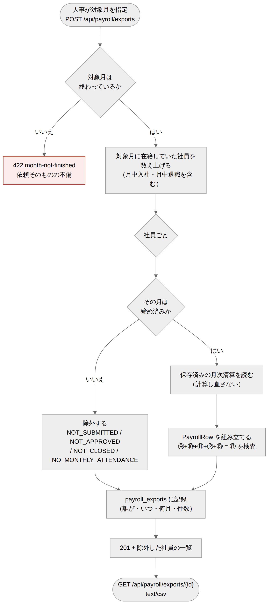

# 給与連携 API設計書

| 項目 | 内容 |
| --- | --- |
| 文書番号 | KNT-DES-703 |
| 版 | 0.1 |
| 対象パッケージ | `jp.co.sample.kintai.payroll.presentation` |
| 関連要件 | BR-18 |
| 関連文書 | [ドメインモデル設計書](ドメインモデル設計書.md) / [DB設計書](DB設計書.md) / [設計規約チェックリスト](../00_共通/設計規約チェックリスト.md) |

共通仕様は [社員・組織 API設計書 1 章](../01_社員・組織/API設計書.md#1-共通仕様) に従う。

---

## 1. エンドポイント一覧

| メソッド | パス | 概要 | 必要ロール |
| --- | --- | --- | --- |
| `POST` | `/api/payroll/exports` | 給与連携データを作り、記録を残す | `HR` |
| `GET` | `/api/payroll/exports/{id}` | 作った内容を CSV で受け取る | `HR` |
| `GET` | `/api/payroll/exports` | 出力の記録を照会する（監査） | `HR` |
| `GET` | `/api/payroll/scheduled-hours/{fiscalYear}` | 年間の所定と 1 か月平均所定労働時間数 | `HR` |

**すべて `HR` に限る。**
全社員の賃金の基礎になるデータであり、閲覧範囲を持つ一般社員・上長には開かない。
[06 API設計書 1](../06_年次有給休暇/API設計書.md) が「一覧を返す API をロールで一律に拒まない」と
書いているのは、**閲覧範囲で絞れば本人のぶんだけが返る**からである。
ここは本人のぶんを返す API ではないので、その理由が当てはまらない。

### 1.1 なぜ 2 段階に分けるか

CSV の本文と「除外した社員の一覧」を**同じ応答に載せられない。**
`text/csv` の本文に JSON を混ぜることはできず、JSON に CSV を文字列として埋めると
100 行ぶんが 1 つの値になって、取込側がまず文字列を剥がすことになる。

| 段階 | 何をするか |
| --- | --- |
| `POST /api/payroll/exports` | 対象を数え上げ、**記録を残し**、除外した社員を返す |
| `GET /api/payroll/exports/{id}` | 同じ月の内容を CSV で返す |

**記録は `POST` の時点で残す。** `GET` を待つと、
作ったのに取得しなかった実行が記録されない。

---

## 2. `POST /api/payroll/exports`



<sub>図のソース: [`diagrams/出力の流れ.mmd`](diagrams/出力の流れ.mmd)</sub>


```json
{ "month": "2026-05" }
```

```json
{
  "exportId": "0195c000-0000-7000-8000-000000000010",
  "month": "2026-05",
  "exportedAt": "2026-06-10T09:12:44",
  "rowCount": 97,
  "excluded": [
    { "employeeNumber": "E0042", "reason": "NOT_APPROVED" },
    { "employeeNumber": "E0088", "reason": "NO_MONTHLY_ATTENDANCE" }
  ]
}
```

| 応答 | 条件 |
| --- | --- |
| `201 Created` | 記録を作った。`Location` に `GET` の URL |
| `403 forbidden` | `HR` ロールが無い |
| `422 month-not-finished` | **対象月がまだ終わっていない** |
| `422 invalid-month` | 月の形式が不正 |

### 2.1 対象月が終わっていない依頼は例外にする

**社員ごとの事情は結果へ、依頼そのものの不備は例外へ**（落とし穴 60）。

| 何が起きたか | どう返すか | 理由 |
| --- | --- | --- |
| 一部の社員が未締め | `excluded` に入れて `201` | 依頼は正当。全件を止めると 1 人の未締めで給与処理が止まる |
| **全員が未締め** | `excluded` に全員を入れて `201` | 同じ理由。`rowCount` が 0 になるだけで、依頼の不備ではない |
| 対象月がまだ終わっていない | `422` | 締められるはずがない。結果にすると、人事は**まだ出せる月だと誤解する** |

> **「全員が未締め」を例外にしない。**
> 例外にすると、締め忘れが 1 人でもいる月と、そもそも誰も締めていない月とで
> 応答の形が変わる。人事が見たいのは**どちらの場合も「誰が残っているか」**である。

### 2.2 除外の理由

| `reason` | 意味 |
| --- | --- |
| `NOT_SUBMITTED` | 下書きのまま |
| `NOT_APPROVED` | 提出済み・未承認 |
| `NOT_CLOSED` | 承認済み・未締め |
| `NO_MONTHLY_ATTENDANCE` | **月次勤怠の行が無い**（1 日も打刻が無い）|

`NO_MONTHLY_ATTENDANCE` を落とすと、1 日も打刻の無い社員が
**結果のどこにも現れない**（ドメインモデル設計書 3.2）。

`excluded` は**空でも項目ごと省かない。**
`warnings` と違い、`excluded: []` は「全員が締まっている」という積極的な意味を持つ
（[05 API設計書 2.2](../05_申請承認と締め/API設計書.md) の `warnings` とは扱いが逆である）。

---

## 3. `GET /api/payroll/exports/{id}`

`Accept: text/csv`。本文は CSV。

```
社員番号,対象月,清算期間開始,清算期間終了,労働時間制度,所定労働日数,出勤日数,年休日数,実労働,所定内,法定内残業,法定外残業60hまで,法定外残業60h超,法定休日,深夜,所定総,不足
E0001,2026-05,2026-05-01,2026-05-31,FIXED,20,20,0,9600,9600,0,0,0,0,0,9600,0
E0002,2026-05,2026-05-18,2026-05-31,FLEX,10,10,0,4800,4800,0,0,0,0,0,4800,0
```

| 決定 | 理由 |
| --- | --- |
| **文字コードは UTF-8（BOM 付き）** | 氏名を出さないので非 ASCII はヘッダ行だけだが、BOM が無いと Excel が Shift_JIS と解釈して見出しが化ける |
| **改行は CRLF** | RFC 4180。給与ソフトの取込で最も通る |
| **時間は分（整数）** | 1 分単位で丸めない（BR-01）。`H:MM` にすると受け手が再び分へ戻すことになり、そこで丸めが混入する |
| **日数は整数** | 年休は 1 日単位（BR-16）|
| **清算期間の終了日は閉区間の最終日** | CSV は人が読む。半開区間の `2026-06-01` を「5 月の終わり」として渡すと必ず取り違える（落とし穴 10・112）|
| **社員番号の昇順で並べる** | 順序が安定していないと、同じ月の CSV の差分が取れない |
| ヘッダ行を付ける | 列の追加に耐える。位置だけで読ませると、列を足した瞬間に取込が壊れる |

| 応答 | 条件 |
| --- | --- |
| `200 OK` | `text/csv; charset=utf-8` |
| `403 forbidden` | `HR` ロールが無い |
| `404 payroll-export-not-found` | その記録が無い |

### 3.1 同じ id を何度でも取得できる

CSV の本文は**保存していない**。`id` から対象月を引いて作り直す。
締め済みの値は動かないので（BR-10）、何度取得しても同じ内容になる。

> **これは「保存済みの月次清算を読む」ことに依存している**（ドメインモデル設計書 5）。
> 出力のたびに計算し直す実装にすると、会社カレンダーの過去分が変わったときに
> 同じ `id` から別の CSV が出る。

---

## 4. `GET /api/payroll/exports`

出力の記録を照会する（監査）。

| クエリパラメータ | 型 | 必須 | 説明 |
| --- | --- | --- | --- |
| `month` | `YYYY-MM` | — | 対象月で絞る |

```json
{
  "exports": [
    { "exportId": "...", "month": "2026-05",
      "exportedBy": "0195c000-0000-7000-8000-000000000001",
      "exportedAt": "2026-06-10T09:12:44", "rowCount": 97, "excludedCount": 3 }
  ]
}
```

**社員番号・氏名を返さない。** 実行者は `employee` が所有する概念である
（[設計規約チェックリスト 3](../00_共通/設計規約チェックリスト.md)）。
画面は `GET /api/employees?ids=...` で引く。

---

## 5. `GET /api/payroll/scheduled-hours/{fiscalYear}`

```json
{
  "fiscalYear": 2026,
  "period": { "from": "2026-04-01", "toExclusive": "2027-04-01" },
  "scheduledDays": 245,
  "monthlyAverageMinutes": 9800
}
```

| 決定 | 理由 |
| --- | --- |
| 年度は 4 月 〜 翌 3 月 | 36 協定の年度（BR-12）とそろえる |
| 社員を指定しない | 会社の所定であり、全社員に共通である（労基則 19 条 1 項 4 号）|
| 年休を差し引かない | 社員ごとの事情であり、基礎額は会社の所定で決まる |
| `period` を返す | 「年度」の解釈は会社によって違う。どの範囲で数えたかを示す |

| 応答 | 条件 |
| --- | --- |
| `200 OK` | 会社カレンダーが未設定の年度でも返す（所定労働日数は暦どおり）|
| `403 forbidden` | `HR` ロールが無い |

---

## 6. 結合テストの観点

| ID | 観点 | 期待 |
| --- | --- | --- |
| IT-PAY-23 | 締め済みの月を出力 | `201`。`rowCount` が在籍者数と一致 |
| IT-PAY-24 | **未締めの社員が混じる** | `201`。その社員は `excluded`、行には現れない |
| IT-PAY-25 | **1 日も打刻の無い社員** | `excluded` に `NO_MONTHLY_ATTENDANCE` で現れる |
| IT-PAY-26 | 下書き / 提出済み / 承認済みの社員 | それぞれ `NOT_SUBMITTED` / `NOT_APPROVED` / `NOT_CLOSED` |
| IT-PAY-27 | **全員が未締め** | `201` で `rowCount` が 0。例外にしない |
| IT-PAY-28 | 対象月がまだ終わっていない | `422 month-not-finished` |
| IT-PAY-29 | 人事でない利用者 | `403` |
| IT-PAY-30 | 未認証 | `401` |
| IT-PAY-31 | **月中入社の社員** | 行が出る。清算期間が在籍期間との交差になる |
| IT-PAY-32 | **月中退職の社員** | 行が出る。除くと最終月の給与が出ない |
| IT-PAY-33 | 対象月より後に入社した社員 | 行が出ない。`excluded` にも現れない |
| IT-PAY-34 | CSV を取得 | `text/csv`。ヘッダ行 + 社員番号の昇順 |
| IT-PAY-35 | **同じ id を 2 回取得** | 同じ内容が返る |
| IT-PAY-36 | 存在しない id | `404 payroll-export-not-found` |
| IT-PAY-37 | **同じ月を 2 回出力** | どちらも `201`。記録が 2 件になる |
| IT-PAY-38 | 出力の記録を照会 | 対象月で絞れる。新しい順 |
| IT-PAY-39 | **CSV の行が月次清算と一致する** | ⑧〜⑯が保存値と一致 |
| IT-PAY-40 | **⑨+⑩+⑪+⑫+⑬ = ⑧** | CSV の各行で成り立つ |
| IT-PAY-41 | 年間の所定 | 所定労働日数と月平均が返る |
| IT-PAY-42 | 会社カレンダーが未設定の年度 | 暦どおりの所定労働日数で返る |

---

## 7. 実装上の注意

| # | 内容 |
| --- | --- |
| 1 | 月次清算・日次の日数・締め状態を**社員ごとに問い合わせない。** 100 名ぶんで N+1 になる。対象月ぶんをまとめて読む |
| 2 | 締め状態は `shared.domain.MonthClosureQuery` で判定する。ただし**除外理由を状態で分ける**には状態そのものが要るので、`approval` の `application` に問う（AR-06 は `infrastructure` / `presentation` だけを禁じる）|
| 3 | 所定労働日数・出勤日数は `attendance` に問う。`payroll` が会社カレンダーを引いて数え直さない（落とし穴 67）|
| 4 | ⑨⑩は `MonthlySettlement` の導出メソッドを呼ぶ。`payroll` に式を置かない |
| 5 | CSV の組み立ては `presentation`。`application` は `PayrollRow` のリストを返すところまで |
| 6 | `exported_at` は DB の `now()`。アプリケーションから渡さない |
