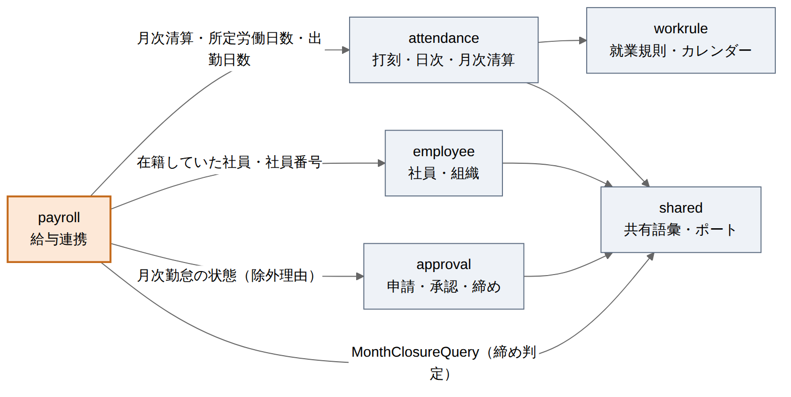

# 給与連携 ドメインモデル設計書

| 項目 | 内容 |
| --- | --- |
| 文書番号 | KNT-DES-701 |
| 版 | 0.1 |
| 対象パッケージ | `jp.co.sample.kintai.payroll` |
| 関連要件 | BR-18（BR-04 / BR-05 / BR-06 / BR-07 / BR-10 / BR-16 に接続） |
| 関連文書 | [月次清算](../04_勤怠_月次清算/ドメインモデル設計書.md) / [申請承認と締め](../05_申請承認と締め/ドメインモデル設計書.md) / [社員・組織](../01_社員・組織/ドメインモデル設計書.md) / [DB設計書](DB設計書.md) / [API設計書](API設計書.md) / [設計規約チェックリスト](../00_共通/設計規約チェックリスト.md) |

---

## 1. このコンテキストの責務

**締めた月次勤怠を、給与計算システムが読める 1 行に変換する。**

| 責務 | 対応要件 |
| --- | --- |
| 対象月に在籍していた社員を数え上げ、締め済みの社員だけを出力する | BR-18 / BR-10 |
| 割増の区分ごとの時間と、日数を CSV の 1 行に並べる | BR-18 |
| 出力しなかった社員を、理由とともに返す | BR-18 |
| 出力の実行を記録する | BR-18 |
| 割増賃金の基礎額に要る年間の所定を、年ごとに 1 行で出す | BR-18（労基則 19 条 1 項 4 号）|

**担わないもの**

| 担わない | 誰が担うか |
| --- | --- |
| 金額・割増率・単価の計算 | 給与計算システム（2.3 の対象外）|
| 労働時間の集計そのもの | `attendance`。ここは**保存済みの値を読むだけ** |
| 締め状態の管理 | `approval` |
| 所定労働日数・出勤日数の数え方 | `attendance`（3.3）|

### 1.1 なぜ新しいコンテキストにするか

出力する 1 行は **4 つのコンテキストの値を束ねたもの**である。

| 値 | 持っているコンテキスト |
| --- | --- |
| 社員番号・在籍期間 | `employee` |
| 労働時間・不足時間・年休日数 | `attendance` |
| 締め状態・月次勤怠の状態 | `approval` |
| 所定労働日数 | `workrule`（`attendance` 経由で読む）|

`attendance` に置くことはできない。
[04 API設計書](../04_勤怠_月次清算/API設計書.md) は
**「社員番号・氏名・部署を返さない。それらは `employee` が所有する概念である」**
と決めている（[設計規約チェックリスト 3](../00_共通/設計規約チェックリスト.md)）。
出力の 1 行は社員番号で始まるので、`attendance` に置いた瞬間にこの規約を破る。

`payroll` は**どのコンテキストからも参照されない末端**である。
依存の向きは外へ出るだけなので、循環は生じない。

```
payroll ──→ attendance ──→ workrule
   │  ├───→ employee
   │  └───→ approval
   └──→ shared（MonthClosureQuery）
```



<sub>図のソース: [`diagrams/コンテキストの依存.mmd`](diagrams/コンテキストの依存.mmd)</sub>

---

## 2. 出力する 1 行

```java
/** 給与計算システムへ渡す 1 行（1 社員 × 1 対象月）。 */
public record PayrollRow(
        EmployeeNumber employeeNumber,     // ① 名寄せの鍵。UUID は出さない
        YearMonth month,                   // ②
        DateRange period,                  // ③ 暦月 ∩ 在籍期間（BR-05）
        WorkingTimeSystemType system,      // ④
        int scheduledDays,                 // ⑤ 所定労働日数（年休の日を除いた後）
        int attendedDays,                  // ⑥ 出勤日数
        int paidLeaveDays,                 // ⑦ 年次有給休暇の取得日数
        Duration workingTime,              // ⑧ 実労働時間
        Duration baseTime,                 // ⑨ 所定内労働時間
        Duration overtimeWithinStatutoryTime, // ⑩ 法定内残業（1.0 倍の追加支払）
        Duration overtimeUpTo60Time,       // ⑪ 法定外残業 60 時間まで（25%）
        Duration overtimeOver60Time,       // ⑫ 法定外残業 60 時間超（50%）
        Duration legalHolidayTime,         // ⑬ 法定休日労働（35%）
        Duration nightTime,                // ⑭ 深夜労働（⑨〜⑬に +25%）
        Duration scheduledTotalTime,       // ⑮ 所定総労働時間（年休の日を除いた後）
        Duration shortageTime) {           // ⑯ 不足時間
```

### 2.1 不変条件

| 検査 | なぜ置くか |
| --- | --- |
| `⑨ + ⑩ + ⑪ + ⑫ + ⑬ = ⑧` | 割増の区分は実労働を**分割**する。合計が実労働に戻らないなら、どこかの区分が実労働の外から生えている |
| `⑨ ≥ 0` / `⑩ ≥ 0` | ⑨⑩は引き算で作るので、月へ振り分ける基準が項目ごとに違うと負になる（[04 の不変条件](../04_勤怠_月次清算/ドメインモデル設計書.md)）|
| `⑯ ≤ ⑮` | 不足は所定総に対する不足である。超えるなら数え方の誤り |
| 日数・時間が負でない | — |

> **「⑨ + ⑩ + ⑪ + ⑫ + ⑬ = ⑧」を恒真にしない。**
> ⑨と⑩は `⑧ − ⑪ − ⑫ − ⑬` を分けたものなので、
> **同じ式から作った値を足し戻すと必ず一致する。**
> `PayrollRow` を「計算した値を渡して組み立てる record」にすると、この検査は何も見ない。
> ⑧〜⑬は**それぞれ別の出どころ**（月次清算の項目）から受け取り、
> 組み立ての時点で突き合わせる（落とし穴 5・36・117）。

> **`⑥ ≤ ⑤`（出勤日数 ≤ 所定労働日数）は置かない。**
> 法定休日・所定休日に出勤した日は⑥に数えるが⑤には入らないので、
> **⑥のほうが多い月は適法に存在する。**
> 排他や大小を主張する検査は、正当なケースが無いか先に探す（落とし穴 23・51）。

### 2.2 ⑨と⑩をどこで導くか

**`MonthlySettlement` の導出メソッドとして `attendance` に置く**（`payroll` では計算しない）。

```java
// attendance.domain.monthly.MonthlySettlement
/** 割増の付かない労働時間（所定内 + 法定内残業）。 */
public Duration nonPremiumTime() {
    return targetWorkingTime.minus(overtimeTime);
}

/** 所定内労働時間。所定総のうち実際に働いた分で頭を打つ。 */
public Duration baseTime() {
    return min(nonPremiumTime(), scheduledTotalTime.minus(shortageTime));
}

/** 法定内残業。割増は付かないが、通常の賃金 1.0 倍の追加支払が要る。 */
public Duration overtimeWithinStatutoryTime() {
    return nonPremiumTime().minus(baseTime());
}
```

**`scheduledTotalTime − shortageTime` が「所定内の実績」になる理由。**
不足時間は制度によって数え方が違うが、どちらも
「所定総 − 実績（実績は所定で頭打ち）」の形をしている。

| 制度 | 不足時間 | 所定総 − 不足時間 |
| --- | --- | --- |
| 固定時間制 | `所定総 − Σ min(その日の実労働, その日の所定)` | `Σ min(その日の実労働, その日の所定)` |
| フレックス | `所定総 − 対象労働時間`（下回った分） | `min(所定総, 対象労働時間)` |

どちらも**所定の範囲内で実際に働いた時間**であり、これが⑨の上限である。
`nonPremiumTime()` のほうが小さくなるのは、週 40 時間超（BR-04）や
法定休日からの通算（BR-07）が**所定内の時間を法定外へ転じさせた**ときで、
そのときは⑩が 0 になり⑨が転換後の値になる。

> **日次の `overtimeWithinStatutoryTime` を月で合計してはならない。**
> 週 40 時間超は「その週の法定内労働のうち時系列で後ろの部分」を法定外へ転じさせる。
> 転じるのは法定内残業とはかぎらず、**1 週の所定が 40 時間を超える週では所定内の時間も転じる。**
> 日次を合計すると、転換のぶんだけ⑩が多く出て、⑨と合わせて実労働を超える。

> **`payroll` に式を置かない。** ⑨は不足時間の定義に依存しており、
> 不足時間の定義を持っているのは `attendance` である。
> 写すと、制度ごとの数え方を直したときに片方だけが古くなる（落とし穴 67）。

### 2.3 ⑪⑫の分割

```java
overtimeUpTo60Time  = overtimeTime − overtimeOver60Time
overtimeOver60Time  = settlement.overtimeOver60Time()   // 04 が既に持っている
```

`overtimeOver60Time()` は `MonthlySettlement` の導出メソッドである（04 の 3.4）。
閾値（60 時間）は法定値なので `payroll` 側に定数を置かない（落とし穴 15）。

### 2.4 ⑭を合計に数えない

深夜は他の区分と**重なる属性**であり、労働時間を分割する区分ではない（BR-06）。
⑨〜⑬の合計に加えると二重に数えることになる。
給与側は `単価 × 0.25 × ⑭` を別に足す（BR-18 の式）。

---

## 3. 対象の数え上げ

### 3.1 誰を数えるか

**対象月に 1 日でも在籍していた社員。**

| 決定 | 理由 |
| --- | --- |
| 月中退職者を含める | 最終月の給与は必ず支払われる。除くと**退職者の最終給与が出ない** |
| 月中入社者を含める | 同じ理由。清算期間は在籍期間との交差になる（③）|
| 対象月の初日時点の在籍で絞らない | 月中入社が落ちる。**在籍期間と対象月の重なり**で絞る |

> 落とし穴 63 と同型である。月末時点の在籍で絞ると、
> 月中退職（4/15）の社員が落ちるのに、退職日が月末（4/30）のテストでは通ってしまう。
> **月中退職の社員を必ず含めて検証する。**

### 3.2 除外する理由を状態で分ける

| 理由 | 状態 | 人事が次に行うこと |
| --- | --- | --- |
| `NOT_SUBMITTED` | 下書き | 本人に提出を促す |
| `NOT_APPROVED` | 提出済み | 承認者に承認を促す |
| `NOT_CLOSED` | 承認済み | 締める |
| `NO_MONTHLY_ATTENDANCE` | **行が無い** | 1 日も打刻が無い。休業か打刻漏れかを確かめる |

**`NO_MONTHLY_ATTENDANCE` を落とさない。**
月次勤怠の行は提出時に初めて作られるので、1 日も打刻の無い社員は
「下書き」ですらない。状態を起点に数えると**結果のどこにも現れず、
その社員の給与が出ないことに誰も気づけない**（落とし穴 26・90 と同型）。
数え上げは**在籍している社員**を起点にする。

### 3.3 日数を数えるのは `attendance`

| 値 | 出どころ | 数え方 |
| --- | --- | --- |
| ⑤ 所定労働日数 | `attendance` | 清算期間の所定労働日数 − 年休の取得日数 |
| ⑥ 出勤日数 | `attendance` | 実労働が 1 分でもある勤務日の数 |

**`payroll` が会社カレンダーを引いて数え直さない。**
⑮（所定総労働時間）は `所定労働日数 × 1 日の所定`として `attendance` が計算しており、
`payroll` が別に数えると **⑮と⑤が食い違う**（落とし穴 67）。

⑥は状態機械の判定ではなく単純な件数なので、SQL で数えてよい
（`working_minutes > 0` の行数）。落とし穴 69 が禁じているのは
「未退勤か」のような**状態の判定**を SQL に写すことである。

---

## 4. 年間の所定（割増賃金の基礎額）

労基則 19 条 1 項 4 号は、月給の場合の割増賃金の基礎額を
**「1 年間における 1 か月平均所定労働時間数」**で除して求めると定める。

```java
public record AnnualScheduledHours(
        int fiscalYear,          // 年度（4 月 〜 翌 3 月）
        int scheduledDays,       // 年間の所定労働日数
        Duration monthlyAverage) // 1 か月平均所定労働時間数
```

| 決定 | 理由 |
| --- | --- |
| **月次の CSV に入れない。年ごとの別表にする** | 全社員に共通の値であり、社員ごとの行に持たせると 100 行に同じ値が並ぶ。そもそも 1 か月ぶんの行から年間の値は出せない（落とし穴 118）|
| 年休を差し引かない | 社員ごとの事情であり、基礎額は**会社の所定**で決まる |
| 年度は 4 月 〜 翌 3 月 | 36 協定の年度（BR-12）とそろえる。暦年と混ぜると、どちらの年かで値が変わる |
| `月平均 = 年間所定労働日数 × 1 日の所定 ÷ 12`。分未満は切り捨て | 切り上げると基礎額の分母が大きくなり、**割増の単価が法定を下回る** |

---

## 5. 締め済みの値だけを読む

| 決定 | 理由 |
| --- | --- |
| **保存済みの `MonthlySettlement` を読む。出力時に計算し直さない** | 計算し直すと、会社カレンダーの過去分が変わったときに同じ月の CSV が変わる。「何度出しても同じ」の根拠は保存値を読むことにある |
| 締め済みでない社員は読まない | 締めていない月の値は後から変わる（BR-10）|
| 締め済みの月に誤りが見つかっても直せない | BR-10 が締め済みからの遷移を持たない。給与側で調整する |

---

## 6. 出力の記録

**「出力済み」を状態として持たないことと、実行の記録を残さないことは別である。**

| 決定 | 理由 |
| --- | --- |
| 「出力済み」を月次勤怠の状態にしない | 締めと二重に管理することになる。締め済みの値は動かないので、何度出しても同じ |
| **誰がいつどの月を出したかは残す** | 全社員の賃金データを外部へ持ち出す操作である。二重取込の原因究明にも、個人データの取扱記録にも要る |
| **CSV の本文は保存しない** | 締め済みの値は動かないので、いつでも同じ内容を作り直せる。保存すると賃金データの複製が増える |
| 記録があっても出力は妨げない | 記録は監査のためであり、再出力の可否を左右しない |

---

## 7. 単体テストの観点

| ID | 観点 | 期待 | 根拠 |
| --- | --- | --- | --- |
| UT-PAY-01 | ⑨⑩⑪⑫⑬の合計が⑧と一致しない | 生成時に例外 | BR-18 |
| UT-PAY-02 | **⑨が負** | 生成時に例外。実労働の外から区分が生えている | BR-18 |
| UT-PAY-03 | **⑩が負** | 生成時に例外 | BR-18 |
| UT-PAY-04 | ⑯が⑮を超える | 生成時に例外 | BR-18 |
| UT-PAY-05 | 日数が負 | 生成時に例外 | BR-18 |
| UT-PAY-06 | **出勤日数が所定労働日数を超える月** | 生成できる。法定休日に出勤すれば正当に起こる | BR-18 |
| UT-PAY-07 | 所定内 = 所定総 − 不足（固定時間制） | 実績が所定の範囲に収まる月 | BR-18 |
| UT-PAY-08 | **週 40 時間超が所定内を法定外へ転じさせた月** | ⑩が 0 になり、⑨が転換後の値になる。日次の合計では⑧を超える | BR-04 |
| UT-PAY-09 | 法定内残業がある月（固定時間制） | ⑩ = 実績 − 所定総 | BR-18 |
| UT-PAY-10 | フレックスで総枠の内側 | ⑪⑫が 0。⑩は所定総を超えた分 | BR-05 |
| UT-PAY-11 | **時間外が 60 時間ちょうど** | ⑫は 0。超えた分だけが 50% | BR-04 |
| UT-PAY-12 | 時間外が 60 時間を 1 分超える | ⑫が 1 分 | BR-04 |
| UT-PAY-13 | 深夜のみの月 | ⑭は正だが⑨〜⑬の合計は⑧のまま | BR-06 |
| UT-PAY-14 | 年間所定の 1 か月平均 | 年間所定労働日数 × 8 時間 ÷ 12。分未満は切り捨て | BR-18 |
| UT-PAY-15 | **年間所定労働日数 0 の年度** | 月平均 0。例外にしない（カレンダー未設定の年度）| BR-18 |
