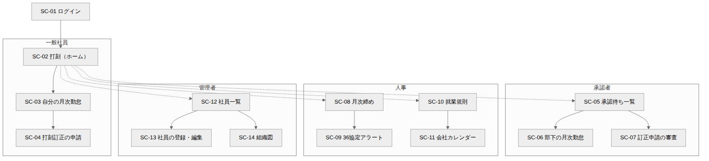
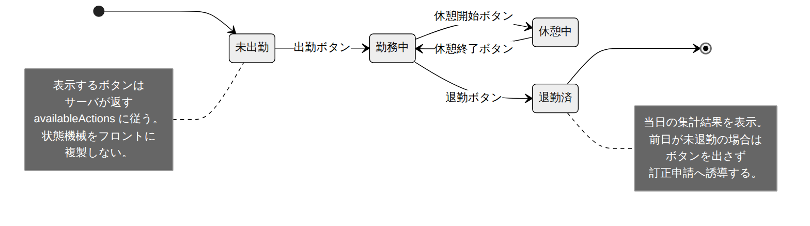

# 画面設計書

| 項目 | 内容 |
| --- | --- |
| 文書番号 | KNT-DES-901 |
| 版 | 1.0 |
| 対象 | フロントエンド（React + TypeScript） |
| 関連要件 | [4章 アクターと権限](../../01_要件定義/要件定義書.md#4-アクターと権限) / [5章 ユースケース一覧](../../01_要件定義/要件定義書.md#5-ユースケース一覧) |
| 関連文書 | [アーキテクチャ設計書](../00_共通/アーキテクチャ設計書.md) / 各コンテキストの API設計書 |

---

## 1. この文書の範囲

**画面と API の対応、および画面が持ってよい判断・持ってはいけない判断を決める。**
配色やコンポーネントの見た目は扱わない。

### 1.1 画面設計の 3 原則

| # | 原則 | 理由 |
| --- | --- | --- |
| 1 | **業務ルールを画面に複製しない。** 「次に何ができるか」はサーバが返す | 打刻の状態機械や BR-11 の承認者導出を画面にも書くと、2 か所で保守することになり必ずずれる |
| 2 | **閲覧範囲の判定をサーバに委ねる。** 画面はロールで表示を出し分けるだけ | 画面が隠しても API が返せば漏洩する。画面の出し分けは利便性、権限は API で守る |
| 3 | **期間は半開区間でやり取りする。** `from` と `toExclusive` | 画面と API で区間の流儀が違うと、月末日が 1 日ずれる不具合が入る |

原則 1 は具体的には次のとおり。

```typescript
// 誤り。サーバと同じ状態機械をフロントに書いている
const canClockOut = state === 'WORKING' || state === 'ON_BREAK';

// 正しい。サーバが返した availableActions をそのまま使う
const canClockOut = current.availableActions.includes('CLOCK_OUT');
```

---

## 2. 画面遷移



<sub>図のソース: [`diagrams/画面遷移図.mmd`](diagrams/画面遷移図.mmd)</sub>

実線は誰でも辿れる遷移、破線は **ロールを持つ利用者にだけメニューが現れる** 遷移である。

---

## 3. 画面一覧

| ID | 画面 | 主なユースケース | 必要ロール | 主に使う API |
| --- | --- | --- | --- | --- |
| SC-01 | ログイン | UC-08 | – | `POST /api/sessions` |
| SC-02 | 打刻（ホーム） | UC-01 | `EMPLOYEE` | `GET /api/employees/{id}/attendances/current` / `POST /api/employees/{id}/time-clocks` |
| SC-03 | 自分の月次勤怠 | UC-02 / UC-10 | `EMPLOYEE` | `GET .../attendances` / `GET .../settlements/{month}` / `GET .../monthly-attendances/{month}` |
| SC-04 | 打刻訂正の申請 | UC-09 | `EMPLOYEE` | `POST /api/employees/{id}/correction-requests` |
| SC-05 | 承認待ち一覧 | UC-11 | `APPROVER` | `GET /api/monthly-attendances/pending-approval` |
| SC-06 | 部下の月次勤怠 | UC-11 | `APPROVER` | `GET .../monthly-attendances/{month}` / `POST .../approval` / `POST .../rejection` |
| SC-07 | 訂正申請の審査 | UC-11 | `APPROVER` | `GET /api/employees/{id}/correction-requests` / `POST /api/correction-requests/{id}/approval` |
| SC-08 | 月次締め | UC-12 | `HR` | `GET /api/monthly-attendances/pending-approval` / `POST /api/monthly-attendances/bulk-closure` |
| SC-09 | 36 協定アラート | UC-07 | `HR` | `GET /api/settlements/agreement-alerts` |
| SC-10 | 就業規則 | UC-03 | `HR` | `GET /api/work-rules` / `POST /api/work-rules/{seriesId}/revisions` |
| SC-11 | 会社カレンダー | UC-04 | `HR` | `GET /api/calendars` / `POST /api/calendars/bulk` |
| SC-12 | 社員一覧 | UC-05 | `ADMIN` | `GET /api/employees` |
| SC-13 | 社員の登録・編集 | UC-05 | `ADMIN` | `POST /api/employees` / `PATCH /api/employees/{id}` |
| SC-14 | 組織図 | UC-05 | `EMPLOYEE`（範囲はロール依存） | `GET /api/departments/tree` |

**M1-a で必要なのは SC-02・SC-03・SC-10・SC-11・SC-12・SC-13。**
SC-01 と申請・承認・締めの画面は M1-c で作る。

---

## 4. 主要画面の設計

### 4.1 SC-02 打刻（ホーム）



<sub>図のソース: [`diagrams/打刻画面の状態.mmd`](diagrams/打刻画面の状態.mmd)</sub>

画面が持つ情報は `GET /api/employees/{id}/attendances/current` の応答がすべてである。

```json
{
  "workDate": "2026-09-01",
  "status": "ON_BREAK",
  "availableActions": ["BREAK_END"],
  "punches": [
    { "id": "0195...", "type": "CLOCK_IN", "occurredAt": "2026-09-01T09:02:00" },
    { "id": "0195...", "type": "BREAK_START", "occurredAt": "2026-09-01T12:00:00" }
  ],
  "unclosedWorkDates": ["2026-08-31"]
}
```

| 決定 | 理由 |
| --- | --- |
| ボタンの出し分けは `availableActions` だけで決める | 状態機械を画面に複製しない（原則 1） |
| 打刻ボタンは押した直後に無効化し、応答を待って再描画する | 二度押しで打刻が 2 行入るのを防ぐ。**ただし本当の防御はサーバ側の状態遷移検査** |
| 打刻時刻を画面から送らない | 端末の時計は信用できない。サーバが `Clock` で決める |
| 前日が未退勤でも**打刻ボタンを消さない。** `unclosedWorkDates` を警告として出し、SC-04 へ誘導する | 別の日の不整合で、その日の労働の記録を止めてはいけない（CLAUDE.md 落とし穴 19・68）。出勤は必ず新しい勤務日を始めるので、打ち忘れた日を吸い込むことはない |

> **時刻を画面に表示するときはサーバの応答の値を使う。**
> `new Date()` を使うと、端末の時計がずれている利用者に
> 「押したのに時刻が違う」と見える。

#### 打刻の訂正はこの画面から行わない

打刻は追記専用で、訂正は取消行の追加として記録される
（[03_勤怠_打刻と日次集計](../03_勤怠_打刻と日次集計/ドメインモデル設計書.md)）。
画面上で「編集」に見せると、記録が上書きされる印象を与える。
**SC-04 の申請画面へ分ける。**

### 4.2 SC-03 自分の月次勤怠

月の勤怠を一覧し、提出する画面。3 つのコンテキストの API を束ねる。

| 表示するもの | 取得元 |
| --- | --- |
| 日ごとの実績（出退勤・実労働・内訳） | `GET /api/employees/{id}/attendances?from=&toExclusive=` |
| 月の集計（所定総・法定総枠・時間外・不足） | `GET /api/employees/{id}/settlements/{month}` |
| 提出状態と可能な操作 | `GET /api/employees/{id}/monthly-attendances/{month}` |

**3 本を並行に呼び、それぞれ独立に描画する。** 1 本にまとめる BFF は M1 では作らない。
まとめると、どのコンテキストが何を所有しているかが画面側から見えなくなる。

| 決定 | 理由 |
| --- | --- |
| 期間は `from` / `toExclusive` で渡す | 半開区間で統一（原則 3）。「9 月」は `from=2026-09-01&toExclusive=2026-10-01` |
| **日次の時間外は「法定内残業」「法定外残業」の 2 列で出す。1 列に束ねない** | 割増は 0% と 25% で違うが、**それ以上に支払う賃金が違う**（法定内残業には通常の賃金 1.0 倍の追加支払が要る。CLAUDE.md 落とし穴 115）。束ねると、画面を見た社員も上長も差額を確かめられない |
| **月次の「時間外労働」は 1 列で、日次の合計ではない** | フレックスの時間外は清算期間で決まり、日次には現れない（BR-05）。同じ見出しで別の数を並べない |
| 提出ボタンの活性は `monthly-attendances` の応答が返す遷移可否で決める | 状態機械を画面に複製しない |
| 就業規則が未設定の日は、計算結果ではなく **「就業規則が未設定です」** と表示する | 0 時間と表示すると、欠勤と区別がつかない |
| 月中入社・月中退職の月は、清算期間を明示して表示する | 「9/15 〜 10/1（在籍期間）」と出す。暦月として見せると、所定総労働時間が少ない理由が分からない |

### 4.3 SC-05 / SC-06 承認

`GET /api/monthly-attendances/pending-approval` は、**その利用者が承認できるものだけ**を返す。
画面は返ってきたものを並べるだけで、BR-11 の承認者導出を行わない。

| 決定 | 理由 |
| --- | --- |
| 承認・差戻しは `version` を必須で送る | 2 人の承認者が同時に開いていたときの上書きを防ぐ（[共通仕様 1.4](../01_社員・組織/API設計書.md)） |
| **決裁の対象月は、開いている詳細から取る。一覧の月セレクタから取らない** | 詳細を開いたまま月を切り替えると、**表示している月と違う月を承認**することになる。月を変えたら詳細を閉じる（CLAUDE.md 落とし穴 152）|
| 差戻しは理由を必須にする | 何を直せばよいか分からない差戻しは、やり取りが増えるだけになる |
| 一覧に「自分が承認者である理由」を出さない | 承認者導出の途中経過は人事情報。BR-11 の遡りで本部長が出てきたことなどを一般に見せない |

### 4.4 SC-08 月次締め

人事担当が月次を締める画面。**未提出・未承認が残っている状態を可視化する。**

| 表示 | 意味 |
| --- | --- |
| 未提出 | 本人が提出していない |
| 承認待ち | 提出済みだが承認されていない |
| **就業規則が未設定** | `GET /api/work-rule-assignments/unassigned` が返した社員。**この社員は締められない** |
| 締め可能 | 承認済み |

一括締めは `POST /api/monthly-attendances/bulk-closure` を 1 回呼ぶ。
**画面から社員ごとに `closure` を繰り返さない。** 途中で失敗したとき、
どこまで締まったかが利用者にも画面にも分からなくなる。

### 4.5 SC-10 就業規則

系列の一覧と、系列ごとの版の履歴を表示する
（[02_就業規則・カレンダー API設計書 2.1](../02_就業規則・カレンダー/API設計書.md)）。

| 決定 | 理由 |
| --- | --- |
| 「編集」ボタンを置かず「**改定**」ボタンを置く | 改定は版を足す操作であり、既存の版を書き換える操作ではない。編集と見せると過去分の再計算結果が変わると誤解される |
| 改定の応答に含まれる `warnings` を、成功メッセージと並べて必ず表示する | 所定総労働時間が法定総枠を超える月の警告。握りつぶすと人事が気づけない |
| 制度の入力欄は `workingTimeSystem` の選択で切り替える | `fixedTime` と `flextime` は排他。両方を同時に入力できる画面にすると、API が受け付けない組み合わせを作れてしまう |

### 4.6 SC-11 会社カレンダー

月表示のカレンダーで暦日区分を設定する。

| 決定 | 理由 |
| --- | --- |
| 一括設定の応答の `warnings` を一覧で表示する | 「連続 7 日に法定休日が無い」「所定総が法定総枠を超える月がある」。**DB で守れないものを画面で見せる** |
| 締め済みの月は編集不可にする | サーバは `409` を返すが、押せてから断られるのは操作として悪い |

### 4.7 SC-14 組織図

**閲覧範囲がロールで大きく変わる画面。**

| ロール | 見える範囲 |
| --- | --- |
| `EMPLOYEE` | 自分の所属と、自分の承認者だけ |
| `APPROVER` | 配下部署 |
| `HR` / `ADMIN` | 全社 |

範囲の絞り込みは **API が行う**。画面は返ってきた木をそのまま描く。
画面側で絞ると、`GET /api/departments/tree` を直接叩けば全社が見えてしまう。

---

## 5. 画面共通の扱い

### 5.1 エラーの表示

API は RFC 9457 (Problem Details) を返す
（[共通仕様 1.3](../01_社員・組織/API設計書.md#13-エラー応答)）。

| `status` | 画面の扱い |
| --- | --- |
| `400` | `errors` の `field` を使って入力欄の下に表示する |
| `401` | SC-01 へ遷移する |
| `403` | 「権限がありません」。**何が見えないかは示さない** |
| `409 optimistic-lock-failure` | 「他の利用者が先に更新しました」と表示し、再読込を促す |
| `409` その他 | `title` と `detail` をそのまま表示する。業務上の理由は利用者に伝える価値がある |
| `422` | 同上。入力欄に紐づけられるなら紐づける |
| `5xx` | 「時間をおいて再度お試しください」。`detail` は表示しない |

**`type` で分岐する。`status` だけで分岐しない。**
`409` には楽観ロック失敗と業務上の衝突が混在しており、利用者への案内が違う。

### 5.2 日付と時刻の表示

| 項目 | 扱い |
| --- | --- |
| 日付 | `2026-09-01`（ISO 8601）で受け、`2026/09/01` で表示する |
| 時刻 | **オフセットを持たない壁掛け時計時刻**として受け、そのまま表示する |
| タイムゾーン変換 | **行わない。** ブラウザの `Date` に渡すと端末のタイムゾーンで解釈される |
| 期間 | API とは半開区間でやり取りし、表示は「9/1 〜 9/30」と閉区間に直す |

```typescript
// 誤り。端末のタイムゾーンで解釈され、9:00 が別の時刻になる
new Date('2026-09-01T09:00:00').toLocaleTimeString()

// 正しい。文字列として扱う
'2026-09-01T09:00:00'.slice(11, 16)   // '09:00'
```

これは [共通仕様 1.1](../01_社員・組織/API設計書.md#11-日時にオフセットを含めない理由) と
[CLAUDE.md 5 章の落とし穴 1](../../../CLAUDE.md) に対応する画面側の対処である。

### 5.3 API 型の扱い

判別可能ユニオンで受けるものを型で表現する。

```typescript
type WorkRuleRevision =
  | { workingTimeSystem: 'FIXED'; fixedTime: FixedTime }
  | { workingTimeSystem: 'FLEX';  flextime: Flextime };

// 判別子で絞ると、もう一方のキーへのアクセスがコンパイルエラーになる
if (rev.workingTimeSystem === 'FIXED') {
  rev.fixedTime.scheduledStart;   // OK
  rev.flextime;                   // コンパイルエラー
}
```

**Java の `sealed interface`、DB の CHECK 制約、TypeScript の判別可能ユニオンが
同じ制約を表現している状態を保つ。**

---

## 6. 画面と要件の対応

| ユースケース | 画面 | M |
| --- | --- | --- |
| UC-01 打刻する | SC-02 | M1-a |
| UC-02 自分の月次勤怠を確認する | SC-03 | M1-a |
| UC-03 就業規則を登録・改定する | SC-10 | M1-a |
| UC-04 会社カレンダーを設定する | SC-11 | M1-a |
| UC-05 社員を登録・異動させる | SC-12 / SC-13 / SC-14 | M1-a |
| UC-06 フレックスの月次清算 | SC-03（表示のみ。実行はシステム） | M1-b |
| UC-07 36 協定の上限超過を検知する | SC-09 | M1-b |
| UC-08 ログインする | SC-01 | M1-c |
| UC-09 打刻の訂正を申請する | SC-04 | M1-c |
| UC-10 月次勤怠を提出する | SC-03 | M1-c |
| UC-11 申請を承認・差戻しする | SC-05 / SC-06 / SC-07 | M1-c |
| UC-12 月次を締める | SC-08 | M1-c |

**UC-13 〜 UC-15（有給・シフト・給与連携）に対応する画面は M1 では作らない。**

---

## 7. 決定した事項（旧・未決事項）

| # | 内容 | 決定 |
| --- | --- | --- |
| 1 | API の型を手書きするか OpenAPI から生成するか | **手書き。** 依存を増やさず、画面が実際に使う項目だけを書く。ただし**手書きの型は思い込みをそのまま固定する**（下記）ので、通しのシナリオテストで実際の応答に当てる |
| 2 | 状態管理に TanStack Query を使うか | **`fetch` の薄いラッパ（`src/api/client.ts`）で足りる。** 画面が 5 つ、共有するキャッシュが無い |
| 3 | 打刻画面をモバイルブラウザ前提にするか | **PC 前提。** 単一事業所の社内システムで、打刻は執務席から行う |
| 4 | SC-03 の 3 本を BFF でまとめるか | **まとめない。** まとめると、どのコンテキストが何を所有しているかが画面から見えなくなる |

> **手書きの型はコンパイラに守られていない。**
> `SignedIn` を `employeeId` と書いていたが、サーバが返すのは `id` である。
> TypeScript は「サーバがそう返すはず」という宣言を検査できないので、
> **型検査を通ったまま `/api/employees/undefined/...` を呼ぶ画面**ができた。
> 単体テストもすべて緑だった。実物のバックエンドに当てて初めて出る
> （IT-SCN-32〜34）。

---

## 8. 画面が失敗を隠さないための決めごと

通しのシナリオで出た欠陥から。

| 決定 | 理由 |
| --- | --- |
| **読み込みに失敗したまま「読み込み中…」を出し続けない。** 失敗を表示し、やり直す手段を置く | 利用者には永久に回り続ける画面としか見えず、401 なのか 404 なのかを確かめる手段が無い |
| **節ごとに失敗を持つ。** 1 つにまとめない | 日ごとの実績が取れなかったときに「計算済みの日がありません」と表示され、**失敗が成功として見える** |
| 失敗の表示は `type`（URN）で分岐する。文言で分岐しない | メッセージを直した瞬間に画面が壊れる（[アーキテクチャ 6.2](../00_共通/アーキテクチャ設計書.md)） |

---

## 9. 画面の単体テスト（UT-FE）

**画面には業務ルールを置かない**（画面設計書 原則 1）ので、
単体で確かめるものは 2 つしかない。

| ID | 観点 | 期待 |
| --- | --- | --- |
| `UT-FE-01` | **深夜帯の時刻の切り出し** | 端末のタイムゾーンに関係なく、サーバの返した壁掛け時計時刻をそのまま出す |
| `UT-FE-02` | 形式の違う日時を受け取らない | 検証を通さない値は型として作れない |
| `UT-FE-03` | **半開区間の上限を閉区間の最終日として表示する** | 「9/1 〜 9/30」。上限をそのまま出すと 1 日多い（落とし穴 112） |
| `UT-FE-04` | 前日の計算が月・年・うるう年をまたぐ | 3/1 の前日は 2/29（うるう年） |
| `UT-FE-05` | 月の半開区間が 12 月をまたぐ | 2026-12 は `2026-12-01` 〜 `2027-01-01` |
| `UT-FE-06` | 表示用の日付は 0 埋めしない | `9/1`。0 埋めは一覧を読みにくくする |
| `UT-FE-07` | **楽観ロックの失敗だけは読み直しを促す** | 同じ 409 でも案内が違う |
| `UT-FE-08` | 締め済みは理由をバナーで出す | 利用者にできることが違う |
| `UT-FE-09` | 入力の不備は項目に紐づける | `errors[].field` を使う |
| `UT-FE-10` | 未認証はログイン画面へ戻す | 401 を握りつぶさない |
| `UT-FE-11` | **未知の `type` は詳細を出さない** | サーバのメッセージをそのまま出すと、内部の情報が画面に出る |
| `UT-FE-12` | **既知の `type` はすべて `unknown` 以外に落ちる** | 網羅性検査が効いていることを、値の側からも確かめる |

**文言で分岐しない。`type`（URN）で分岐する。**
メッセージを直した瞬間に画面が壊れるため
（[アーキテクチャ 6.2](../00_共通/アーキテクチャ設計書.md)）。

画面そのもの（ボタンの出し分け・提出可否）は単体では確かめない。
**サーバの応答をそのまま使っているかどうかが観点**なので、
モックを置くと 1 行も検査しないことになる。実物へ当てる
（`IT-SCN-32`〜`34`）。
